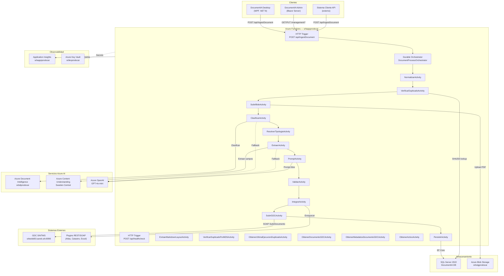
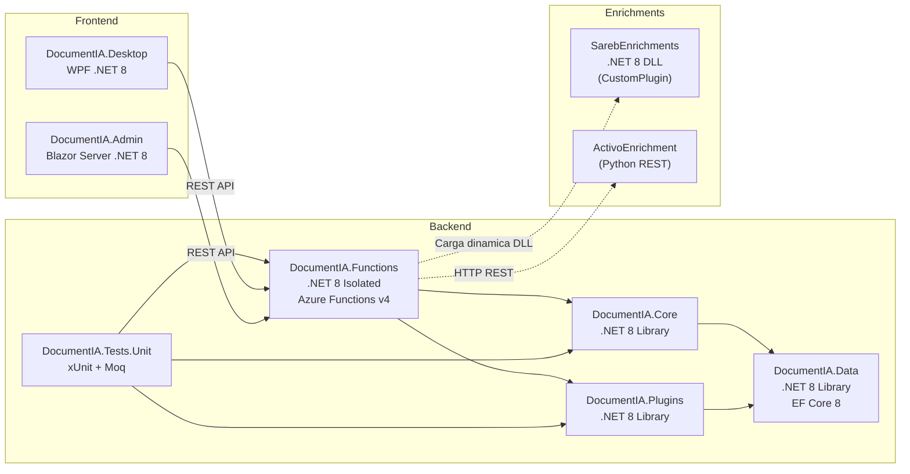
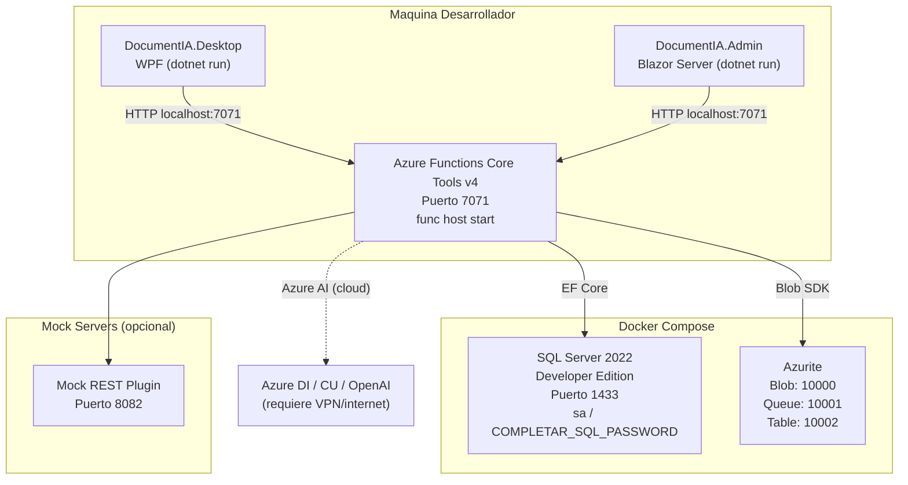
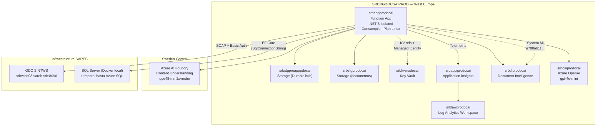
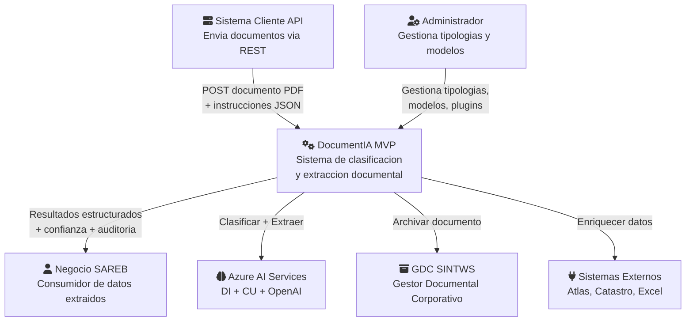
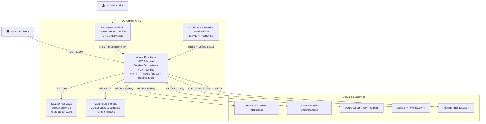

# 1. Arquitectura del Sistema — DocumentIA MVP

> Ultima actualizacion: 2026-03-31  
> Proyecto: AI DocClassExt — SAREB  
> Repositorio: Azure DevOps `sareb.visualstudio.com/AI%20DocClassExt`

---

## 1.1 Descripcion General

DocumentIA es un sistema de clasificacion y extraccion automatizada de documentos para SAREB. Procesa documentos inmobiliarios (notas simples registrales, tasaciones, resumenes documentales) empleando servicios de IA de Azure para:

1. **Clasificar** el tipo documental mediante Azure AI Document Intelligence (modelos custom entrenados) con fallback a Azure OpenAI GPT-4o-mini.
2. **Extraer** campos estructurados mediante Azure Content Understanding o Document Intelligence, con fallback GPT.
3. **Validar** los datos extraidos contra un motor de reglas configurable por tipologia (NIF, fechas, rangos, referencias catastrales, campos obligatorios).
4. **Enriquecer** los datos mediante un sistema de plugins de integracion (REST, SOAP, DLL custom).
5. **Archivar** el documento en el Gestor Documental Corporativo (GDC SINTWS) via SOAP.
6. **Persistir** resultados, auditoria y metricas en SQL Server.

### Stack tecnologico

| Capa | Tecnologia |
|------|-----------|
| Runtime | .NET 8 Isolated Worker |
| Orquestacion | Azure Durable Functions v4 |
| Clasificacion IA | Azure AI Document Intelligence (custom classifier) |
| Extraccion IA | Azure Content Understanding + Azure DI (custom models) |
| LLM (fallback + prompt) | Azure OpenAI GPT-4o-mini |
| Base de datos | SQL Server 2022 (EF Core 8 Code-First) |
| Almacenamiento blob | Azure Blob Storage (Azurite en local) |
| Gestor documental | GDC SINTWS (SOAP, srbwidd03.sareb.srb:8090) |
| Frontend operativo | WPF .NET 8 (MVVM, RestSharp) |
| Frontend COMPLETAR_GDC_HTTP_BASIC_USERNAME | Blazor Server .NET 8 |
| CI/CD | Azure DevOps Pipelines (self-hosted agent) |
| Observabilidad | Application Insights + Log Analytics |

---

## 1.2 Diagrama de Arquitectura de Alto Nivel



---

## 1.3 Diagrama de Componentes de la Solucion .NET



### Responsabilidades por proyecto

| Proyecto | Responsabilidad |
|----------|----------------|
| **DocumentIA.Functions** | Triggers HTTP (`IngestDocument`, `healthcheck`), Orchestrator Durable, **17 Activities**, Providers de IA (DI, CU, GPT), servicios GDC y AssetResolver, autenticacion |
| **DocumentIA.Core** | Modelos de dominio (ContratoEntrada/Salida), motor de validacion (11 reglas), configuracion de tipologias, interfaces de servicio |
| **DocumentIA.Data** | DbContext EF Core, 9 entidades, repositorios, migraciones, seed data |
| **DocumentIA.Plugins** | Infraestructura de plugins: IIntegrationPlugin, PluginFactory, PluginManager, ResilientPlugin, RestPlugin, SoapPlugin, CustomPlugin |
| **DocumentIA.Tests.Unit** | 33 clases de test (xUnit + Moq + FluentAssertions) |
| **DocumentIA.Desktop** | WPF MVVM: ingesta de documentos, polling de estado en tiempo real, visualizacion de timeline |
| **DocumentIA.Admin** | Blazor Server: CRUD tipologias, gestion modelos AI, configuracion plugins |
| **SarebEnrichments** | Plugin custom .NET: enriquecimiento de Nota Simple (cargas, riesgo, datos de activo) |

---

## 1.4 Principios y Patrones Arquitectonicos

### 1.4.1 Durable Functions — Orquestacion tipo Saga

El pipeline de procesamiento se implementa como un **Durable Function Orchestrator** (`DocumentProcessOrchestrator`) que coordina **17 activities** (no todas se ejecutan en cada peticion: hay early exits por duplicado, fallos GDC, skip de pasos opcionales como Prompt/AssetResolver). Las ventajas:

- **Durabilidad**: el estado de la orquestacion persiste automaticamente en Azure Storage. Si el host se reinicia, el orquestador resume donde quedo.
- **Replay-safe logging**: usa `context.CreateReplaySafeLogger` para evitar logs duplicados durante replays.
- **customStatus**: publica progreso en tiempo real que el frontend consume via polling del status endpoint de Durable.
- **Timeout patterns**: `SubirGDCActivity` usa `Task.WhenAny` con timer de 120s para evitar bloqueos indefinidos.

### 1.4.2 Strategy Pattern — Proveedores Configurables

Tanto clasificacion como extraccion usan el patron Strategy con un **router configurable**:

```
IClasificarDataProvider (interfaz)
  ├─ ConfigurableClasificarDataProvider (router)
  │   ├─ AzureDocumentIntelligenceClasificarProvider
  │   ├─ GptClasificarDataProvider
  │   └─ MockClasificarDataProvider
```

```
IExtraerDataProvider (interfaz)
  ├─ ConfigurableExtraerDataProvider (router)
  │   ├─ AzureContentUnderstandingProvider            ← provider = "azure-content-understanding"
  │   ├─ AzureDocumentIntelligenceExtraerDataProvider ← provider = "azure-document-intelligence"
  │   ├─ GptDirectExtraerDataProvider                 ← provider = "azure-openai" | "gpt" | "openai"
  │   ├─ GptFallbackExtraerDataProvider               ← fallback automático cuando CU es insuficiente
  │   └─ MockExtraerDataProvider                      ← provider = "mock"

ILayoutMarkdownDataProvider (interfaz)
  └─ AzureDocumentIntelligenceLayoutMarkdownProvider  ← provider = "azure-document-intelligence-layout"
```

> El proveedor se resuelve por prioridad: instrucciones de la petición → campo `extraction.provider` de la tipología → `Extraction.DefaultProvider` de configuración global.
> `GptDirectExtraerDataProvider` extrae directamente con OpenAI (sin CU previo), validando upfront que el modelo tiene endpoint, deployment y API key configurados.

### 1.4.2a Patrón RegistryLoader — Configuración de Proveedores IA desde BD

Todos los parámetros de conexión de los proveedores IA (**endpoint, apiKey, authMode, apiVersion**, etc.) se almacenan **exclusivamente en la tabla `ModeloConfigs` de BD**. No hay ninguna clave de configuración en `appsettings` ni en `local.settings.json` para estos parámetros.

Cada tipo de modelo tiene su propio loader que hereda de `ModelRegistryLoader<TConfig>`:

| Loader | Tipo modelo | Configuración cargada |
|--------|-------------|----------------------|
| `ClassificationModelRegistryLoader` | `TipoModelo.Clasificacion` | `ClassificationModelConfig` |
| `ExtractionModelRegistryLoader` | `TipoModelo.Extraccion` | `ExtractionModelConfig` |
| `PromptModelRegistryLoader` | `TipoModelo.Prompt` | `PromptModelConfig` |
| `LayoutModelRegistryLoader` | `TipoModelo.Layout` | `LayoutModelConfig` |

Los proveedores reciben el loader por inyección de dependencias y obtienen el modelo con `GetModel(key)` o `GetDefaultModel()`. El seed inicial se carga desde los archivos `config/{tipo}/models.json` al arrancar la Function App (solo si no existen ya en BD).

### 1.4.3 Repository Pattern

Acceso a datos mediante repositorios inyectados (`IDocumentoRepository`, `ITipologiaRepository`, `IAuditoriaRepository`, etc.) sobre EF Core DbContext.

### 1.4.4 Plugin Architecture — Carga Dinamica

Los plugins de integracion siguen una arquitectura extensible:

- **IIntegrationPlugin**: interfaz comun con `InitializeAsync`, `ExecuteAsync`, `HealthCheckAsync`.
- **PluginFactory**: crea instancias segun configuracion (`REST` → `RestPlugin`, `SOAP` → `SoapPlugin`, `Custom` → `CustomPlugin`).
- **PluginManager**: registro y lookup de plugins por clave.
- **CustomPlugin**: carga DLLs externas desde `AppContext.BaseDirectory/plugins/` usando reflection.
- **Configuracion JSON**: `config/tipologias/{codigo}.plugins.json` define que plugins se ejecutan por tipologia, su prioridad y retry policy.

### 1.4.5 Circuit Breaker + Retry (Decorator Pattern)

La resiliencia se implementa mediante decoradores:

- **ResilientPlugin**: envuelve cualquier `IIntegrationPlugin` con retry exponencial y circuit breaker.
  - Retry: `MaxRetries` intentos con backoff `InitialDelayMs * 2^(attempt-1)`.
  - Circuit breaker: abre tras 5 fallos consecutivos, se resetea tras 5 minutos (half-open trial).
- **ResilientGdcService**: envuelve `GdcService` (SOAP) con la misma logica.
  - Configurable via `GDC:MaxRetries`, `GDC:CircuitBreakerFailures`, `GDC:CircuitBreakerDurationMs`.

### 1.4.6 Dual Authentication Mode

Los proveedores de IA soportan dos modos de autenticacion (`AuthMode`):

| Modo | Mecanismo | Uso actual |
|------|-----------|-----------|
| `ApiKey` | Header `Ocp-Apim-Subscription-Key` (DI) / `api-key` (OpenAI/CU) | Produccion (actual) |
| `DefaultAzureCredential` | Bearer token via Managed Identity | Preparado, pendiente asignacion RBAC |

`DocumentIntelligenceAuthHelper` implementa la logica con lazy singleton de `DefaultAzureCredential` thread-safe.

---

## 1.5 Decisiones Arquitectonicas (ADR)

### ADR-001: Azure Durable Functions como motor de orquestacion

| Aspecto | Detalle |
|---------|---------|
| **Contexto** | Se necesita orquestar un pipeline de 8-13 pasos asincrono con llamadas a servicios externos de IA (latencia 5-60s por paso), gestion de estados, retry y monitorizacion en tiempo real. |
| **Opciones** | (A) Azure Durable Functions, (B) Azure Logic Apps, (C) Colas + funciones independientes, (D) Microservicios con Dapr |
| **Decision** | **(A) Azure Durable Functions** |
| **Justificacion** | - Modelo de codigo C# nativo (no YAML/JSON designer). <br/>- Persistencia automatica de estado en Storage. <br/>- customStatus para polling de progreso. <br/>- Retry policies y timer support built-in. <br/>- Consumption plan (pago por ejecucion). <br/>- Todo en un unico proyecto .NET desplegable. |
| **Riesgos** | Replay semantics requieren cuidado (no I/O en el orchestrator). Tamaño de input/output limitado por Storage. |

### ADR-002: EF Core Code-First sobre SQL Server

| Aspecto | Detalle |
|---------|---------|
| **Contexto** | Se necesita persistir documentos, resultados, auditoria y configuracion con schema evolutivo durante el MVP. |
| **Opciones** | (A) EF Core Code-First, (B) Database-First, (C) Dapper raw SQL |
| **Decision** | **(A) EF Core Code-First** |
| **Justificacion** | - Migraciones automaticas aplican cambios de schema sin scripts manuales. <br/>- `DbContext.Database.Migrate()` en startup para dev local. <br/>- Seed data desde archivos JSON de config. <br/>- Facilidad de evolucionar el modelo durante MVP. <br/>- Repository pattern para desacoplamiento. |
| **Trade-offs** | Menos control sobre SQL generado. Para consultas criticas de rendimiento futuras se puede usar raw SQL/Dapper puntualmente. |

### ADR-003: Azure DI + GPT fallback para clasificacion

| Aspecto | Detalle |
|---------|---------|
| **Contexto** | La clasificacion requiere alta precision (>85%) pero los modelos custom de DI pueden tener baja confianza en documentos atipicos. |
| **Opciones** | (A) Solo Azure DI, (B) Solo GPT-4o-mini, (C) DI + GPT fallback |
| **Decision** | **(C) DI con fallback a GPT** |
| **Justificacion** | - DI es rapido y barato para documentos que coinciden con el entrenamiento. <br/>- GPT maneja documentos fuera de distribucion con reasoning. <br/>- Umbral configurable por tipologia (`clasifUmbralFallback`). <br/>- Mismo patron para extraccion: CU primario + GPT fallback. |
| **Metricas** | DI: ~2-5s, GPT: ~5-15s. Fallback solo se activa cuando confianza DI < umbral. |

### ADR-004: Sistema de plugins DLL dinamico

| Aspecto | Detalle |
|---------|---------|
| **Contexto** | Cada tipologia puede requerir enriquecimiento diferente (REST a catastro, SOAP a atlas, logica custom). Debe ser extensible sin modificar el core. |
| **Opciones** | (A) Plugins como DLLs cargadas dinamicamente, (B) Microservicios por plugin, (C) Azure Logic Apps por plugin |
| **Decision** | **(A) Plugins DLL + REST/SOAP** |
| **Justificacion** | - DLLs compiladas externamente (SarebEnrichments.dll), cargadas desde `AppContext.BaseDirectory/plugins/`. <br/>- Plugins REST/SOAP no requieren codigo .NET. <br/>- PluginFactory + ResilientPlugin abstraen la complejidad. <br/>- Prioridad configurable: plugins criticos (P1) detienen la cadena si fallan. |

### ADR-005: Dual AuthMode (ApiKey + Managed Identity)

| Aspecto | Detalle |
|---------|---------|
| **Contexto** | El MVP necesita funcionar rapidamente con API Keys, pero la produccion final debe usar Managed Identity (zero-secret). |
| **Decision** | Implementar ambos modos desde el inicio, seleccionables por configuracion (`AuthMode: "ApiKey"` o `"DefaultAzureCredential"`). |
| **Estado** | ApiKey activo en produccion. MI preparado en codigo, pendiente asignacion roles RBAC (`Cognitive Services User`) a la System Managed Identity `e700ab11-6478-4aa3-ad3c-b6b7a92279ab`. |

### ADR-006: Docker SQL local con auto-migraciones

| Aspecto | Detalle |
|---------|---------|
| **Contexto** | El desarrollo local necesita SQL Server sin depender de Azure SQL (coste + conectividad). |
| **Decision** | `docker-compose.yml` con SQL Server 2022 Developer + Azurite. `Program.cs` aplica migraciones automaticamente en startup (`RunDatabaseMigrationsOnStartup=true`). |
| **Transicion** | Cuando Azure SQL (`srbsqlprodocai`) este disponible, solo cambia `SqlConnectionString`. El seed se aplica desde `config/` automaticamente. |

---

## 1.6 Diagrama de Despliegue

### 1.6.1 Entorno Local (Desarrollo)



### 1.6.2 Entorno Azure (Produccion)



---

## 1.7 Diagramas de Contexto C4

### 1.7.1 C4 Level 1 — Contexto del Sistema



### 1.7.2 C4 Level 2 — Contenedores



---

## 1.8 Escalabilidad, Disponibilidad y Resiliencia

### Escalabilidad

| Aspecto | Estrategia |
|---------|-----------|
| **Compute** | Azure Functions Consumption Plan: escala automatica de 0 a N instancias segun carga. Sin gestion de servidores. |
| **Concurrencia** | Durable Functions gestiona multiples orquestaciones en paralelo. Cada instancia es independiente. |
| **Storage** | Azure Blob Storage: escalado nativo sin limites practicos. Durable task hub en Storage separado (`srbstgproapppdocai`). |
| **Base de datos** | SQL Server 2022 (actual: Docker local). Plan: Azure SQL Elastic Pool para escalado vertical/horizontal. |
| **AI Services** | Azure AI tiene rate limits por region. Content Understanding en Sweden Central (alta capacidad). DI y OpenAI en West Europe. |

### Disponibilidad

| Aspecto | Estrategia |
|---------|-----------|
| **Function App** | Consumption plan con SLA 99.95%. Health checks integrados. |
| **Durabilidad** | Durable Functions persiste estado en Storage. Tolerante a reinicios del host. |
| **Idempotencia** | Deduplicacion por SHA256: un documento identico no se reprocesa (salvo `forceReprocess=true`). |
| **GDC** | Consulta previa (`ConsultarDocumentoAsync`) antes de subir. Si ya existe, no duplica. |

### Resiliencia

| Componente | Mecanismo |
|-----------|-----------|
| **Plugins** | `ResilientPlugin`: retry exponencial (`InitialDelayMs * 2^attempt`) + circuit breaker (5 fallos → open, 5 min → half-open) |
| **GDC SOAP** | `ResilientGdcService`: retry configurable (`GDC:MaxRetries`) + circuit breaker (`GDC:CircuitBreakerFailures/DurationMs`) |
| **SubirGDC timeout** | `Task.WhenAny` con timer de 120s en el orchestrator. Si timeout, marca "Timeout" y continua a persistencia. |
| **Clasificacion fallback** | Si confianza DI < umbral, automaticamente se invoca GPT-4o-mini. |
| **Extraccion fallback** | Si completitud CU < umbral, se redirige a GPT para campos faltantes. |
| **Plugin critico** | Plugin con `Priority=1` falla → se detiene la cadena de plugins. Plugins no criticos: log warning y continua. |
| **Error general** | Try/catch global en el orchestrator. Estado final `ERROR` con mensaje. Siempre persiste lo que tenga hasta ese punto. |

### Limites conocidos

| Limite | Valor | Mitigacion |
|--------|-------|-----------|
| Tamaño input Durable Functions | ~60 KB (Storage entity) | El base64 del documento se pasa en el input; documentos muy grandes pueden requerir blob-reference pattern |
| Timeout Activity | Sin limite explicito (excepto GDC: 120s) | Considerar timeouts por activity en futuras fases |
| Rate limit Azure DI | Varía por tier (S0: 15 TPS) | Durable Functions serializa por instancia; N instancias paralelas podrian saturar |
| SSL GDC | Certificado CA corporativo SAREB no confiado en Linux | `GDC:BypassSslValidation=true` (solo para host Linux; en Windows la CA se instala en el cert store) |

---

## 1.9 Referencias a Documentacion Relacionada

| Documento | Contenido |
|-----------|-----------|
| [03_DISENO_TECNICO_DETALLADO.md](03_DISENO_TECNICO_DETALLADO.md) | Problema de negocio, casos de uso, requisitos y diseno tecnico |
| [03_DISENO_TECNICO_DETALLADO.md](03_DISENO_TECNICO_DETALLADO.md) | Flujo pipeline, secuencias, modelo ER, contratos |
| [04_MANUAL_EXPLOTACION.md](04_MANUAL_EXPLOTACION.md) | Instalacion, despliegue, operacion |
| [CONTRATO_API_HTTP.md](contratos/CONTRATO_API_HTTP.md) | Contrato de API REST detallado |
| [MANUAL_PLUGINS.md](manuales/MANUAL_PLUGINS.md) | Guia de desarrollo de plugins |
| [ESPECIFICACION_CAPA_SERVICIO_GDC_SINTWS.md](especificaciones/ESPECIFICACION_CAPA_SERVICIO_GDC_SINTWS.md) | Integracion con GDC SINTWS |
