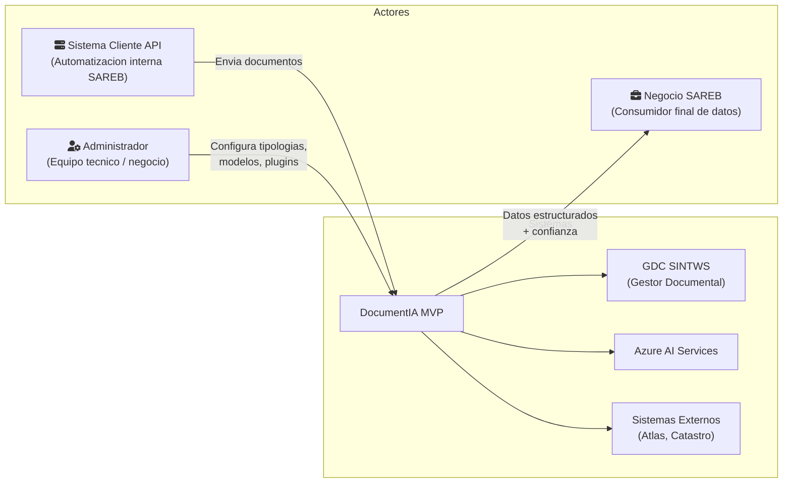
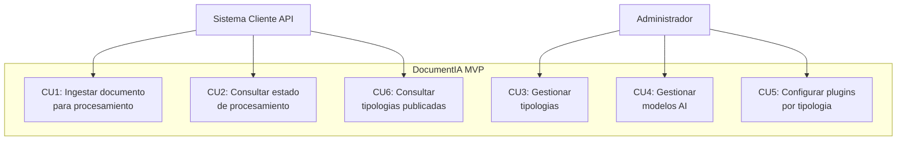
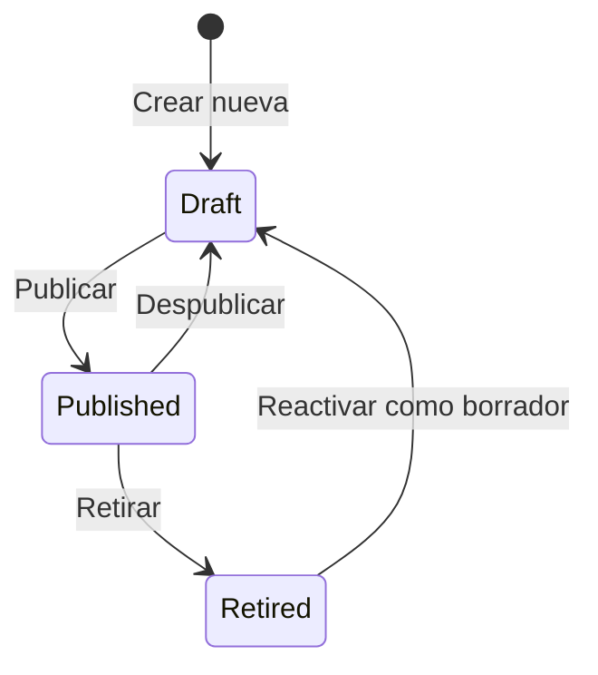

# 2. Analisis Funcional — DocumentIA MVP

> Ultima actualizacion: 2026-03-31  
> Proyecto: AI DocClassExt — SAREB

---

## 2.1 Descripcion del Problema de Negocio

SAREB (Sociedad de Gestion de Activos procedentes de la Reestructuracion Bancaria) gestiona una cartera de activos inmobiliarios que genera un volumen elevado de documentacion legal y tecnica: notas simples registrales, tasaciones, escrituras, certificados energeticos, contratos de arrendamiento, entre otros.

**Situacion actual (antes de DocumentIA):**
- La clasificacion documental es manual: un operador identifica el tipo de documento y lo archiva en el Gestor Documental Corporativo (GDC).
- La extraccion de datos clave (finca registral, titulares, cargas, valores de tasacion) se realiza manualmente o con plantillas rigidas.
- Los errores de clasificacion y extraccion generan reprocesos, retrasos y riesgos regulatorios.
- No existe validacion automatica de datos extraidos (NIF invalidos, fechas incoherentes, referencias catastrales erroneas).
- La trazabilidad end-to-end es limitada.

**Solucion DocumentIA:**
Un pipeline automatizado de IA que recibe un documento PDF, lo clasifica, extrae datos estructurados, los valida, los enriquece con fuentes externas, los archiva en GDC y persiste resultados con auditoria completa. Todo accesible via API REST para integracion con sistemas existentes de SAREB.

---

## 2.2 Actores del Sistema



| Actor | Tipo | Descripcion |
|-------|------|------------|
| **Sistema Cliente API** | Sistema | Cualquier sistema de SAREB que envie documentos al pipeline via `POST /api/IngestDocument`. Puede ser un proceso batch, un portal web o un flujo RPA. |
| **Administrador** | Persona | Miembro del equipo tecnico o de negocio que gestiona tipologias, modelos AI y plugins desde el portal Admin (Blazor) o directamente via API `/management/*`. |
| **Negocio SAREB** | Persona | Consumidor final de los datos extraidos y clasificados. No interactua directamente con DocumentIA; consume los resultados a traves de GDC, SQL o reportes. |
| **GDC SINTWS** | Sistema externo | Gestor Documental Corporativo de SAREB. Recibe documentos clasificados via SOAP. |
| **Azure AI Services** | Sistema externo | Proveedores de IA: Document Intelligence, Content Understanding, OpenAI. |
| **Plugins externos** | Sistema externo | Servicios REST/SOAP para enriquecimiento (catastro, atlas, Excel de referencias). |

---

## 2.3 Casos de Uso Principales



### CU1: Ingestar Documento para Procesamiento

| Campo | Detalle |
|-------|---------|
| **Actor principal** | Sistema Cliente API |
| **Precondicion** | Debe informarse exactamente una fuente de documento: `documento.content.base64` (PDF en Base64) **o** `documento.objectIdGDC` (documento ya archivado en GDC). Function Key valida (si endpoint protegido). |
| **Postcondicion** | Documento clasificado, datos extraidos, validados, enriquecidos, archivado en GDC, persistido en BD. |

**Flujo normal:**
1. Cliente envia `POST /api/IngestDocument` con documento en Base64 **o** `objectIdGDC`, e instrucciones opcionales.
2. Sistema genera `instanceId` y devuelve `statusQueryUri` para polling.
3. Orchestrator ejecuta pipeline: Normalizar → Verificar duplicado → Subir blob → Clasificar → Resolver tipologia → Extraer → Prompt → Validar → ObtenerActivo → Integrar → Subir GDC → Persistir.
4. Cliente consulta `statusQueryUri` hasta obtener estado `Completed`.
5. Respuesta final incluye: datos extraidos, confianza global, estado calidad, auditoria.

**Flujos alternativos:**

| Condicion | Comportamiento |
|-----------|---------------|
| Entrada por `objectIdGDC` con checksum existente en BD | Pre-dedupe por MD5 (metadata GDC) y retorno temprano con última ejecución si `forceReprocess=false`. |
| Entrada por `objectIdGDC` sin checksum/duplicado en BD | Descarga documento desde GDC y continúa pipeline normal. |
| Documento duplicado (SHA256 ya existe en BD) | Si `forceReprocess=false`: retorna resultado anterior cacheado con `ReutilizadaPorDuplicado=true`. |
| ExpectedType informado | Omite clasificacion (confianza=1.0), usa la tipologia indicada directamente. |
| Confianza clasificacion < umbral | Estado final `BAJA_CONFIANZA_CLASIFICACION`. No extrae ni valida. |
| Tipologia no resoluble | Estado final `ERROR` con mensaje "No se ha podido identificar la tipologia". |
| Extraccion con baja completitud | Activa fallback GPT-4o-mini para campos faltantes. |
| Plugin critico (Priority=1) falla | Detiene cadena de plugins. Datos parciales se preservan. |
| AssetResolver habilitado y activo encontrado | `ObtenerActivoActivity` resuelve IdActivo desde `DM_POSICION_AAII_TB` antes de la integracion. |
| AssetResolver sin resultados | Paso se completa sin IdActivo; plugins posteriores pueden resolverlo. |
| GDC timeout (>120s) | Marca `Timeout` en SubirGDC, continua a persistencia. |
| Excepcion no controlada | Estado final `ERROR` con mensaje de excepcion. Persiste lo capturado hasta ese punto. |

### CU2: Consultar Estado de Procesamiento

| Campo | Detalle |
|-------|---------|
| **Actor principal** | Sistema Cliente API / Desktop |
| **Flujo** | `GET statusQueryUri` (Durable Functions built-in). Retorna `runtimeStatus` (Pending/Running/Completed/Failed) + `customStatus` con timeline de actividades. |
| **customStatus en Running** | `{ estado, actividadActual, actividadesTotales, actividadesCompletadas[], duracionTotalMs, actividades[{nombre, estado, duracionMs, fallbackActivado}] }` |

### CU3: Gestionar Tipologias

| Campo | Detalle |
|-------|---------|
| **Actor principal** | Administrador |
| **Endpoints** | `GET/POST/PUT /management/tipologias`, `POST .../publicar`, `POST .../retirar`, `POST .../draft` |
| **Ciclo de vida** | Draft → Published → Retired. Solo tipologias Published estan activas para clasificacion. |
| **Datos gestionados** | Codigo, nombre, version, umbrales, modelos asociados, prompt GPT y `ConfiguracionJson` persistido en BD. Los JSON fisicos son seed/referencia, no fuente operativa. |

### CU4: Gestionar Modelos AI

| Campo | Detalle |
|-------|---------|
| **Actor principal** | Administrador |
| **Endpoints** | `GET /management/modelos/{tipo}`, `POST /management/modelos`, `PUT .../modelos/{id}`, `DELETE .../modelos/{id}` |
| **Tipos** | Clasificacion, Extraccion, Prompt, Layout |
| **Datos** | Key unica, provider, modelo, `ConfiguracionJson` en la tabla `ModeloConfigs`, activo/inactivo. |

### CU5: Configurar Plugins por Tipologia

| Campo | Detalle |
|-------|---------|
| **Actor principal** | Administrador |
| **Endpoints** | `GET/PUT /management/plugins-tipologias/{codigo}`, `POST .../publicar`, `POST .../retirar` |
| **Datos** | `ConfiguracionJson` en BD con array de plugins: pluginKey, pluginType (REST/SOAP/Custom), enabled, priority, configuration, retryPolicy. |

### CU6: Consultar Tipologias Publicadas

| Campo | Detalle |
|-------|---------|
| **Actor principal** | Sistema Cliente / Desktop |
| **Endpoint** | `GET /api/tipologias` (Anonymous) |
| **Respuesta** | Lista de tipologias publicadas con codigo, nombre, version, campos GDC. |

### CU7: Obtener Activo desde Documento

| Campo | Detalle |
|-------|---------|
| **Actor principal** | Sistema (automatico dentro del pipeline) |
| **Precondicion** | Documento extraido con datos que contienen IDUFIR o Referencia Catastral. AssetResolver habilitado en tipologia o instrucciones. |
| **Postcondicion** | Si se encuentra un activo unico, `IdActivo` queda resuelto y se propaga a Integracion y persistencia. |
| **Descripcion** | La actividad `ObtenerActivoActivity` consulta la tabla `DM_POSICION_AAII_TB` del plugin AssetResolver usando los datos extraidos (IDUFIR y/o Referencia Catastral). Los campos de busqueda se resuelven por alias configurables (mapeo en tipologia o configuracion global). |
| **Precedencia** | `instrucciones.assetResolver.enabled` > `tipologia.assetResolver.enabled` > deshabilitado (default) |
| **Resultado** | `detalleEjecucion.assetResolver` con activos encontrados, criterios usados, campos solicitados y duracion. |
| **Si no hay match** | `assetResolver.exitoso = false`, `activos = []`, pipeline continua sin IdActivo desde este paso. |
| **Si hay match multiple** | Se retornan todos los activos pero no se resuelve IdActivo automaticamente (requiere match unico). |

---

## 2.4 Reglas de Negocio Criticas

### RN1: Deduplicacion por SHA256

- Antes de procesar, se calcula SHA256 del documento y se busca en BD.
- Si existe y `forceReprocess=false`, se retorna el resultado anterior.
- Si existe y `forceReprocess=true`, se reprocesa completamente.
- `SkipDuplicateCheck=true` omite la verificacion (procesamiento incondicional).
- La **clave de deduplicacion** es `SHA256 + classificationOnly + nivelClasificacion`. Dos peticiones con el mismo
  SHA256 pero distinto `nivelClasificacion` se tratan como ejecuciones independientes y no se reutilizan entre si.

### RN2: Umbrales de Confianza Configurables

La confianza se evalua en cascada con prioridad:

```
Instrucciones de la peticion (request)
  → Configuracion de la tipologia publicada en BD
    → Configuracion global del servidor (appsettings)
```

| Umbral | Significado | Default |
|--------|------------|---------|
| `clasifUmbralFallback` | Confianza minima de DI para NO activar fallback GPT en clasificacion | 0.6 (server) / 0.85 (tipologia) |
| `extracUmbralFallback` | Completitud minima de CU para NO activar fallback GPT en extraccion | 0.5 (server) / 0.9 (tipologia) |
| `umbralOK` | Confianza global minima para estado calidad "OK" | 0.85 |
| `umbralRevision` | Confianza global minima para estado calidad "REVISION" (entre revision y error) | 0.70 |

Los campos de una tipologia pueden declarar `avoidConfidence: true`. Estos campos quedan fuera del calculo
del score de confianza de extraccion y de `CamposBajaConfianza`, pero siguen contando para completitud,
campos requeridos y `DatosExtraidos`. `MetricasDebug.ConfianzaPorCampo` mantiene la confianza original de
todos los campos, y `CamposExcluidosConfianza` lista los campos excluidos del score.

### RN3: Confianza Global

```
ConfianzaGlobal = MIN(ConfianzaClasificacion, ConfianzaExtraccion, ConfianzaValidacion)
```

| ConfianzaGlobal | EstadoCalidad |
|----------------|--------------|
| >= umbralOK (0.85) | `OK` |
| >= umbralRevision (0.70) | `REVISION` |
| < umbralRevision | `ERROR` |

### RN4: Severidades de Validacion

| Severidad | Impacto |
|-----------|---------|
| `Error` | Reduce ConfianzaValidacion. Se reporta en Inconsistencias. Detiene validacion del campo (por optimizacion). |
| `Warning` | Se reporta en Validaciones. No impide procesamiento. |
| `Info` | Informativo. No impacta confianza. |

Si hay errores de validacion, el estado final es `VALIDACION_CON_ERRORES` en lugar de `OK`.

### RN5: Ciclo de Vida de Tipologias



Solo las tipologias en estado `Published` son usadas por el pipeline de clasificacion y estan visibles en `GET /api/tipologias`.

### RN6: Plugins por Prioridad

- Los plugins se ejecutan en orden ascendente de prioridad (`Priority=1` primero).
- Si un plugin con `Priority=1` (critico) falla, se detiene la cadena completa.
- Plugins no criticos: error se loguea como warning, se continua con el siguiente.

### RN7: Clasificacion Jerarquica GPT (nivelClasificacion)

Cuando se informa `instrucciones.classification.nivelClasificacion` (`"TDN1"` o `"TDN1/TDN2"`):

1. **D2 — Force provider GPT**: el sistema fuerza `classification.provider = "gpt"` automaticamente, independientemente
   de lo que se haya indicado en la peticion o configuracion de tipologia.
2. **D1 — Clasificacion parcial (`clasificacionParcial = true`)**:
   - Si la clasificacion GPT retorna un **codigo TDN1 conocido** del catalogo: se asigna `identificacion.tdn1` y el
     **pipeline continua normalmente** (extraccion, validacion, plugins). Solo se establece el nivel TDN1 detectado.
   - Si la clasificacion GPT retorna una **tipologia no mapeada al catalogo** (`tipologia = "Desconocido"`):
     el pipeline **se detiene**, extraccion y validacion se omiten, `resultado.estado = "OK"`, y
     `identificacion.propuestaTipologia` contiene la propuesta libre del modelo.
3. **D4 — Markdown pre-procesado**: si se informa `instrucciones.classification.markdown`, el paso
   `ExtraerMarkdownLayoutActivity` se omite y se usa ese texto directamente. Util en integraciones batch que
   ya tienen el markdown extraido.
4. **D7 — Clave de deduplicacion extendida**: el campo `nivelClasificacion` forma parte de la clave de deduplicacion
   junto con `SHA256` y `classificationOnly`. Ver RN1.
5. **Confianza dinamica self-reported**: GPT reporta su propia certeza sobre cada clasificacion mediante un campo
   `confianza` (0.0-1.0) en el JSON de respuesta. El sistema extrae este valor y lo usa como `ConfianzaClasificacion`
   final. Si GPT no reporta confianza, se aplica fallback a 0.9 para mantener compatibilidad con versiones anteriores.
   Esta confianza se refleja en:
   - `output.DetalleEjecucion.Clasificacion.Confianza`
   - Logs: `ConfianzaSelfReported` vs `ConfianzaFinal`
   - Calculo de `ConfianzaGlobal` (ver RN3)
- Cada plugin puede devolver `DatosEnriquecidos` que se mergean acumulativamente en `DatosFinales`.
- Un plugin con `returnsIdActivo=true` puede resolver/sobreescribir el `IdActivo` del documento.

### RN7: Resolucion de Activo (AssetResolver)

- La actividad `ObtenerActivo` se ejecuta entre Validar e Integrar, solo si esta habilitada.
- Habilitacion por precedencia: `instrucciones.assetResolver.enabled ?? tipologia.assetResolver.enabled ?? false`.
- **Tres criterios de busqueda independientes**, cada uno habilitado/deshabilitado por configuracion:
  - **IDUFIR** (`busquedaIdufirHabilitada`, default `true`): busqueda exacta en `DM_POSICION_AAII_TB.ID_IDUFIR`.
  - **Referencia Catastral** (`busquedaReferenciaCatastralHabilitada`, default `true`): busqueda exacta en `ID_REF_CATAST`.
  - **Direccion** (`busquedaDireccionHabilitada`, default `false`): busqueda fuzzy con scoring en columnas de direccion.
- **Modo de combinacion** (`modoCombinacionCriterios`): `OR` (union, default) o `AND` (interseccion de resultados).
- Los alias de campos se resuelven por precedencia: mapeos de la tipologia > configuracion global (`FieldAliases`).
- Si un criterio esta deshabilitado, no se intenta detectar ni usar, incluso si hay aliases globales.
- Si se encuentra exactamente 1 activo, su `ID_ACTIVO_SAREB` se asigna como `IdActivo` del documento.
- Si se encuentran 0 o multiples activos, no se resuelve IdActivo en este paso (puede ser resuelto por plugins posteriores).

---

## 2.5 Glosario de Terminos del Dominio

| Termino | Definicion |
|---------|-----------|
| **Tipologia** | Tipo documental configurable (ej: nota-simple, tasacion, resumen-documental). Tiene codigo, version, umbrales y configuracion de extraccion/validacion/plugins. |
| **Nota Simple** | Extracto del Registro de la Propiedad que informa sobre la situacion juridica de una finca (titulares, cargas, dominio). Tipologia principal del MVP: `nota-simple@1.4`. |
| **Tasacion** | Informe de valoracion de un inmueble realizado por una sociedad de tasacion. |
| **Confianza** | Metrica [0.0-1.0] que indica el grado de certeza de la IA sobre su resultado. Se calcula por clasificacion, extraccion y validacion. |
| **ConfianzaAgregada / ConfianzaGlobal** | MIN(confianza clasificacion, confianza extraccion, confianza validacion). |
| **EstadoCalidad** | Clasificacion del resultado final: OK (>=0.85), REVISION (>=0.70), ERROR (<0.70). Umbrales configurables por tipologia. |
| **CorrelationId** | UUID que vincula todas las operaciones de una misma peticion para trazabilidad end-to-end. Auto-generado si no se informa. |
| **IdActivo** | Identificador del activo inmobiliario de SAREB asociado al documento. Puede venir en la peticion o ser resuelto por un plugin de enriquecimiento. |
| **IdGDC** | Identificador del objeto en el Gestor Documental Corporativo tras la subida exitosa. |
| **Matricula** | Codigo de clasificacion GDC que define donde se archiva el documento (ej: `AI-01-NOTS-01`). |
| **Finca Registral** | Numero de inscripcion de una finca en el Registro de la Propiedad. Campo clave en Notas Simples. |
| **IDUFIR / CRU** | Codigo Registral Unico de 14 digitos que identifica una finca de forma univoca a nivel nacional. |
| **Referencia Catastral** | Codigo de 20 caracteres que identifica un inmueble en el Catastro. Validado por `CatastralReferenceValidator`. |
| **NIF/NIE/CIF** | Documentos de identidad fiscal espanoles. Validados algoritmicamente por `NifValidator`. |
| **GDC SINTWS** | Servicio SOAP del Gestor Documental Corporativo de SAREB (host: srbwidd03.sareb.srb:8090). |
| **Fallback** | Mecanismo automatico que redirige al proveedor alternativo (GPT) cuando el primario (DI/CU) tiene baja confianza o falla. |
| **Plugin** | Componente de integracion extensible (REST, SOAP o DLL .NET custom) que enriquece datos extraidos con fuentes externas. |
| **AssetResolver** | Plugin HTTP que consulta la tabla `DM_POSICION_AAII_TB` para resolver el activo inmobiliario (IdActivo). Soporta tres criterios: IDUFIR, Referencia Catastral y Direccion (fuzzy scoring). Criterios configurables con AND/OR. |
| **DM_POSICION_AAII_TB** | Tabla SQL Server con la posicion de activos AAII de SAREB (~160 columnas). PK compuesta: `(ID_ACTIVO_SAREB, FCH_CIERRE_DT)`. Campos clave de busqueda: `ID_IDUFIR` (14 chars), `ID_REF_CATAST` (32 chars). |
| **ObtenerActivoActivity** | Actividad del pipeline que invoca al AssetResolver via HTTP para resolver el activo asociado al documento. Se ejecuta entre Validar e Integrar. |
| **Circuit Breaker** | Patron de resiliencia que abre el circuito tras N fallos consecutivos, impidiendo nuevas llamadas hasta que se restablezca el servicio. |

---

## 2.6 Requisitos Funcionales

| ID | Requisito | Criterio de Aceptacion | Estado |
|----|-----------|----------------------|--------|
| RF01 | El sistema debe clasificar automaticamente el tipo documental de un PDF | Devuelve `TipologiaDetectada` con confianza >= 0.6. Soporta fallback a GPT si confianza DI baja. | DONE |
| RF02 | El sistema debe extraer campos estructurados de documentos clasificados | Devuelve `DatosExtraidos` como diccionario clave-valor. Campos alineados con configuracion de tipologia. | DONE |
| RF03 | El sistema debe detectar documentos duplicados por SHA256 | Si SHA256 existe en BD y `forceReprocess=false`, retorna resultado cacheado sin reprocesar. | DONE |
| RF04 | El sistema debe validar datos extraidos contra reglas configurables | Ejecuta ValidationEngine con reglas JSON por tipologia. Devuelve errores/warnings/info. | DONE |
| RF05 | El sistema debe soportar multiples tipologias con configuracion independiente | Cada tipologia tiene su propia configuracion de extraccion, validacion, plugins y umbrales. | DONE |
| RF06 | El sistema debe subir documentos al GDC via SOAP | `SubirGDCActivity` envia documento al GDC con matricula y metadata. Soporta timeout de 120s. | DONE |
| RF07 | El sistema debe enriquecer datos via plugins configurables | PluginFactory crea REST/SOAP/Custom plugins. Ejecucion por prioridad con retry. | DONE |
| RF08 | El sistema debe persistir resultados y auditoria en BD | `PersistirActivity` guarda DocumentoEntity, ResultadoProcesamientoEntity, DocumentoEjecucionEntity, AuditoriaEntity. | DONE |
| RF09 | El sistema debe exponer progreso de procesamiento en tiempo real | customStatus con timeline de actividades consultable via statusQueryUri. | DONE |
| RF10 | El sistema debe soportar gestion CRUD de tipologias via API | Endpoints `/management/tipologias` con ciclo Draft→Published→Retired. | DONE |
| RF11 | El sistema debe soportar gestion de modelos AI (clasificacion, extraccion, prompt, layout) | Endpoints `/management/modelos` con CRUD y activacion. | DONE |
| RF12 | El sistema debe ejecutar prompts libres configurables por tipologia y resumen por defecto controlado | PromptActivity con OpenAI, configurable via `promptConfig` en tipologia JSON. El resumen ejecutivo por defecto se devuelve en `Resumen`; el prompt propio/ad-hoc se mantiene en `ResultadoPrompt`. | DONE |
| RF13 | El sistema debe soportar versionado de tipologias | Resolucion `nota-simple` → default version, `nota-simple@1.4` → version especifica. | DONE |
| RF14 | El sistema debe calcular hashes SHA256, MD5 y CRC32 para integridad | NormalizarActivity calcula los tres hashes. SHA256 usado para deduplicacion, MD5 para GDC. | DONE |
| RF15 | El sistema debe proteger datos personales segun GDPR/LOPD | Masking de datos sensibles, cifrado en reposo, retencion configurable. | DESCARTADO MVP (EP7 Removed) |
| RF16 | El sistema debe resolver el activo inmobiliario desde datos extraidos | `ObtenerActivoActivity` consulta `DM_POSICION_AAII_TB` via AssetResolver. Devuelve `IdActivo` si match unico. Habilitacion configurable por tipologia/instrucciones. | DONE |
| RF17 | El sistema debe permitir excluir campos del score de confianza de extraccion por tipologia | `avoidConfidence: true` en un campo lo excluye del score y de `CamposBajaConfianza`, manteniendo completitud y trazabilidad en `ConfianzaPorCampo`. | DONE |

---

## 2.7 Requisitos No Funcionales

| ID | Categoria | Requisito | Criterio | Estado |
|----|-----------|-----------|----------|--------|
| RNF01 | Rendimiento | Pipeline completo en < 120s para un documento tipico | Medido por DuracionTotalMs en seguimiento. GDC timeout 120s. | CUMPLIDO (tipico: 15-45s) |
| RNF02 | Disponibilidad | Function App con SLA >= 99.95% | Azure Consumption Plan SLA. Durable Functions tolerante a reinicios. | CUMPLIDO (Azure SLA) |
| RNF03 | Escalabilidad | Soportar procesamiento concurrente de multiples documentos | Durable Functions escala automaticamente. Sin estado compartido entre instancias. | CUMPLIDO |
| RNF04 | Seguridad | Autenticacion en todos los endpoints de gestion | `AuthorizationLevel.Function` (x-functions-key). Managed Identity preparada. | CUMPLIDO |
| RNF05 | Seguridad | Credenciales nunca en codigo fuente | API Keys en configuration/Key Vault. SSL bypass solo configurable explicitamente. | CUMPLIDO |
| RNF06 | Auditabilidad | Cada operacion registrada en tabla Auditoria | PersistirActivity escribe AuditoriaEntity con accion, nivel, mensaje, timestamp. | CUMPLIDO |
| RNF07 | Extensibilidad | Anadir nueva tipologia sin cambiar codigo | Registro/configuracion en BD via Admin portal o Admin API. JSON fisico solo como seed/plantilla. Sin recompilacion. | CUMPLIDO |
| RNF08 | Observabilidad | Telemetria en Application Insights | Structured logging + Application Insights SDK. Metricas custom por actividad. | CUMPLIDO |
| RNF09 | Resiliencia | Tolerancia a fallos en servicios externos | Circuit breaker + retry exponencial en plugins y GDC. Fallback IA automatico. | CUMPLIDO |
| RNF10 | Mantenibilidad | Cobertura de tests unitarios >= 70% en modulos criticos | 33 clases de test. Validacion, plugins, configuracion bien cubiertos. | EN PROGRESO |

---

## 2.8 Mapeo de User Stories

### Epics y User Stories

| Epic | Nombre | Estado | User Stories |
|------|--------|--------|-------------|
| **EP1** | Ingesta y orquestacion | DONE | HU1, HU2 |
| **EP2** | Clasificacion y extraccion AI | DONE | HU3, HU4 |
| **EP3** | Validacion y motor de reglas | IN PROGRESS | HU5, HU6 |
| **EP4** | Persistencia y auditoria | DONE | HU7 |
| **EP5** | Configuracion y tipologias | IN PROGRESS | HU8, HU9, HU10 |
| **EP6** | Observabilidad y pruebas | IN PROGRESS | HU11 |
| **EP7** | Proteccion de datos / GDPR | REMOVED (fuera de alcance MVP) | HU12 |
| **EP8** | Mantenimiento Blob | PLANNED | HU13 |
| **EP9** | GDC integracion completa | IN PROGRESS | — |
| **EP10** | Resolucion de Activo | DONE | HU14 |

### Detalle de User Stories

| ID | Titulo | Descripcion | Criterio de Aceptacion | Estado |
|----|--------|------------|----------------------|--------|
| HU1 | Ingesta de documentos via API | Como sistema cliente, quiero enviar un documento via POST para que sea procesado automaticamente. | Endpoint acepta JSON con `documento.content.base64` o `documento.objectIdGDC`, devuelve `instanceId` y `statusQueryUri`. | DONE |
| HU2 | Seguimiento en tiempo real | Como usuario del Desktop, quiero ver el progreso del procesamiento con actividades en tiempo real. | customStatus muestra timeline con estado/duracion por actividad. Polling cada 2s. | DONE |
| HU3 | Clasificacion con fallback | Como sistema, quiero que la clasificacion use DI y si la confianza es baja, recurra a GPT. | Fallback automatico cuando confianza < umbral. Flag `FallbackLLM=true` en resultado. | DONE |
| HU4 | Extraccion multi-proveedor | Como sistema, quiero extraer campos usando CU con fallback a GPT si la completitud es baja. | ConfigurableExtraerDataProvider enruta segun config. Fallback automatico. | DONE |
| HU5 | Validacion por reglas | Como negocio, quiero que los datos extraidos se validen contra reglas de NIF, fechas, rangos, etc. | ValidationEngine con 11 tipos de regla. Severidades Error/Warning/Info. | DONE |
| HU6 | Configuracion de reglas JSON | Como COMPLETAR_GDC_HTTP_BASIC_USERNAME, quiero definir reglas de validacion en JSON sin cambiar codigo. | Archivos `{tipologia}.validation.json` con campos, tipos de regla y severidades. | DONE |
| HU7 | Persistencia completa | Como sistema, quiero que cada procesamiento quede guardado en BD con auditoria. | Documentos, resultados, ejecuciones, plugins y validaciones persistidos. | DONE |
| HU8 | Gestion de tipologias | Como COMPLETAR_GDC_HTTP_BASIC_USERNAME, quiero crear, editar, publicar y retirar tipologias desde un portal. | CRUD + lifecycle Draft→Published→Retired via API y Blazor Admin. | DONE |
| HU9 | Versionado de tipologias | Como COMPLETAR_GDC_HTTP_BASIC_USERNAME, quiero manejar multiples versiones de una tipologia simultanamente. | Resolucion `familia@version`. Default version configurable. | DONE |
| HU10 | Configuracion de plugins | Como COMPLETAR_GDC_HTTP_BASIC_USERNAME, quiero asignar y configurar plugins de integracion por tipologia. | Endpoints `/management/plugins-tipologias`. JSON con priority, retry, enabled. | DONE |
| HU11 | Observabilidad | Como operador, quiero metricas y logs en Application Insights para diagnosticar problemas. | Structured logging, telemetria AI SDK, metricas por actividad en seguimiento. | IN PROGRESS |
| HU12 | Proteccion GDPR | Como responsable de datos, quiero cifrado de datos sensibles y politica de retencion. | AES-256-GCM en campos PII, retencion configurable, masking en logs. | REMOVED (fuera de alcance MVP) |
| HU13 | Mantenimiento blob | Como operador, quiero politicas de retencion de blobs para gestionar almacenamiento. | Lifecycle rules en Storage + soft delete + archivado por antigüedad. | PLANNED |
| HU14 | Resolucion de activo | Como sistema, quiero resolver automaticamente el IdActivo del documento consultando la tabla `DM_POSICION_AAII_TB` usando IDUFIR, Referencia Catastral y/o Direccion. | `ObtenerActivoActivity` busca en AssetResolver con tres criterios configurables (habilitar/deshabilitar cada uno). Soporta AND/OR. Si match unico, `IdActivo` se propaga. Ver [ESPECIFICACION_PLUGIN_ASSETRESOLVER.md](ESPECIFICACION_PLUGIN_ASSETRESOLVER.md). | DONE |

---

## 2.9 Restricciones del Sistema

| Restriccion | Detalle |
|------------|---------|
| **GDPR/LOPD** | Los documentos pueden contener datos personales (NIF, nombres, direcciones). Este requisito regulatorio se mantiene, pero su implementación funcional (EP7) queda fuera del alcance del MVP actual (`Removed` en ADO el 2026-05-26). |
| **Formatos aceptados** | Solo PDF. Puede recibirse como Base64 sin saltos de línea (RFC 4648) o recuperarse desde GDC vía `documento.objectIdGDC`. |
| **Tamaño maximo** | Limitado por el tamaño maximo de input de Durable Functions (~60 KB entity size en Storage). Documentos grandes pueden requerir blob-reference pattern (no implementado). |
| **Timeouts** | GDC: 120s (hardcoded en orchestrator). Servicios AI: configurable por proveedor (DI: 120s, GPT: 30-60s, CU: configurable). |
| **Conectividad GDC** | Requiere acceso de red a `srbwidd03.sareb.srb:8090`. SSL bypass configurable para certificado CA corporativo no confiado en Linux. |
| **Region Azure** | Function App y mayoria de servicios en West Europe. Content Understanding en Sweden Central (unica region disponible con la funcionalidad requerida). |
| **Modelo Consumption** | Function App en plan Consumption: cold start posible (~2-10s). Timeout maximo por ejecucion: 10 min (default) o 230s (HTTP trigger). |
| **Idioma** | Documentos en espanol. Prompts GPT y reglas de validacion asumen idioma espanol. |

---

## 2.10 Referencias

| Documento | Contenido |
|-----------|-----------|
| [01_ARQUITECTURA_SISTEMA.md](01_ARQUITECTURA_SISTEMA.md) | Arquitectura tecnica, ADRs, despliegue |
| [03_DISENO_TECNICO_DETALLADO.md](03_DISENO_TECNICO_DETALLADO.md) | Diagramas de flujo, secuencia, modelo ER |
| [CAUSISTICAS_NOTA_SIMPLE_1_4.md](CAUSISTICAS_NOTA_SIMPLE_1_4.md) | Casuisticas especificas de Nota Simple 1.4 |
| [CONFIANZA_AGREGADA.md](CONFIANZA_AGREGADA.md) | Logica detallada de calculo de confianza |
| [TIPOLOGIAS_REFERENCIA.md](TIPOLOGIAS_REFERENCIA.md) | Catalogo de referencia de tipologias |
