# 3. Diseno Tecnico Detallado — DocumentIA MVP

> Ultima actualizacion: 2026-04-24  
> Proyecto: AI DocClassExt — SAREB

---

## 3.1 Diagrama de Flujo del Pipeline

El pipeline de procesamiento esta orquestado por `DocumentProcessOrchestrator` (Durable Functions). Ejecuta 14 actividades en secuencia con multiples puntos de decision.

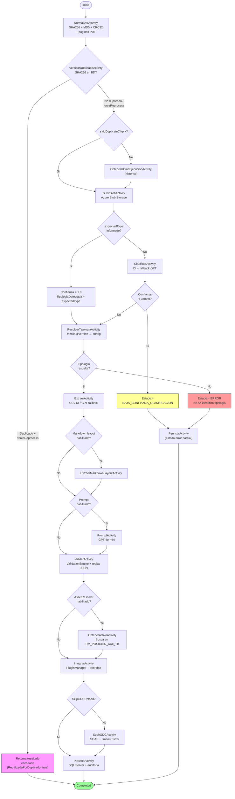

### Detalle de las 14 Actividades

| # | Actividad | Clase | Input principal | Output principal | Notas |
|---|-----------|-------|----------------|-----------------|-------|
| 1 | Normalizar | `NormalizarActivity` | byte[] PDF | SHA256, MD5, CRC32, Paginas | Calculo de hashes e info PDF |
| 2 | VerificarDuplicado | `VerificarDuplicadoActivity` | SHA256 | Resultado previo o null | Busca en BD por SHA256 (indice unico) |
| 3 | ObtenerUltimaEjecucion | `ObtenerUltimaEjecucionActivity` | SHA256 | Ultima ejecucion o null | Solo si no es duplicado y no skipDuplicateCheck |
| 4 | SubirBlob | `SubirBlobActivity` | byte[] + nombre | URL blob | Container `documents/` |
| 5 | Clasificar | `ClasificarActivity` | byte[] PDF | TipologiaDetectada, Confianza | DI primario + GPT fallback |
| 6 | ResolverTipologia | `ResolverTipologiaActivity` | codigo tipologia | TipologiaConfig completa | Resuelve familia@version → config |
| 7 | Extraer | `ExtraerActivity` | byte[] + tipologia config | DatosExtraidos (Dictionary) | CU/DI/GPT segun config |
| 8 | ExtraerMarkdownLayout | `ExtraerMarkdownLayoutActivity` | byte[] PDF | Markdown texto | Layout extraction con DI (opcional) |
| 9 | Prompt | `PromptActivity` | datos + markdown + prompt config | Datos prompt enriquecidos | GPT-4o-mini con prompt libre (opcional) |
| 10 | Validar | `ValidarActivity` | DatosExtraidos + reglas JSON | ValidationReport | 11 tipos de validador |
| 11 | ObtenerActivo | `ObtenerActivoActivity` | DatosExtraidos + config AssetResolver | ResultadoAssetResolver | Busca activo por IDUFIR/RefCatastral/Direccion en DM_POSICION_AAII_TB. Criterios configurables con AND/OR. Ver [ESPECIFICACION_PLUGIN_ASSETRESOLVER.md](especificaciones/ESPECIFICACION_PLUGIN_ASSETRESOLVER.md). |
| 12 | Integrar | `IntegrarActivity` | datos + tipologia + plugins config | DatosFinales + plugins results | Ejecucion por prioridad |
| 13 | SubirGDC | `SubirGDCActivity` | documento + metadata GDC | ObjectId GDC | SOAP (`searchEntities` + `create`) con timeout 120s |
| 14 | Persistir | `PersistirActivity` | ContratoSalida completo | void | BD + auditoria |

### Preflujo adicional cuando se usa `documento.objectIdGDC`

Cuando la entrada viene por referencia GDC (`objectIdGDC`), antes del pipeline estándar se ejecuta un preflujo con operaciones SOAP `get`:

1. `ObtenerMetadatosDocumentoGDCActivity` (lectura de metadatos sin contenido).
2. `VerificarDuplicadoPorMD5Activity` (deduplicación temprana por checksum MD5 en BD local).
3. `ObtenerDocumentoGDCActivity` (descarga de contenido Base64 para hidratar el documento).

En este modo se fuerza `SkipGDCUpload=true` para evitar re-subida del mismo documento origen.

### Actualizacion PRD v2.1: Paso 2.7 (Preparacion para clasificacion)

Se incorpora una preparacion explicita del PDF para clasificacion entre `SubirBlobActivity` y `ClasificarActivity`.

Implementacion:

- Activity: `PrepararDocumentoClasificacionActivity`
- Servicio: `PdfRecorteService`
- Contrato: `PrepararDocumentoClasificacionInput` / `PrepararDocumentoClasificacionResultado`

Comportamiento:

1. Si `ClassificationPreparation.Enabled=true`, se calcula `MaxPaginas` efectivo con precedencia `tipologia > familia > default`.
2. Se recorta el PDF para clasificacion cuando el total de paginas excede `MaxPaginas`.
3. Se propagan metadatos a clasificacion mediante `ClasificacionInput`:
  - `DocumentoBase64Override`
  - `CharsTextoNativo`
  - `TotalPaginas`
4. Si la preparacion falla, el orquestador continua con documento completo (fallback seguro).

Alcance:

- Impacta solo la etapa de clasificacion.
- `ExtraerActivity` y `SubirGDCActivity` siguen usando el documento completo.

### Rama ClassificationOnly (nuevo)

Cuando `instrucciones.classificationOnly=true`, tras `Clasificar` y `ResolverTipologia` se aplica una rama reducida:

- `Extraer`, `Prompt`, `Validar` y `ObtenerActivo` no se ejecutan y quedan como `Skipped` en `detalleEjecucion.seguimiento`.
- `Integrar` solo se ejecuta si `instrucciones.executeIntegrarWhenClassificationOnly=true` y existe `trazabilidad.idActivo`.
- `SubirGDC` mantiene la prioridad de `SkipGDCUpload` y requiere `idActivo` resuelto/disponible.
- `Persistir` siempre se ejecuta.

Trazas operativas expuestas en salida:

- `detalleEjecucion.classificationOnly`: confirma si la ejecución quedó en rama reducida.
- `detalleEjecucion.recorteAplicado` y `detalleEjecucion.paginasIncluidas`: auditan el recorte real usado para clasificación.
- `detalleEjecucion.markdownGenerado` y `detalleEjecucion.origenMarkdown`: indican si se generó markdown y en qué etapa quedó fijado.
- `detalleEjecucion.modeloLLMUsado`: refleja el modelo LLM efectivo cuando hubo fallback/prompt.
- `detalleEjecucion.motivoErrorTipologia`: registra el motivo cuando la tipología no pudo resolverse.

Restricción de entrada:

- `classificationOnly=true` es incompatible con `expectedType` informado (validación en trigger HTTP, respuesta `400`).

Deduplicación:

- La reutilización de ejecuciones previas se confronta por `SHA256 + ClassificationOnly` para evitar mezclar procesos completos con procesos de solo clasificación.

Adicionalmente, cuando `documento.name` llega vacio y se resuelve desde GDC durante este preflujo, el nombre se sincroniza en `salida.Identificacion.Documento` antes de persistir. Como defensa final, `PersistirActivity` aplica fallback determinista si el nombre siguiera vacio para cumplir la restriccion `NOT NULL` de `Documentos.NombreArchivo`.

### Anexo integrado: detalle operativo de Activities

El contenido operativo del antiguo `docs/not in use/MANUAL_ACTIVITIES_AZURE_FUNCTIONS.md` queda integrado en este documento canonico.

Resumen de comportamiento por activity:

- `NormalizarActivity`: hidrata/decodifica documento y calcula integridad (`SHA256`, `MD5`, `CRC32`) y metadatos de páginas.
- `VerificarDuplicadoActivity`: consulta duplicidad por `SHA256`; con `forceReprocess=false` permite retorno temprano de ejecución previa.
- `SubirBlobActivity`: persiste binario en blob (`documents/`) para trazabilidad operativa.
- `ClasificarActivity`: usa DI primario y fallback GPT según umbral/resultado; puede terminar anticipadamente en baja confianza o error de clasificación.
- `ResolverTipologiaActivity`: resuelve configuración efectiva por familia/version.
- `ExtraerActivity`: ejecuta extracción principal y fallback cuando aplica.
- `ValidarActivity`: ejecuta motor de reglas y produce reporte de validación.
- `ObtenerActivoActivity`: resuelve activo vía AssetResolver según criterios configurados.
- `IntegrarActivity`: aplica plugins por prioridad y consolida `DatosFinales`.
- `SubirGDCActivity`: gestiona deduplicación previa (`searchEntities`) y subida (`create`) con timeout de 120s en orquestación.
- `PersistirActivity`: persiste resultado integral y auditoría.

Estados funcionales de cierre del pipeline:

- `OK`
- `VALIDACION_CON_ERRORES`
- `DUPLICADO`
- `BAJA_CONFIANZA_CLASIFICACION`
- `ERROR`

---

## 3.2 Diagrama de Secuencia End-to-End

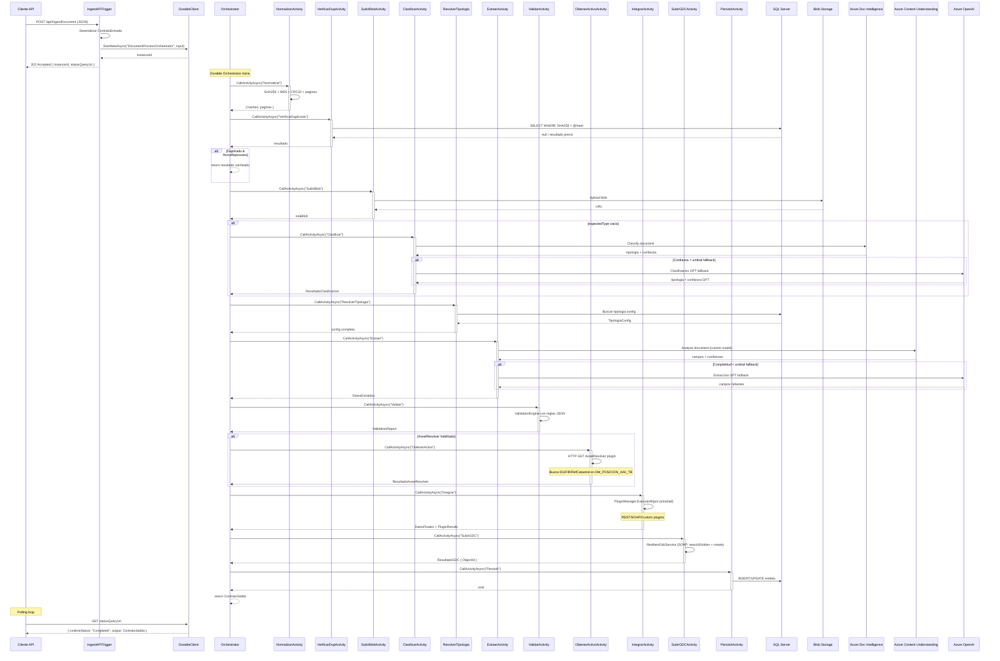

---

## 3.3 Diagrama de Secuencia — Motor de Validacion

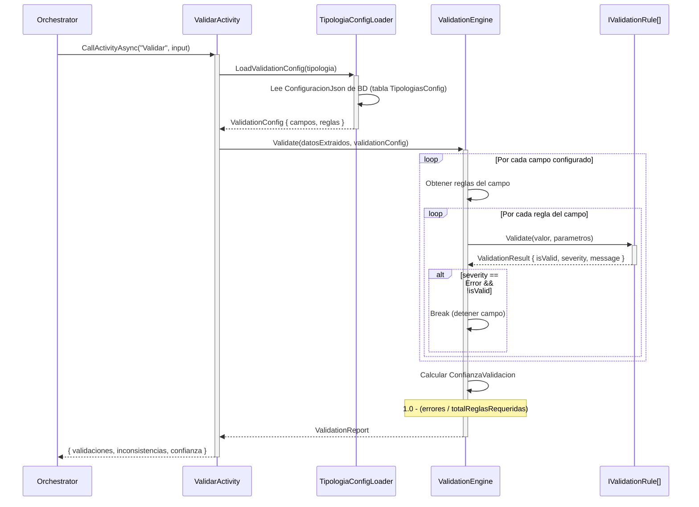

---

## 3.4 Diagrama de Clases — Subsistemas Principales

### 3.4.1 Contratos API

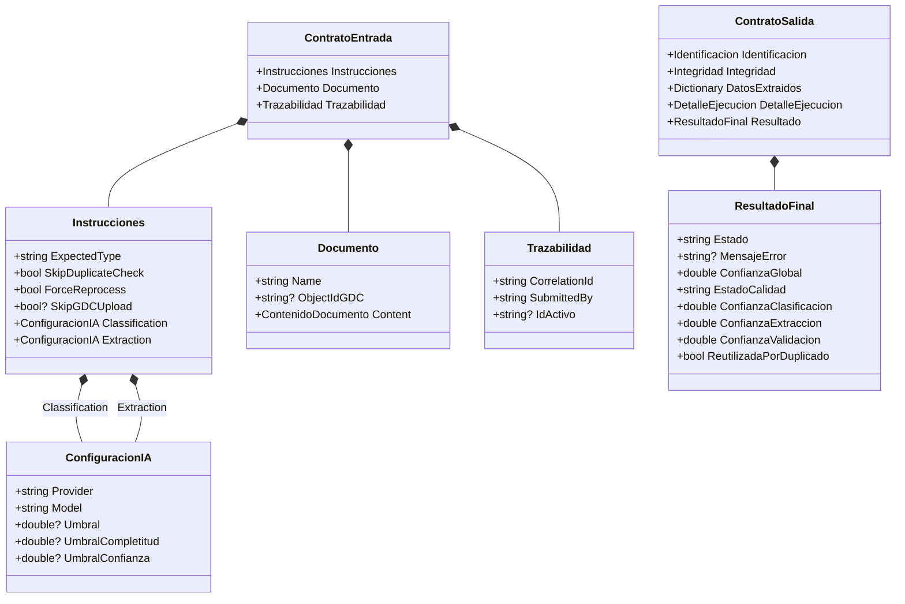

### 3.4.2 Interfaces de Proveedores

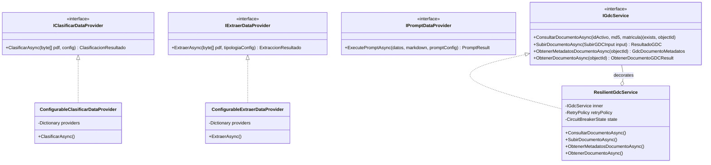

### 3.4.3 Sistema de Plugins

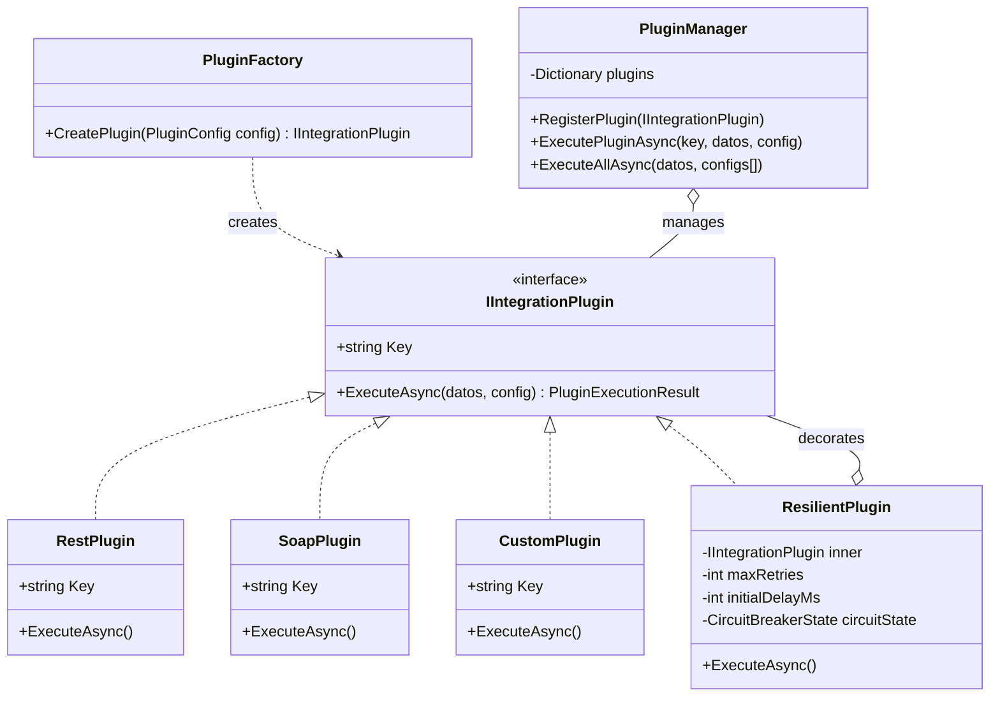

### 3.4.4 Motor de Validacion

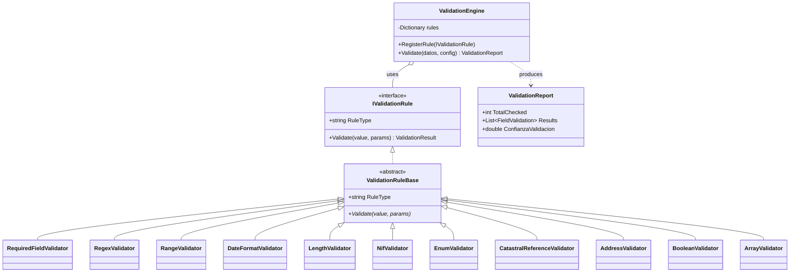

### 3.4.5 Subsistema AssetResolver

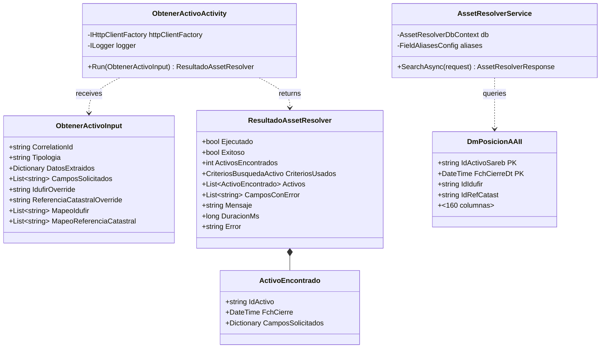

---

## 3.5 Modelo Entidad-Relacion

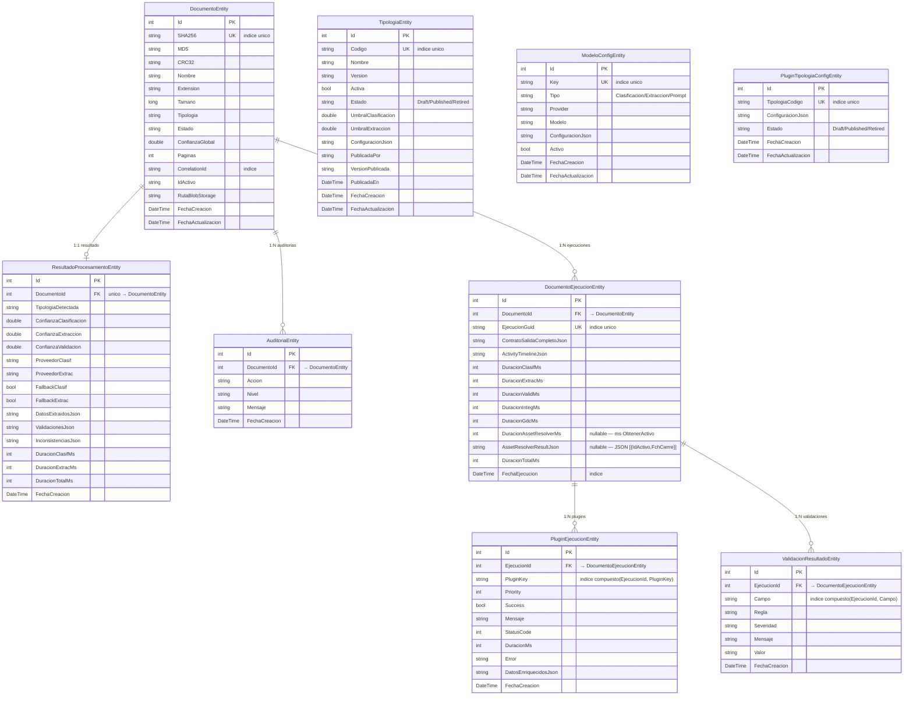

### Indices Configurados en OnModelCreating

| Entidad | Indice | Tipo |
|---------|--------|------|
| `DocumentoEntity` | SHA256 | Unique |
| `DocumentoEntity` | CorrelationId | Non-unique |
| `DocumentoEntity` | Estado | Non-unique |
| `TipologiaEntity` | Codigo | Unique |
| `ModeloConfigEntity` | Key | Unique |
| `PluginTipologiaConfigEntity` | TipologiaCodigo | Unique |
| `DocumentoEjecucionEntity` | EjecucionGuid | Unique |
| `DocumentoEjecucionEntity` | FechaEjecucion | Non-unique |
| `PluginEjecucionEntity` | (EjecucionId, PluginKey) | Compuesto |
| `ValidacionResultadoEntity` | (EjecucionId, Campo) | Compuesto |

---

## 3.6 Motor de Reglas de Validacion

### 3.6.1 Arquitectura

El motor sigue el patron **Strategy**: cada tipo de regla implementa `IValidationRule` con un `RuleType` string discriminator. Las reglas se registran en `ValidationEngine` por tipo y se resuelven dinamicamente al ejecutar la validacion.

### 3.6.2 Tipos de Regla

| RuleType | Clase | Parametros | Ejemplo |
|----------|-------|-----------|---------|
| `required` | RequiredFieldValidator | — | Campo obligatorio, no vacio |
| `regex` | RegexValidator | `pattern` | `"pattern": "^\\d{14}$"` para IDUFIR |
| `range` | RangeValidator | `min`, `max` | Importes 0-999999999 |
| `dateFormat` | DateFormatValidator | `format` | `"format": "dd/MM/yyyy"` |
| `length` | LengthValidator | `minLength`, `maxLength` | NIF: 9-9 caracteres |
| `nif` | NifValidator | — | Validacion algoritmica NIF/NIE/CIF espanol |
| `enum` | EnumValidator | `values[]` | `["Plena", "Nuda", "Usufructo"]` |
| `catastralReference` | CatastralReferenceValidator | — | 20 chars, formato catastral espanol |
| `address` | AddressValidator | — | Estructura basica de direccion |
| `boolean` | BooleanValidator | — | true/false/si/no |
| `array` | ArrayValidator | `minItems`, `maxItems`, `itemRules[]` | Arrays de titulares |

### 3.6.3 Esquema de Configuracion JSON

```json
{
  "tipologiaId": "nota.simple.1_4",
  "version": "1.4",
  "extractionConfig": {
    "expectedFields": [
      "FincaRegistral", "IDUFIR_CRU", "Direccion",
      "ReferenciaCatastral", "FechaDocumento"
    ]
  },
  "confidenceConfig": {
    "umbralOK": 0.85,
    "umbralRevision": 0.70
  },
  "fields": {
    "FincaRegistral": {
      "rules": [
        { "type": "required", "severity": "Error", "message": "Finca registral es obligatoria" },
        { "type": "regex", "severity": "Warning", "params": { "pattern": "^\\d+$" }, "message": "Formato numerico esperado" }
      ]
    },
    "IDUFIR_CRU": {
      "rules": [
        { "type": "required", "severity": "Warning" },
        { "type": "regex", "severity": "Error", "params": { "pattern": "^\\d{14}$" }, "message": "IDUFIR debe tener 14 digitos" }
      ]
    },
    "Titulares": {
      "rules": [
        { "type": "required", "severity": "Error" },
        { "type": "array", "severity": "Error", "params": { "minItems": 1 } }
      ]
    },
    "NIF_Titular": {
      "rules": [
        { "type": "nif", "severity": "Error", "message": "NIF/NIE/CIF invalido" }
      ]
    },
    "ReferenciaCatastral": {
      "rules": [
        { "type": "catastralReference", "severity": "Warning" }
      ]
    },
    "FechaDocumento": {
      "rules": [
        { "type": "required", "severity": "Warning" },
        { "type": "dateFormat", "severity": "Error", "params": { "format": "dd/MM/yyyy" } }
      ]
    }
  }
}
```

### 3.6.4 Calculo de Confianza de Validacion

```
erroresCount  = campos con al menos una regla severity=Error que falla
totalRequired = total de campos con al menos una regla severity=Error configurada

ConfianzaValidacion = 1.0 - (erroresCount / totalRequired)
```

Si `totalRequired = 0` (sin reglas Error), `ConfianzaValidacion = 1.0`.

---

## 3.7 Sistema de Plugins

### 3.7.1 Ciclo de Vida

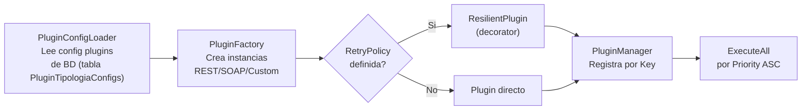

### 3.7.2 Resiliencia (ResilientPlugin)

```
Retry con backoff exponencial:
  delay = InitialDelayMs * 2^(attempt - 1)
  Ejemplo: 500ms → 1000ms → 2000ms → 4000ms

Circuit Breaker:
  - ConsecutiveFailures >= 5 → Estado OPEN
  - OPEN durante 5 minutos → Estado HALF_OPEN
  - HALF_OPEN: 1 intento → exito = CLOSED, fallo = OPEN
```

### 3.7.3 Esquema Configuracion Plugins JSON

```json
{
  "tipologiaCodigo": "nota.simple.1_4",
  "plugins": [
    {
      "pluginKey": "refCatExcel",
      "pluginType": "REST",
      "enabled": true,
      "priority": 1,
      "configuration": {
        "baseUrl": "https://api.ejemplo.com/catastro",
        "method": "POST",
        "headers": { "Authorization": "Bearer <TOKEN>" },
        "bodyTemplate": "{ \"referencia\": \"{ReferenciaCatastral}\" }",
        "responseMapping": {
          "idActivo": "$.result.idActivo",
          "direccionEnriquecida": "$.result.direccion"
        },
        "returnsIdActivo": true
      },
      "retryPolicy": {
        "maxRetries": 3,
        "initialDelayMs": 500
      }
    }
  ]
}
```

### 3.7.4 Tipos de Plugin

| Tipo | Clase | Comunicacion | Uso tipico |
|------|-------|-------------|-----------|
| `REST` | `RestPlugin` | HTTP/HTTPS (JSON) | APIs externas (catastro, atlas, enriquecimiento) |
| `SOAP` | `SoapPlugin` | HTTP/HTTPS (XML/SOAP) | Servicios corporativos legacy |
| `Custom` | `CustomPlugin` | DLL .NET cargada en proceso | Logica de negocio especifica (transformaciones, Excel) |

---

## 3.8 Configuracion Multi-Tipologia

### 3.8.1 Resolucion de Tipologia

```
Input: "nota-simple" | "nota-simple@1.4" | "nota.simple.1_4"
                 ↓
TipologiaVersionResolver
                 ↓
Buscar en TipologiaEntity WHERE Codigo = input (exacto)
  → Si no: split("@") → familia + version → buscar combinaciones
  → Si no: buscar default version de la familia
                 ↓
TipologiaConfig { Codigo, Version, Umbrales, ConfigJson }
```

### 3.8.2 Archivos de Configuración por Tipología

Los archivos JSON en `config/tipologias/` son únicamente **fuente de seed**: al arrancar la Function App, `ConfigurationSeedService` los lee y los inserta en BD si no existen. En tiempo de ejecución, **toda la configuración se lee exclusivamente desde base de datos**.

| Archivo (solo seed) | Propósito | Tabla BD en runtime |
|---------------------|-----------|---------------------|
| `{codigo}.validation.json` | Reglas de validación por campo | `TipologiasConfig.ConfiguracionJson` |
| `{codigo}.plugins.json` | Plugins de integración | `PluginTipologiaConfigs.ConfiguracionJson` |
| `config/extraction/models.json` | Modelos de extracción | `ModelosConfig` (tipo = Extraccion) |
| `config/classification/models.json` | Modelos de clasificación | `ModelosConfig` (tipo = Clasificacion) |
| `config/prompt/models.json` | Modelos de prompt | `ModelosConfig` (tipo = Prompt) |
| `config/layout/models.json` | Modelos de layout markdown | `ModelosConfig` (tipo = Layout) |

> **Nunca editar los JSON de `config/tipologias/` para cambiar el comportamiento en producción.** Para modificar una tipología existente, usar los endpoints de la Admin API (`PUT /management/tipologias/{id}` + `POST /management/tipologias/{id}/publicar`). Los archivos JSON siguen siendo útiles como respaldo o para crear nuevas versiones de tipologías via re-seed en un entorno nuevo.

### 3.8.3 Ciclo de Vida Draft → Published → Retired

| Accion | Endpoint | Efecto |
|--------|----------|--------|
| Crear | `POST /management/tipologias` | Estado = Draft |
| Editar | `PUT /management/tipologias/{id}` | Solo en Draft |
| Publicar | `POST /management/tipologias/{id}/publicar` | Draft → Published. Visible en pipeline. |
| Retirar | `POST /management/tipologias/{id}/retirar` | Published → Retired. Invisible en pipeline. |
| Reactivar | `POST /management/tipologias/{id}/draft` | Retired/Published → Draft |

---

## 3.9 Manejo de Errores en Durable Functions

### 3.9.1 Patron EjecutarPasoNegocio

Todas las actividades se invocan via el wrapper `EjecutarPasoNegocio<T>()` del orchestrator:

```csharp
// Pseudocodigo del patron
async Task<T> EjecutarPasoNegocio<T>(string nombre, Func<Task<T>> accion)
{
    MarcarInicioActividad(nombre);
    PublicarEstado(nombre, "Running");
    try
    {
        var resultado = await accion();
        MarcarFinActividad(nombre, "Completed");
        return resultado;
    }
    catch (Exception ex)
    {
        MarcarFinActividad(nombre, "Failed", ex.Message);
        throw; // re-throw para que el orchestrator gestione
    }
}
```

### 3.9.2 Early Exits (Salidas Anticipadas)

| Condicion | Actividad | Estado final | Se persiste? |
|-----------|-----------|-------------|-------------|
| Documento duplicado, !forceReprocess | VerificarDuplicado | `DUPLICADO` (reutilizado) | No (ya existe) |
| Confianza clasificacion < umbral | Clasificar | `BAJA_CONFIANZA_CLASIFICACION` | Si (parcial) |
| Tipologia no resuelta | ResolverTipologia | `ERROR` | Si (parcial) |

### 3.9.3 Timeout GDC

```csharp
// Patron timeout en orchestrator
var gdcTask = context.CallActivityAsync<ResultadoGDC>("SubirGDC", input);
var timeoutTask = context.CreateTimer(context.CurrentUtcDateTime.AddSeconds(120), CancellationToken.None);

var winner = await Task.WhenAny(gdcTask, timeoutTask);
if (winner == timeoutTask)
{
    // Marca timeout, continua a Persistir
    resultadoGDC = new ResultadoGDC { Exitoso = false, Mensaje = "Timeout" };
}
```

### 3.9.4 Degradacion Graceful

| Fallo | Comportamiento |
|-------|---------------|
| AI Service no disponible | Fallback a proveedor alternativo (DI → GPT, CU → GPT) |
| Plugin no critico falla | Log warning, continuar con siguiente plugin |
| Plugin critico (P=1) falla | Detener cadena plugins, datos parciales se preservan |
| GDC timeout/error | Marca error en GDC, continua a persistencia |
| BD no disponible | Exception no capturada → `runtimeStatus = Failed` |

---

## 3.10 Proteccion de Datos y Seguridad

### 3.10.1 Estado Actual (MVP)

| Aspecto | Implementacion |
|---------|---------------|
| Autenticacion API | `AuthorizationLevel.Function` (x-functions-key) |
| Credenciales AI | Configuration (local) / Key Vault (Azure) |
| Credenciales GDC | Basic Auth via configuration |
| SSL GDC | Bypass configurable (`DisableSslValidation`) para CA interna |
| Datos en transito | HTTPS (Functions + AI Services + Blob) |
| Datos en reposo BD | TDE (Azure SQL) / sin cifrado (Docker local) |
| Datos en reposo Blob | SSE con Microsoft-managed keys |
| Logs | Structured logging sin PII (planned: masking EP7) |

### 3.10.2 Roadmap GDPR (EP7 — Planned)

| Funcionalidad | Descripcion |
|--------------|------------|
| Cifrado campo-nivel | AES-256-GCM para campos PII (NIF, nombres, direcciones) |
| Masking en logs | Enmascarar automaticamente datos sensibles en telemetria |
| Politica retencion | TTL configurable por tipologia para documentos y blobs |
| Derecho al olvido | API para purge de datos por CorrelationId / SHA256 |
| Key management | Claves de cifrado en Key Vault con rotacion automatica |

---

## 3.11 Diagrama de Estados del Documento

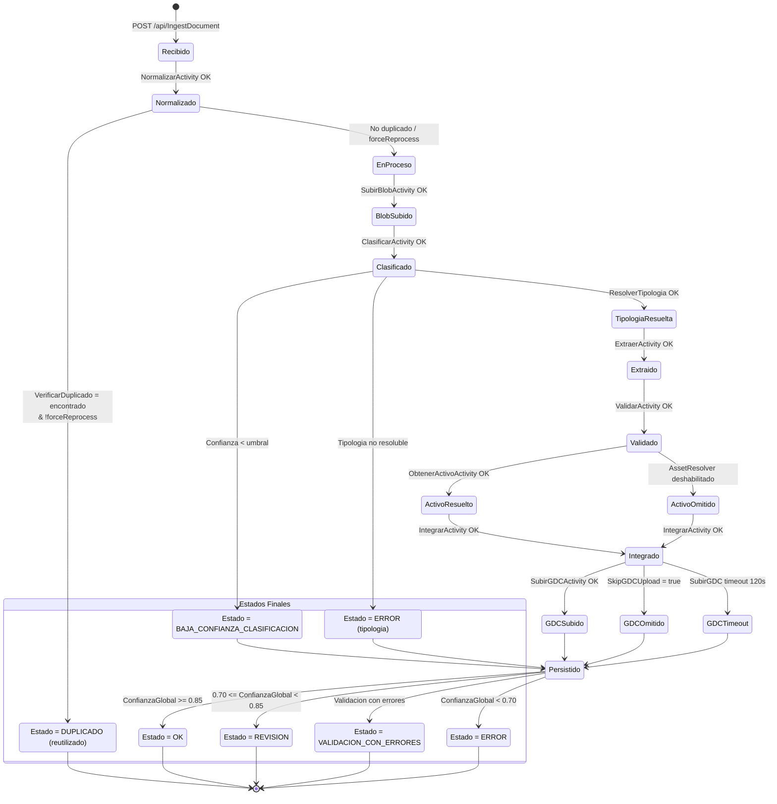

---

## 3.12 Contratos API Completos

### 3.12.1 POST /api/IngestDocument — Request

```json
{
  "instrucciones": {
    "expectedType": "",
    "skipDuplicateCheck": false,
    "forceReprocess": false,
    "skipGDCUpload": null,
    "classification": {
      "provider": "auto",
      "model": "auto",
      "umbral": null,
      "umbralCompletitud": null,
      "umbralConfianza": null
    },
    "extraction": {
      "provider": "auto",
      "model": "auto",
      "umbral": null,
      "umbralCompletitud": 0.9,
      "umbralConfianza": null
    },
    "assetResolver": {
      "enabled": true,
      "camposBusqueda": {
        "idufir": "28077000012345",
        "referenciaCatastral": null
      },
      "camposSolicitados": ["#ALL#"]
    }
  },
  "documento": {
    "name": "nota_simple_finca_12345.pdf",
    "objectIdGDC": null,
    "content": {
      "base64": "JVBERi0xLjcKMSAw..."
    }
  },
  "trazabilidad": {
    "correlationId": "a1b2c3d4-0000-0000-0000-000000000000",
    "submittedBy": "sistema-batch-sareb",
    "idActivo": "ACT-2026-00123"
  }
}
```

Reglas de validación del trigger:

- `documento.objectIdGDC` y `documento.content.base64` son mutuamente excluyentes.
- Debe informarse exactamente una fuente de documento.
- Si se usa `documento.objectIdGDC`, el backend fuerza `instrucciones.skipGDCUpload = true`.

### 3.12.2 POST /api/IngestDocument — Response 202

```json
{
  "instanceId": "abc123def456ghi789",
  "statusQueryUri": "https://srbappprodocai.azurewebsites.net/runtime/webhooks/durabletask/instances/abc123def456ghi789?code=<system-key>",
  "correlationId": "a1b2c3d4-0000-0000-0000-000000000000"
}
```

### 3.12.3 GET statusQueryUri — Running

```json
{
  "name": "DocumentProcessOrchestrator",
  "instanceId": "abc123def456ghi789",
  "runtimeStatus": "Running",
  "customStatus": {
    "version": "1.0",
    "estado": "Running",
    "actividadActual": "Extraer",
    "actividadesTotales": 12,
    "actividadesCompletadas": ["Normalizar", "VerificarDuplicado", "SubirBlob", "Clasificar", "ResolverTipologia"],
    "duracionTotalMs": 4200,
    "actividades": [
      { "nombre": "Normalizar", "estado": "Completed", "duracionMs": 120, "fallbackActivado": false },
      { "nombre": "VerificarDuplicado", "estado": "Completed", "duracionMs": 85, "fallbackActivado": false },
      { "nombre": "SubirBlob", "estado": "Completed", "duracionMs": 340, "fallbackActivado": false },
      { "nombre": "Clasificar", "estado": "Completed", "duracionMs": 2800, "fallbackActivado": true, "fallbackRazon": "Confianza DI 0.45 < umbral 0.85" },
      { "nombre": "ResolverTipologia", "estado": "Completed", "duracionMs": 15, "fallbackActivado": false },
      { "nombre": "Extraer", "estado": "Running", "duracionMs": 0, "fallbackActivado": false }
    ]
  },
  "createdTime": "2026-03-27T10:00:00Z",
  "lastUpdatedTime": "2026-03-27T10:00:04Z"
}
```

### 3.12.4 GET statusQueryUri — Completed (Exito)

```json
{
  "runtimeStatus": "Completed",
  "output": {
    "identificacion": {
      "documento": "nota_simple_finca_12345.pdf",
      "guid": "f47ac10b-58cc-4372-a567-0e02b2c3d479",
      "tipologia": "nota.simple.1_4",
      "tipologiaFamilia": "nota-simple",
      "tipologiaVersion": "1.4",
      "fechaProceso": "2026-03-27T10:00:12Z",
      "paginas": 5
    },
    "integridad": {
      "crc32": "a1b2c3d4",
      "sha256": "e3b0c44298fc1c149afbf4c8996fb92427ae41e4649b934ca495991b7852b855",
      "md5": "d41d8cd98f00b204e9800998ecf8427e",
      "rutaBlobStorage": "documents/nota_simple_finca_12345.pdf",
      "gestorDocumental": "GDC-OBJ-12345",
      "idActivo": "ACT-2026-00456",
      "idActivoEntrada": "ACT-2026-00123",
      "idActivoCambiado": true
    },
    "datosExtraidos": {
      "FincaRegistral": "12345",
      "IDUFIR_CRU": "28077000012345",
      "Direccion": "Calle Mayor 1, 28001 Madrid",
      "ReferenciaCatastral": "9872023VH5797S0001WX",
      "FechaDocumento": "15/01/2026",
      "Titulares": [
        {
          "Nombre": "GARCIA LOPEZ, MARIA",
          "NIF": "12345678Z",
          "Participacion": "100%",
          "TipoDominio": "Plena"
        }
      ],
      "Cargas": [
        {
          "Tipo": "Hipoteca",
          "Acreedor": "BANCO EJEMPLO SA",
          "Importe": 150000.00
        }
      ]
    },
    "detalleEjecucion": {
      "runTipologia": "nota.simple.1_4",
      "clasificacion": {
        "modelo": "srbdiprodocai-classifier-v1",
        "confianza": 0.92,
        "confianzaDI": 0.45,
        "confianzaGPT": 0.92,
        "proveedorClasif": "GPT4oMini",
        "fallbackLLM": true,
        "fallbackRazon": "Confianza DI 0.45 < umbral 0.85",
        "tipologiaDetectada": "nota-simple"
      },
      "extraccion": {
        "modelo": "nota-simple-cu-v1",
        "confianzaExtraccion": 0.91,
        "proveedorExtrac": "AzureContentUnderstanding",
        "layoutEnabled": false,
        "fallbackUsado": false,
        "confianzaPorCampo": {
          "FincaRegistral": 0.98,
          "IDUFIR_CRU": 0.95,
          "Direccion": 0.87,
          "ReferenciaCatastral": 0.91,
          "FechaDocumento": 0.93
        },
        "camposConDuda": [],
        "tiemposMs": { "cu": 3200 }
      },
      "postproceso": {
        "normalizaciones": ["FechaDocumento normalizada a dd/MM/yyyy"],
        "validaciones": ["FincaRegistral: OK", "IDUFIR_CRU: OK", "NIF_Titular: OK"],
        "inconsistencias": [],
        "confianzaValidacion": 1.0
      },
      "integracion": {
        "tipologia": "nota.simple.1_4",
        "estado": "OK",
        "mensaje": "Integracion completada",
        "plugins": [
          {
            "pluginKey": "refCatExcel",
            "priority": 1,
            "success": true,
            "mensaje": "IdActivo resuelto",
            "statusCode": 200,
            "durationMs": 450,
            "datosEnriquecidos": { "idActivo": "ACT-2026-00456" }
          }
        ],
        "datosFinales": {
          "FincaRegistral": "12345",
          "idActivo": "ACT-2026-00456"
        },
        "idActivoEntrada": "ACT-2026-00123",
        "idActivoResuelto": "ACT-2026-00456",
        "idActivoCambiado": true
      },
      "assetResolver": {
        "ejecutado": true,
        "exitoso": true,
        "activosEncontrados": 1,
        "criteriosUsados": {
          "idufir": "28077000012345",
          "referenciaCatastral": "9872023VH5797S0001WX"
        },
        "activos": [
          {
            "idActivo": "ACT-2026-00456",
            "fchCierre": "2026-01-31T00:00:00Z",
            "camposSolicitados": {
              "ID_ACTIVO_SAREB": "ACT-2026-00456",
              "FCH_CIERRE": "2026-01-31T00:00:00Z",
              "ID_IDUFIR": "28077000012345",
              "ID_REF_CATAST": "9872023VH5797S0001WX"
            }
          }
        ],
        "camposConError": [],
        "mensaje": "1 activo(s) encontrado(s).",
        "duracionMs": 180,
        "error": null
      },
      "gdc": {
        "exitoso": true,
        "objectId": "GDC-OBJ-12345",
        "mensaje": "Documento creado en GDC",
        "intentos": 1,
        "duracionMs": 1200,
        "errorDetalle": "",
        "yaExistia": false
      },
      "seguimiento": {
        "version": "1.0",
        "estado": "Completed",
        "actividadActual": "",
        "actividadesTotales": 12,
        "actividadesCompletadas": [
          "Normalizar", "VerificarDuplicado", "SubirBlob",
          "Clasificar", "ResolverTipologia", "Extraer",
          "Validar", "ObtenerActivo", "Integrar", "SubirGDC", "Persistir"
        ],
        "duracionTotalMs": 8500,
        "actividades": [
          { "nombre": "Normalizar", "estado": "Completed", "duracionMs": 120, "fallbackActivado": false },
          { "nombre": "Clasificar", "estado": "Completed", "duracionMs": 2800, "fallbackActivado": true, "fallbackRazon": "Confianza DI 0.45 < umbral 0.85" },
          { "nombre": "Extraer", "estado": "Completed", "duracionMs": 3200, "fallbackActivado": false },
          { "nombre": "Validar", "estado": "Completed", "duracionMs": 45, "fallbackActivado": false },
          { "nombre": "ObtenerActivo", "estado": "Completed", "duracionMs": 180, "fallbackActivado": false },
          { "nombre": "Integrar", "estado": "Completed", "duracionMs": 450, "fallbackActivado": false },
          { "nombre": "SubirGDC", "estado": "Completed", "duracionMs": 1200, "fallbackActivado": false },
          { "nombre": "Persistir", "estado": "Completed", "duracionMs": 85, "fallbackActivado": false }
        ]
      },
      "prompt": null
    },
    "resultado": {
      "estado": "OK",
      "mensajeError": null,
      "confianzaGlobal": 0.91,
      "estadoCalidad": "OK",
      "confianzaClasificacion": 0.92,
      "confianzaExtraccion": 0.91,
      "confianzaValidacion": 1.0,
      "reutilizadaPorDuplicado": false,
      "mensajeReutilizacion": null
    }
  }
}
```

### 3.12.5 Management Endpoints

| Metodo | Endpoint | Descripcion | Auth |
|--------|----------|------------|------|
| GET | `/api/tipologias` | Tipologias publicadas | Anonymous |
| GET | `/management/tipologias` | Todas las tipologias | Function |
| POST | `/management/tipologias` | Crear tipologia | Function |
| PUT | `/management/tipologias/{id}` | Actualizar tipologia | Function |
| POST | `/management/tipologias/{id}/publicar` | Publicar | Function |
| POST | `/management/tipologias/{id}/retirar` | Retirar | Function |
| POST | `/management/tipologias/{id}/draft` | Volver a Draft | Function |
| GET | `/management/modelos/{tipo}` | Listar modelos (Clasificacion/Extraccion/Prompt) | Function |
| POST | `/management/modelos` | Crear modelo | Function |
| PUT | `/management/modelos/{id}` | Actualizar modelo | Function |
| DELETE | `/management/modelos/{id}` | Eliminar modelo | Function |
| GET | `/management/plugins-tipologias/{codigo}` | Config plugins de tipologia | Function |
| PUT | `/management/plugins-tipologias/{codigo}` | Actualizar config plugins | Function |
| POST | `/management/plugins-tipologias/{codigo}/publicar` | Publicar config plugins | Function |
| POST | `/management/plugins-tipologias/{codigo}/retirar` | Retirar config plugins | Function |

---

## 3.13 Referencias

| Documento | Contenido |
|-----------|-----------|
| [01_ARQUITECTURA_SISTEMA.md](01_ARQUITECTURA_SISTEMA.md) | Arquitectura, ADRs, patrones |
| [CONTRATO_API_HTTP.md](contratos/CONTRATO_API_HTTP.md) | Contrato API detallado (original) |
| [CONFIANZA_AGREGADA.md](referencias/CONFIANZA_AGREGADA.md) | Logica de confianza |
| [TIPOLOGIAS_REFERENCIA.md](referencias/TIPOLOGIAS_REFERENCIA.md) | Catalogo de tipologias |
