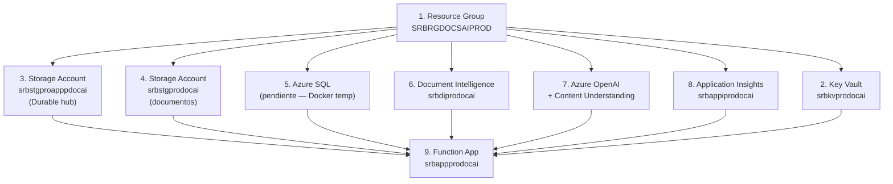

# 4. Manual de Explotacion — DocumentIA MVP

> Ultima actualizacion: 2026-04-16  
> Proyecto: AI DocClassExt — SAREB

> Alcance de este manual: instalacion, despliegue, infraestructura y operacion tecnica del entorno.
> Para uso funcional de APIs y configuracion de consumo, ver `docs/05_MANUAL_USO_CONFIGURACION.md`.

---

## 4.1 Requisitos de Infraestructura

### 4.1.1 Entorno Local (Desarrollo)

| Componente | Version minima | Instalacion |
|-----------|---------------|-------------|
| .NET SDK | 8.0 | [dotnet.microsoft.com](https://dotnet.microsoft.com/download) |
| Azure Functions Core Tools | v4.x | `npm install -g azure-functions-core-tools@4 --unsafe-perm true` |
| Docker Desktop | 4.x+ | [docker.com](https://www.docker.com/products/docker-desktop/) |
| Azure CLI | 2.50+ | `winget install Microsoft.AzureCLI` (solo para deploy) |
| dotnet-ef (EF Tools) | 8.0+ | `dotnet tool install --global dotnet-ef` |
| PowerShell | 5.1+ / 7+ | Preinstalado en Windows |

### 4.1.2 Recursos Azure (Produccion)

| Recurso | Nombre | Region | Proposito |
|---------|--------|--------|----------|
| Resource Group | `SRBRGDOCSAIPROD` | West Europe | Contenedor de recursos |
| Function App | `srbappprodocai` | West Europe | Backend (Consumption Plan, Linux) |
| Storage Account | `srbstgproapppdocai` | West Europe | Durable Functions hub (AzureWebJobsStorage) |
| Storage Account | `srbstgprodocai` | West Europe | Almacenamiento de documentos (blobs) |
| Document Intelligence | `srbdiprodocai` | West Europe | Clasificacion de documentos |
| Azure OpenAI | `upe48-mm2avmdm` | Sweden Central | GPT-4o-mini (fallback clasif/extrac + prompt) |
| Content Understanding | `upe48-mm2avmdm` | Sweden Central | Extraccion de campos |
| Application Insights | `srbappiprodocai` | West Europe | Telemetria y monitorizacion |
| Key Vault | `srbkvprodocai` | West Europe | Secretos (connection strings, credenciales GDC) |
| Azure SQL | (pendiente) | — | BD productiva (actualmente Docker SQL local) |

---

## 4.2 Instalacion Local Paso a Paso

### Paso 1: Clonar repositorio

```powershell
git clone <URL_REPOSITORIO> documento-ia-clasificacion-mvp
cd documento-ia-clasificacion-mvp
```

### Paso 2: Iniciar servicios Docker

```powershell
docker-compose up -d
```

Esto arranca:
- **Azurite** (emulador Azure Storage): puertos 10000 (Blob), 10001 (Queue), 10002 (Table)
- **SQL Server 2022** (Developer): puerto 1433, usuario `sa`, password en docker-compose

Verificar que ambos contenedores estan corriendo:

```powershell
docker ps --format "table {{.Names}}\t{{.Status}}\t{{.Ports}}"
```

### Paso 3: Aplicar migraciones de base de datos

Las migraciones se aplican automaticamente al iniciar la Function App si `RunDatabaseMigrationsOnStartup=true` en `local.settings.json`. Alternativamente, aplicar manualmente:

```powershell
cd src\backend\DocumentIA.Functions
dotnet ef database update --project ..\DocumentIA.Data\DocumentIA.Data.csproj --startup-project .
```

Verificar conectividad:

```powershell
.\scripts\check-database.ps1
```

### Paso 4: Configurar local.settings.json

El archivo `local.settings.json` ya viene configurado para desarrollo local con Azurite y Docker SQL. Verificar/ajustar:

| Setting | Valor local por defecto |
|---------|----------------------|
| `AzureWebJobsStorage` | `UseDevelopmentStorage=true` |
| `SqlConnectionString` | `Server=localhost,1433;Database=DocumentIA;User Id=sa;Password=<TU_PASSWORD>;TrustServerCertificate=True;` |
| `AzureStorageConnectionString` | `UseDevelopmentStorage=true` |
| `Classification:DefaultProvider` | `azure-document-intelligence` |
| `Extraction:DefaultProvider` | `azure-content-understanding` |

**Parámetros de los proveedores AI** (endpoints, API keys, versiones API): se cargan automáticamente desde la base de datos en la primera ejecución. La semilla inicial se encuentra en los ficheros `config/classification/models.json`, `config/extraction/models.json`, `config/prompt/models.json` y `config/layout/models.json`. Para entornos de producción, modificar los valores en esos ficheros antes del primer arranque, o editarlos desde la interfaz web de COMPLETAR_GDC_HTTP_BASIC_USERNAMEistración (`/modelos`) una vez que la app esté corriendo.

### Paso 5: Compilar plugins de enriquecimiento

```powershell
.\scripts\compile-all-plugins.ps1
```

Esto compila `SarebEnrichments.dll` y la copia a `plugins/`.

### Paso 6: Iniciar la Function App

```powershell
cd src\backend\DocumentIA.Functions
func start
```

O usar la tarea de VS Code: `Ctrl+Shift+B` (ejecuta `build (functions)` + `func: host start`).

La primera vez, la app:
1. Ejecuta migraciones EF Core (auto-create de la BD `DocumentIA`).
2. Carga seed data de tipologias desde `config/`.
3. Inicia el host de Functions con los endpoints disponibles.

### Paso 7: Verificar endpoints

```powershell
# Verificar que la Function App esta corriendo
Invoke-RestMethod http://localhost:7071/api/tipologias | ConvertTo-Json -Depth 5
```

### Paso 8 (Opcional): Iniciar frontend Desktop

```powershell
cd src\frontend\DocumentIA.Desktop
dotnet run
```

### Paso 9 (Opcional): Iniciar frontend Admin

```powershell
cd src\frontend\DocumentIA.Admin
dotnet run --launch-profile http
```

---

## 4.3 Scripts Disponibles

| Script | Proposito | Uso |
|--------|----------|-----|
| `1 setup-folders.ps1` | Crear estructura de carpetas inicial del proyecto | `.\scripts\1 setup-folders.ps1` |
| `2 setup-config-files.ps1` | Inicializar archivos de configuracion | `.\scripts\2 setup-config-files.ps1` |
| `3 setup-docs.ps1` | Crear estructura de documentacion | `.\scripts\3 setup-docs.ps1` |
| `4 setup-dev-tools.ps1` | Instalar/configurar herramientas de desarrollo | `.\scripts\4 setup-dev-tools.ps1` |
| `5 setup-ci-cd.ps1` | Configurar pipeline CI/CD | `.\scripts\5 setup-ci-cd.ps1` |
| `activate-pim.ps1` | Activar rol PIM (Privileged Identity Management) via device code | `.\scripts\activate-pim.ps1 -UseUser` |
| `list-pim-eligible.ps1` | Listar asignaciones PIM elegibles | `.\scripts\list-pim-eligible.ps1 -UseUser` |
| `check-database.ps1` | Verificar conectividad y estado de la BD SQL | `.\scripts\check-database.ps1` |
| `compile-all-plugins.ps1` | Compilar todas las DLLs de enrichments y copiar a `plugins/` | `.\scripts\compile-all-plugins.ps1` |
| `deploy-manual.ps1` | Deploy manual a Azure (build, zip, opcional Kudu upload) | `.\scripts\deploy-manual.ps1 [-KuduUser '$x' -KuduPassword 'y']` |
| `set-app-settings.ps1` | Configurar Application Settings en Azure via CLI | `.\scripts\set-app-settings.ps1` |
| `list-analyzers.ps1` | Listar analizadores disponibles en Document Intelligence | `.\scripts\list-analyzers.ps1` |
| `run-analyze.ps1` | Ejecutar analisis DI sobre un documento | `.\scripts\run-analyze.ps1` |
| `test-plugin-integration.ps1` | Probar integracion de plugins custom | `.\scripts\test-plugin-integration.ps1` |
| `verify-program-config.ps1` | Verificar configuracion de la aplicacion | `.\scripts\verify-program-config.ps1` |
| `azure_contentunderstanding_sample.py` | Ejemplo Python de Azure Content Understanding | `python .\scripts\azure_contentunderstanding_sample.py` |

### Scripts de Mock Servers

| Script | Proposito |
|--------|----------|
| `scripts\Mock Servers\start-mock-servers.ps1` | Iniciar servidores mock para desarrollo sin servicios reales |
| `scripts\Mock Servers\stop-mock-servers.ps1` | Detener servidores mock |

---

## 4.4 Variables de Entorno y Configuracion

### 4.4.1 local.settings.json (Desarrollo Local)

| Variable | Tipo | Descripcion | Requerida |
|----------|------|------------|-----------|
| **Infraestructura** | | | |
| `AzureWebJobsStorage` | string | Connection string Storage para Durable Functions hub | Si |
| `FUNCTIONS_WORKER_RUNTIME` | string | Runtime: `dotnet-isolated` | Si |
| `SqlConnectionString` | string | Connection string SQL Server | Si |
| `AzureStorageConnectionString` | string | Connection string Storage para documentos (blobs) | Si |
| `RunDatabaseMigrationsOnStartup` | bool | Aplicar migraciones EF Core al iniciar | Si |
| **Clasificacion** | | | |
| `Classification:DefaultProvider` | string | Proveedor por defecto: `azure-document-intelligence` / `mock` | Si |
| `Classification:DefaultModelKey` | string | Clave del modelo en la tabla `ModeloConfigs` (`default.azure-di`) | Si |
| **Extraccion** | | | |
| `Extraction:DefaultProvider` | string | Proveedor por defecto: `azure-content-understanding` / `azure-openai` / `azure-document-intelligence` / `mock` | Si |
| **GDC** | | | |
| `GDC:Endpoint` | string | URL del servicio SOAP GDC SINTWS | Si |
| `GDC:TimeoutSeconds` | int | Timeout GDC en segundos | Si |
| `GDC:ApplicationId` | string | ID aplicacion GDC | Si |
| `GDC:Username` | string | Usuario servicio GDC | Si |
| `GDC:Password` | string | Password servicio GDC | Si |
| `GDC:HttpBasicUsername` | string | Usuario HTTP Basic Auth para GDC | Si |
| `GDC:HttpBasicPassword` | string | Password HTTP Basic Auth | Si |
| `GDC:BypassSslValidation` | bool | Omitir validacion SSL (solo desarrollo/red interna) | No |
| `GDC:DefaultMatricula` | string | Matricula por defecto para archivado GDC | Si |
| `GDC:ClaseExpediente` | string | Clase de expediente GDC | Si |
| `GDC:TipoExpediente` | string | Tipo expediente GDC | Si |
| `GDC:OrigenDocumento` | string | Codigo de origen documento | Si |
| `GDC:Servicer` | string | Codigo servicer | Si |
| `GDC:EntidadOrigen` | string | Codigo entidad origen | Si |
| `GDC:ProcesoCarga` | string | Codigo proceso de carga | Si |
| `GDC:Publico` | string | Visibilidad documento (`verdadero`/`falso`) | Si |

> **Nota**: Endpoint, ApiKey, AuthMode, ApiVersion y demás parámetros de cada proveedor AI (Document Intelligence clasificador/extractor, Azure Content Understanding, Azure OpenAI GPT) se almacenan **exclusivamente en la base de datos**, en la tabla `ModeloConfigs`. Se gestionan desde la interfaz web de COMPLETAR_GDC_HTTP_BASIC_USERNAMEistración en `/modelos` o mediante los ficheros seed en `config/classification/models.json`, `config/extraction/models.json`, `config/prompt/models.json` y `config/layout/models.json`. No requieren variables de entorno adicionales.

### 4.4.2 host.json (Configuracion del Runtime)

| Seccion | Parametro | Valor | Descripcion |
|---------|-----------|-------|------------|
| `extensions.durableTask` | `hubName` | `DocumentIAHub` | Nombre del hub de Durable Functions |
| | `maxConcurrentActivityFunctions` | `10` | Actividades simultaneas maximas |
| | `maxConcurrentOrchestratorFunctions` | `10` | Orquestadores simultaneos maximos |
| | `extendedSessionsEnabled` | `false` | Sesiones extendidas |
| | `tracing.traceInputsAndOutputs` | `false` | No trazar inputs/outputs (contienen PDF base64) |
| `logging.applicationInsights` | `samplingSettings.isEnabled` | `true` | Muestreo de telemetria |
| | `maxTelemetryItemsPerSecond` | `20` | Rate limit telemetria |
| `logging.logLevel` | `default` | `Warning` | Nivel log general |
| | `Function` | `Information` | Nivel log para funciones |

---

## 4.5 Despliegue en Azure

### 4.5.1 Orden de Aprovisionamiento



### 4.5.2 Procedimiento de Deploy

#### Opcion A: Deploy via script (con credenciales Kudu)

```powershell
# 1. Obtener credenciales Kudu desde Cloud Shell
az functionapp deployment list-publishing-credentials `
    --resource-group SRBRGDOCSAIPROD --name srbappprodocai `
    --query "{user:publishingUserName,pass:publishingPassword}" -o tsv

# 2. Ejecutar deploy con esas credenciales
.\scripts\deploy-manual.ps1 -KuduUser '$srbappprodocai' -KuduPassword '<PASSWORD>'
```

El script:
1. Compila `SarebEnrichments.dll` (plugin custom)
2. Copia DLL a `plugins/`
3. Ejecuta `dotnet publish --configuration Release`
4. Ajusta rutas de plugins a relativas (para Linux/Azure)
5. Crea ZIP con rutas Unix (requerido por Kudu)
6. Sube via Kudu zipdeploy

#### Opcion B: Deploy via Cloud Shell

```powershell
# 1. Ejecutar script sin parametros para generar zip
.\scripts\deploy-manual.ps1

# 2. Subir publish/functions.zip al Cloud Shell (boton Upload)

# 3. En Cloud Shell:
az functionapp deploy --resource-group SRBRGDOCSAIPROD --name srbappprodocai `
    --src-path ~/functions.zip --type zip
```

### 4.5.3 Configurar App Settings en Azure

```powershell
# Editar set-app-settings.ps1 con los valores de produccion (connection strings, API keys)
.\scripts\set-app-settings.ps1
```

El script aplica en 3 bloques:
1. **Infraestructura**: Storage, SQL, App Insights, runtime
2. **AI**: Classification (DI + GPT fallback) + Extraction (CU + GPT fallback)
3. **GDC**: Endpoint SOAP, credenciales, campos taxonomia

> **Key Vault activo** (`srbkvprodocai`): los siguientes secretos ya estan almacenados en Key Vault y referenciados via `@Microsoft.KeyVault(...)` desde la Function App o el Web App del AssetResolver:
> - `SqlConnectionString`
> - `GDC__Password`, `GDC__HttpBasicPassword`
> - `user-ods-dwh` para la connection string `ConnectionStrings__AssetResolverDb` del AssetResolver
>
> Las API Keys de servicios AI (Document Intelligence, Content Understanding, Azure OpenAI) se gestionan en la base de datos dentro de `ModeloConfigs.ConfiguracionJson`. Si se desea centralizarlas en Key Vault, usar referencias KV (`@Microsoft.KeyVault(...)`) en los campos `apiKey` de cada modelo via la interfaz de COMPLETAR_GDC_HTTP_BASIC_USERNAMEistración.

### 4.5.4 Revision obligatoria de Azure y Azure DevOps

Esta revisión es el control mínimo para considerar un despliegue apto en entorno objetivo.
El detalle operativo está en `docs/08_CHECKLISTS_DESPLIEGUE.md`.

| Area | Punto de revision | Evidencia esperada |
|------|-------------------|--------------------|
| Azure DevOps | Service Connection `AI DocClassExt` valida y con permisos sobre `SRBRGDOCSAIPROD` | Service Connection en estado OK y SP con roles requeridos |
| Azure DevOps | Pipeline ejecuta `Build` y `DeployFunctions` sin errores | Run en estado `Succeeded` |
| Azure DevOps | Tareas post-deploy de app settings y smoke test ejecutadas | Logs de `AzureCLI@2` y `smoke-test-functions.ps1` |
| Azure Platform | Recursos críticos disponibles (Function App, Storage, KV, DI, AppInsights) | Estado saludable en Portal/Azure CLI |
| Seguridad | Managed Identity con RBAC mínimo necesario | Roles asignados en KV/Storage/AI (y SQL cuando aplique) |
| Secretos | Key Vault con secretos requeridos y referencias en Function App resueltas | `verify-prod-prereqs.ps1` sin errores + settings `Resolved` |
| Observabilidad | Sin regresión post deploy en AppInsights | Sin picos anómalos de excepciones/failures |

> Alcance: este bloque se centra en revisión Azure/DevOps. La validación funcional de negocio se gestiona en el plan de pruebas.

---

## 4.6 Operaciones Frecuentes

### 4.6.1 Verificar Estado de la Function App

```powershell
# Local
Invoke-RestMethod http://localhost:7071/api/tipologias | ConvertTo-Json

# Azure
$key = "<FUNCTION_KEY>"
Invoke-RestMethod "https://srbappprodocai.azurewebsites.net/api/tipologias?code=$key" | ConvertTo-Json
```

### 4.6.2 Enviar Documento para Procesamiento

```powershell
$body = @{
    documento = @{
        name = "nota_simple_test.pdf"
        content = @{
            base64 = [Convert]::ToBase64String([IO.File]::ReadAllBytes("ruta\al\documento.pdf"))
        }
    }
    trazabilidad = @{
        correlationId = [guid]::NewGuid().ToString()
        submittedBy = "manual-test"
    }
} | ConvertTo-Json -Depth 5

$resp = Invoke-RestMethod -Method POST -Uri "http://localhost:7071/api/IngestDocument" `
    -ContentType "application/json" -Body $body

# Guardar instanceId para polling
$resp.instanceId
$resp.statusQueryUri
```

Alternativa: enviar por `objectIdGDC` (sin Base64)

```powershell
$body = @{
    documento = @{
        objectIdGDC = "4526609"
    }
    trazabilidad = @{
        correlationId = [guid]::NewGuid().ToString()
        submittedBy = "manual-test"
    }
} | ConvertTo-Json -Depth 5

$resp = Invoke-RestMethod -Method POST -Uri "http://localhost:7071/api/IngestDocument" `
    -ContentType "application/json" -Body $body
```

Reglas del contrato de entrada:

- `documento.objectIdGDC` y `documento.content.base64` no pueden enviarse juntos.
- Debe enviarse exactamente una fuente de documento.
- Con `objectIdGDC`, el backend fuerza `skipGDCUpload=true`.

### 4.6.3 Consultar Estado de Procesamiento

```powershell
# Polling hasta completado
$statusUri = $resp.statusQueryUri
do {
    Start-Sleep -Seconds 2
    $status = Invoke-RestMethod $statusUri
    Write-Host "Estado: $($status.runtimeStatus) - $($status.customStatus.actividadActual)"
} while ($status.runtimeStatus -eq "Running" -or $status.runtimeStatus -eq "Pending")

# Resultado final
$status.output | ConvertTo-Json -Depth 10
```

### 4.6.4 Forzar Reproceso de Documento Duplicado

```powershell
$body = @{
    instrucciones = @{ forceReprocess = $true }
    documento = @{ name = "doc.pdf"; content = @{ base64 = "..." } }
} | ConvertTo-Json -Depth 5
```

### 4.6.5 Verificar Base de Datos

```powershell
.\scripts\check-database.ps1
```

---

## 4.7 Backup y Restauracion

### 4.7.1 SQL Server Docker (Local)

```powershell
# Backup
docker exec documentia-sql /opt/mssql-tools18/bin/sqlcmd `
    -S localhost -U sa -P "COMPLETAR_SQL_PASSWORD" -C `
    -Q "BACKUP DATABASE [DocumentIA] TO DISK = '/var/opt/mssql/backup/DocumentIA.bak'"

# Restaurar
docker exec documentia-sql /opt/mssql-tools18/bin/sqlcmd `
    -S localhost -U sa -P "COMPLETAR_SQL_PASSWORD" -C `
    -Q "RESTORE DATABASE [DocumentIA] FROM DISK = '/var/opt/mssql/backup/DocumentIA.bak' WITH REPLACE"
```

### 4.7.2 Docker Volumes

```powershell
# Exportar volume de SQL
docker run --rm -v sql_data:/data -v ${PWD}:/backup busybox tar czf /backup/sql_data_backup.tar.gz -C /data .

# Importar
docker run --rm -v sql_data:/data -v ${PWD}:/backup busybox tar xzf /backup/sql_data_backup.tar.gz -C /data
```

### 4.7.3 Azure SQL (Produccion — cuando este disponible)

Azure SQL ofrece backup automatico (PITR — Point-In-Time Restore) con retencion de 7-35 dias. No requiere configuracion adicional.

### 4.7.4 Blob Storage

- **Produccion**: SSE habilitado, soft delete configurable, lifecycle management para archivado.
- **Local (Azurite)**: Volume Docker `azurite_data`. Backup igual que SQL volume.

---

## 4.8 Monitorizacion

### 4.8.1 Application Insights — Consultas KQL Utiles

**Documentos procesados en las ultimas 24h:**

```kusto
customEvents
| where timestamp > ago(24h)
| where name == "DocumentProcessed"
| summarize count() by bin(timestamp, 1h)
| render timechart
```

**Errores por actividad:**

```kusto
traces
| where timestamp > ago(24h)
| where severityLevel >= 3
| where message contains "Activity"
| summarize count() by message
| order by count_ desc
```

**Duracion promedio del pipeline:**

```kusto
customMetrics
| where timestamp > ago(7d)
| where name == "DuracionTotalMs"
| summarize avg(value), percentile(value, 95), max(value) by bin(timestamp, 1d)
```

**Ejecuciones con fallback AI activado:**

```kusto
traces
| where timestamp > ago(24h)
| where message contains "Fallback"
| project timestamp, message, severityLevel
| order by timestamp desc
```

### 4.8.2 Live Metrics

Acceder desde Azure Portal → Application Insights → Live Metrics para monitorear en tiempo real:
- Requests/second
- Failures
- Server response time
- Exceptions

### 4.8.3 Alertas Recomendadas

| Alerta | Condicion | Severidad |
|--------|-----------|-----------|
| Pipeline lento | DuracionTotalMs > 60000 (60s) | Warning |
| Tasa de errores alta | Failures > 10% en 5 min | Critical |
| GDC no disponible | GDC timeout consecutivos > 3 | Critical |
| Fallback frecuente | Fallback activaciones > 50% en 1h | Warning |
| BD no accesible | SQL connection failures > 0 en 5 min | Critical |

---

## 4.9 Rotacion de Claves

### 4.9.1 Estado Actual

Key Vault `srbkvprodocai` esta activo y operativo. Los secretos criticos (`SqlConnectionString`, `GDC__Password`, `GDC__HttpBasicPassword`, `user-ods-dwh`) se almacenan en Key Vault y se referencian desde los App Settings de la Function App o del Web App del AssetResolver via `@Microsoft.KeyVault(...)`. El resto de settings no sensibles permanecen como App Settings directos.

### 4.9.2 Claves a Rotar Periodicamente

| Clave | Servicio | Ubicacion actual | Frecuencia recomendada |
|-------|----------|-----------------|----------------------|
| API Key Document Intelligence | `srbdiprodocai` | App Settings | 90 dias |
| API Key Azure OpenAI | `upe48-mm2avmdm` | App Settings | 90 dias |
| API Key Content Understanding | `upe48-mm2avmdm` | App Settings | 90 dias |
| Password SQL Server | Azure SQL | Key Vault `srbkvprodocai` | 90 dias |
| Connection string ODS AssetResolver | ODS DWH | Key Vault `srbkvprodocai`, secret `user-ods-dwh` | Segun politica SAREB |
| Credenciales GDC | GDC SINTWS | Key Vault `srbkvprodocai` | Segun politica SAREB |
| Function Key | `srbappprodocai` | Azure Portal | 180 dias |
| Storage Account Keys | `srbstgprodocai`, `srbstgproapppdocai` | App Settings | 90 dias |

### 4.9.3 Procedimiento de Rotacion

**Para secretos en Key Vault** (`SqlConnectionString`, `GDC__Password`, `GDC__HttpBasicPassword`, `user-ods-dwh`):

1. Generar nueva version del secreto en Key Vault `srbkvprodocai` (Azure Portal → Key Vault → Secrets → New Version).
2. La Function App o el Web App del AssetResolver resolveran automaticamente la nueva version si la referencia usa la URI sin version; si usa URI con version, actualizar el App Setting correspondiente.
3. Verificar que la Function App o el Web App del AssetResolver funcionan correctamente tras la rotacion.
4. Deshabilitar la version anterior del secreto en Key Vault.

**Para secretos en App Settings directos** (API Keys de servicios AI):

1. Generar nueva clave en el servicio correspondiente (Azure Portal).
2. Actualizar el App Setting en la Function App (`srbappprodocai` → Configuration) o via `set-app-settings.ps1`.
3. Verificar que la Function App funciona correctamente.
4. Revocar la clave antigua.

---

## 4.10 Gestion de Tipologias sin Cambiar Codigo

> **Importante:** Los archivos JSON en `config/tipologias/` son solo fuente de **seed inicial**. En tiempo de ejecucion, la Function App lee toda la configuracion desde base de datos. Para gestionar tipologias en produccion, usar siempre la Admin API.

### Paso 1: Crear la configuracion JSON (seed o como referencia)

```
config/tipologias/
  mi-nueva-tipologia.validation.json    # Reglas de validacion (seed o referencia)
  mi-nueva-tipologia.plugins.json       # Plugins de integracion (opcional)
```

> Si la Function App arranca con estos archivos presentes y sin registro previo en BD, `ConfigurationSeedService` los insertar automaticamente. Para entornos donde ya existe la BD, usar directamente el Paso 2.

### Paso 2: Registrar tipologia via API Admin

```powershell
$body = @{
    codigo = "mi-nueva-tipologia"
    nombre = "Mi Nueva Tipologia"
    version = "1.0"
    umbralClasificacion = 0.85
    umbralExtraccion = 0.80
} | ConvertTo-Json

Invoke-RestMethod -Method POST -Uri "http://localhost:7071/management/tipologias" `
    -ContentType "application/json" -Body $body `
    -Headers @{ "x-functions-key" = "<FUNCTION_KEY>" }
```

### Paso 3: Registrar modelo AI (si es nuevo)

```powershell
$body = @{
    key = "mi-tipologia-cu-v1"
    tipo = "Extraccion"
    provider = "azure-content-understanding"
    modelo = "analyzer-mi-tipologia-v1"
    activo = $true
} | ConvertTo-Json

Invoke-RestMethod -Method POST -Uri "http://localhost:7071/management/modelos" `
    -ContentType "application/json" -Body $body `
    -Headers @{ "x-functions-key" = "<FUNCTION_KEY>" }
```

### Paso 4: Publicar tipologia

```powershell
Invoke-RestMethod -Method POST `
    -Uri "http://localhost:7071/management/tipologias/{id}/publicar" `
    -Headers @{ "x-functions-key" = "<FUNCTION_KEY>" }
```

### Paso 5: Verificar

```powershell
# Debe aparecer en la lista de tipologias publicadas
Invoke-RestMethod http://localhost:7071/api/tipologias | ConvertTo-Json
```

---

## 4.11 Referencias

| Documento | Contenido |
|-----------|-----------|
| [01_ARQUITECTURA_SISTEMA.md](01_ARQUITECTURA_SISTEMA.md) | Arquitectura y despliegue |
| [03_DISENO_TECNICO_DETALLADO.md](03_DISENO_TECNICO_DETALLADO.md) | Configuracion tecnica detallada |
| [05_MANUAL_USO_CONFIGURACION.md](05_MANUAL_USO_CONFIGURACION.md) | Uso de API y configuraciones |
| [README-activate-pim.md](../scripts/README-activate-pim.md) | Guia PIM |

---

## 4.12 Monitorizacion y Observabilidad en Portal Azure

> **Recurso principal**: Application Insights `srbappiprodocai`  
> Resource Group `SRBRGDOCSAIPROD` — West Europe  
> ADO: T1 #99067 · T2 #99070 · T3 #99068 · T4 #99069

### 4.12.1 Acceso rapido

| Vista | Ruta en portal Azure |
|-------|----------------------|
| App Insights overview | Portal → `SRBRGDOCSAIPROD` → `srbappiprodocai` |
| Live Metrics | App Insights → **Live Metrics** (menu lateral) |
| Failures / Exceptions | App Insights → **Failures** |
| Performance / Latencia | App Insights → **Performance** |
| Log Analytics — Logs | App Insights → **Logs** (abre workspace vinculado) |
| Durable Functions Monitor | Portal → Function App `srbappprodocai` → **Durable Functions** |

### 4.12.2 Live Metrics

1. Abrir `srbappiprodocai` → **Live Metrics** en el menu lateral.
2. Verificar que aparecen servidores activos (la Function App debe estar warm o procesando).
3. Monitorizar en tiempo real: requests/s, exception rate, CPU, dependencias externas.
4. Umbral: si exception rate > 5 req/s sostenido, investigar via Failures → End-to-end transaction.

### 4.12.3 Durable Functions Monitor

1. En el portal: **Function App `srbappprodocai`** → seccion **Durable Functions**.
2. Alternativa local: extension **Durable Functions Monitor** en VS Code → conectar al Storage Account `srbstgproapppdocai`.
3. Permite inspeccionar instancias por estado: `Running` / `Completed` / `Failed` / `Terminated`.
4. Para diagnosticar un documento concreto: buscar el `instanceId` (GUID de la ejecucion) en el historial de orquestacion.
5. Las instancias `Failed` contienen el `FailureDetails` con stack trace completo.

### 4.12.4 Queries KQL base (Log Analytics)

Abrir `srbappiprodocai` → **Logs** y ejecutar las siguientes queries.  
Se recomienda guardarlas en **Saved Queries** con prefijo `DocumentIA-`.

#### Q1 — Ejecuciones recientes (ultimas 100, ultimas 24h)

```kusto
customEvents
| where timestamp > ago(24h)
| where name == "DocumentProcessed"
| extend tipologia   = tostring(customDimensions["Tipologia"])
       , estado      = tostring(customDimensions["EstadoFinal"])
       , duracion_ms = toint(customDimensions["DuracionTotalMs"])
       , fallback    = tobool(customDimensions["UseFallbackLLM"])
| project timestamp, tipologia, estado, duracion_ms, fallback
| order by timestamp desc
| take 100
```

#### Q2 — Tasa de error por ventana horaria (ultimos 7 dias)

```kusto
customEvents
| where timestamp > ago(7d)
| where name == "DocumentProcessed"
| extend estado = tostring(customDimensions["EstadoFinal"])
| summarize total      = count()
          , errores    = countif(estado == "Error")
          , tasa_error = round(100.0 * countif(estado == "Error") / count(), 1)
  by bin(timestamp, 1h)
| order by timestamp desc
```

#### Q3 — Latencia E2E p50/p95/p99 por tipologia

```kusto
customEvents
| where timestamp > ago(7d)
| where name == "DocumentProcessed"
| extend tipologia   = tostring(customDimensions["Tipologia"])
       , duracion_ms = toint(customDimensions["DuracionTotalMs"])
| summarize p50 = percentile(duracion_ms, 50)
          , p95 = percentile(duracion_ms, 95)
          , p99 = percentile(duracion_ms, 99)
  by tipologia
```

#### Q4 — Uso de fallback LLM por tipologia

```kusto
customEvents
| where timestamp > ago(7d)
| where name == "DocumentProcessed"
| extend tipologia   = tostring(customDimensions["Tipologia"])
       , fallback    = tobool(customDimensions["UseFallbackLLM"])
| summarize total        = count()
          , con_fallback = countif(fallback == true)
          , pct_fallback = round(100.0 * countif(fallback == true) / count(), 1)
  by tipologia
```

> **Nota**: Las queries Q1–Q4 dependen de que `PersistirActivity` emita eventos `TrackEvent("DocumentProcessed")`.  
> Esto se implementa en **Fase C** de EP6 (Feature F6.3). Hasta entonces, usar la tabla `requests` y `traces` nativas del SDK para visibilidad tecnica.

### 4.12.5 Umbrales de referencia

| Metrica | Normal | Alerta | Critico |
|---------|--------|--------|---------|
| Latencia E2E (p95) | < 30 s | 30–60 s | > 60 s |
| Tasa de error (ventana 1 h) | < 5 % | 5–10 % | > 10 % |
| Tasa fallback LLM | < 20 % | 20–40 % | > 40 % |
| Confianza media (`ConfianzaGlobal`) | > 0.70 | 0.50–0.70 | < 0.50 |
| Orchestrations en estado `Failed` | 0 / h | 1–3 / h | > 3 / h |
