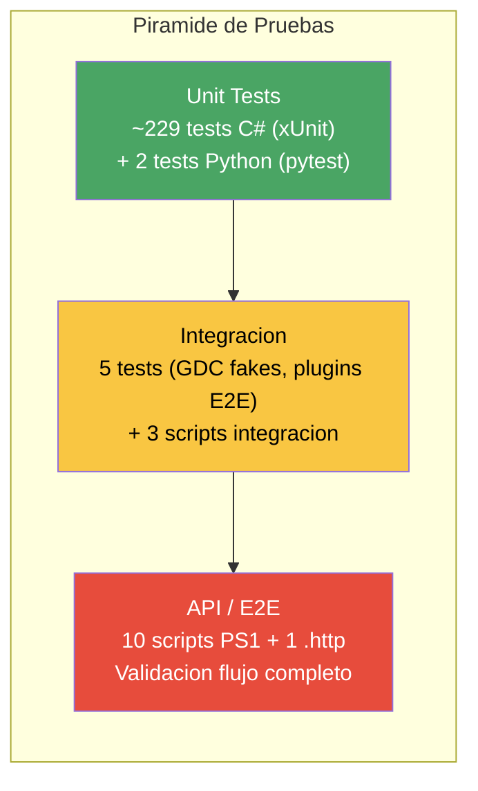
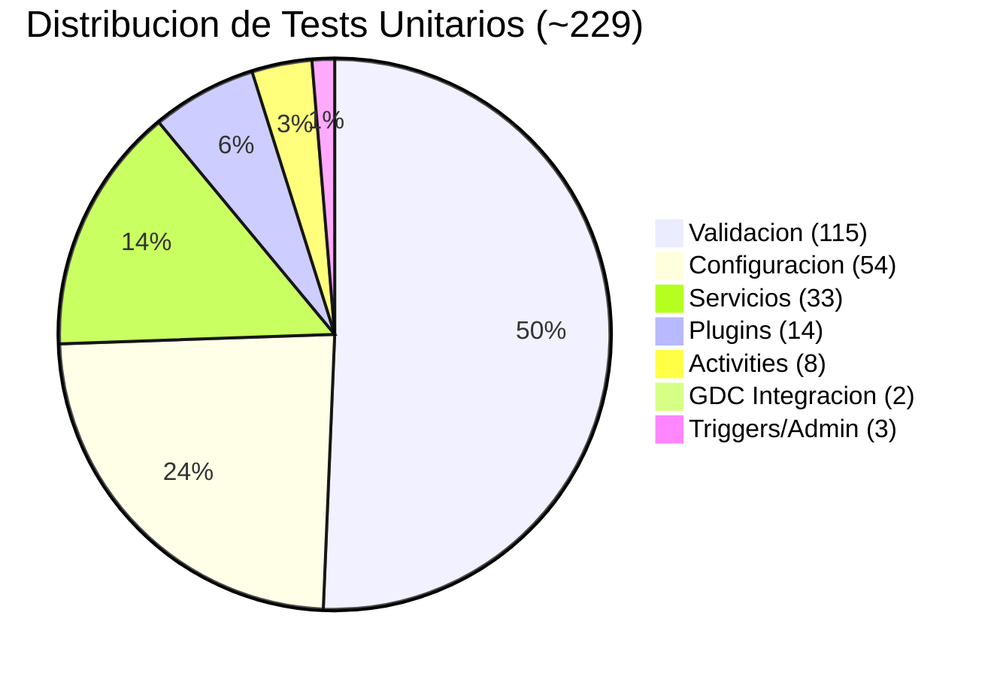

# 6. Plan de Pruebas — DocumentIA MVP

> Ultima actualizacion: 2026-04-20  
> Proyecto: AI DocClassExt — SAREB

---

## 6.1 Estrategia de Pruebas

### 6.1.1 Piramide de Pruebas



### 6.1.2 Frameworks y Herramientas

| Herramienta | Version | Uso |
|-------------|---------|-----|
| **xUnit** | 2.9.2 | Framework de tests unitarios C# |
| **FluentAssertions** | 6.12.0 | Aserciones legibles |
| **Moq** | 4.20.70 | Mocking de interfaces y servicios |
| **Coverlet** | 6.0.2 | Recoleccion de cobertura de codigo |
| **Microsoft.NET.Test.Sdk** | 17.12.0 | SDK de ejecucion de tests |
| **pytest** | — | Tests unitarios Python (enrichments) |

### 6.1.3 Principios

1. **Tests unitarios obligatorios** para toda logica de validacion, configuracion y servicios core.
2. **Aislamiento total**: toda dependencia externa (BD, Blob, IA, GDC) se mockea con Moq o FakeHttpHandler.
3. **Determinismo**: sin dependencias de red ni estado compartido. Cada test crea/limpia sus propios ficheros temporales.
4. **Naming convention**: `MetodoTesteado_Escenario_ResultadoEsperado`.

---

## 6.2 Tests Unitarios C# — Inventario Detallado

### 6.2.1 Validacion (12 clases, ~115 tests)

Componente mas critico: garantiza la calidad de los datos extraidos.

| Clase | Tests | Componente bajo test | Casos clave |
|-------|-------|---------------------|-------------|
| **AddressValidatorTests** | 22 | `AddressValidator` | Direcciones validas, abreviaciones calle, numero portal (requerido/opcional), codigo postal, chars invalidos, bounds longitud, acentos, apostrofe, normalizacion, municipio/provincia, fincas, constraints custom |
| **ArrayValidatorTests** | 11 | `ArrayValidator` | Arrays validos, JSON string arrays, empty/null, JSON invalido, items string, JsonElement, estructuras anidadas, tipos no objeto, arrays grandes |
| **BooleanValidatorTests** | 26 | `BooleanValidator` | Booleano nativo, variantes string (true/false/1/0/si/no/yes/no), espanol/ingles, null/empty/whitespace, valores invalidos, flags VPO/discrepancias, integers, espacios |
| **CatastralReferenceValidatorTests** | 7 | `CatastralReferenceValidator` | Formato valido (20 chars), demasiado corto/largo, formato invalido, null/empty, espacios |
| **DateFormatValidatorTests** | 6 | `DateFormatValidator` | dd/MM/yyyy, formatos invalidos, restricciones futuro/pasado, formatos custom, null/empty |
| **EnumValidatorTests** | 20 | `EnumValidator` | Constructor variants, case-sensitive/insensitive, null/empty/whitespace, mensajes, escenarios dominio (tipologia, tipos documento, estado proceso, roles, tipos propiedad) |
| **LengthValidatorTests** | 20 | `LengthValidator` | Constructor variants, null/empty, min/max boundaries, rango, NIF, integers, unicode, emojis |
| **NifValidatorTests** | 6 | `NifValidator` | NIF/NIE/CIF, null/empty, formatos invalidos |
| **RangeValidatorTests** | 9 | `RangeValidator` | Dentro de rango, por debajo/encima, fronteras, no numerico, null, solo min/solo max |
| **RegexValidatorTests** | 16 | `RegexValidator` | Constructor (valid/null/whitespace/invalid), codigos postales, ref. catastral, NIF/NIE, email, URLs, patrones complejos, case sensitivity |
| **RequiredFieldValidatorTests** | 6 | `RequiredFieldValidator` | Con valor, null, vacio, whitespace, numerico, booleano |
| **ValidationEngineTests** | 18 | `ValidationEngine` | Sin reglas, required faltante, campo valido, multiples validadores (pass/fail), campos mixtos, fallo parcial, documento complejo, contexto, campos opcionales, enum/regex/boolean/length, arrays, conteo error/warning, caso completo |

### 6.2.2 Configuracion (6 clases, ~54 tests)

| Clase | Tests | Componente bajo test | Casos clave |
|-------|-------|---------------------|-------------|
| **TipologiaVersionResolverTests** | 9 | `TipologiaVersionResolver` | Familia→version default, familia@version especifica, clave tecnica legacy, multiples defaults, default faltante, tipologia solo prompt |
| **TipologiaValidationConfigTests** | 26 | `TipologiaValidationConfig` (modelo) | Serializacion/deserializacion JSON, valores default, campos, extraccion, reglas (range, enum, date, regex), items, arrays anidados, estructuras reales nota-simple y tasacion |
| **TipologiaConfigLoaderTests** | 22 | `TipologiaConfigLoader` | Carga JSON desde disco, secciones extraccion/prompt, errores (fichero faltante, JSON invalido, null), construccion motor validacion (cada tipo regla), severidades, reglas no soportadas |
| **PromptModelRegistryLoaderTests** | 3 | `PromptModelRegistryLoader` | Cargar registry, obtener modelo por key, excepcion key desconocida |
| **ClassificationModelRegistryLoaderTests** | 3 | `ClassificationModelRegistryLoader` | Cargar registry, obtener modelo por key, excepcion key desconocida |
| **ExtractionModelRegistryLoaderTests** | 3 | `ExtractionModelRegistryLoader` | Cargar registry, obtener modelo por key, excepcion key desconocida |

### 6.2.3 Servicios (5 clases, ~33 tests)

| Clase | Tests | Componente bajo test | Casos clave |
|-------|-------|---------------------|-------------|
| **ConfidenceCalculatorTests** | 24 | `ConfidenceCalculator` | Confianza clasificacion, extraccion CU (perfecto/missing/warnings/pesos custom), extraccion GPT, scoring validacion, confianza global (MIN), umbrales calidad (OK/revision/error) |
| **ClasificarActivityTests** | 2 | `ClasificarActivity` | ExpectedType bypass, delegacion a provider |
| **ConfigurableExtraerDataProviderTests** | 4 | `ConfigurableExtraerDataProvider` | Extraccion deshabilitada, CU excepcion→fallback GPT, CU insuficiente→fallback, CU suficiente→sin fallback |
| **ContentUnderstandingResultMapperTests** | 3 | `ContentUnderstandingResultMapper` | Auto-mapping campos, mapping explicito, campo faltante |
| **GdcServiceTests** | 10 | `GdcService` | ConsultarDocumento (existe/no), SubirDocumento (exito/DOC_OBJECT_EXISTS), SOAP 1.2 envelope/content-type, expresion IN, campo MD5 EQUALS, parsing SOAP fault, campos obligatorios GDC |

### 6.2.4 Plugins (5 clases, 14 tests)

| Clase | Tests | Componente bajo test | Casos clave |
|-------|-------|---------------------|-------------|
| **RestPluginTests** | 4 | `RestIntegrationPlugin` | Request exitoso, error HTTP, timeout, config faltante |
| **CustomPluginTests** | 2 | `CustomIntegrationPlugin` | IdActivo preservado vs override por enricher |
| **IdActivoPropagationTests** | 2 | `RestIntegrationPlugin` / `SoapIntegrationPlugin` | Propagacion idActivo cuando respuesta no lo incluye |
| **PluginConfigLoaderTests** | 6 | `PluginConfigLoader` | Carga file-mode (fichero faltante, cache), carga DB-mode (config publicada, sin config), invalidacion cache |
| **PluginManagerTests** | 4 | `PluginManager` | Registrar plugin, ejecutar plugin faltante, excepcion en plugin, listar plugins |

### 6.2.5 Activities (3 clases, 8 tests)

| Clase | Tests | Componente bajo test | Casos clave |
|-------|-------|---------------------|-------------|
| **IntegrarActivityTests** | 1 | `IntegrarActivity` | Deteccion cambio idActivo por plugin |
| **ObtenerUltimaEjecucionDuplicadoActivityTests** | 3 | `ObtenerUltimaEjecucionDuplicadoActivity` | Documento no existe, reutilizacion output serializado, sin output serializado |
| **ResolverTipologiaActivityTests** | 4 | `ResolverTipologiaActivity` | Familia, version especifica, clave legacy, propagacion excepcion |

### 6.2.6 Triggers / Admin (1 clase, 3 tests)

| Clase | Tests | Componente bajo test | Casos clave |
|-------|-------|---------------------|-------------|
| **PluginsTipologiaAdminFunctionValidationTests** | 3 | `PluginsTipologiaAdminFunction` | JSON valido, JSON invalido, objeto vacio |

### 6.2.7 Integracion con Fakes (1 clase, 2 tests)

| Clase | Tests | Componente bajo test | Casos clave |
|-------|-------|---------------------|-------------|
| **GdcIntegrationTests** | 2 | `GdcService` (E2E con FakeHttpHandler) | Subida documento: retorna ObjectId. Consulta: retorna exists. |

---

## 6.3 Tests Python (Enrichments)

| Fichero | Framework | Tests | Descripcion |
|---------|-----------|-------|-------------|
| `src/enrichments/ActivoEnrichment/tests/test_activo_enrichment.py` | pytest | 2 | `test_enriquecer_preserves_incoming_idActivo`: si la peticion ya trae idActivo, se preserva. `test_enriquecer_returns_found_idActivo_when_not_in_request`: si no viene, el enrichment lo resuelve. |

---

## 6.4 Tests API / E2E (Scripts PowerShell)

Scripts ubicados en `tests/api-tests/` y `scripts/`. Requieren Functions App o plugin correspondiente en ejecucion (local o Azure).

| Script | Tipologia | Modo | Descripcion |
|--------|-----------|------|-------------|
| `test-ingest.ps1` | Auto (sin expectedType) | Clasificacion auto | Flujo generico: envia PDF, polling, muestra output. Flags: skip duplicate, force reprocess. |
| `test-ingest-notasimple.ps1` | nota-simple 1.2 | expectedType | Envio con tipologia nota-simple 1.2 forzada |
| `test-ingest-notasimple1-3.ps1` | nota-simple 1.3 | expectedType | Envio con tipologia nota-simple 1.3 forzada |
| `test-ingest-notasimple1-4.ps1` | nota-simple 1.4 | expectedType | Envio con tipologia nota-simple 1.4 forzada |
| `test-ingest-notasimple1-4-classify.ps1` | nota-simple 1.4 | Clasificacion real | Sin expectedType — usa Document Intelligence para clasificar |
| `test-ingest-notasimple1-4-extract-fallback.ps1` | nota-simple 1.4 | Fallback GPT | Umbral alto para forzar fallback GPT en extraccion |
| `test-ingest-notasimple1-4-from-path.ps1` | nota-simple 1.4 | Desde disco | Para `DocumentPath` — envia fichero local |
| `test-ingest-resumen-documental-from-path.ps1` | resumen-documental | Desde disco | Tipologia resumen-documental desde fichero local |
| `test-gdc-consultar-aislado.ps1` | — | Aislado | Test SOAP puro contra GDC: searchEntities + create. Diagnostica DOC_OBJECT_EXISTS. |
| `test-azure-openai-clasificacion-fallback.ps1` | — | Aislado | Test conectividad Azure OpenAI para clasificacion fallback |
| `scripts/Test-AssetResolver.ps1` | AssetResolver | Aislado | Bateria funcional del plugin AssetResolver: IDUFIR, RefCat, Direccion fuzzy, Direccion tipificada, OR/AND, requestedFields y caso sin datos. |

### 6.4.1 Bateria Funcional AssetResolver

Script principal:
- `scripts/Test-AssetResolver.ps1`

Escenarios cubiertos:
- `idufir-alias-default`
- `idufir-mapeo-personalizado`
- `refcat-directa`
- `idufir-override`
- `modo-or-dos-criterios`
- `modo-and-dos-criterios`
- `direccion-fuzzy`
- `campos-all`
- `campos-limitados`
- `direccion-tipificada`
- `direccion-tipificada-combinada`
- `sin-datos`

Ejecucion recomendada (bateria completa):

```powershell
.\scripts\Test-AssetResolver.ps1 \
    -SampleIdufir "46007001178211" \
    -SampleRefCatastral "8519921XJ8681N0001JK" \
    -SampleDireccion "calle torrente ballester 7, 4C Azuqueca de henares, Guadalajara" \
    -SampleMunicipio "Azuqueca de Henares" \
    -SampleCalle "Torrente Ballester" \
    -SampleNumero "7"
```

Salida esperada:
- Tabla resumen ASCII por escenario con columnas `Escenario`, `Descripcion`, `Resultado`, `IdsActivos`.
- `IdsActivos` muestra los `IdActivo` resueltos (o `-` si no hay coincidencias).

### Scripts Integracion (carpeta `scripts/`)

| Script | Descripcion |
|--------|-------------|
| `scripts/test-plugin-integration.ps1` | E2E sistema de plugins via IngestDocument (nota.simple.1_3) |
| `scripts/Mock Servers/test-mock-server.ps1` | Health check + smoke test del servidor mock de enriquecimiento |
| `scripts/Mock Servers/test-multi-plugin.ps1` | Test completo 3 plugins (REST + SOAP + Activo) con mock servers |

### Utilidades

| Script/Fichero | Uso |
|----------------|-----|
| `tests/api-tests/check-status.ps1` | Polling manual de instanceId — muestra estado, customStatus, output |
| `tests/api-tests/test-requests.http` | REST Client (.http) — ingest Tasacion + check status |
| `tests/api-tests/last-instance-id*.txt` | Almacena ultimo instanceId para retomar polling |

---

## 6.5 Patrones de Test

### 6.5.1 Aislamiento con IDisposable

Las clases que acceden a disco crean directorios temporales y los limpian:

```csharp
public class TipologiaConfigLoaderTests : IDisposable
{
    private readonly string _tempDir;

    public TipologiaConfigLoaderTests()
    {
        _tempDir = Path.Combine(Path.GetTempPath(), Guid.NewGuid().ToString());
        Directory.CreateDirectory(_tempDir);
    }

    public void Dispose() => Directory.Delete(_tempDir, true);
}
```

Aplica a: TipologiaVersionResolverTests, TipologiaConfigLoaderTests, PluginConfigLoaderTests, *ModelRegistryLoaderTests, ConfigurableExtraerDataProviderTests.

### 6.5.2 FakeHttpHandler para SOAP

Tests de GDC simulan respuestas SOAP 1.1/1.2 sin red:

```csharp
var handler = new FakeHttpMessageHandler(responseXml, HttpStatusCode.OK);
var httpClient = new HttpClient(handler);
var factory = new SimpleHttpClientFactory(httpClient);
var gdcService = new GdcService(config, factory, logger);
```

Soporta escenarios: exito, DOC_OBJECT_EXISTS, SOAP fault.

### 6.5.3 TestFixture Builder

ConfigurableExtraerDataProviderTests usa un builder para configurar escenarios:

```csharp
var fixture = TestFixture.Create()
    .WithMinFieldsRatio(0.5)
    .WithFallbackEnabled(true)
    .WithExtractionEnabled(true);
```

### 6.5.4 Reflection para Inyeccion

CustomPluginTests inyecta mocks en campos privados via reflexion:

```csharp
// Inyectar enricher mock en campo privado del plugin
typeof(CustomIntegrationPlugin)
    .GetField("_enricher", BindingFlags.NonPublic | BindingFlags.Instance)
    .SetValue(plugin, mockEnricher);
```

---

## 6.6 Metricas y Cobertura

### 6.6.1 Resumen Cuantitativo

| Metrica | Valor |
|---------|-------|
| Clases de test C# | 33 |
| Metodos de test C# | ~229 |
| Clases de test Python | 1 |
| Metodos de test Python | 2 |
| Scripts E2E/API | 11 |
| Scripts integracion | 3 |
| **Total artefactos de test** | **50** |
| **Total tests automatizados** | **~231** |

### 6.6.2 Cobertura por Componente



### 6.6.3 Ejecucion

```powershell
# Ejecutar todos los tests unitarios
cd src\backend\DocumentIA.Tests.Unit
dotnet test --verbosity normal

# Con cobertura (Coverlet)
dotnet test --collect:"XPlat Code Coverage"

# Tests especificos por categoria
dotnet test --filter "FullyQualifiedName~Validation"
dotnet test --filter "FullyQualifiedName~Config"
dotnet test --filter "FullyQualifiedName~Plugin"

# Tests Python
cd src\enrichments\ActivoEnrichment
pytest tests/ -v
```

---

## 6.7 Gaps Identificados y Tests Pendientes

### 6.7.1 Gaps Criticos

| Area | Gap | Prioridad | Razon |
|------|-----|-----------|-------|
| **Orchestrator** | Sin tests unitarios para DocumentProcessOrchestrator | **Alta** | Es el componente central. Cualquier cambio en el flujo puede romper la cadena. |
| **NormalizarActivity** | Sin tests | Alta | Calcula hashes, paginas, nombres. Error aqui = deduplicacion rota. |
| **SubirBlobActivity** | Sin tests | Media | Subida a Blob Storage no testeada (dependeria de mock BlobClient). |
| **PersistirActivity** | Sin tests | Media | Persistencia final en BD no testeada unitariamente. |
| **Admin Functions** | Solo 3 tests basicos (validacion JSON) | Media | CRUD de tipologias, modelos y plugins sin tests de logica negocio. |
| **Frontend Desktop** | Sin tests | Baja | WPF MVVM. Testeable via ViewModels pero no prioritario para MVP. |
| **Frontend Admin** | Sin tests | Baja | Blazor Server. Validar CRUD de tipologias. |

### 6.7.2 Gaps de Integracion

| Area | Gap | Prioridad |
|------|-----|-----------|
| **BD real (EF Core)** | No hay tests de integracion con SQL Server real o InMemory provider | Alta |
| **Blob Storage** | No hay tests con Azurite | Media |
| **CU / DI real** | Solo se testea contra mock/fake — sin smoke test contra servicios Azure reales | Baja (costoso) |
| **CI Pipeline** | Tests no integrados en azure-pipelines.yml (pending) | Alta |

### 6.7.3 Plan de Tests Futuros

| # | Test propuesto | Tipo | Componente | Prioridad |
|---|---------------|------|-----------|-----------|
| 1 | OrchestratorTests — flujo completo con Moq de todas las Activities | Unit | Orchestrator | Alta |
| 2 | NormalizarActivityTests — hashes, paginas, nombres | Unit | Activity | Alta |
| 3 | Tests EF Core InMemory — CRUD completo | Integracion | Data | Alta |
| 4 | Integracion CI/CD — `dotnet test` en azure-pipelines.yml | Pipeline | CI | Alta |
| 5 | SubirBlobActivityTests — mock BlobClient | Unit | Activity | Media |
| 6 | PersistirActivityTests — mock DbContext | Unit | Activity | Media |
| 7 | TipologiaAdminCrudTests — crear, publicar, archivar | Unit | Admin | Media |
| 8 | Smoke test Azure: CU + DI con documento real | E2E | AI | Baja |
| 9 | Frontend ViewModel tests (WPF) | Unit | Desktop | Baja |
| 10 | Blazor component tests (Admin) | Unit | Admin Web | Baja |

---

## 6.8 Matriz de Trazabilidad Requisitos ↔ Tests

| Requisito | Componente | Tests existentes | Cobertura |
|-----------|-----------|-----------------|-----------|
| RF-01 Recepcion PDF | IngestDocumentTrigger | test-ingest*.ps1 (E2E) | Media |
| RF-02 Clasificacion | ClasificarActivity | ClasificarActivityTests (2) | Baja |
| RF-03 Extraccion | ConfigurableExtraerDataProvider | ConfigurableExtraerDataProviderTests (4) | Media |
| RF-XX Resolucion de Activo (AssetResolver) | Plugin `DocumentIA.AssetResolver` | `scripts/Test-AssetResolver.ps1` (12 escenarios) | Alta |
| RF-04 Validacion | ValidationEngine + 11 validators | 115 tests | **Alta** |
| RF-05 Integracion plugins | PluginManager + plugins | 14 tests + scripts | Media |
| RF-06 Subida GDC | GdcService | GdcServiceTests (10) + GdcIntegrationTests (2) | **Alta** |
| RF-07 Persistencia BD | PersistirActivity | *(sin tests)* | **Ninguna** |
| RF-08 Deduplicacion | ObtenerUltimaEjecucion | ObtenerUltimaEjecucionTests (3) | Media |
| RF-09 Confianza | ConfidenceCalculator | ConfidenceCalculatorTests (24) | **Alta** |
| RF-10 Configuracion tipologia | TipologiaConfigLoader + VersionResolver | ~57 tests | **Alta** |
| RN-01 Tipologias publicadas | TipologiaVersionResolver | 9 tests | Alta |
| RN-02 Umbrales confianza | ConfidenceCalculator | 24 tests | Alta |
| RN-03 NIF/CIF | NifValidator | 6 tests | Media |
| RN-04 Ref. catastral | CatastralReferenceValidator | 7 tests | Media |
