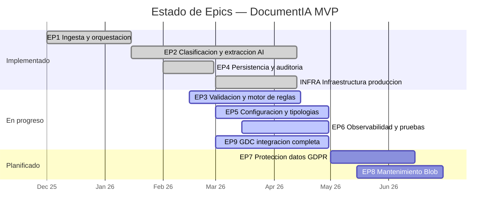

# 7. Roadmap y Pendientes — DocumentIA MVP

> Ultima actualizacion: 2026-04-13
> Proyecto: AI DocClassExt — SAREB

---

## 7.1 Estado de Epics



### Detalle por Epic

| Epic | Nombre | Estado | % Completado | Notas |
|------|--------|--------|-------------|-------|
| **EP1** | Ingesta y orquestacion | DONE | 100% | Orquestador con 13 actividades, timeout GDC, early exits, customStatus, seguimiento timeline |
| **EP2** | Clasificacion y extraccion AI | DONE | 100% | DI clasificacion + CU extraccion + fallback GPT. Fix preproceso markdown aplicado. Degradacion segura activa. |
| **EP3** | Validacion y motor de reglas | IN PROGRESS | 85% | 11 tipos de regla implementados. ValidationEngine operativo. Pendiente: reglas cross-field, reglas condicionales. |
| **EP3** | Validacion y motor de reglas | IN PROGRESS | 88% | 11 tipos de regla implementados. ValidationEngine operativo. Pendiente: reglas cross-field (V-1), reglas condicionales (V-2). |
| **EP4** | Persistencia y auditoria | DONE | 100% | 9 entidades EF Core, migraciones auto, auditoria por ejecucion, validaciones por campo. |
| **EP5** | Configuracion y tipologias | IN PROGRESS | 75% | Config JSON por tipologia (validacion + plugins + prompt). Admin Blazor CRUD basico desplegado. Pendiente: versionado avanzado (A-2), import/export (A-1), auditoria cambios (A-3). |
| **EP6** | Observabilidad y pruebas | IN PROGRESS | 65% | ~231 tests automatizados, customStatus, seguimiento orquestacion. Pendiente: tests CI/CD pipeline (T-4), tests orchestrator (T-1), NormalizarActivity (T-2), EF tests (T-3), dashboards App Insights (7.3.3), alertas productivas (7.3.4). |
| **EP7** | Proteccion datos / GDPR | PLANNED | 0% | Cifrado en reposo (AES-256-GCM), masking PII en logs, retencion configurable, KV para secrets. |
| **EP8** | Mantenimiento Blob | PLANNED | 0% | Lifecycle management, limpieza automatica, retencion por tipologia. |
| **EP9** | GDC integracion completa | IN PROGRESS | 75% | SubirGDC + ConsultarDocumento operativos. Pendiente: retry avanzado, reconciliacion DOC_OBJECT_EXISTS, idempotencia. |
| **EP9** | GDC integracion completa | IN PROGRESS | 80% | SubirGDC + ConsultarDocumento operativos. Pendiente: retry Polly (G-1), idempotencia DOC_OBJECT_EXISTS (G-2), reconciliacion async (G-3). |

---

## 7.2 Pendientes Criticos (Bloqueantes para Produccion)

### 7.2.1 Infraestructura

| # | Pendiente | Estado | Descripcion | Referencia |
|---|-----------|--------|-------------|-----------|
| I-1 | Crear Azure SQL Database | ~~**BLOQUEANTE**~~ **DONE** | `srbsqlprodocai` creado y operativo en produccion. Migraciones EF aplicadas. | plan-despliegue FASE 0 |
| I-2 | Registrar self-hosted agent | **DONE / N/A** | Agente no requerido. Pipeline CI/CD operativo con alternativa actual. | plan-despliegue FASE 0 |
| I-3 | Configurar Key Vault references | **DONE** | Secretos en KV `srbkvprodocai`. Referencias `@Microsoft.KeyVault(...)` activas en App Settings. | plan-despliegue FASE 2 |
| I-4 | RBAC Managed Identity | **DONE** | MI `srbappprodocai` con roles en Storage, KV y SQL configurados. | plan-despliegue FASE 2 |
| I-5 | Web App Admin Blazor | **DONE** | `srbwebCOMPLETAR_GDC_HTTP_BASIC_USERNAMEprodocai` desplegada y operativa (frontend web). | plan-despliegue FASE 5 |
| I-6 | Verificar deployment gpt-4o-mini | **DONE** | Deployment `gpt-4o-mini` verificado en region de produccion y funcionando OK. | plan-despliegue FASE 0 |

### 7.2.2 Codigo

| # | Pendiente | Estado | Descripcion | Referencia |
|---|-----------|--------|-------------|-----------|
| C-1 | Fix bug PDF→GPT fallback | **DONE** | `GptClasificarDataProvider` y `GptFallbackExtraerDataProvider` corregidos. GPT opera sobre markdown extraido. | estado-fallback-preproceso |
| C-2 | Preproceso markdown | **DONE** | `ExtraerMarkdownLayoutActivity` implementada. Reutilizada en extraccion y fallback GPT. | estado-fallback-preproceso |
| C-3 | Persistir markdown sidecar en Blob | **DONE** | Markdown `{sha256}.md` guardado en Blob junto al PDF original. | estado-fallback-preproceso |
| C-4 | Degradacion segura fallback GPT | **DONE** | Si GPT fallback falla, orquestacion devuelve resultado parcial sin tumbar el flujo. | estado-fallback-preproceso |
| C-5 | Propagacion idActivo en IntegrarActivity | **DONE** | Payload plugins usa `DatosFinales.idActivo`; valor enriquecido ya no es pisado. | estado-fallback-preproceso (2026-03-27) |

---

## 7.3 Bloque 3 — Calidad, Pruebas y Observabilidad (Sprint actual)

> **Estado 2026-04-13:** Bloques 1 (Infraestructura) y 2 (Codigo critico) completados al 100%. Sistema en produccion con Azure SQL, KV, MI, Admin Blazor y todos los fixes de fallback aplicados. Los proximos sprints se centran en calidad/pruebas y funcionalidad de negocio.

### 7.3.1 Tests unitarios pendientes

Gap principal: el orchestrator y varias activities core no tienen cobertura unitaria.

| # | Test a implementar | Tipo | Componente | Prioridad | Detalle tecnico |
|---|-------------------|------|-----------|-----------|----------------|
| T-1 | `OrchestratorTests` — flujo completo | Unit | `DocumentProcessOrchestrator` | **Alta** | Usar `Moq` para mockear las 13 activities via `IDurableOrchestrationContext`. Cubrir: flujo feliz, duplicado cacheado, baja confianza clasificacion, tipologia no resuelta, early exit GDC. |
| T-2 | `NormalizarActivityTests` — hashes y paginas | Unit | `NormalizarActivity` | **Alta** | Verificar SHA256 / MD5 / CRC32 correctos con PDFs de referencia. Paginas: PDF valido, PDF corrupto, PDF 0 paginas, fallback nombre. |
| T-3 | Tests EF Core InMemory — CRUD completo | Integracion | `DocumentIA.Data` | **Alta** | Usar provider `InMemory` o `Sqlite` en memoria. Cubrir: insercion ejecucion, validaciones, duplicado SHA256 (unique constraint), paginacion historial. |
| T-4 | `PersistirActivityTests` — mock DbContext | Unit | `PersistirActivity` | Media | Mockear `IDocumentIADbContext`. Escenarios: persistencia OK, excepcion BD → no debe tumbar orquestacion (degradacion). |
| T-5 | `SubirBlobActivityTests` — mock BlobClient | Unit | `SubirBlobActivity` | Media | Mockear `BlobContainerClient`. Escenarios: subida OK, contenedor no existe (auto-create), error transitorio → excepcion propagada. |
| T-6 | `TipologiaAdminCrudTests` — crear, publicar, archivar | Unit | Admin Functions | Media | Cubrir estados: Borrador → Publicada → Archivada. Validar que no se puede publicar tipologia sin campos requeridos. |

**Convencion de naming a seguir:**
```
MetodoTesteado_Escenario_ResultadoEsperado
// Ejemplos:
Execute_DocumentoDuplicadoSinForceReprocess_RetornaCacheado()
Execute_TipologiaNoResuelta_RetornaEstadoError()
Normalizar_PDFValido_RetornaHashesYPaginas()
```

### 7.3.2 Integracion CI/CD — `dotnet test` en pipeline

Actualmente `azure-pipelines.yml` tiene build y deploy pero **no ejecuta tests**. Añadir en el Stage `Build`:

```yaml
# Tras el paso de build, antes del publish:
- task: DotNetCoreCLI@2
    displayName: 'Run unit tests'
    inputs:
        command: test
        projects: 'src/backend/DocumentIA.Tests.Unit/DocumentIA.Tests.Unit.csproj'
        arguments: >
            --configuration Release
            --collect:"XPlat Code Coverage"
            --logger trx
            --results-directory $(Agent.TempDirectory)/TestResults
        publishTestResults: true

- task: PublishTestResults@2
    displayName: 'Publish test results'
    inputs:
        testResultsFormat: VSTest
        testResultsFiles: '$(Agent.TempDirectory)/TestResults/**/*.trx'
        failTaskOnFailedTests: true
```

El pipeline debe fallar si algún test falla (`failTaskOnFailedTests: true`).

### 7.3.3 Dashboards App Insights (Workbooks)

Crear un Workbook en `srbappiprodocai` con tres pestanas:

| Pestana | KPIs | Query KQL base |
|---------|------|---------------|
| **Volumen** | Documentos procesados/dia, por tipologia, tasa exito/error | `customEvents | where name == "DocumentProcessed"` agrupado por tipologia y estado |
| **Latencias** | P50 / P95 / P99 por actividad, latencia total E2E | `dependencies | where type == "DurableActivity"` — percentiles por `data` (nombre actividad) |
| **IA y GDC** | Tasa fallback GPT (clasif+extrac), tasa fallo GDC, confianza media por tipologia | `customMetrics | where name in ("ClassificationConfidence","ExtractionCompleteness","GdcUploadDuration")` |

Instrumentacion necesaria en codigo (si no existe):
- `TelemetryClient.TrackEvent("DocumentProcessed", properties: { tipologia, estado, paginas, hasGDC })`
- `TelemetryClient.TrackMetric("ClassificationConfidence", value)` en `ClasificarActivity`
- `TelemetryClient.TrackMetric("ExtractionCompleteness", ratio)` en `ExtraerActivity`
- `TelemetryClient.TrackMetric("GdcUploadDuration", ms)` en `SubirGDCActivity`

### 7.3.4 Alertas productivas (Azure Monitor)

Crear las siguientes alertas sobre `srbappiprodocai`:

| Alerta | Metrica / Query | Umbral | Severidad | Accion |
|--------|-----------------|--------|-----------|--------|
| Tasa de error alta | `exceptions` count en 5 min | > 10 excepciones | Sev 2 | Email + Teams webhook |
| Latencia E2E excesiva | `customMetrics["E2EDuration"]` p95 en 15 min | > 120 s | Sev 2 | Email |
| Fallos GDC repetidos | `customEvents` donde `name="GdcUploadFailed"` en 10 min | > 3 eventos | Sev 1 | Email + PagerDuty (o equiv.) |
| Fallback GPT elevado | ratio `GptFallbackUsed / DocumentProcessed` en 30 min | > 20% | Sev 3 | Email (aviso calidad) |
| Function App sin actividad | requests count en 60 min | = 0 (si horario laboral) | Sev 2 | Email |

Herramienta recomendada: script PowerShell `scripts/create-monitor-alerts.ps1` (a crear) usando `az monitor metrics alert create`.

---

## 7.4 Bloque 4 — Funcionalidad de Negocio Pendiente (backlog priorizado)

### 7.4.1 GDC — Robustez y reconciliacion (EP9)

| # | Item | Esfuerzo | Detalle |
|---|------|----------|---------|
| G-1 | Retry avanzado en `SubirGDCActivity` | Medio | Reemplazar timeout fijo 120s por policy Polly: 3 reintentos con backoff exponencial (2s, 4s, 8s) + circuit breaker (5 fallos → open 60s). Usar `IAsyncPolicy<HttpResponseMessage>` inyectado via DI. |
| G-2 | Idempotencia `DOC_OBJECT_EXISTS` | Medio | Cuando GDC devuelve `DOC_OBJECT_EXISTS`: (1) consultar `ConsultarDocumentoGDC` para obtener el `ObjectId` existente, (2) persistirlo como si fuera subida exitosa, (3) marcar `ResultadoGDC.EsIdempotente = true`. No reintentar la subida. |
| G-3 | Reconciliacion de ObjectIds huerfanos | Bajo | Timer trigger semanal: buscar en BD ejecuciones con `ObjectIdGDC = null` y estado `Completed`, intentar `ConsultarDocumentoGDC` por SHA256/MD5 para recuperar el ObjectId a posteriori. |

### 7.4.2 Motor de Validacion — Reglas avanzadas (EP3)

El `ValidationEngine` soporta 11 tipos de validador sobre campos individuales. Faltan dos tipos de regla que operan sobre multiples campos:

| # | Item | Esfuerzo | Detalle |
|---|------|----------|---------|
| V-1 | Reglas cross-field | Alto | Nueva interfaz `ICrossFieldValidationRule` con acceso al `IDictionary<string, object> datos` completo. Ejemplos concretos: `FechaFirma <= FechaRegistro`, `ImporteTotal == ImporteCapital + ImporteIntereses`, `CodigoPostal coherente con Provincia`. Configuracion en JSON de tipologia bajo `"validacion": { "reglasGlobales": [...] }`. |
| V-2 | Reglas condicionales | Medio | Modificar `IValidationRule` para soportar `"condicion": { "campo": "TipoGravamen", "operador": "equals", "valor": "hipoteca" }`. Si la condicion no se cumple, la regla se omite (no genera error ni warning). Util para: validar `NumeroFinca` solo si `TipoPropiedad == "urbana"`, validar `NIFArrendatario` solo si `TipoContrato == "arrendamiento"`. |

Impacto en tests: añadir ~15-20 tests nuevos en `ValidationEngineTests` cubriendo ambos tipos.

### 7.4.3 Configuracion de Tipologias — Admin y versionado (EP5)

| # | Item | Esfuerzo | Detalle |
|---|------|----------|---------|
| A-1 | Import/Export config tipologia | Medio | Endpoint `GET /api/tipologias/{id}/export` devuelve JSON completo (campos, reglas, plugins, prompt). Endpoint `POST /api/tipologias/import` acepta ese JSON y crea nueva tipologia en estado Borrador. Util para clonar entre entornos y compartir plantillas. |
| A-2 | Diff de versiones en Admin | Medio | Pagina en Blazor Admin que muestra lado a lado dos versiones de la misma tipologia (familia). Resaltar campos añadidos/eliminados/modificados. Usar comparacion JSON estructural. |
| A-3 | Auditoria de cambios de config | Bajo | Tabla `TipologiaConfigAudit` (usuario, timestamp, tipo cambio, diff JSON). Registrar cada publicacion y archivado. Mostrar historial en Admin. |

### 7.4.4 Rendimiento y eficiencia

| # | Item | Esfuerzo | Detalle |
|---|------|----------|---------|
| R-1 | Cache SHA256 → resultado de extraccion | Medio | Si un documento ya fue procesado (mismo SHA256, misma tipologia, misma version config), reutilizar `DatosExtraidos` en cache (Redis o tabla SQL `ExtraccionCache`). Ahorrar llamadas a CU/GPT. TTL configurable. |
| R-2 | Soporte multi-formato (TIFF, Word, imagen) | Alto | Anadir step de conversion a PDF antes de `SubirBlobActivity`. Usar `DocumentFormat.OpenXml` (Word→PDF via LibreOffice headless o Telerik) y `ImageMagick.NET` (TIFF/imagen→PDF). Nuevos content-types aceptados en `IngestDocumentTrigger`. |

---

## 7.5 Dependencias Externas

| Dependencia | Propietario | Impacto | Estado |
|-------------|------------|---------|--------|
| GDC SINTWS (SOAP) | Equipo GDC SAREB | Subida/consulta de documentos. Certificado SSL corporativo. | Operativo (red interna) |
| Azure SQL Database `srbsqlprodocai` | Equipo Infra SAREB | Base de datos productiva. | **Operativo** (creado 2026-04) |
| Azure AI Content Understanding | Microsoft (Sweden Central) | Extraccion de campos. Servicio en preview. | Operativo |
| Azure Document Intelligence | Microsoft (West Europe) | Clasificacion de documentos. | Operativo |
| Azure OpenAI gpt-4o-mini | Microsoft | Fallback clasificacion + extraccion + prompt. | **Operativo** (deployment verificado en produccion) |
| Key Vault `srbkvprodocai` | Equipo Infra SAREB | Secretos de produccion. | **Operativo** (secretos cargados, referencias activas) |
| Red corporativa SAREB | Equipo Infra SAREB | VPN/private endpoints necesarios para Function App. | Configurado |

---

## 7.6 Riesgos

| Riesgo | Probabilidad | Impacto | Mitigacion |
|--------|-------------|---------|-----------|
| ~~Azure SQL no disponible~~ | ~~Media~~ | ~~Alto~~ | **RESUELTO.** `srbsqlprodocai` operativo en produccion. |
| ~~Self-hosted agent inestable~~ | ~~Media~~ | ~~Alto~~ | **N/A.** Agente no requerido en arquitectura actual. |
| ~~Fallback GPT HTTP 400~~ | ~~Media~~ | ~~Alto~~ | **RESUELTO.** GPT opera sobre markdown extraido (C-1/C-2 completados). |
| CU (preview) cambia API | Baja | Alto | Abstraccion via `IExtraerDataProvider`. Adapter pattern permite cambiar implementacion sin afectar pipeline. |
| GDC sin disponibilidad | Baja | Medio | `skipGDCUpload` permite continuar sin GDC. Documento se persiste en BD igualmente. Mitigacion adicional: G-3 (reconciliacion async). |
| GDC `DOC_OBJECT_EXISTS` sin resolver | Media | Medio | Exige implementar G-2 (idempotencia). Mientras tanto, la ejecucion termina en error de GDC pero el documento se persiste en BD. |
| Tests unitarios insuficientes en orchestrator | Alta | Medio | Cualquier refactor del orquestador puede romper flujos sin detection. Mitigacion: T-1 (prioridad alta). |
| Volumen excesivo sin plan de escalado | Baja | Medio | Consumption Plan escala automaticamente. Monitorizacion via App Insights (pendiente T-3.3/T-3.4). Premium Plan si P95 >60s. |

---

## 7.7 Decision Log (Decisiones Pendientes)

| Decision | Opciones | Estado | Contexto |
|----------|---------|--------|----------|
| Auth mode servicios Azure | API Keys en KV vs Managed Identity | **RESUELTO: MI + KV** | Managed Identity activa con RBAC completo. Secretos en KV con referencias activas. |
| Azure SQL tier | Basic/S0/S1 | **RESUELTO** | `srbsqlprodocai` creado. Tier a confirmar segun volumen real en produccion. |
| Admin Blazor: auth | Anonymous vs Azure AD | **PENDIENTE** | Desplegada sin auth (MVP). Produccion deberia requerir Azure AD — definir antes de dar acceso externo. |
| Plugins SarebEnrichments en v1 | Incluir vs posponer | POSPUESTO | Funcionalidad implementada, DLL compilable. No critico para MVP sin activos reales. |
| Retencion documentos Blob | 30d / 90d / indefinida | **PENDIENTE** | GDPR/EP8 requiere politica de retencion. Definir con Legal/Compliance SAREB. |
| Retry GDC: Polly vs codigo manual | Polly vs IAsyncRetryPolicy custom | **PENDIENTE** | Polly recomendado (ya en dependencias transitivas de Functions). Ver G-1. |
| Cache extraccion: Redis vs SQL | Redis Cache vs tabla `ExtraccionCache` en SQL | **PENDIENTE** | SQL suficiente para MVP (volumen bajo). Redis si latencia es problema. Ver R-1. |
| Admin Blazor: auth cuándo | Antes o despues de GA | **PENDIENTE** | Bloquear sin auth si el Admin es accesible desde red corporativa sin restriccion de IP. |
