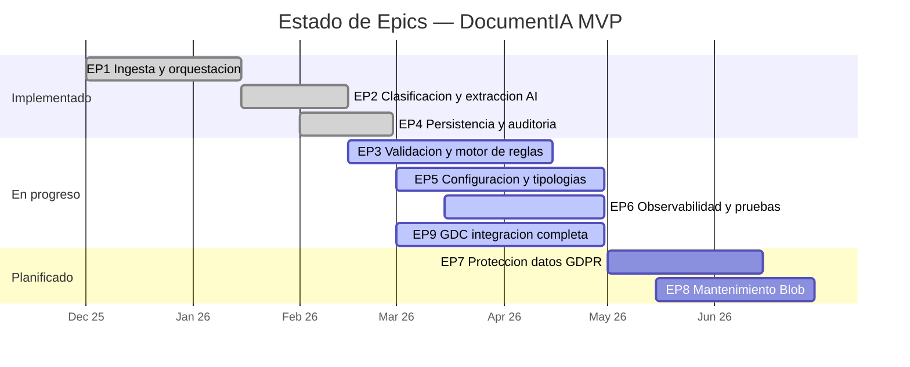
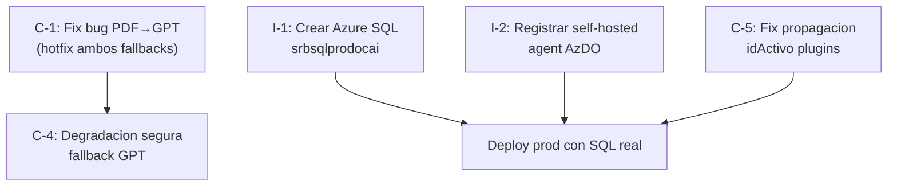

# 7. Roadmap y Pendientes — DocumentIA MVP

> Ultima actualizacion: 2026-03-31  
> Proyecto: AI DocClassExt — SAREB

---

## 7.1 Estado de Epics

### Detalle por Epic

| Epic | Nombre | Estado | % Completado | Notas |
|------|--------|--------|-------------|-------|
| **EP1** | Ingesta y orquestacion | DONE | 100% | Orquestador con 13 actividades, timeout GDC, early exits, customStatus, seguimiento timeline |
| **EP2** | Clasificacion y extraccion AI | DONE | 90% | DI clasificacion + CU extraccion + fallback GPT. Pendiente: fix bug PDF→GPT (ver 7.3.1). |
| **EP3** | Validacion y motor de reglas | IN PROGRESS | 85% | 11 tipos de regla implementados. ValidationEngine operativo. Pendiente: reglas cross-field, reglas condicionales. |
| **EP4** | Persistencia y auditoria | DONE | 100% | 9 entidades EF Core, migraciones auto, auditoria por ejecucion, validaciones por campo. |
| **EP5** | Configuracion y tipologias | IN PROGRESS | 70% | Config JSON por tipologia (validacion + plugins + prompt). Admin Blazor CRUD basico. Pendiente: versionado avanzado, importacion/exportacion config. |
| **EP6** | Observabilidad y pruebas | IN PROGRESS | 60% | ~231 tests automatizados, customStatus, seguimiento orquestacion. Pendiente: CI/CD tests, dashboards App Insights, alertas productivas. |
| **EP7** | Proteccion datos / GDPR | PLANNED | 0% | Cifrado en reposo (AES-256-GCM), masking PII en logs, retencion configurable, KV para secrets. |
| **EP8** | Mantenimiento Blob | PLANNED | 0% | Lifecycle management, limpieza automatica, retencion por tipologia. |
| **EP9** | GDC integracion completa | IN PROGRESS | 75% | SubirGDC + ConsultarDocumento operativos. Pendiente: retry avanzado, reconciliacion DOC_OBJECT_EXISTS, idempotencia. |

---

## 7.2 Pendientes Criticos (Bloqueantes para Produccion)

### 7.2.1 Infraestructura

| # | Pendiente | Estado | Descripcion | Referencia |
|---|-----------|--------|-------------|-----------|
| I-1 | Crear Azure SQL Database | **BLOQUEANTE** | `srbsqlprodocai` no existe. Se usa Docker SQL temporal. | plan-despliegue FASE 0 |
| I-2 | Registrar self-hosted agent | PENDIENTE | Pool `documentia-selfhosted` necesario para CI/CD. Private endpoints impiden hosted agents. | plan-despliegue FASE 0 |
| I-3 | Configurar Key Vault references | PENDIENTE | Secrets actualmente en App Settings directo. Migrar a `@Microsoft.KeyVault(...)`. | plan-despliegue FASE 2 |
| I-4 | RBAC Managed Identity | PENDIENTE | MI de `srbappprodocai` necesita roles en Storage, KV, SQL. | plan-despliegue FASE 2 |
| I-5 | Web App Admin Blazor | PENDIENTE | `srbwebCOMPLETAR_GDC_HTTP_BASIC_USERNAMEprodocai` no creada. Admin solo funciona local. | plan-despliegue FASE 5 |
| I-6 | Verificar deployment gpt-4o-mini en srboaiprodocai | PENDIENTE | local.settings apunta a Sweden Central; prod necesita West Europe. | plan-despliegue FASE 0 |

### 7.2.2 Codigo

| # | Pendiente | Prioridad | Descripcion | Referencia |
|---|-----------|-----------|-------------|-----------|
| C-1 | Fix bug PDF→GPT fallback | **CRITICA** | `GptClasificarDataProvider` y `GptFallbackExtraerDataProvider` envian PDF como image part → HTTP 400. | estado-fallback-preproceso |
| C-2 | Preproceso markdown | ALTA | Nueva activity para extraer markdown/texto antes de fallback GPT. Reutilizable. | estado-fallback-preproceso |
| C-3 | Persistir markdown sidecar en Blob | ALTA | Guardar markdown junto al PDF original (`{sha256}.md`). | estado-fallback-preproceso |
| C-4 | Degradacion segura fallback GPT | ALTA | Si GPT fallback falla, no tumbar orquestacion. Devolver resultado parcial. | estado-fallback-preproceso |
| C-5 | Propagacion idActivo en IntegrarActivity | MEDIA | Payload plugins debe usar `DatosFinales.idActivo` (no siempre `input.IdActivo`) para evitar que plugins pisen valor enriquecido. | estado-fallback-preproceso (2026-03-27) |
| C-6 | Tests CI/CD pipeline | ALTA | `dotnet test` no integrado en azure-pipelines.yml. | 06_PLAN_PRUEBAS gap |
| C-7 | Tests Orchestrator | MEDIA | Sin tests unitarios para DocumentProcessOrchestrator. | 06_PLAN_PRUEBAS gap |

---

## 7.3 Secuencia Recomendada de Trabajo

### Fase Inmediata (Sprint actual)

| Orden | Item | Esfuerzo estimado | Dependencia |
|-------|------|-------------------|-------------|
| 1 | C-1: Fix PDF→GPT fallback | Bajo | Ninguna |
| 2 | C-4: Degradacion segura fallback | Bajo | C-1 |
| 3 | C-5: Propagacion idActivo | Bajo | Ninguna |
| 4 | I-1: Azure SQL Database | Medio (requiere permisos Azure) | Ninguna |
| 5 | I-2: Self-hosted agent | Medio (config maquina + PAT) | Ninguna |
| 6 | Deploy primera version productiva | — | I-1, I-2, C-1 |

### Fase Siguiente (1-2 sprints)

| Orden | Item | Esfuerzo | Dependencia |
|-------|------|----------|-------------|
| 7 | C-2: Activity preproceso markdown | Medio | C-1 |
| 8 | C-3: Persistir markdown sidecar | Bajo | C-2 |
| 9 | I-3: Key Vault references | Medio | I-4 |
| 10 | I-4: RBAC Managed Identity | Medio | I-1 |
| 11 | C-6: Tests en pipeline CI/CD | Bajo | I-2 |
| 12 | I-5: Deploy Admin Blazor | Medio | I-4 |
| 13 | I-6: Verificar gpt-4o-mini West Europe | Bajo | Ninguna |
| 14 | C-7: Tests Orchestrator | Medio | Ninguna |

### Fase Posterior (backlog)

| Item | Epic | Descripcion |
|------|------|-------------|
| Reglas cross-field | EP3 | Validacion que compare multiples campos entre si |
| Reglas condicionales | EP3 | Reglas que solo aplican si otro campo tiene cierto valor |
| Versionado avanzado tipologias | EP5 | Migracion automatica entre versiones, diff de configs |
| Import/Export config tipologias | EP5 | JSON bulk import/export desde Admin |
| Dashboards App Insights | EP6 | Workbooks con KPIs: volumen, latencias, errores por tipologia |
| Alertas productivas | EP6 | Azure Monitor Alerts: tasa error >5%, latencia p95 >60s, GDC failures |
| Cifrado en reposo (AES-256-GCM) | EP7 | Client-side encryption de PDFs en Blob Storage |
| Masking PII en logs | EP7 | Ocultar NIF, nombres, direcciones en structured logs |
| Retencion configurable | EP7/EP8 | TTL por tipologia, soft delete, lifecycle policies |
| Limpieza automatica Blob | EP8 | Timer trigger para purgar documentos expirados |
| Reconciliacion GDC | EP9 | Resolver DOC_OBJECT_EXISTS con logica de idempotencia |
| Retry avanzado GDC | EP9 | Reintentos con backoff exponencial en SubirGDCActivity (hoy es timeout fijo 120s) |
| Cache SHA256 → resultado | — | Reutilizar extraccion previa si SHA256 coincide y tipologia no cambio |
| Soporte multi-formato | — | Admitir TIFF, Word, imagenes ademas de PDF |

---

## 7.4 Dependencias Externas

| Dependencia | Propietario | Impacto | Estado |
|-------------|------------|---------|--------|
| GDC SINTWS (SOAP) | Equipo GDC SAREB | Subida/consulta de documentos. Certificado SSL corporativo. | Operativo (red interna) |
| Azure SQL Database | Equipo Infra SAREB | Base de datos productiva. Docker temporal en uso. | **Pendiente creacion** |
| Azure AI Content Understanding | Microsoft (Sweden Central) | Extraccion de campos. Servicio en preview. | Operativo |
| Azure Document Intelligence | Microsoft (West Europe) | Clasificacion de documentos. | Operativo |
| Azure OpenAI gpt-4o-mini | Microsoft | Fallback clasificacion + extraccion. | Operativo (verificar deployment en West Europe) |
| Red corporativa SAREB | Equipo Infra SAREB | VPN/private endpoints necesarios para agente CI/CD y Function App. | Configurado parcialmente |

---

## 7.5 Riesgos

| Riesgo | Probabilidad | Impacto | Mitigacion |
|--------|-------------|---------|-----------|
| Azure SQL no disponible a tiempo | Media | Alto | Docker SQL temporal ya operativo. Switch seria solo cambiar connection string. |
| Self-hosted agent inestable | Media | Alto | Documentar proceso de reinstalacion. Alternativa: temporary public endpoints para pipeline. |
| CU (preview) cambia API | Baja | Alto | Abstraccion via `IExtraerDataProvider`. Adapter pattern permite cambiar implementacion sin afectar pipeline. |
| Fallback GPT genera datos incorrectos | Media | Medio | Bug conocido (C-1). Tras fix, GPT operara sobre markdown (no PDF). Validacion posterior detecta inconsistencias. |
| GDC sin disponibilidad | Baja | Medio | `skipGDCUpload` permite continuar sin GDC. Documento se persiste en BD igualmente. |
| Volumen excesivo sin plan de escalado | Baja | Medio | Consumption Plan escala automaticamente. Monitorizacion via App Insights. Premium Plan si P95 >60s. |

---

## 7.6 Decision Log (Decisiones Pendientes)

| Decision | Opciones | Estado | Contexto |
|----------|---------|--------|----------|
| Auth mode servicios Azure | API Keys en KV vs Managed Identity | PENDIENTE | MI preferida pero requiere RBAC completo (I-4). Keys temporales en App Settings. |
| Azure SQL tier | Basic/S0/S1 | PENDIENTE | Depende del volumen esperado. S0 (10 DTU) suficiente para MVP. |
| Admin Blazor: auth | Anonymous vs Azure AD | PENDIENTE | MVP sin auth. Produccion deberia requerir Azure AD + RBAC. |
| Plugins SarebEnrichments en v1 | Incluir vs posponer | POSPUESTO | Funcionalidad implementada, DLL compilable. No critico para MVP sin activos reales. |
| Retencion documentos Blob | 30d / 90d / indefinida | PENDIENTE | GDPR requiere politica de retencion. Definir con Legal/Compliance SAREB. |
