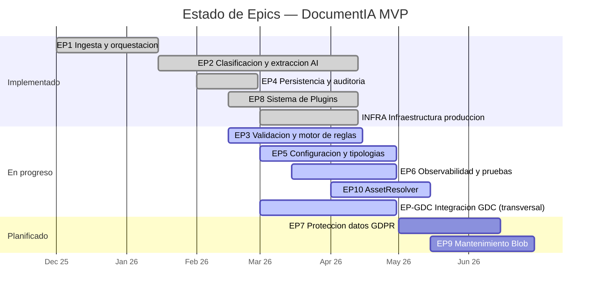

# 7. Roadmap y Pendientes — DocumentIA MVP

> Ultima actualizacion: 2026-05-05
> Proyecto: AI DocClassExt — SAREB

---

## 7.1 Estado de Epics



### Detalle por Epic

| Epic | Nombre | Estado | % Completado | Notas |
|------|--------|--------|-------------|-------|
| **EP1** | Ingesta y orquestacion | DONE | 100% | Orquestador con 13 actividades, timeout GDC, early exits, customStatus, seguimiento timeline |
| **EP2** | Clasificacion y extraccion AI | DONE | 100% | DI clasificacion + CU extraccion + fallback GPT. Fix preproceso markdown aplicado. Degradacion segura activa. |
| **EP3** | Validacion y motor de reglas | IN PROGRESS | 88% | 11 tipos de regla implementados. ValidationEngine operativo. Pendiente: reglas cross-field (V-1), reglas condicionales (V-2). |
| **EP4** | Persistencia y auditoria | DONE | 100% | 9 entidades EF Core, migraciones auto, auditoria por ejecucion, validaciones por campo. |
| **EP5** | Configuracion y tipologias | IN PROGRESS | 80% | Config JSON por tipologia (validacion + plugins + prompt). Admin Blazor CRUD basico desplegado. Editor JSON con modo pantalla completa implementado. Pendiente: versionado avanzado (A-2), import/export (A-1), auditoria cambios (A-3). |
| **EP6** | Observabilidad y pruebas | IN PROGRESS | 85% | 536 tests C# en verde (verificado 2026-05-04 en `DocumentIA.Tests.Unit`), customStatus y seguimiento de orquestacion activos. Completados T-1/T-2/T-3/T-4/T-5/T-6. Pendiente: extender pipeline a Admin/E2E/AssetResolver, dashboards App Insights (7.3.3), alertas productivas (7.3.4). |
| **EP7** | Proteccion datos / GDPR (ADO Epic 98519) | NEW | 0% | Cifrado en reposo (AES-256-GCM), masking PII en logs, retencion configurable, KV para secrets. Features ADO: 98520 F7.1, 98524 F7.2, 98529 F7.3, 98534 F7.4. |
| **EP8** | Sistema de Plugins de Integracion (ADO Epic 98628) | DONE | 100% | Arquitectura plugins + plugin REST generico + plugins Atlas/Catastro/GDC + resiliencia y observabilidad. Features 98634-98637 todas Done. |
| **EP9** | Mantenimiento y limpieza de Blob Storage (ADO Epic 98692) | NEW | 0% | Politica de retencion por tipologia (F9.1), motor de limpieza automatica (F9.2), inventario y reporting (F9.3), observabilidad/auditoria (F9.4). Features 98693-98696 todas New. |
| **EP10** | Resolucion de Activo por Direccion en AssetResolver (ADO Epic 99089) | IN PROGRESS | 90% | Core operativo: 3 criterios (IDUFIR, RefCat, Direccion) + doble origen AAII/AACC + flags por criterio. Pendiente Tanda C: AR-10 evaluacion rendimiento/calidad matching (Task 99101), AR-12 hardening operativo + telemetria (Task 99103). Feature AR-F1 (99091) In Progress. Ver [ESPECIFICACION_PLUGIN_ASSETRESOLVER.md](especificaciones/ESPECIFICACION_PLUGIN_ASSETRESOLVER.md). |
| **EP-GDC** | Integracion GDC — trabajo tecnico transversal (no es Epic en ADO) | IN PROGRESS | 80% | SubirGDC + ConsultarDocumento operativos (HU 8.4 = PBI 98632 Committed; HU 8.5 endpoint DEV real = PBI 98871 To Validate). Pendiente: retry Polly (G-1), idempotencia DOC_OBJECT_EXISTS (G-2), reconciliacion async (G-3). |

---

## 7.2 Pendientes Criticos (Bloqueantes para Produccion)

### 7.2.1 Infraestructura

| # | Pendiente | Estado | Descripcion | Referencia |
|---|-----------|--------|-------------|-----------|
| I-1 | Crear Azure SQL Database | ~~**BLOQUEANTE**~~ **DONE** | `srbsqlprodocai` creado y operativo en produccion. Migraciones EF aplicadas. | plan-despliegue FASE 0 |
| I-2 | Registrar self-hosted agent | **DONE / N/A** | Agente no requerido. Pipeline CI/CD operativo con alternativa actual. | plan-despliegue FASE 0 |
| I-3 | Configurar Key Vault references | **DONE** | Secretos en KV `srbkvprodocai`. Referencias `@Microsoft.KeyVault(...)` activas en App Settings. | plan-despliegue FASE 2 |
| I-4 | RBAC Managed Identity | **DONE** | MI `srbappprodocai` con roles en Storage, KV y SQL configurados. | plan-despliegue FASE 2 |
| I-5 | Web App Admin Blazor | **DONE** | `srbwebCOMPLETAR_GDC_HTTP_BASIC_USERNAMEprodocai` desplegada y operativa (frontend web). | plan-despliegue FASE 5 |
| I-6 | Verificar deployment gpt-4o-mini | **DONE** | Deployment `gpt-4o-mini` verificado en region de produccion y funcionando OK. | plan-despliegue FASE 0 |

### 7.2.2 Codigo

| # | Pendiente | Estado | Descripcion | Referencia |
|---|-----------|--------|-------------|-----------|
| C-1 | Fix bug PDF→GPT fallback | **DONE** | `GptClasificarDataProvider` y `GptFallbackExtraerDataProvider` corregidos. GPT opera sobre markdown extraido. | estado-fallback-preproceso |
| C-2 | Preproceso markdown | **DONE** | `ExtraerMarkdownLayoutActivity` implementada. Reutilizada en extraccion y fallback GPT. | estado-fallback-preproceso |
| C-3 | Persistir markdown sidecar en Blob | **DONE** | Markdown `{sha256}.md` guardado en Blob junto al PDF original. | estado-fallback-preproceso |
| C-4 | Degradacion segura fallback GPT | **DONE** | Si GPT fallback falla, orquestacion devuelve resultado parcial sin tumbar el flujo. | estado-fallback-preproceso |
| C-5 | Propagacion idActivo en IntegrarActivity | **DONE** | Payload plugins usa `DatosFinales.idActivo`; valor enriquecido ya no es pisado. | estado-fallback-preproceso (2026-03-27) |
| C-6 | Fix `NombreArchivo` null en flujo `objectIdGDC` | **DONE** | Sincronizacion `entrada.Documento.Name -> salida.Identificacion.Documento` en orquestador + fallback defensivo en `PersistirActivity` para no persistir null. Incluye regresion unitaria en orquestador y persistencia. Work items `99297`, `99298`, `99299`, `99300` en `Done`. | AB#99297 AB#99298 AB#99299 AB#99300 |

---

## 7.3 Bloque 3 — Calidad, Pruebas y Observabilidad (Sprint actual)

> **Estado 2026-04-17:** Bloques 1 (Infraestructura) y 2 (Codigo critico) completados al 100%. Sistema en produccion con Azure SQL, KV, MI, Admin Blazor y todos los fixes de fallback aplicados. Pipeline CI/CD operativo con migraciones EF al arrancar y fix de settings AssetResolver (az CLI Python). Admin Blazor mejorado con editor JSON en pantalla completa. **AssetResolver mejorado** con busqueda por direccion fuzzy, flags de habilitacion por criterio (IDUFIR/RefCat/Direccion) y modo combinacion AND/OR. Los proximos sprints se centran en calidad/pruebas y funcionalidad de negocio.

### 7.3.1 Tests unitarios EP6 (estado)

Estado 2026-05-04: suite EP6 implementada y validada en `develop` (merge fast-forward de `feature/ep6-tests-activities`, commit `c0982c0`).

| # | Test a implementar | Tipo | Componente | Prioridad | Detalle tecnico |
|---|-------------------|------|-----------|-----------|----------------|
| T-1 | `OrchestratorTests` — flujo completo | Unit | `DocumentProcessOrchestrator` | **Completado** | Implementado en `DocumentProcessOrchestratorTests` (4 casos: duplicado cacheado, baja confianza, tipologia no resuelta, clasificacion no identificada). WI: AB#99262. |
| T-2 | `NormalizarActivityTests` — hashes y paginas | Unit | `NormalizarActivity` | **Completado** | Implementado y consolidado en rama principal. Cobertura de hashes/paginas y escenarios de degradacion. |
| T-3 | Tests EF Core InMemory — CRUD completo | Integracion | `DocumentIA.Data` | **Completado** | Implementado en `EFInMemoryCrudTests` (6 tests CRUD y aislamiento de contexto InMemory). WI: AB#99261. |
| T-4 | `PersistirActivityTests` — mock DbContext | Unit | `PersistirActivity` | **Completado** | Implementado y validado en suite unitaria de activities. |
| T-5 | `SubirBlobActivityTests` — mock BlobClient | Unit | `SubirBlobActivity` | **Completado** | Implementado y validado en suite unitaria de activities. |
| T-6 | `TipologiaAdminCrudTests` — crear, publicar, archivar | Unit | Admin Functions | **Completado** | Implementado en `TipologiasAdminFunctionTests` (9 tests GET/POST/PUT/DELETE con validaciones y conflictos). WI: AB#99260. |

**Convencion de naming a seguir:**
```
MetodoTesteado_Escenario_ResultadoEsperado
// Ejemplos:
Execute_DocumentoDuplicadoSinForceReprocess_RetornaCacheado()
Execute_TipologiaNoResuelta_RetornaEstadoError()
Normalizar_PDFValido_RetornaHashesYPaginas()
```

### 7.3.2 Integracion CI/CD — `dotnet test` en pipeline

**Estado 2026-05-04:** parcialmente cubierto. `azure-pipelines.yml` (lineas 31-32 / 63-68) define `testsProject = src/backend/DocumentIA.Tests.Unit/DocumentIA.Tests.Unit.csproj` y ejecuta tarea `Test` con `command: test` tras el `Build`. Los tests del proyecto Unit (536) corren en cada build.

**Pendiente:**

1. Extender el pipeline para ejecutar tambien `DocumentIA.Tests.Admin` (41 tests) y `DocumentIA.AssetResolver.Tests` (7 tests).
2. Anadir publicacion de resultados (`PublishTestResults@2`) y cobertura (`--collect:"XPlat Code Coverage"` + `PublishCodeCoverageResults`).
3. `DocumentIA.Tests.E2E` (Playwright) debe quedar fuera del pipeline o en un stage opcional, ya que requiere Admin frontend levantado.
4. Configurar `failTaskOnFailedTests: true` para que el pipeline falle si algun test falla.

Propuesta de tarea ampliada:

```yaml
# Tras el paso de build, antes del publish:
- task: DotNetCoreCLI@2
    displayName: 'Run unit tests'
    inputs:
        command: test
        projects: |
            src/backend/DocumentIA.Tests.Unit/DocumentIA.Tests.Unit.csproj
            src/backend/DocumentIA.Tests.Admin/DocumentIA.Tests.Admin.csproj
            src/plugins/DocumentIA.AssetResolver.Tests/DocumentIA.AssetResolver.Tests.csproj
        arguments: >
            --configuration Release
            --collect:"XPlat Code Coverage"
            --logger trx
            --results-directory $(Agent.TempDirectory)/TestResults
        publishTestResults: true

- task: PublishTestResults@2
    displayName: 'Publish test results'
    inputs:
        testResultsFormat: VSTest
        testResultsFiles: '$(Agent.TempDirectory)/TestResults/**/*.trx'
        failTaskOnFailedTests: true
```

El pipeline debe fallar si algún test falla (`failTaskOnFailedTests: true`).

### 7.3.3 Dashboards App Insights (Workbooks)

Crear un Workbook en `srbappiprodocai` con tres pestanas:

| Pestana | KPIs | Query KQL base |
|---------|------|---------------|
| **Volumen** | Documentos procesados/dia, por tipologia, tasa exito/error | `customEvents | where name == "DocumentProcessed"` agrupado por tipologia y estado |
| **Latencias** | P50 / P95 / P99 por actividad, latencia total E2E | `dependencies | where type == "DurableActivity"` — percentiles por `data` (nombre actividad) |
| **IA y GDC** | Tasa fallback GPT (clasif+extrac), tasa fallo GDC, confianza media por tipologia | `customMetrics | where name in ("ClassificationConfidence","ExtractionCompleteness","GdcUploadDuration")` |

Instrumentacion necesaria en codigo (si no existe):
- `TelemetryClient.TrackEvent("DocumentProcessed", properties: { tipologia, estado, paginas, hasGDC })`
- `TelemetryClient.TrackMetric("ClassificationConfidence", value)` en `ClasificarActivity`
- `TelemetryClient.TrackMetric("ExtractionCompleteness", ratio)` en `ExtraerActivity`
- `TelemetryClient.TrackMetric("GdcUploadDuration", ms)` en `SubirGDCActivity`

### 7.3.4 Alertas productivas (Azure Monitor)

Crear las siguientes alertas sobre `srbappiprodocai`:

| Alerta | Metrica / Query | Umbral | Severidad | Accion |
|--------|-----------------|--------|-----------|--------|
| Tasa de error alta | `exceptions` count en 5 min | > 10 excepciones | Sev 2 | Email + Teams webhook |
| Latencia E2E excesiva | `customMetrics["E2EDuration"]` p95 en 15 min | > 120 s | Sev 2 | Email |
| Fallos GDC repetidos | `customEvents` donde `name="GdcUploadFailed"` en 10 min | > 3 eventos | Sev 1 | Email + PagerDuty (o equiv.) |
| Fallback GPT elevado | ratio `GptFallbackUsed / DocumentProcessed` en 30 min | > 20% | Sev 3 | Email (aviso calidad) |
| Function App sin actividad | requests count en 60 min | = 0 (si horario laboral) | Sev 2 | Email |

Herramienta recomendada: script PowerShell `scripts/create-monitor-alerts.ps1` (a crear) usando `az monitor metrics alert create`.

---

## 7.4 Bloque 4 — Funcionalidad de Negocio Pendiente (backlog priorizado)

### 7.4.1 GDC — Robustez y reconciliacion (EP9)

| # | Item | Esfuerzo | Detalle |
|---|------|----------|---------|
| G-1 | Retry avanzado en `SubirGDCActivity` | Medio | Reemplazar timeout fijo 120s por policy Polly: 3 reintentos con backoff exponencial (2s, 4s, 8s) + circuit breaker (5 fallos → open 60s). Usar `IAsyncPolicy<HttpResponseMessage>` inyectado via DI. |
| G-2 | Idempotencia `DOC_OBJECT_EXISTS` | Medio | Cuando GDC devuelve `DOC_OBJECT_EXISTS`: (1) consultar `ConsultarDocumentoGDC` para obtener el `ObjectId` existente, (2) persistirlo como si fuera subida exitosa, (3) marcar `ResultadoGDC.EsIdempotente = true`. No reintentar la subida. |
| G-3 | Reconciliacion de ObjectIds huerfanos | Bajo | Timer trigger semanal: buscar en BD ejecuciones con `ObjectIdGDC = null` y estado `Completed`, intentar `ConsultarDocumentoGDC` por SHA256/MD5 para recuperar el ObjectId a posteriori. |

### 7.4.2 Motor de Validacion — Reglas avanzadas (EP3)

El `ValidationEngine` soporta 11 tipos de validador sobre campos individuales. Faltan dos tipos de regla que operan sobre multiples campos:

| # | Item | Esfuerzo | Detalle |
|---|------|----------|---------|
| V-1 | Reglas cross-field | Alto | Nueva interfaz `ICrossFieldValidationRule` con acceso al `IDictionary<string, object> datos` completo. Ejemplos concretos: `FechaFirma <= FechaRegistro`, `ImporteTotal == ImporteCapital + ImporteIntereses`, `CodigoPostal coherente con Provincia`. Configuracion en JSON de tipologia bajo `"validacion": { "reglasGlobales": [...] }`. |
| V-2 | Reglas condicionales | Medio | Modificar `IValidationRule` para soportar `"condicion": { "campo": "TipoGravamen", "operador": "equals", "valor": "hipoteca" }`. Si la condicion no se cumple, la regla se omite (no genera error ni warning). Util para: validar `NumeroFinca` solo si `TipoPropiedad == "urbana"`, validar `NIFArrendatario` solo si `TipoContrato == "arrendamiento"`. |

Impacto en tests: añadir ~15-20 tests nuevos en `ValidationEngineTests` cubriendo ambos tipos.

### 7.4.3 Configuracion de Tipologias — Admin y versionado (EP5)

| # | Item | Esfuerzo | Detalle |
|---|------|----------|---------|
| A-1 | Import/Export config tipologia | Medio | Endpoint `GET /api/tipologias/{id}/export` devuelve JSON completo (campos, reglas, plugins, prompt). Endpoint `POST /api/tipologias/import` acepta ese JSON y crea nueva tipologia en estado Borrador. Util para clonar entre entornos y compartir plantillas. |
| A-2 | Diff de versiones en Admin | Medio | Pagina en Blazor Admin que muestra lado a lado dos versiones de la misma tipologia (familia). Resaltar campos añadidos/eliminados/modificados. Usar comparacion JSON estructural. |
| A-3 | Auditoria de cambios de config | Bajo | Tabla `TipologiaConfigAudit` (usuario, timestamp, tipo cambio, diff JSON). Registrar cada publicacion y archivado. Mostrar historial en Admin. |

### 7.4.4 Rendimiento y eficiencia

| # | Item | Esfuerzo | Detalle |
|---|------|----------|---------|
| R-1 | Cache SHA256 → resultado de extraccion | Medio | Si un documento ya fue procesado (mismo SHA256, misma tipologia, misma version config), reutilizar `DatosExtraidos` en cache (Redis o tabla SQL `ExtraccionCache`). Ahorrar llamadas a CU/GPT. TTL configurable. |
| R-2 | Soporte multi-formato (TIFF, Word, imagen) | Alto | Anadir step de conversion a PDF antes de `SubirBlobActivity`. Usar `DocumentFormat.OpenXml` (Word→PDF via LibreOffice headless o Telerik) y `ImageMagick.NET` (TIFF/imagen→PDF). Nuevos content-types aceptados en `IngestDocumentTrigger`. |

---

## 7.5 Dependencias Externas

| Dependencia | Propietario | Impacto | Estado |
|-------------|------------|---------|--------|
| GDC SINTWS (SOAP) | Equipo GDC SAREB | Subida/consulta de documentos. Certificado SSL corporativo. | Operativo (red interna) |
| Azure SQL Database `srbsqlprodocai` | Equipo Infra SAREB | Base de datos productiva. | **Operativo** (creado 2026-04) |
| Azure AI Content Understanding | Microsoft (Sweden Central) | Extraccion de campos. Servicio en preview. | Operativo |
| Azure Document Intelligence | Microsoft (West Europe) | Clasificacion de documentos. | Operativo |
| Azure OpenAI gpt-4o-mini | Microsoft | Fallback clasificacion + extraccion + prompt. | **Operativo** (deployment verificado en produccion) |
| Key Vault `srbkvprodocai` | Equipo Infra SAREB | Secretos de produccion. | **Operativo** (secretos cargados, referencias activas) |
| Red corporativa SAREB | Equipo Infra SAREB | VPN/private endpoints necesarios para Function App. | Configurado |

---

## 7.6 Riesgos

| Riesgo | Probabilidad | Impacto | Mitigacion |
|--------|-------------|---------|-----------|
| ~~Azure SQL no disponible~~ | ~~Media~~ | ~~Alto~~ | **RESUELTO.** `srbsqlprodocai` operativo en produccion. |
| ~~Self-hosted agent inestable~~ | ~~Media~~ | ~~Alto~~ | **N/A.** Agente no requerido en arquitectura actual. |
| ~~Fallback GPT HTTP 400~~ | ~~Media~~ | ~~Alto~~ | **RESUELTO.** GPT opera sobre markdown extraido (C-1/C-2 completados). |
| CU (preview) cambia API | Baja | Alto | Abstraccion via `IExtraerDataProvider`. Adapter pattern permite cambiar implementacion sin afectar pipeline. |
| GDC sin disponibilidad | Baja | Medio | `skipGDCUpload` permite continuar sin GDC. Documento se persiste en BD igualmente. Mitigacion adicional: G-3 (reconciliacion async). |
| GDC `DOC_OBJECT_EXISTS` sin resolver | Media | Medio | Exige implementar G-2 (idempotencia). Mientras tanto, la ejecucion termina en error de GDC pero el documento se persiste en BD. |
| ~~Tests unitarios insuficientes en orchestrator~~ | ~~Alta~~ | ~~Medio~~ | **RESUELTO (parcial EP6).** Implementados T-1/T-2/T-3/T-4/T-5/T-6 y validados con 536 tests en verde (2026-05-04). |
| Volumen excesivo sin plan de escalado | Baja | Medio | Consumption Plan escala automaticamente. Monitorizacion via App Insights (pendiente T-3.3/T-3.4). Premium Plan si P95 >60s. |

---

## 7.7 Decision Log (Decisiones Pendientes)

| Decision | Opciones | Estado | Contexto |
|----------|---------|--------|----------|
| Auth mode servicios Azure | API Keys en KV vs Managed Identity | **RESUELTO: MI + KV** | Managed Identity activa con RBAC completo. Secretos en KV con referencias activas. |
| Azure SQL tier | Basic/S0/S1 | **RESUELTO** | `srbsqlprodocai` creado. Tier a confirmar segun volumen real en produccion. |
| Admin Blazor: auth | Anonymous vs Azure AD | **PENDIENTE** | Desplegada sin auth (MVP). Produccion deberia requerir Azure AD — definir antes de dar acceso externo. |
| Plugins SarebEnrichments en v1 | Incluir vs posponer | POSPUESTO | Funcionalidad implementada, DLL compilable. No critico para MVP sin activos reales. |
| Retencion documentos Blob | 30d / 90d / indefinida | **PENDIENTE** | GDPR/EP8 requiere politica de retencion. Definir con Legal/Compliance SAREB. |
| Retry GDC: Polly vs codigo manual | Polly vs IAsyncRetryPolicy custom | **PENDIENTE** | Polly recomendado (ya en dependencias transitivas de Functions). Ver G-1. |
| Cache extraccion: Redis vs SQL | Redis Cache vs tabla `ExtraccionCache` en SQL | **PENDIENTE** | SQL suficiente para MVP (volumen bajo). Redis si latencia es problema. Ver R-1. |
| Admin Blazor: auth cuándo | Antes o despues de GA | **PENDIENTE** | Bloquear sin auth si el Admin es accesible desde red corporativa sin restriccion de IP. |

---

## 7.8 Plan de Cierre — Work Items AssetResolver (99089–99103)

Objetivo: cerrar de forma trazable los work items abiertos relacionados con AssetResolver, evitando cierres inconsistentes entre tarea/feature/epic.

### 7.8.1 Estado de partida

Abiertos en la revisión ADO:
- 99103, 99102, 99101, 99100, 99098, 99097, 99092, 99091, 99089

Cerrados con evidencia:
- 99099, 99096, 99095, 99094, 99093

### 7.8.2 Criterios de cierre por item abierto

| WI | Qué falta para cierre | Evidencia mínima requerida |
|----|------------------------|----------------------------|
| 99097 (Integración activity) | Verificar mapeo request/response completo en `ObtenerActivoActivity` (incluyendo dirección tipificada) | Tests unitarios verdes + payload/response validados |
| 99098 (Integración orquestador) | Verificar propagación de criterios desde orquestador a activity y resultado en salida | Test de integración unitario del paso ObtenerActivo en orquestador |
| 99100 (Pruebas activity/orquestador) | Batería ampliada para casos feliz/no-found/error/AND-OR/dirección tipificada | Resultado de ejecución de tests y cobertura objetivo del módulo |
| 99101 (Rendimiento/calidad) | Ejecutar pruebas de latencia y calidad de matching | Informe p95/p99 + tasa de acierto en dataset representativo |
| 99102 (Documentación) | Publicar documentación funcional/técnica alineada al comportamiento actual | Documentos actualizados y revisados (AssetResolver + Plan de pruebas) |
| 99103 (Hardening/telemetría) | Añadir telemetría operativa y criterios de alerta mínimos | Logs estructurados/métricas + checklist de observabilidad |
| 99092 (Contrato de precedencia) | Formalizar y aprobar reglas de precedencia de criterios | Contrato API/funcional aprobado |
| 99091 (Feature) | Cerrar tras completar tareas hijas críticas | Hijos en Done + comentario de consolidación |
| 99089 (Epic) | Cerrar tras cierre de features dependientes | Features cerradas + validación final |

### 7.8.3 Plan por tandas (ejecutable)

1. Tanda A — Integración técnica (objetivo inmediato)
- 99097, 99098, 99100
- Acciones:
    - Completar tests de `ObtenerActivoActivity` para dirección tipificada y combinación de criterios.
    - Añadir tests del orquestador en el paso de AssetResolver (caso único activo/múltiples/no encontrado).
    - Publicar evidencia de ejecución (`dotnet test`) en comentario de WI.

2. Tanda B — Contrato y documentación
- 99092, 99102
- Acciones:
    - Cerrar contrato de precedencia en documento contractual.
    - Alinear documentación técnica/plan de pruebas con comportamiento actual y anexar ejemplo de request/response.

3. Tanda C — Operación y cierre jerárquico
- 99101, 99103, 99091, 99089
- Acciones:
    - Ejecutar validación de rendimiento/calidad.
    - Aplicar checklist de observabilidad (métricas + alertas mínimas).
    - Cerrar Feature y Epic con traza de evidencias previas.

### 7.8.4 Avance ejecutado en esta iteración

- Plan guardado en este roadmap.
- Desarrollo: ampliación de `ObtenerActivoActivity` para soportar y mapear `DireccionTipificada` en payload/response.
- Pruebas: alta de tests unitarios para validar envío y mapeo de dirección tipificada.
- Pruebas unitarias en verde:
    - `DocumentProcessOrchestratorTests`: 2/2 OK.
    - `ObtenerActivoActivityTests`: 8/8 OK.
- Evidencia E2E mínima de orquestador + AssetResolver (local):
    - `RuntimeStatus=Completed` en `IngestDocument`.
    - `DetalleEjecucion.AssetResolver.Ejecutado=true`.
    - `DetalleEjecucion.AssetResolver.Exitoso=true`.
    - Resultado final de la prueba: `PASS`.

### 7.8.5 Resultado Tanda C (revision 2026-04-21)

Estado revisado para los items de la tanda C: `99101`, `99103`, `99091`, `99089`.

Evidencia comprobada en repositorio/ejecucion:
- Existe prueba E2E local de orquestador con `RuntimeStatus=Completed`, `AssetResolver.Ejecutado=true` y `AssetResolver.Exitoso=true`.
- Existe instrumentacion base en `PersistirActivity` con `TrackEvent("DocumentProcessed")` y metricas `DocumentIA.Duracion.*`.
- Existe soporte tecnico de criterios y scoring en `ObtenerActivoActivity` (`Score`, `CandidatosEvaluados`, `Razon`) para salida funcional.

Gap objetivo detectado para cierre:
- `99101 (Rendimiento/calidad)`: no hay informe trazable de p95/p99 ni medicion de precision/recall sobre dataset representativo.
- `99103 (Hardening/telemetria)`: no hay evidencia cerrable de telemetria operativa completa del matching (criterio usado, score, descartes y razon de seleccion/rechazo) ni checklist de alertado operativo verificado.

Decision de estado aplicada en ADO:
- `99101` y `99103`: mantener abiertos en `In Progress` con checklist de cierre.
- `99091` y `99089`: mantener abiertos por dependencia jerarquica de los dos items anteriores.

### 7.8.6 Checklist de cierre pendiente (Tanda C)

1. `99101` (rendimiento y calidad):

## 7.9 ClassificationOnly - Limit pages (Feature 99339)

Implementación iniciada para limitar páginas procesadas en modo `ClassificationOnly`.

- Feature ADO: `99339`.
- Tasks ADO asociadas: `99340`, `99341`, `99342`, `99343`, `99344`, `99345`, `99346`, `99347`, `99348`, `99349`.

Alcance funcional:

- Batch general y Batch Classification exponen campo `Limit pages`.
- Cuando `classificationOnly=true` y `maxPagesForClassificationOnly>0`, clasificación usa solo primeras `N` páginas.
- Backend aplica recorte defensivo previo a `Clasificar` para cubrir llamadas API directas.
- Se mantiene compatibilidad: `0` = sin límite.
    - KPI de rendimiento obligatorios: p50/p95/p99 de latencia E2E (ms) por tipologia en ventana de 7 dias.
    - Metodo de medicion reproducible (App Insights): ejecutar query Q3 de `4.12.4` en `04_MANUAL_EXPLOTACION.md` y guardar resultado (tabla o captura) con fecha/hora de consulta.
    - KPI de calidad obligatorios: precision y recall de matching sobre dataset etiquetado.
    - Metodo de calidad reproducible: para cada documento del dataset, comparar `IdActivo_esperado` vs `IdActivo_obtenido` y publicar matriz de conteo (`TP`, `FP`, `FN`) + calculo:
        - `precision = TP / (TP + FP)`
        - `recall = TP / (TP + FN)`
    - Tuning documentado: registrar umbral final (`umbralScoreDireccion`) y razon de negocio/tecnica para mantener o ajustar.

2. `99103` (hardening y telemetria):
    - Telemetria minima operativa de matching (dedicada): criterio aplicado, score, candidatos evaluados, candidatos descartados y razon de seleccion/rechazo.
    - Evidencia aceptable para cierre: query KQL guardada en App Insights (o captura equivalente) que muestre eventos de matching en una ventana temporal concreta.
    - Alertas minimas operativas verificadas:
        - Error rate de procesamiento (`DocumentProcessed` con `EstadoFinal=Error`) por ventana.
        - p95 de latencia E2E por tipologia.
        - Desviacion de calidad (precision/recall por debajo del umbral acordado en la tanda).
    - Validacion de alertas: dejar constancia de regla, umbral y accion configurada (email/Teams/PagerDuty) en comentario de WI.

3. Checklist de validacion para pasar a `Done`:
    - `99101`: existe evidencia trazable de p50/p95/p99 + informe precision/recall + decision de tuning documentada.
    - `99103`: existe evidencia de telemetria de matching + alertas minimas configuradas y verificadas.
    - `99091` y `99089`: pasar a `Done` solo cuando `99101` y `99103` esten en `Done`.

### 7.8.7 Ejecucion automatizada del paquete de evidencia (Tanda C)

Script operativo disponible:
- `scripts/collect-tandac-evidence.ps1`

Uso recomendado:

```powershell
powershell -ExecutionPolicy Bypass -File .\scripts\collect-tandac-evidence.ps1 \
    -ResourceGroup "SRBRGDOCSAIPROD" \
    -AppInsightsName "srbappiprodocai" \
    -Subscription "<subscription-id-o-nombre>" \
    -DatasetCsv ".\artifacts\dataset-matching.csv"
```

Formato esperado del dataset para calidad (`-DatasetCsv`):
- Columnas obligatorias: `IdActivoEsperado`, `IdActivoObtenido`
- El script calcula automaticamente `TP`, `FP`, `FN`, `precision`, `recall`.

Artefactos generados por el script (en `artifacts/tandac-evidence-yyyymmdd-hhmmss`):
- `Q1-EjecucionesRecientes.(json/csv)`
- `Q2-TasaError.(json/csv)`
- `Q3-LatenciaP50P95P99.(json/csv)`
- `Q4-Fallback.(json/csv)`
- `Q5-EventosAssetResolver.(json/csv)`
- `Q6-MatchingDetallado.(json/csv)`
- `Q7-PrecisionRecall.(json/csv)` (si se informa dataset)
- `Resumen-TandaC.txt`

Regla de cierre sugerida con estos artefactos:
- `99101`: adjuntar `Q3` + `Q7` + decision final de umbral.
- `99103`: adjuntar `Q5` + `Q6` + evidencia de alertas (regla, umbral, accion).
