# DocumentIA — Apoyo Visual para Presentación
> Documento de soporte: diapositivas / pantallas de apoyo  
> Fecha: abril 2026 | Proyecto: AI DocClassExt — SAREB

Cada sección corresponde a un bloque del guion. Los diagramas están en formato Mermaid (renderizable en VS Code, GitHub, Confluence y herramientas similares).

---

## DIAPOSITIVA 1 — Portada

```
┌─────────────────────────────────────────────────────────────┐
│                                                             │
│              DocumentIA                                     │
│   Clasificación y extracción automática de documentos       │
│                                                             │
│                      SAREB · Abril 2026                     │
│                                                             │
└─────────────────────────────────────────────────────────────┘
```

---

## DIAPOSITIVA 2 — El problema: antes del sistema *(Bloque 1)*

```mermaid
flowchart LR
    DOC["📄 Documento\nlega a SAREB"]

    subgraph ANTES["❌  Proceso MANUAL"]
        direction TB
        P1["👤 Operador abre\nel documento"]
        P2["🔍 Identifica el tipo\n'¿nota simple? ¿tasación?'"]
        P3["✍️ Copia datos\na mano"]
        P4["📁 Archiva en GDC\n(si procede)"]
        P1 --> P2 --> P3 --> P4
    end

    subgraph PROBLEMAS["⚠️  Consecuencias"]
        direction TB
        E1["⏱️ Lento\n(minutos por documento)"]
        E2["❌ Errores\n(transcripción manual)"]
        E3["🔇 Sin trazabilidad\n(¿quién hizo qué?)"]
    end

    DOC --> ANTES
    ANTES --> PROBLEMAS
```

---

## DIAPOSITIVA 3 — La solución: el pipeline automático *(Bloque 2)*

```mermaid
flowchart LR
    IN["📄 PDF de entrada\n(cualquier canal)"]

    P1["🔑\n1. Normalización\ny deduplicación"]
    P2["🏷️\n2. Clasificación\nautomática"]
    P3["📋\n3. Extracción\nde datos"]
    P4["✅\n4. Validación\nde reglas"]
    P5["🔗\n5. Enriquecimiento\n(datos externos)"]
    P6["📁\n6. Archivo en GDC"]
    P7["📊\n7. Puntuación\nde confianza"]

    OUT["✔️ Resultado\nestructurado\n+ auditado"]

    IN --> P1 --> P2 --> P3 --> P4 --> P5 --> P6 --> P7 --> OUT

    style P1 fill:#e8f4f8,stroke:#4a90d9
    style P2 fill:#e8f4f8,stroke:#4a90d9
    style P3 fill:#e8f4f8,stroke:#4a90d9
    style P4 fill:#e8f4f8,stroke:#4a90d9
    style P5 fill:#e8f4f8,stroke:#4a90d9
    style P6 fill:#e8f4f8,stroke:#4a90d9
    style P7 fill:#e8f4f8,stroke:#4a90d9
    style IN  fill:#fff3cd,stroke:#f0ad4e
    style OUT fill:#d4edda,stroke:#28a745
```

---

## DIAPOSITIVA 4 — ¿Qué ocurre en clasificación y extracción? *(Bloque 2, pasos 2-3)*

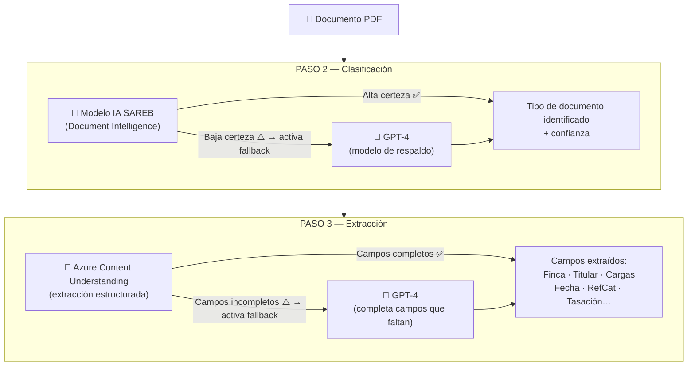

---

## DIAPOSITIVA 5 — El semáforo de confianza *(Bloque 2, paso 7)*

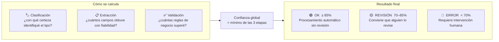

---

## DIAPOSITIVA 6 — Arquitectura funcional (visión de negocio) *(Bloque 3)*

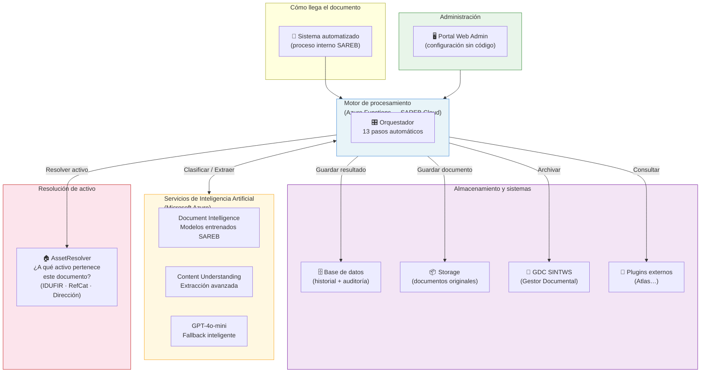

---

## DIAPOSITIVA 6b — ¿Qué es AssetResolver? *(Bloque 3 — detalle)*

> **Uso recomendado:** mostrar esta diapositiva si el público pregunta "¿cómo sabe el sistema a qué activo pertenece el documento?"

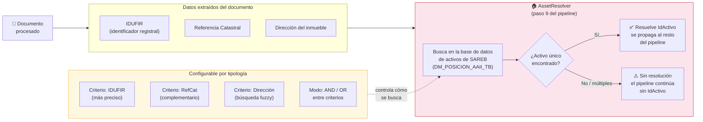

**Qué aporta:** el sistema no solo extrae datos del documento — también los cruza con la cartera de activos de SAREB para saber automáticamente a qué inmueble corresponde, sin que el operador tenga que buscarlo manualmente.

---

## DIAPOSITIVA 7 — Puntos fuertes (resumen visual) *(Bloque 4)*

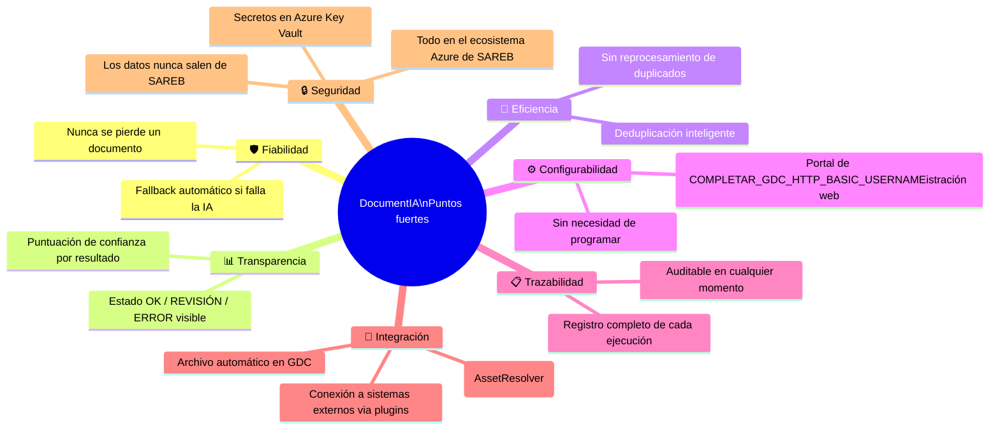

---

## DIAPOSITIVA 8 — Capacidades de expansión *(Bloque 5)*

```mermaid
flowchart LR
    ACTUAL["Sistema actual\n(en producción)"]

    subgraph HOY["Disponible hoy"]
        T1["✅ Notas simples\nregistrales"]
        T2["✅ Motor de validación\n11 tipos de regla"]
        T3["✅ Plugins REST/SOAP\nAtlas · AssetResolver"]
        T4["✅ Portal de\nCOMPLETAR_GDC_HTTP_BASIC_USERNAMEistración web"]
    end

    subgraph PRONTO["En desarrollo"]
        T5["🔧 Reglas cruzadas\nentre campos"]
        T6["🔧 Dashboards operativos\nen tiempo real"]
        T7["🔧 Integración GDC\nretry avanzado"]
    end

    subgraph FUTURO["Planificado"]
        T8["📋 Nuevas tipologías\n(escrituras, contratos…)"]
        T9["📋 Protección GDPR\n(cifrado, enmascaramiento)"]
        T10["📋 Ciclo de vida\nde documentos en Storage"]
    end

    ACTUAL --> HOY
    HOY --> PRONTO
    PRONTO --> FUTURO

    style HOY fill:#d4edda,stroke:#28a745
    style PRONTO fill:#fff3cd,stroke:#f0ad4e
    style FUTURO fill:#e8f4f8,stroke:#4a90d9
```

---

## DIAPOSITIVA 9 — Resumen ejecutivo *(Bloque 6)*

```mermaid
flowchart LR
    subgraph ANTES["❌ Antes"]
        direction TB
        A1["Proceso manual\npor operador"]
        A2["Sin validación\nautomática"]
        A3["Sin trazabilidad"]
        A4["Archivo manual\nen GDC"]
    end

    AHORA["⚡ DocumentIA"]

    subgraph AHORA_LIST["✅ Ahora"]
        direction TB
        B1["Pipeline automático\n13 pasos orquestados"]
        B2["Motor de reglas\nconfigurable"]
        B3["Auditoría completa\npor ejecución"]
        B4["Archivo automático\n+ ObjectID GDC"]
    end

    ANTES -->|"Transformado por"| AHORA
    AHORA --> AHORA_LIST

    style ANTES fill:#fdecea,stroke:#c62828
    style AHORA fill:#fff8e1,stroke:#f9a825
    style AHORA_LIST fill:#d4edda,stroke:#28a745
```

---

---

# Esquema Técnico de Infraestructura

> Destinado al bloque 3 de la presentación o como referencia técnica adjunta.

---

## Infraestructura en producción (Azure SAREB)

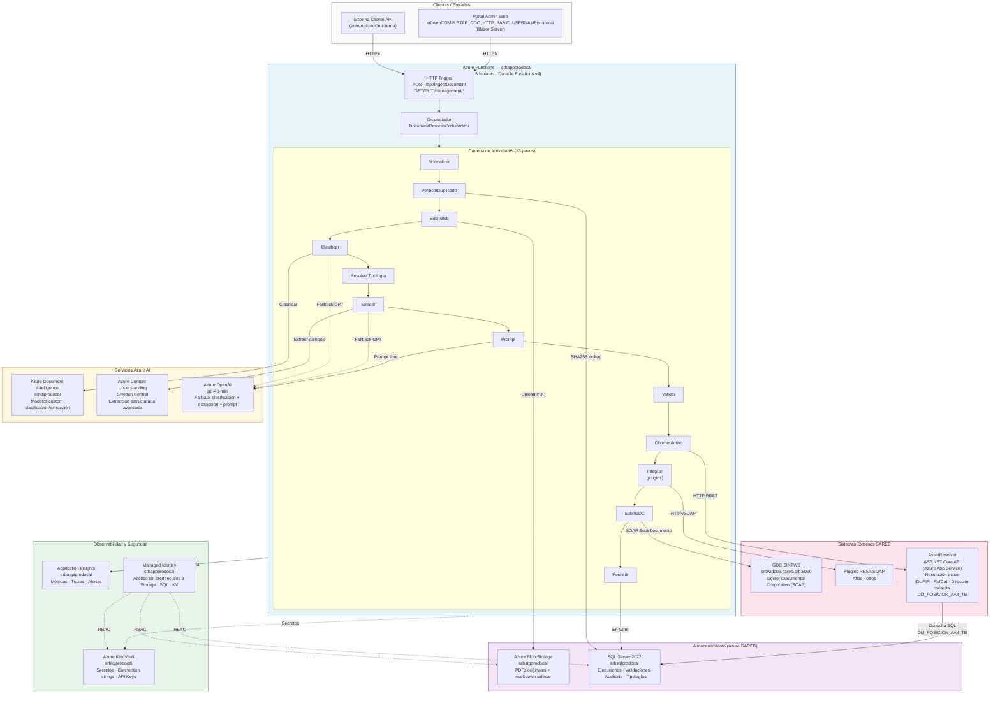

---

## Flujo de seguridad y datos

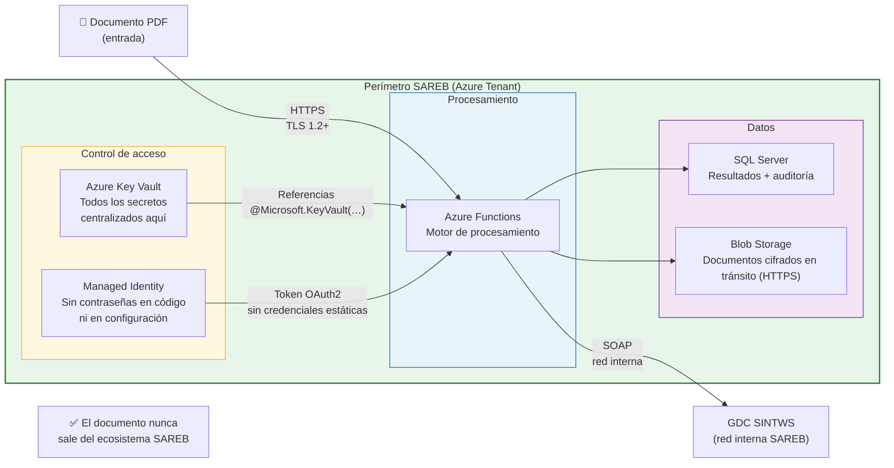

---

## Componentes del sistema (vista de módulos)

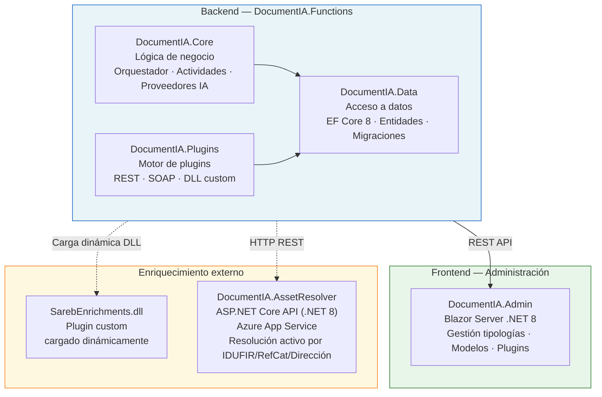

---

## Estado de implementación por componente

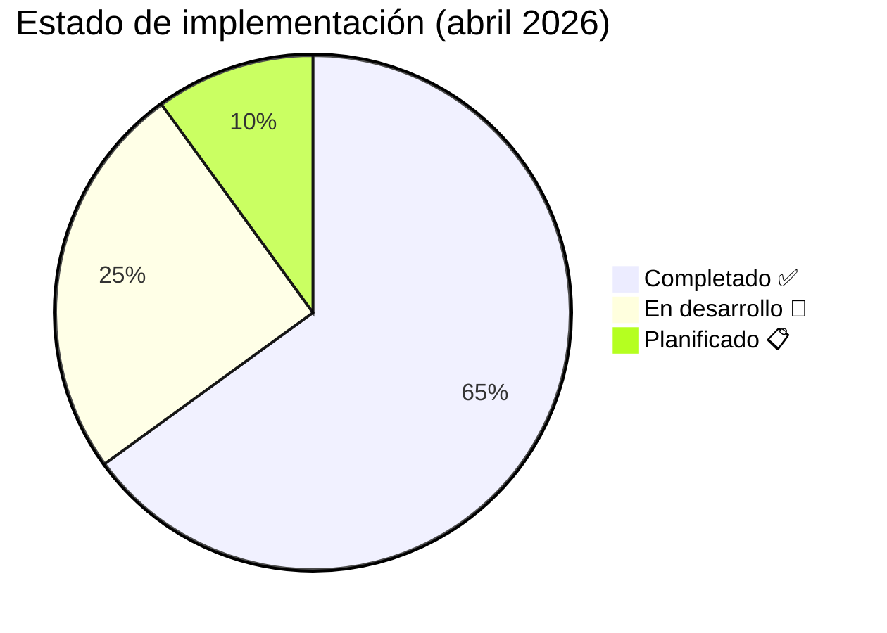

| Componente | Estado |
|---|---|
| Motor de orquestación (13 actividades) | ✅ Completado |
| Clasificación IA + fallback GPT | ✅ Completado |
| Extracción CU + fallback GPT | ✅ Completado |
| Preproceso markdown (layout) | ✅ Completado |
| Persistencia y auditoría (SQL) | ✅ Completado |
| Integración GDC (subir + consultar) | ✅ Completado |
| AssetResolver (IDUFIR · RefCat · Dirección) | ✅ Completado |
| Portal Admin Blazor (CRUD básico) | ✅ Completado |
| CI/CD Azure DevOps + migraciones automáticas | ✅ Completado |
| Infraestructura producción (SQL, KV, MI, Storage) | ✅ Completado |
| Motor de validación (11 tipos de regla) | 🔧 88% — reglas cruzadas pendientes |
| Configuración tipologías (versionado avanzado) | 🔧 80% — import/export pendiente |
| Observabilidad (dashboards App Insights) | 🔧 65% — alertas productivas pendientes |
| GDC retry avanzado + idempotencia | 🔧 80% — Polly pendiente |
| Protección GDPR (cifrado, masking PII) | 📋 Planificado |
| Ciclo de vida Blob (limpieza automática) | 📋 Planificado |

---

---

# Diagrama de Infraestructura Azure — Recursos y Relaciones

> Referencia técnica: todos los recursos Azure en producción, su tipo, y cómo se comunican entre sí.

---

## Mapa completo de recursos Azure (rg-documentia-mvp · West Europe)

```mermaid
flowchart TB
    subgraph SAREB_NET["Red / Ecosistema SAREB"]

        subgraph RG["Resource Group: rg-documentia-mvp  ·  West Europe"]

            subgraph COMPUTE["Cómputo (App Service Plan: srbspprodocai)"]
                FUNCAPP["⚙️ srbappprodocai\nFunction App\n.NET 8 Isolated\nDurable Functions v4\n─────────────────\nOrquestador + 13 Activities\nHTTP Trigger API\nAdmin Management API"]
                ADMINWEB["🖥️ srbwebCOMPLETAR_GDC_HTTP_BASIC_USERNAMEprodocai\nApp Service (Web App)\nBlazor Server .NET 8\n─────────────────\nPortal de COMPLETAR_GDC_HTTP_BASIC_USERNAMEistración\nGestión tipologías · Modelos\nPlugins · Configuración"]
                ASSETWEB["🏠 AssetResolver Web App\nApp Service (.NET 8)\nASP.NET Core API\n─────────────────\nPOST /api/assets/GetAAIIInfo\nBúsqueda IDUFIR · RefCat\nDirección fuzzy\nAuth: X-Api-Key"]
            end

            subgraph STORAGE_GRP["Almacenamiento"]
                STG_DOCS["📦 srbstgprodocai\nStorage Account\n─────────────────\nBlob: PDFs originales\nBlob: markdown sidecar\n(.sha256.md)"]
                STG_JOBS["📦 srbstgproapppdocai\nStorage Account\n─────────────────\nAzureWebJobsStorage\n(estado Durable Functions\norquestación · historial)"]
                SQL["🗄️ srbsqlprodocai\nAzure SQL Server\nDatabase: DocumentIA\n─────────────────\nEjecuciones · Tipologías\nModelos · Validaciones\nAuditoría · Duplicados\n(EF Core 8 · migraciones auto)"]
            end

            subgraph AI_GRP["Inteligencia Artificial"]
                DI["🤖 srbdiprodocai\nDocument Intelligence\nWest Europe\n─────────────────\nModelos custom SAREB\nClasificación · Extracción\nLayout markdown"]
                OPENAI["💬 srboaiprodocai\nAzure OpenAI\nWest Europe\nDeployment: gpt-4o-mini\n─────────────────\nFallback clasificación\nFallback extracción\nPrompt libre"]
                CU["🔬 upe48-mm2avmdm-swedencentral\nAzure AI Foundry\nContent Understanding\nSweden Central\n─────────────────\nExtracción estructurada\navanzada (proveedor\nprincipal extracción)"]
            end

            subgraph OBS_GRP["Observabilidad"]
                APPINS["📊 srbappiprodocai\nApplication Insights\n─────────────────\nMétricas · Trazas\nLogs · Excepciones\nDuración por actividad"]
                LAW["📋 srblawprodocai\nLog Analytics Workspace\n─────────────────\nBackend de AppInsights\nRetención de logs\nKQL queries"]
            end

            subgraph SEC_GRP["Seguridad"]
                KV["🔑 srbkvprodocai\nAzure Key Vault\n─────────────────\nSqlConnectionString\nAPIKeys DI · CU · OpenAI\nGDC credentials\nAssetResolver API Key\nConnection strings Storage"]
                MI["🪪 srbappprodocai\nManaged Identity\n(System Assigned)\n─────────────────\nAcceso sin credenciales\na Storage · SQL · KV"]
            end

        end

        subgraph SAREB_ON["Sistemas On-Premise / Red Interna SAREB"]
            GDC["📁 GDC SINTWS\nsrbwidd03.sareb.srb:8090\nGestor Documental\nCorporativo\n─────────────────\nSubirDocumento (SOAP)\nConsultarDocumento (SOAP)\nObjectID registro"]
            SQL_SAREB["🗄️ BD SAREB\n(DM_POSICION_AAII_TB)\nBase datos activos\ninmobiliarios SAREB\n─────────────────\nIDUFIR · RefCat\nDirección · IdActivo"]
        end

    end

    subgraph CLIENTES["Clientes (dentro de SAREB)"]
        SYS_CLIENTE["📨 Sistema automatizado\n(proceso interno SAREB)"]
        ADMIN_USER["👤 Administrador\n(equipo técnico/negocio)"]
    end

    %% --- Flujos de entrada ---
    SYS_CLIENTE -->|"HTTPS · POST /api/IngestDocument\nGET statusQueryUri (polling)"| FUNCAPP
    ADMIN_USER -->|"HTTPS · navegador"| ADMINWEB
    ADMINWEB -->|"HTTPS · REST API /management/*"| FUNCAPP

    %% --- Function App → Compute ---
    FUNCAPP -->|"HTTPS · POST /api/assets/GetAAIIInfo\nHeader: X-Api-Key"| ASSETWEB

    %% --- Function App → Storage ---
    FUNCAPP -->|"Upload PDF + .md sidecar\n(Blob SDK, MI RBAC)"| STG_DOCS
    FUNCAPP -->|"Estado orquestación\n(AzureWebJobsStorage)"| STG_JOBS
    FUNCAPP -->|"EF Core · leer/escribir\nejecuciones · auditoría"| SQL

    %% --- Function App → AI ---
    FUNCAPP -->|"Clasificar (custom model)\nExtraer Layout markdown\nHTTPS · API Key (KV ref)"| DI
    FUNCAPP -->|"Extraer campos\nHTTPS · API Key (KV ref)"| CU
    FUNCAPP -->|"Fallback clasificación\nFallback extracción\nPrompt libre\nHTTPS · API Key (KV ref)"| OPENAI

    %% --- Function App → Externos ---
    FUNCAPP -->|"SOAP SubirDocumento\nred interna SAREB"| GDC

    %% --- AssetResolver → BD SAREB ---
    ASSETWEB -->|"SQL · lectura DM_POSICION_AAII_TB\n(connection string AssetResolverDb)"| SQL_SAREB

    %% --- Observabilidad ---
    FUNCAPP -->|"Telemetría automática\nSDK AppInsights"| APPINS
    ADMINWEB -->|"Telemetría"| APPINS
    ASSETWEB -->|"Telemetría"| APPINS
    APPINS -->|"Almacena logs"| LAW

    %% --- Seguridad ---
    KV -.->|"@Microsoft.KeyVault(...)\nApp Settings references"| FUNCAPP
    KV -.->|"Secrets"| ADMINWEB
    KV -.->|"Secrets"| ASSETWEB
    MI -.->|"RBAC: Blob Data Contributor"| STG_DOCS
    MI -.->|"RBAC: Blob Owner + Queue + Table"| STG_JOBS
    MI -.->|"RBAC: Key Vault Secrets User"| KV
    MI -.->|"db_datareader / db_datawriter"| SQL

    %% --- Estilos ---
    style COMPUTE fill:#e8f4f8,stroke:#1565c0
    style STORAGE_GRP fill:#f3e5f5,stroke:#6a1b9a
    style AI_GRP fill:#fff8e1,stroke:#f57f17
    style OBS_GRP fill:#e8f5e9,stroke:#2e7d32
    style SEC_GRP fill:#fce4ec,stroke:#c62828
    style SAREB_ON fill:#fafafa,stroke:#757575,stroke-dasharray:5 5
    style CLIENTES fill:#fafafa,stroke:#9e9e9e
    style RG fill:#f9f9f9,stroke:#1565c0,stroke-width:2px
```

---

## Flujo de datos por tipo de comunicación

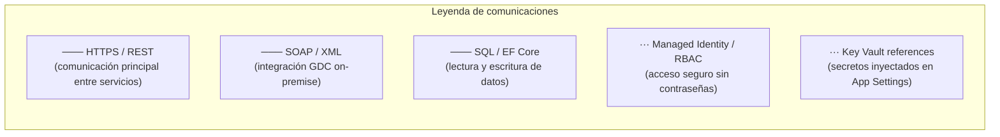

| Conexión | Protocolo | Autenticación |
|---|---|---|
| `srbappprodocai` → `srbdiprodocai` | HTTPS | API Key (en KV) |
| `srbappprodocai` → `srboaiprodocai` | HTTPS | API Key (en KV) |
| `srbappprodocai` → CU Sweden Central | HTTPS | API Key (en KV) |
| `srbappprodocai` → `srbstgprodocai` | Blob SDK | Managed Identity (RBAC) |
| `srbappprodocai` → `srbstgproapppdocai` | Blob/Queue/Table SDK | Managed Identity (RBAC) |
| `srbappprodocai` → `srbsqlprodocai` | SQL / EF Core | Managed Identity (Entra) |
| `srbappprodocai` → `srbkvprodocai` | HTTPS | Managed Identity (RBAC) |
| `srbappprodocai` → AssetResolver Web App | HTTPS | X-Api-Key (en KV) |
| `srbappprodocai` → GDC SINTWS | SOAP sobre HTTP | Usuario/contraseña SAREB |
| AssetResolver Web App → BD SAREB | SQL Server | Connection string (`AssetResolverDb`) |
| `srbwebCOMPLETAR_GDC_HTTP_BASIC_USERNAMEprodocai` → `srbappprodocai` | HTTPS | Function Key |
| Todos los servicios → `srbappiprodocai` | HTTPS | Connection string AppInsights |

---

## Tabla de recursos Azure (referencia rápida)

| Recurso | Tipo | Región | Propósito |
|---|---|---|---|
| `srbappprodocai` | Function App | West Europe | Motor principal: orquestador + 13 actividades + API |
| `srbwebCOMPLETAR_GDC_HTTP_BASIC_USERNAMEprodocai` | App Service (Web App) | West Europe | Portal de COMPLETAR_GDC_HTTP_BASIC_USERNAMEistración (Blazor Server) |
| AssetResolver Web App | App Service (Web App) | West Europe | Plugin resolución de activo (ASP.NET Core API) |
| `srbspprodocai` | App Service Plan | West Europe | Plan de hosting compartido (Function App + Web Apps) |
| `srbstgprodocai` | Storage Account | West Europe | Documentos PDF + markdown sidecar |
| `srbstgproapppdocai` | Storage Account | West Europe | Estado interno Durable Functions |
| `srbsqlprodocai` | Azure SQL Server/DB | West Europe | Base de datos DocumentIA (EF Core) |
| `srbdiprodocai` | Document Intelligence | West Europe | Clasificación y extracción (modelos custom SAREB) |
| `srboaiprodocai` | Azure OpenAI | West Europe | GPT-4o-mini (fallback + prompt) |
| `upe48-mm2avmdm-swedencentral` | Azure AI Foundry / CU | Sweden Central | Content Understanding (extracción primaria) |
| `srbkvprodocai` | Key Vault | West Europe | Secretos, API Keys, connection strings |
| `srbappiprodocai` | Application Insights | West Europe | Métricas, trazas, logs de todos los servicios |
| `srblawprodocai` | Log Analytics Workspace | West Europe | Backend de Application Insights |
| GDC SINTWS (on-premise) | SOAP Service | Red interna SAREB | Gestor Documental Corporativo |
| BD SAREB / `DM_POSICION_AAII_TB` | SQL Server (on-premise) | Red interna SAREB | Tabla maestra de activos inmobiliarios |
