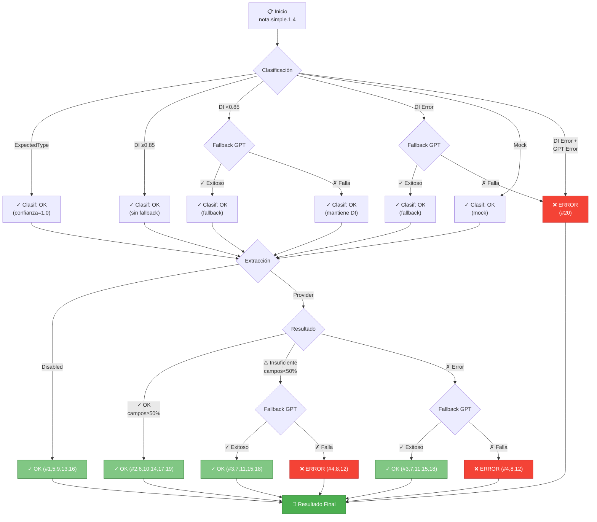

# Causísticas Nota Simple 1.4: Clasificación + Extracción

## **MATRIZ DE 20 CAUSÍSTICAS VÁLIDAS**

| # | Clasificación | Fallback Clasif | Estado Clasif | Extracción | Resultado Extrac | Fallback Extrac | Resultado Final |
|---|---|---|---|---|---|---|---|
| **1** | ExpectedType | N/A | ✓ OK | Disabled | — | — | `OK` |
| **2** | ExpectedType | N/A | ✓ OK | Provider | ✓ OK | NO | `OK` |
| **3** | ExpectedType | N/A | ✓ OK | Provider | ⚠ Insuficiente | YES | `OK` (GPT fallback) |
| **4** | ExpectedType | N/A | ✓ OK | Provider | ✗ Error | YES | `ERROR` |
| **5** | DI ≥0.85 | NO | ✓ OK | Disabled | — | — | `OK` |
| **6** | DI ≥0.85 | NO | ✓ OK | Provider | ✓ OK | NO | `OK` |
| **7** | DI ≥0.85 | NO | ✓ OK | Provider | ⚠ Insuficiente | YES | `OK` (GPT fallback) |
| **8** | DI ≥0.85 | NO | ✓ OK | Provider | ✗ Error | YES | `ERROR` |
| **9** | DI <0.85 | GPT ✓ OK | ✓ OK | Disabled | — | — | `OK` |
| **10** | DI <0.85 | GPT ✓ OK | ✓ OK | Provider | ✓ OK | NO | `OK` |
| **11** | DI <0.85 | GPT ✓ OK | ✓ OK | Provider | ⚠ Insuficiente | YES | `OK` (GPT fallback) |
| **12** | DI <0.85 | GPT ✓ OK | ✓ OK | Provider | ✗ Error | YES | `ERROR` |
| **13** | DI <0.85 | GPT ✗ Fail | ✓ OK(*) | Disabled | — | — | `OK` |
| **14** | DI <0.85 | GPT ✗ Fail | ✓ OK(*) | Provider | ✓ OK | NO | `OK` |
| **15** | DI <0.85 | GPT ✗ Fail | ✓ OK(*) | Provider | ⚠ Insuficiente | YES | `OK` (GPT fallback) |
| **16** | DI error | GPT ✓ OK | ✓ OK | Provider | ✓ OK | NO | `OK` |
| **17** | DI error | GPT ✓ OK | ✓ OK | Provider | ⚠ Insuficiente | YES | `OK` (GPT fallback) |
| **18** | DI error | GPT ✓ OK | ✓ OK | Provider | ✗ Error | YES | `ERROR` |
| **19** | Mock | N/A | ✓ OK | Provider | ✓ OK | NO | `OK` |
| **20** | DI error | GPT ✗ Fail | ✗ FAIL | — | — | — | **`ERROR`** |

---

## **Diagrama de Flujo**

---

## **Leyenda**

- **Clasificación:** ExpectedType, Azure DI, o Mock
- **Fallback Clasif:** Si confianza baja o DI falla, intenta GPT
- **Extracción:** Disabled o cualquier Provider (CU, DI, Mock, etc.)
- **Resultado Extrac:** 
  - ✓ OK = suficientes campos extraídos (ratio ≥ 0.5)
  - ⚠ Insuficiente = ratio campos < 0.5 → activa fallback GPT
  - ✗ Error = excepción en provider
- **Fallback Extrac:** Intenta GPT a través de ExtraerActivity
- **Resultado Final:** Estado del orquestador tras clasificación y extracción

---

## **Resumen de Resultados**

- **OK:** 16 causísticas (#1, #2, #3, #5, #6, #7, #9, #10, #11, #13, #14, #15, #16, #17, #19)
- **ERROR:** 4 causísticas (#4, #8, #12, #18, #20)

---

## **Causística por Referencia**

### Causística #1
- **Clasificación:** ExpectedType
- **Extracción:** Disabled
- **Descripción:** Clasificación omitida (confianza=1.0), extracción deshabilitada
- **Resultado:** OK

### Causística #2
- **Clasificación:** ExpectedType
- **Extracción:** Provider (extrae ≥50% campos)
- **Descripción:** Clasificación omitida, extracción exitosa sin fallback
- **Resultado:** OK

### Causística #3
- **Clasificación:** ExpectedType
- **Extracción:** Provider (extrae <50% campos)
- **Descripción:** Clasificación omitida, extracción insuficiente, Fallback GPT exitoso
- **Resultado:** OK (con fallback)

### Causística #4
- **Clasificación:** ExpectedType
- **Extracción:** Provider (error)
- **Descripción:** Clasificación omitida, extracción con error, Fallback GPT falla
- **Resultado:** ERROR

### Causística #5
- **Clasificación:** DI ≥0.85
- **Extracción:** Disabled
- **Descripción:** Clasificación exitosa sin fallback, extracción deshabilitada
- **Resultado:** OK

### Causística #6
- **Clasificación:** DI ≥0.85
- **Extracción:** Provider (extrae ≥50% campos)
- **Descripción:** Clasificación exitosa, extracción exitosa
- **Resultado:** OK

### Causística #7
- **Clasificación:** DI ≥0.85
- **Extracción:** Provider (extrae <50% campos)
- **Descripción:** Clasificación exitosa, extracción insuficiente, Fallback GPT exitoso
- **Resultado:** OK (con fallback)

### Causística #8
- **Clasificación:** DI ≥0.85
- **Extracción:** Provider (error)
- **Descripción:** Clasificación exitosa, extracción con error, Fallback GPT falla
- **Resultado:** ERROR

### Causística #9
- **Clasificación:** DI <0.85 → Fallback GPT ✓
- **Extracción:** Disabled
- **Descripción:** Clasificación con fallback exitoso, extracción deshabilitada
- **Resultado:** OK

### Causística #10
- **Clasificación:** DI <0.85 → Fallback GPT ✓
- **Extracción:** Provider (extrae ≥50% campos)
- **Descripción:** Clasificación con fallback exitoso, extracción exitosa
- **Resultado:** OK

### Causística #11
- **Clasificación:** DI <0.85 → Fallback GPT ✓
- **Extracción:** Provider (extrae <50% campos)
- **Descripción:** Clasificación con fallback exitoso, extracción insuficiente, Fallback GPT exitoso
- **Resultado:** OK (con fallback)

### Causística #12
- **Clasificación:** DI <0.85 → Fallback GPT ✓
- **Extracción:** Provider (error)
- **Descripción:** Clasificación con fallback exitoso, extracción con error, Fallback GPT falla
- **Resultado:** ERROR

### Causística #13
- **Clasificación:** DI <0.85 → Fallback GPT ✗
- **Extracción:** Disabled
- **Descripción:** Clasificación con fallback fallido (mantiene DI), extracción deshabilitada
- **Resultado:** OK (DI mantiene confianza aunque fallback intentado)

### Causística #14
- **Clasificación:** DI <0.85 → Fallback GPT ✗
- **Extracción:** Provider (extrae ≥50% campos)
- **Descripción:** Clasificación con fallback fallido (mantiene DI), extracción exitosa
- **Resultado:** OK

### Causística #15
- **Clasificación:** DI <0.85 → Fallback GPT ✗
- **Extracción:** Provider (extrae <50% campos)
- **Descripción:** Clasificación con fallback fallido (mantiene DI), extracción insuficiente, Fallback GPT exitoso
- **Resultado:** OK (con fallback extracción)

### Causística #16
- **Clasificación:** DI error → Fallback GPT ✓
- **Extracción:** Provider (extrae ≥50% campos)
- **Descripción:** Clasificación con fallback exitoso tras error DI, extracción exitosa
- **Resultado:** OK

### Causística #17
- **Clasificación:** DI error → Fallback GPT ✓
- **Extracción:** Provider (extrae <50% campos)
- **Descripción:** Clasificación con fallback exitoso tras error DI, extracción insuficiente, Fallback GPT exitoso
- **Resultado:** OK (con fallback)

### Causística #18
- **Clasificación:** DI error → Fallback GPT ✓
- **Extracción:** Provider (error)
- **Descripción:** Clasificación con fallback exitoso tras error DI, extracción con error, Fallback GPT falla
- **Resultado:** ERROR

### Causística #19
- **Clasificación:** Mock
- **Extracción:** Provider (extrae ≥50% campos)
- **Descripción:** Clasificación mock, extracción exitosa
- **Resultado:** OK

### Causística #20
- **Clasificación:** DI error → Fallback GPT ✗
- **Extracción:** —
- **Descripción:** Clasificación falla completamente (DI error + Fallback GPT error). Orquestador no llega a extracción
- **Resultado:** ERROR
