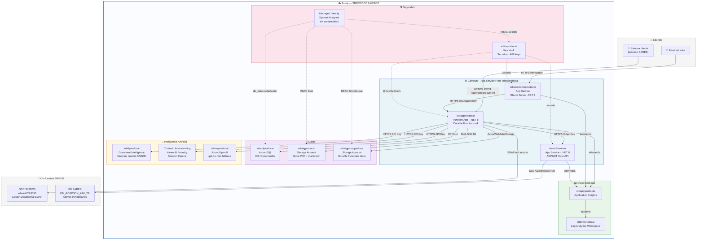

# DocumentIA — Infraestructura Azure
> Resource Group: **SRBRGDOCSAIPROD** · West Europe | Abril 2026

---

---

## Comunicaciones

| Origen | Destino | Protocolo | Autenticación |
|---|---|---|---|
| Sistema cliente | `srbappprodocai` | HTTPS | Function Key |
| `srbappprodocai` | `srbdiprodocai` | HTTPS | API Key (KV) |
| `srbappprodocai` | Content Understanding | HTTPS | API Key (KV) |
| `srbappprodocai` | `srboaiprodocai` | HTTPS | API Key (KV) |
| `srbappprodocai` | `srbstgprodocai` | Blob SDK | Managed Identity |
| `srbappprodocai` | `srbstgproapppdocai` | Blob/Queue/Table SDK | Managed Identity |
| `srbappprodocai` | `srbsqlprodocai` | EF Core / SQL | Managed Identity |
| `srbappprodocai` | `srbkvprodocai` | HTTPS | Managed Identity |
| `srbappprodocai` | AssetResolver | HTTPS | X-Api-Key (KV) |
| `srbappprodocai` | GDC SINTWS | SOAP/HTTP | Usuario/pwd SAREB |
| AssetResolver | BD SAREB | SQL Server | Connection string |
| `srbwebAdminprodocai` | `srbappprodocai` | HTTPS | Function Key |

---

## Recursos (referencia rápida)

| Recurso | Tipo | Región |
|---|---|---|
| `srbappprodocai` | Function App (.NET 8 Isolated) | West Europe |
| `srbwebAdminprodocai` | App Service — Blazor Server | West Europe |
| AssetResolver Web App | App Service — ASP.NET Core API | West Europe |
| `srbspprodocai` | App Service Plan | West Europe |
| `srbstgprodocai` | Storage Account (PDFs + sidecars) | West Europe |
| `srbstgproapppdocai` | Storage Account (Durable state) | West Europe |
| `srbsqlprodocai` | Azure SQL Server / DB DocumentIA | West Europe |
| `srbdiprodocai` | Document Intelligence | West Europe |
| `srboaiprodocai` | Azure OpenAI — gpt-4o-mini | West Europe |
| `upe48-mm2avmdm-swedencentral` | Azure AI Foundry / Content Understanding | Sweden Central |
| `srbkvprodocai` | Key Vault | West Europe |
| `srbappiprodocai` | Application Insights | West Europe |
| `srblawprodocai` | Log Analytics Workspace | West Europe |
| GDC SINTWS | SOAP Service (on-premise) | Red interna SAREB |
| BD `DM_POSICION_AAII_TB` | SQL Server (on-premise) | Red interna SAREB |

