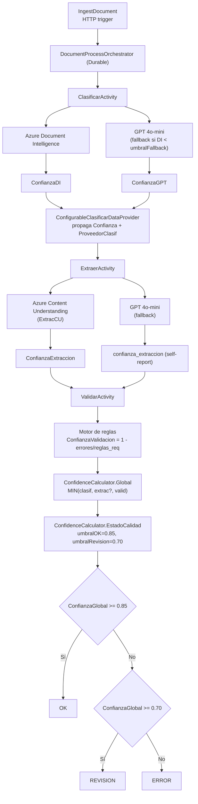

### Diagrama: Umbral de confianza

Pega este bloque en el preview de Markdown con soporte Mermaid o abre `confianza_umbral.mmd` en un visor de Mermaid.

```mermaid
flowchart TD
    A["IngestDocument<br/>HTTP trigger"] --> B["DocumentProcessOrchestrator (Durable)"]
    B --> C["ClasificarActivity"]
    C --> D1["Azure Document Intelligence"]
    C --> D2["GPT 4o-mini<br/>(fallback si DI &lt; umbralFallback)"]
    D1 --> E1["ConfianzaDI"]
    D2 --> E2["ConfianzaGPT"]
    E1 --> F["ConfigurableClasificarDataProvider<br/>propaga Confianza + ProveedorClasif"]
    E2 --> F
    F --> G["ExtraerActivity"]
    G --> H1["Azure Content Understanding<br/>(ExtracCU)"]
    G --> H2["GPT 4o-mini<br/>(fallback)"]
    H1 --> I1["ConfianzaExtraccion"]
    H2 --> I2["confianza_extraccion (self-report)"]
    I1 --> J["ValidarActivity"]
    I2 --> J
    J --> K["Motor de reglas<br/>ConfianzaValidacion = 1 - errores/reglas_req"]
    K --> L["ConfidenceCalculator.Global<br/>MIN(clasif, extrac?, valid)"]
    L --> M["ConfidenceCalculator.EstadoCalidad<br/>umbralOK=0.85, umbralRevision=0.70"]
    M --> N{ConfianzaGlobal &gt;= 0.85}
    N -->|Sí| O[OK]
    N -->|No| P{ConfianzaGlobal &gt;= 0.70}
    P -->|Sí| Q[REVISION]
    P -->|No| R[ERROR]
```
