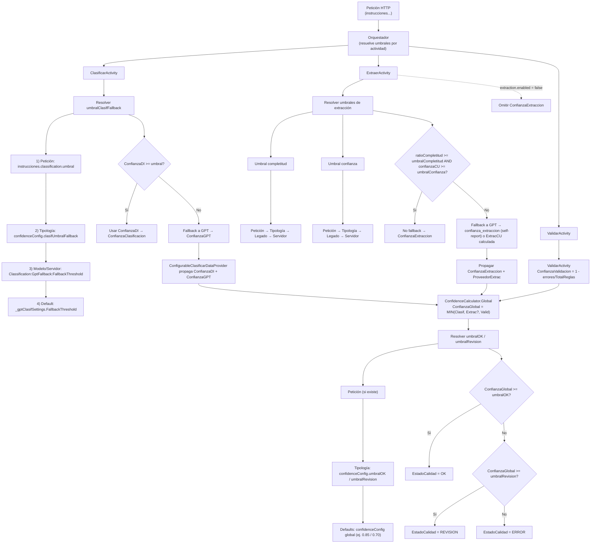

# Prioridad de umbrales — Orquestación por actividad

Abre el fichero `umbrales_prioridad.mmd` con un visor Mermaid o pega el siguiente bloque en un Markdown con preview Mermaid.

Notas rápidas:
- La jerarquía por criterio es: **Petición → Tipología → Modelo/Servidor → Default**.
- En extracción hay dos criterios independientes (completitud y confianza) y **si cualquiera falla** se activa el fallback LLM.
- `confidenceConfig` por tipología puede sobrescribir umbrales y pesos (ver `*.validation.json`).

¿Quieres que genere también un SVG/PNG del diagrama y lo añada al repositorio?