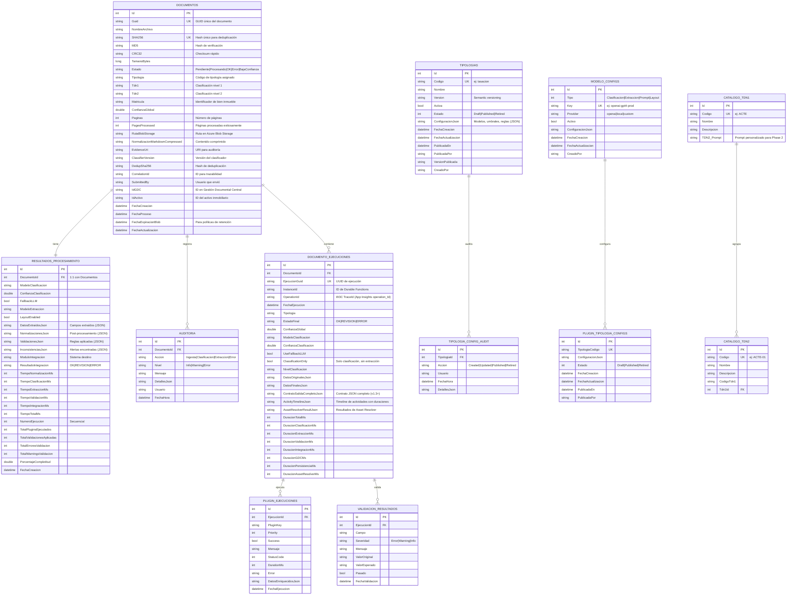

# Data Models & ER Diagram — DocumentIA

## 1. Introducción

La base de datos DocumentIA está diseñada para un sistema de **clasificación inteligente de documentos** que:

- **Ingesta**: Recibe documentos PDF, extrae contenido, calcula checksums (SHA256, MD5, CRC32)
- **Clasificación**: Asigna tipologías (TDN1/TDN2), confianza global, y categorización
- **Extracción**: Recupera campos específicos usando modelos de Document Intelligence (DI)
- **Validación**: Aplica reglas de negocio, corrige inconsistencias, reporta errores/warnings
- **Integración**: Envía resultados a sistemas externos (GDC, Asset Resolver)
- **Auditoría**: Registra todas las operaciones con trazabilidad completa

**Normalización**: 3NF con soporte para JSON configuracional y versionado

**ORM**: Entity Framework Core 8 (.NET 8/9)

**Estrategia de Identidad**: Identity (1,1) en SQL Server

---

## 2. ER Diagram (Mermaid)



---

## 3. Descripción de Tablas

### 3.1 **Documentos** (Documentos)

**Propósito**: Registro central de todos los documentos procesados en el sistema.

**PK**: `Id`  
**Índices**:
- `IX_Documentos_SHA256` (UNIQUE) - Deduplicación
- `IX_Documentos_CorrelationId` - Trazabilidad
- `IX_Documentos_Estado` - Filtros de estado
- `IX_Documentos_FechaExpiracionBlob` - Políticas de retención
- `IX_Documentos_FechaExpiracionBlob_RutaBlobStorage` - Limpieza de blobs

| Campo | Tipo | Restricciones | Descripción |
|-------|------|---------------|-------------|
| **Id** | INT | PK, Identity(1,1) | Identificador único |
| **Guid** | NVARCHAR(100) | NOT NULL, UK | UUID del documento en sistema origen |
| **NombreArchivo** | NVARCHAR(500) | NOT NULL | Nombre original del PDF |
| **SHA256** | NVARCHAR(64) | NOT NULL, UK | Hash para deduplicación |
| **MD5** | NVARCHAR(32) | NOT NULL | Hash de verificación rápida |
| **CRC32** | NVARCHAR(8) | NOT NULL | Checksum |
| **TamanoBytes** | BIGINT | NOT NULL | Tamaño en bytes |
| **Tipologia** | NVARCHAR(100) | NULL | Código tipología asignada |
| **Tdn1** | NVARCHAR(50) | NULL | Clasificación jerárquica nivel 1 |
| **Tdn2** | NVARCHAR(100) | NULL | Clasificación jerárquica nivel 2 |
| **Matricula** | NVARCHAR(50) | NULL | Identificador de bien inmueble (SAREB) |
| **Estado** | NVARCHAR(500) | NOT NULL | Estado actual (máx. 500 para errores complejos) |
| **ConfianzaGlobal** | FLOAT | NULL | Confianza agregada (0.0-1.0) |
| **Paginas** | INT | NOT NULL | Número total de páginas |
| **PagesProcessed** | INT | NOT NULL DEFAULT 0 | Páginas procesadas exitosamente |
| **RutaBlobStorage** | NVARCHAR(500) | NULL | URL en Azure Blob Storage |
| **NormalizacionMarkdownCompressed** | NVARCHAR(MAX) | NULL | Contenido extracto comprimido |
| **EvidenceUri** | NVARCHAR(500) | NULL | URI para auditoría externa |
| **ClassifierVersion** | NVARCHAR(50) | NULL | Versión del modelo de clasificación |
| **DedupSha256** | NVARCHAR(64) | NULL | Hash deduplicado (si aplica) |
| **CorrelationId** | NVARCHAR(100) | NOT NULL | ID de trazabilidad (W3C TraceId) |
| **SubmittedBy** | NVARCHAR(200) | NULL | Usuario que envió el documento |
| **IdGDC** | NVARCHAR(100) | NULL | ID en Gestión Documental Central |
| **IdActivo** | NVARCHAR(100) | NULL | ID del activo inmobiliario |
| **FechaCreacion** | DATETIME2 | NOT NULL | Timestamp de creación (UTC) |
| **FechaProceso** | DATETIME2 | NULL | Timestamp de procesamiento |
| **FechaExpiracionBlob** | DATETIME2 | NULL | Fecha de eliminación programada |
| **FechaActualizacion** | DATETIME2 | NULL | Última actualización |

**Navegación**: 
- → `ResultadosProcesamiento` (1:1)
- → `Auditoria` (1:N)
- → `DocumentoEjecuciones` (1:N)

**Ejemplo de datos**:
```json
{
  "Id": 101,
  "Guid": "d8f4c923-1b2a-49e7-a8c1-2d3e4f5a6b7c",
  "NombreArchivo": "tasacion_2026_01.pdf",
  "SHA256": "a1b2c3d4e5f6...",
  "Estado": "OK",
  "Tipologia": "tasacion",
  "Tdn1": "CERT",
  "Tdn2": "CERT-03",
  "ConfianzaGlobal": 0.92,
  "Paginas": 15,
  "CorrelationId": "550e8400-e29b-41d4-a716-446655440000",
  "FechaCreacion": "2026-06-10T14:23:45Z"
}
```

---

### 3.2 **ResultadosProcesamiento** (Resultados de Procesamiento)

**Propósito**: Almacena todos los resultados de extracción, validación e integración para cada documento.

**PK**: `Id`  
**FK**: `DocumentoId` → Documentos (1:1, Cascade Delete)  
**Índice**: `IX_ResultadosProcesamiento_DocumentoId` (UNIQUE)

| Campo | Tipo | Descripción |
|-------|------|-------------|
| **Id** | INT | PK |
| **DocumentoId** | INT | FK a Documentos |
| **ModeloClasificacion** | NVARCHAR(200) | Modelo usado (ej: gpt-4o-2024-08-06) |
| **ConfianzaClasificacion** | FLOAT | Confianza de tipología (0.0-1.0) |
| **FallbackLLM** | BIT | Si usó LLM como fallback |
| **ModeloExtraccion** | NVARCHAR(200) | Modelo Document Intelligence |
| **LayoutEnabled** | BIT | Si se usó análisis de layout |
| **DatosExtraidosJson** | NVARCHAR(MAX) | Campos extraídos (JSON) |
| **NormalizacionesJson** | NVARCHAR(MAX) | Transformaciones aplicadas (JSON) |
| **ValidacionesJson** | NVARCHAR(MAX) | Reglas de negocio aplicadas (JSON) |
| **InconsistenciasJson** | NVARCHAR(MAX) | Alertas y discrepancias (JSON) |
| **ModuloIntegracion** | NVARCHAR(200) | Sistema destino (GDC, Asset Resolver) |
| **ResultadoIntegracion** | NVARCHAR(50) | OK, REVISION, ERROR |
| **TiempoNormalizacionMs** | INT | Duración post-procesamiento |
| **TiempoClasificacionMs** | INT | Duración clasificación |
| **TiempoExtraccionMs** | INT | Duración extracción |
| **TiempoValidacionMs** | INT | Duración validación |
| **TiempoIntegracionMs** | INT | Duración integración |
| **TiempoTotalMs** | INT | Duración total end-to-end |
| **NumeroEjecucion** | INT | Número secuencial de intentos |
| **TotalPluginsEjecutados** | INT | Cantidad de plugins ejecutados |
| **TotalValidacionesAplicadas** | INT | Cantidad de reglas aplicadas |
| **TotalErroresValidacion** | INT | Cantidad de errores encontrados |
| **TotalWarningsValidacion** | INT | Cantidad de warnings |
| **PorcentajeCompletitud** | FLOAT | % de campos extraídos exitosamente |
| **FechaCreacion** | DATETIME2 | UTC |

**Ejemplo de JSON**:
```json
{
  "DatosExtraidosJson": {
    "Direccion": "Calle Principal 123, Madrid",
    "ValorCatastral": 450000,
    "Superficie": 125.5,
    "AnyoConstitucion": 1985
  },
  "NormalizacionesJson": {
    "Direccion": "normalizado a formato SAREB",
    "ValorCatastral": "convertido a EUR"
  },
  "ValidacionesJson": {
    "SuperficieRazonable": "PASS (100-200 m²)",
    "ValorCatastralVsAvaluo": "WARNING (diferencia >15%)"
  }
}
```

---

### 3.3 **Tipologias** (Tipologías de Documentos)

**Propósito**: Catálogo dinámico de tipologías, modelos y configuraciones.

**PK**: `Id`  
**Índices**:
- `IX_Tipologias_Codigo` (UNIQUE)

| Campo | Tipo | Descripción |
|-------|------|-------------|
| **Id** | INT | PK |
| **Codigo** | NVARCHAR(100) | Código único (ej: tasacion) |
| **Nombre** | NVARCHAR(200) | Nombre legible (ej: Tasación) |
| **Version** | NVARCHAR(50) | Semantic versioning (ej: 1.2.3) |
| **Activa** | BIT | Si está en uso |
| **Estado** | INT | Draft (0), Published (1), Retired (2) |
| **ConfiguracionJson** | NVARCHAR(MAX) | Configuración jerárquica (JSON) |
| **FechaCreacion** | DATETIME2 | Timestamp |
| **FechaActualizacion** | DATETIME2 | Última edición |
| **PublicadaEn** | DATETIME2 | Cuándo fue publicada |
| **PublicadaPor** | NVARCHAR(200) | Quién la publicó |
| **VersionPublicada** | NVARCHAR(50) | Versión publicada en producción |
| **CreadoPor** | NVARCHAR(200) | Creador original |

**Estructura de ConfiguracionJson** (v1.5+):
```json
{
  "classification": {
    "tdn1": "CERT",
    "tdn2": "CERT-03",
    "gptDescripcion": "Certificado de tipo X...",
    "enableRules": true
  },
  "extraction": {
    "modelKey": "openai-gpt4o-prod",
    "fields": [
      {"name": "direccion", "required": true, "type": "string"},
      {"name": "valoCatastral", "required": false, "type": "number"}
    ]
  },
  "confidenceConfig": {
    "clasifUmbralFallback": 0.75,
    "extracUmbralFallback": 0.80
  },
  "gdc": {
    "skipUpload": false,
    "matricula": "01234567",
    "tipoDocumento": "CERT",
    "subtipoDocumento": "CERT-03"
  },
  "promptConfig": {
    "enabled": true,
    "modelKey": "gpt4o-mini",
    "systemPrompt": "...",
    "temperature": 0.0,
    "contentMode": "markdown"
  }
}
```

---

### 3.4 **DocumentoEjecuciones** (Historial de Ejecuciones)

**Propósito**: Registra cada ejecución del pipeline con orquestación, duraciones por actividad, y estado detallado.

**PK**: `Id`  
**FK**: `DocumentoId` → Documentos (Cascade Delete)  
**Índices**:
- `IX_DocumentoEjecuciones_EjecucionGuid` (UNIQUE) - Deduplicación
- `IX_DocumentoEjecuciones_FechaEjecucion` - Auditoría temporal

| Campo | Tipo | Descripción |
|-------|------|-------------|
| **Id** | INT | PK |
| **DocumentoId** | INT | FK a Documentos |
| **EjecucionGuid** | NVARCHAR(36) | UUID único para deduplicación |
| **InstanceId** | NVARCHAR(200) | ID de Durable Functions (Azure) |
| **OperationId** | NVARCHAR(100) | W3C TraceId para App Insights |
| **FechaEjecucion** | DATETIME2 | Timestamp de inicio |
| **Tipologia** | NVARCHAR(100) | Tipología procesada |
| **EstadoFinal** | NVARCHAR(50) | OK, REVISION, ERROR |
| **ConfianzaGlobal** | FLOAT | Confianza agregada final |
| **ModeloClasificacion** | NVARCHAR(200) | Modelo usado |
| **ConfianzaClasificacion** | FLOAT | Confianza de clasificación |
| **UseFallbackLLM** | BIT | Si se activó fallback |
| **ClassificationOnly** | BIT | Solo clasificación (sin extracción) |
| **NivelClasificacion** | NVARCHAR(20) | Level (ej: "Full") |
| **DatosOriginalesJson** | NVARCHAR(MAX) | Estado inicial (para comparativa) |
| **DatosFinalesJson** | NVARCHAR(MAX) | Estado final |
| **ContratoSalidaCompletoJson** | NVARCHAR(MAX) | Contrato de salida completo (v1.3+) |
| **ActivityTimelineJson** | NVARCHAR(MAX) | Timeline de actividades con duraciones |
| **AssetResolverResultJson** | NVARCHAR(MAX) | Resultado de Asset Resolver |
| **DuracionTotalMs** | INT | Duración total end-to-end |
| **DuracionClasificacionMs** | INT | Clasificación |
| **DuracionExtraccionMs** | INT | Extracción |
| **DuracionValidacionMs** | INT | Validación |
| **DuracionIntegracionMs** | INT | Integración |
| **DuracionGDCMs** | INT | Envío a GDC |
| **DuracionPersistenciaMs** | INT | Persistencia en BD |
| **DuracionAssetResolverMs** | INT | Asset Resolver |

**Navegación**:
- → `PluginEjecuciones` (1:N)
- → `ValidacionResultados` (1:N)

**Ejemplo de ActivityTimelineJson**:
```json
{
  "actividades": [
    {
      "nombre": "Clasificacion",
      "inicio": "2026-06-10T14:23:45.123Z",
      "fin": "2026-06-10T14:23:47.456Z",
      "duracionMs": 2333,
      "estado": "OK"
    },
    {
      "nombre": "Extraccion",
      "inicio": "2026-06-10T14:23:47.456Z",
      "fin": "2026-06-10T14:23:50.789Z",
      "duracionMs": 3333,
      "estado": "OK"
    },
    {
      "nombre": "Validacion",
      "inicio": "2026-06-10T14:23:50.789Z",
      "fin": "2026-06-10T14:23:51.123Z",
      "duracionMs": 334,
      "estado": "WARNING"
    }
  ]
}
```

---

### 3.5 **PluginEjecuciones** (Ejecución de Plugins)

**Propósito**: Registra la ejecución de cada plugin/enriquecimiento durante el procesamiento.

**PK**: `Id`  
**FK**: `EjecucionId` → DocumentoEjecuciones (Cascade Delete)  
**Índice**: `IX_PluginEjecuciones_EjecucionId_PluginKey` (Composite)

| Campo | Tipo | Descripción |
|-------|------|-------------|
| **Id** | INT | PK |
| **EjecucionId** | INT | FK a DocumentoEjecuciones |
| **PluginKey** | NVARCHAR(100) | Identificador del plugin |
| **Priority** | INT | Orden de ejecución |
| **Success** | BIT | Si ejecutó exitosamente |
| **Mensaje** | NVARCHAR(500) | Mensaje de resultado |
| **StatusCode** | INT | HTTP Status (ej: 200) |
| **DurationMs** | INT | Duración en ms |
| **Error** | NVARCHAR(MAX) | Stack trace si falla |
| **DatosEnriquecidosJson** | NVARCHAR(MAX) | Datos agregados por plugin |
| **FechaEjecucion** | DATETIME2 | Timestamp |

---

### 3.6 **ValidacionResultados** (Resultados de Validación)

**Propósito**: Detalla cada regla de validación aplicada y su resultado.

**PK**: `Id`  
**FK**: `EjecucionId` → DocumentoEjecuciones (Cascade Delete)  
**Índice**: `IX_ValidacionResultados_EjecucionId_Campo` (Composite)

| Campo | Tipo | Descripción |
|-------|------|-------------|
| **Id** | INT | PK |
| **EjecucionId** | INT | FK a DocumentoEjecuciones |
| **Campo** | NVARCHAR(200) | Nombre del campo validado |
| **Severidad** | NVARCHAR(50) | Error, Warning, Info |
| **Mensaje** | NVARCHAR(MAX) | Descripción de la regla |
| **ValorOriginal** | NVARCHAR(500) | Valor antes |
| **ValorEsperado** | NVARCHAR(500) | Valor correcto |
| **Pasado** | BIT | Si pasó la validación |
| **FechaValidacion** | DATETIME2 | Timestamp |

---

### 3.7 **Auditoria** (Audit Trail)

**Propósito**: Registro completo de todas las operaciones sobre un documento.

**PK**: `Id`  
**FK**: `DocumentoId` → Documentos (Cascade Delete)  
**Índice**: `IX_Auditoria_DocumentoId`

| Campo | Tipo | Descripción |
|-------|------|-------------|
| **Id** | INT | PK |
| **DocumentoId** | INT | FK a Documentos |
| **Accion** | NVARCHAR(100) | Ingesta, Clasificacion, Extraccion, Error |
| **Nivel** | NVARCHAR(50) | Info, Warning, Error |
| **Mensaje** | NVARCHAR(MAX) | Descripción |
| **DetallesJson** | NVARCHAR(MAX) | Contexto (JSON) |
| **Usuario** | NVARCHAR(200) | Quién ejecutó |
| **FechaHora** | DATETIME2 | Timestamp (UTC) |

---

### 3.8 **ModeloConfigs** (Configuración de Modelos)

**Propósito**: Registro central de todos los modelos de IA disponibles (clasificación, extracción, prompts).

**PK**: `Id`  
**Índice**: `IX_ModeloConfigs_Key` (UNIQUE)

| Campo | Tipo | Descripción |
|-------|------|-------------|
| **Id** | INT | PK |
| **Tipo** | INT | 0=Clasificacion, 1=Extraccion, 2=Prompt, 3=Layout |
| **Key** | NVARCHAR(200) | Identificador único (ej: openai-gpt4o-prod) |
| **Provider** | NVARCHAR(100) | openai, azure, local, custom |
| **Activo** | BIT | Si está habilitado |
| **ConfiguracionJson** | NVARCHAR(MAX) | Parámetros específicos (JSON) |
| **FechaCreacion** | DATETIME2 | Timestamp |
| **FechaActualizacion** | DATETIME2 | Última edición |
| **CreadoPor** | NVARCHAR(200) | Usuario |

---

### 3.9 **PluginTipologiaConfigs** (Configuración Plugins por Tipología)

**Propósito**: Mapeo dinámico de plugins a tipologías con configuración específica.

**PK**: `Id`  
**Índice**: `IX_PluginTipologiaConfigs_TipologiaCodigo` (UNIQUE)

| Campo | Tipo | Descripción |
|-------|------|-------------|
| **Id** | INT | PK |
| **TipologiaCodigo** | NVARCHAR(100) | Código de tipología |
| **ConfiguracionJson** | NVARCHAR(MAX) | Configuración de plugins (JSON) |
| **Estado** | INT | Draft (0), Published (1), Retired (2) |
| **FechaCreacion** | DATETIME2 | Timestamp |
| **FechaActualizacion** | DATETIME2 | Última edición |
| **PublicadaEn** | DATETIME2 | Cuándo fue publicada |
| **PublicadaPor** | NVARCHAR(200) | Quién la publicó |

---

### 3.10 **TipologiaConfigAudit** (Auditoría de Configuraciones)

**Propósito**: Registra cambios en configuraciones de tipologías.

**PK**: `Id`  
**Índices**:
- `IX_TipologiaConfigAudit_TipologiaId`
- `IX_TipologiaConfigAudit_FechaHora`

| Campo | Tipo | Descripción |
|-------|------|-------------|
| **Id** | INT | PK |
| **TipologiaId** | INT | ID de tipología modificada |
| **Accion** | NVARCHAR(100) | Created, Updated, Published, Retired |
| **Usuario** | NVARCHAR(200) | Quién hizo el cambio |
| **FechaHora** | DATETIME2 | Timestamp (UTC) |
| **DetallesJson** | NVARCHAR(MAX) | Cambios realizados (JSON diff) |

---

### 3.11 **CatalogoTdn1** (Catálogo TDN Nivel 1)

**Propósito**: Clasificación jerárquica nivel 1 (familias de documentos SAREB).

**PK**: `Id`  
**Índice**: `IX_CatalogoTdn1_Codigo` (UNIQUE)

| Campo | Tipo | Descripción |
|-------|------|-------------|
| **Id** | INT | PK |
| **Codigo** | NVARCHAR(10) | Código único (ej: ACTE, ACTR, CERT) |
| **Nombre** | NVARCHAR(200) | Nombre legible (ej: Actas de expropiación) |
| **Descripcion** | NVARCHAR(2000) | Descripción detallada |
| **TDN2_Prompt** | NVARCHAR(MAX) | Prompt personalizado para Phase 2 |

**Ejemplo**:
```
Id: 13
Codigo: CERT
Nombre: Certificados técnicos
Descripcion: "Documentos que acreditan y aseguran la veracidad de un hecho..."
TDN2_Prompt: NULL (usa prompt dinámico)
```

---

### 3.12 **CatalogoTdn2** (Catálogo TDN Nivel 2)

**Propósito**: Clasificación jerárquica nivel 2 (tipos específicos dentro de TDN1).

**PK**: `Id`  
**FK**: `Tdn1Id` → CatalogoTdn1 (Restrict Delete)  
**Índices**:
- `IX_CatalogoTdn2_Codigo` (UNIQUE)
- `IX_CatalogoTdn2_Tdn1Id`

| Campo | Tipo | Descripción |
|-------|------|-------------|
| **Id** | INT | PK |
| **Codigo** | NVARCHAR(15) | Código único (ej: CERT-03) |
| **Nombre** | NVARCHAR(200) | Nombre |
| **Descripcion** | NVARCHAR(2000) | Descripción |
| **CodigoTdn1** | NVARCHAR(10) | Código padre (ej: CERT) |
| **Tdn1Id** | INT | FK a CatalogoTdn1 |

**Ejemplo**:
```
Id: 121
Codigo: CERT-03
Nombre: "Certificado de habitabilidad"
CodigoTdn1: CERT
Tdn1Id: 13
```

---

## 4. Relaciones Principales

### 4.1 Diagrama de Relaciones Clave

```
Documentos (1) → (N) DocumentoEjecuciones
    ↓
    → (N) Auditoria
    → (1) ResultadosProcesamiento

DocumentoEjecuciones (1) → (N) PluginEjecuciones
    ↓
    → (N) ValidacionResultados

Tipologias (1) → (N) TipologiaConfigAudit

CatalogoTdn1 (1) → (N) CatalogoTdn2

ModeloConfigs (1) → (N) PluginTipologiaConfigs (indirect)
```

### 4.2 Cascadas de Eliminación

- `Documentos` → `ResultadosProcesamiento`: **CASCADE**
- `Documentos` → `Auditoria`: **CASCADE**
- `Documentos` → `DocumentoEjecuciones`: **CASCADE**
- `DocumentoEjecuciones` → `PluginEjecuciones`: **CASCADE**
- `DocumentoEjecuciones` → `ValidacionResultados`: **CASCADE**
- `CatalogoTdn1` → `CatalogoTdn2`: **RESTRICT** (no eliminar si hay hijos)

---

## 5. Versionado & Evolución de Schema

### 5.1 Migrations Principales

| Versión | Fecha | Cambios |
|---------|-------|---------|
| **1.0** | 2026-01-30 | Inicial: Documentos, Tipologias, ResultadosProcesamiento, Auditoria |
| **1.1** | 2026-02-16 | Agregó DocumentoEjecuciones, PluginEjecuciones, ValidacionResultados |
| **1.2** | 2026-02-16 | Agregó campos de contrato de salida completo |
| **1.3** | 2026-02-27 | Agregó MD5 hash a Documentos |
| **1.4** | 2026-03-24 | Agregó seguimiento de orquestación (ActivityTimeline, duraciones por actividad) |
| **1.5** | 2026-03-27 | Agregó TipologiaConfigAudit, ModeloConfigs, PluginTipologiaConfigs |
| **1.6** | 2026-04-08 | Agregó NormalizacionMarkdownCompressed a Documentos |
| **1.7** | 2026-04-14 | Agregó AssetResolverResultJson, DuracionAssetResolverMs |
| **1.8** | 2026-05-05 | Agregó InstanceId, OperationId (Durable Functions, App Insights) |
| **1.9** | 2026-05-11 | Agregó ClassificationOnly flag |
| **1.10** | 2026-05-13 | Agregó TDN híbrido (Tdn1, Tdn2, Matricula, ClassifierVersion, etc) |
| **1.11** | 2026-05-14 | PromptGPT → nvarchar(max) (preparación para deprecación v2.0) |
| **1.12** | 2026-05-21 | Agregó CatalogoTdn1, CatalogoTdn2 |
| **1.13** | 2026-05-25 | Agregó NivelClasificacion |
| **1.14** | 2026-05-26 | Agregó FechaExpiracionBlob + políticas de retención |
| **1.15** | 2026-06-02 | Agregó TDN2_Prompt a CatalogoTdn1 |
| **v1.5** | 2026-06-05 | [ACTUAL] Marca PromptGPT, ModeloClasificacionDI, UmbralClasificacion como [Obsolete] |
| **v2.0** | 2026-07-31 | [PLANIFICADO] Elimina PromptGPT, ModeloClasificacionDI, UmbralClasificacion |

### 5.2 Cambios Recientes (Últimos 30 días)

1. **TDN2_Prompt en CatalogoTdn1** (2026-06-02)
   - Permite prompts personalizados por familia TDN1 para Phase 2
   - Fallback: genera dinámicamente si NULL

2. **Deprecación PromptGPT** (2026-06-05)
   - Migración a ConfiguracionJson.promptConfig
   - 6 meses de deprecación warnings (hasta 2026-07-31)
   - Eliminación programada en v2.0

3. **ActivityTimeline en DocumentoEjecuciones** (2026-03-24)
   - Tracking granular de duraciones por actividad (Clasificacion, Extraccion, Validacion, etc)
   - Facilita KQL queries en App Insights

4. **OperationId (W3C TraceId)** (2026-05-05)
   - Correlaciona trazas en App Insights
   - `operation_Id` en KQL

### 5.3 Soft Delete vs Hard Delete

**Política actual**: No se usa soft delete en schema. Las eliminaciones son:
- **Cascada**: Para entidades dependientes (DocumentoEjecuciones, PluginEjecuciones)
- **RESTRICT**: Para catálogos (CatalogoTdn2 no puede eliminarse si tiene referencias)
- **Audit via**: `TipologiaConfigAudit` registra cambios de estado (Draft → Published → Retired)

---

## 6. Queries Comunes

### 6.1 Listar últimos 10 documentos procesados

```sql
SELECT TOP 10
    d.Id,
    d.Guid,
    d.NombreArchivo,
    d.Tipologia,
    d.Tdn1,
    d.Tdn2,
    d.Estado,
    d.ConfianzaGlobal,
    d.FechaCreacion
FROM Documentos d
ORDER BY d.FechaCreacion DESC;
```

### 6.2 Buscar documentos por estado y rango de fecha

```sql
SELECT
    d.Id,
    d.NombreArchivo,
    d.Estado,
    d.Paginas,
    DATEDIFF(MINUTE, d.FechaCreacion, GETUTCDATE()) AS MinutosDesdeCreacion
FROM Documentos d
WHERE d.Estado IN ('OK', 'BajaConfianza')
  AND d.FechaCreacion BETWEEN DATEADD(DAY, -7, GETUTCDATE()) AND GETUTCDATE()
ORDER BY d.FechaCreacion DESC;
```

### 6.3 Análisis de confianza por tipología

```sql
SELECT
    d.Tipologia,
    COUNT(*) AS TotalDocumentos,
    AVG(d.ConfianzaGlobal) AS ConfianzaPromedio,
    MIN(d.ConfianzaGlobal) AS ConfianzaMinima,
    MAX(d.ConfianzaGlobal) AS ConfianzaMaxima,
    SUM(CASE WHEN d.ConfianzaGlobal < 0.75 THEN 1 ELSE 0 END) AS BajaConfianza
FROM Documentos d
WHERE d.Tipologia IS NOT NULL
GROUP BY d.Tipologia
ORDER BY TotalDocumentos DESC;
```

### 6.4 Tiempo promedio de procesamiento por actividad

```sql
SELECT
    JSON_VALUE(x.value, '$.nombre') AS Actividad,
    COUNT(*) AS Ejecuciones,
    AVG(CAST(JSON_VALUE(x.value, '$.duracionMs') AS INT)) AS DuracionPromedioMs,
    MIN(CAST(JSON_VALUE(x.value, '$.duracionMs') AS INT)) AS DuracionMinimaMs,
    MAX(CAST(JSON_VALUE(x.value, '$.duracionMs') AS INT)) AS DuracionMaximaMs
FROM DocumentoEjecuciones de
CROSS APPLY OPENJSON(de.ActivityTimelineJson, '$.actividades') x
WHERE de.FechaEjecucion >= DATEADD(DAY, -7, GETUTCDATE())
GROUP BY JSON_VALUE(x.value, '$.nombre')
ORDER BY AVG(CAST(JSON_VALUE(x.value, '$.duracionMs') AS INT)) DESC;
```

### 6.5 Errores y warnings de validación

```sql
SELECT
    d.Id,
    d.NombreArchivo,
    vr.Campo,
    vr.Severidad,
    vr.Mensaje,
    vr.ValorOriginal,
    vr.ValorEsperado,
    vr.FechaValidacion
FROM ValidacionResultados vr
JOIN DocumentoEjecuciones de ON de.Id = vr.EjecucionId
JOIN Documentos d ON d.Id = de.DocumentoId
WHERE vr.Severidad IN ('Error', 'Warning')
  AND vr.FechaValidacion >= DATEADD(DAY, -1, GETUTCDATE())
ORDER BY vr.FechaValidacion DESC;
```

### 6.6 Tipologías publicadas vs archivadas

```sql
SELECT
    t.Codigo,
    t.Nombre,
    t.Estado,
    CASE WHEN t.Estado = 1 THEN 'Publicada' WHEN t.Estado = 2 THEN 'Retirada' ELSE 'Borrador' END AS EstadoLegible,
    t.Version,
    t.VersionPublicada,
    t.PublicadaEn,
    t.PublicadaPor,
    (SELECT COUNT(*) FROM Documentos WHERE Tipologia = t.Codigo) AS TotalDocumentos
FROM Tipologias t
ORDER BY t.Estado DESC, t.FechaCreacion DESC;
```

### 6.7 KQL Equivalente: Análisis de orquestación en App Insights

```kusto
union requests, traces
| where operation_Id == "550e8400-e29b-41d4-a716-446655440000"
| extend DocumentoId = tostring(toint(extract(@'documentoId:(\d+)', 1, tostring(customDimensions))))
| summarize
    TotalDuration = max(duration),
    Stages = count_distinct(operation_ParentId),
    HasErrors = any(severityLevel > 1)
    by operation_Id, DocumentoId
| order by TotalDuration desc
```

### 6.8 Documentos próximos a expirar (retención)

```sql
SELECT
    d.Id,
    d.NombreArchivo,
    d.RutaBlobStorage,
    d.FechaExpiracionBlob,
    DATEDIFF(DAY, GETUTCDATE(), d.FechaExpiracionBlob) AS DiasRestantes
FROM Documentos d
WHERE d.RutaBlobStorage IS NOT NULL
  AND d.FechaExpiracionBlob IS NOT NULL
  AND d.FechaExpiracionBlob BETWEEN GETUTCDATE() AND DATEADD(DAY, 7, GETUTCDATE())
ORDER BY d.FechaExpiracionBlob ASC;
```

---

## 7. Notas de Arquitectura

### 7.1 Decisiones de Diseño

1. **JSON para Configuración Dinámica**
   - `Tipologias.ConfiguracionJson` permite evolución sin migrations
   - Versionado semántico integrado en JSON
   - Índices de búsqueda con JSON_VALUE/JSON_QUERY

2. **Índices Compuestos para Auditoría**
   - `(EjecucionId, Campo)` → Búsquedas rápidas por ejecución/campo
   - `(EjecucionId, PluginKey)` → Trazas de plugin por ejecución

3. **Cascada de Eliminación Limitada**
   - Protege integridad referencial
   - Auditoría completa via `TipologiaConfigAudit`

4. **OperationId (W3C TraceId)**
   - Correlaciona trazas de App Insights con datos BD
   - Essential para debugging end-to-end

5. **Soft State vs Hard Delete**
   - Tipologías: Estados (Draft → Published → Retired), no eliminación
   - Documentos: Retención con `FechaExpiracionBlob`

### 7.2 Consideraciones de Performance

- **DocumentoEjecuciones**: 10-50 registros por Documento (histórico)
- **PluginEjecuciones**: 5-20 registros por DocumentoEjecucion (plugins ejecutados)
- **ValidacionResultados**: 10-100 registros por DocumentoEjecucion (reglas aplicadas)
- **Particionamiento**: Considerar temporal por FechaCreacion para tablas >1M registros

### 7.3 Políticas de Retención

- **Documentos/Blobs**: 2 días (configurable) después de procesamiento
- **Auditoria**: 1 año (legal requirement)
- **DocumentoEjecuciones**: 3 meses (debugging)
- **ModeloConfigs**: Perpetua (referencia histórica)

---

## 8. Vistas Recomendadas (Future)

Para simplificar queries complejas:

```sql
-- Vista: Último estado de cada documento
CREATE VIEW vw_DocumentoEstadoActual AS
SELECT
    d.*,
    rp.ConfianzaClasificacion,
    rp.TiempoTotalMs,
    de.InstanceId,
    de.ActivityTimelineJson
FROM Documentos d
LEFT JOIN ResultadosProcesamiento rp ON rp.DocumentoId = d.Id
LEFT JOIN (
    SELECT DocumentoId, InstanceId, ActivityTimelineJson,
           ROW_NUMBER() OVER (PARTITION BY DocumentoId ORDER BY FechaEjecucion DESC) AS rn
    FROM DocumentoEjecuciones
) de ON de.DocumentoId = d.Id AND de.rn = 1;

-- Vista: Errores de validación recientes
CREATE VIEW vw_ErroresValidacion AS
SELECT
    d.Id,
    d.NombreArchivo,
    vr.Campo,
    vr.Severidad,
    vr.Mensaje,
    de.FechaEjecucion
FROM ValidacionResultados vr
JOIN DocumentoEjecuciones de ON de.Id = vr.EjecucionId
JOIN Documentos d ON d.Id = de.DocumentoId
WHERE vr.Severidad = 'Error';
```

---

## Anexo: Mapeo EF Core → SQL Server

| EF Property | SQL Type | Constraints |
|-------------|----------|-------------|
| `int` (PK) | INT | Identity(1,1), NOT NULL |
| `string` + `[MaxLength(N)]` | NVARCHAR(N) | NOT NULL (si no nullable) |
| `string` + `[Column(TypeName = "nvarchar(max)")]` | NVARCHAR(MAX) | NULL by default |
| `double` | FLOAT | NULL by default |
| `bool` | BIT | NOT NULL, default 0 |
| `long` | BIGINT | NOT NULL |
| `DateTime` + `.UtcNow` | DATETIME2(7) | NOT NULL DEFAULT GETUTCDATE() |
| `DateTime?` | DATETIME2(7) | NULL |
| `Enum` (int backing) | INT | NOT NULL |

---

**Documento**: Data Models & ER Diagram — DocumentIA  
**Última actualización**: 2026-06-10  
**Versión BD**: v1.5  
**Status**: Production
