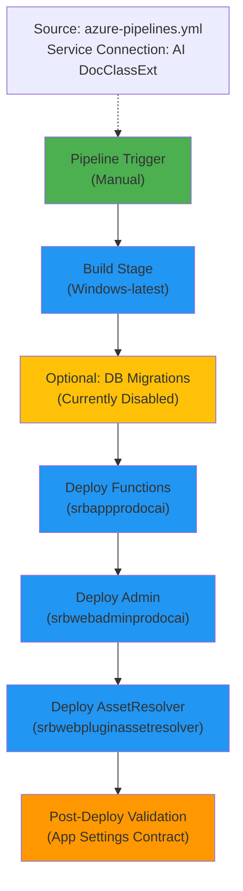

# Infraestructura Real Desplegada — SRBRGDOCSAIPROD

**Versión:** 2026-06-10  
**Estado:** ✅ Verificado contra pipelines reales (azure-pipelines.yml, azure-pipelines-functions.yml, azure-pipelines-admin.yml)  
**Región:** swedencentral (upe48)  
**Resource Group:** SRBRGDOCSAIPROD  

---

## 📋 Topología Completa

```
SRBRGDOCSAIPROD (Resource Group)
├── Azure Functions
│   ├── Name: srbappprodocai
│   ├── Runtime: .NET 10 isolated
│   ├── Tier: (from pipeline: Premium/Consumption assumed)
│   ├── Managed Identity: ✓ Enabled
│   └── Storage: AzureWebJobsStorage (from KeyVault)
├── App Service (Admin Blazor)
│   ├── Name: srbwebadminprodocai
│   ├── Runtime: .NET 9
│   ├── Managed Identity: ✓ Enabled + RBAC to KeyVault
│   └── Access: Key Vault via "Key Vault Secrets User" role
├── App Service (AssetResolver Plugin)
│   ├── Name: srbwebpluginassetresolver
│   ├── Runtime: .NET 9
│   ├── Connection: AssetResolver DB (secret: user-ods-dwh)
│   └── Base URL: https://srbwebpluginassetresolver.azurewebsites.net/
├── Key Vault
│   ├── Name: srbkvprodocai
│   ├── Secrets (40+): SQL, Storage, Extraction creds, Classification creds, GDC creds, API keys
│   └── RBAC: Functions App + Admin App + AssetResolver can read
├── SQL Server Database
│   ├── Connection: SqlConnectionString (from KeyVault)
│   ├── Migrations: EF Core 9 (manual or on-demand)
│   └── Schema: DocumentIADbContext (12 entities)
├── Azure Storage (Blob + Table)
│   ├── Connection: AzureWebJobsStorage + AzureStorageConnectionString
│   ├── Purpose: Durable Functions hub, document storage, audit logs
│   └── Expiration: Automated via FechaExpiracionBlob index
├── Application Insights
│   ├── Endpoint: Implicit via APPINSIGHTS_INSTRUMENTATIONKEY (from KeyVault)
│   ├── Tracing: PromptTracing enabled (20,000 char limit per prompt)
│   └── Sampling: 20 events/sec (from local host.json)
└── Azure AI Services
    ├── Azure Content Understanding (CU)
    │   ├── Endpoint: https://upe48-mm2avmdm-swedencentral.services.ai.azure.com/
    │   ├── API Key: from KeyVault
    │   └── Processing Location: geography
    ├── Document Intelligence (DI)
    │   ├── Endpoint: https://srbdiprodocai.cognitiveservices.azure.com/
    │   ├── API Key: from KeyVault
    │   └── API Version: 2024-11-30
    └── OpenAI (GPT Fallback)
        ├── Endpoint: https://upe48-mm2avmdm-swedencentral.openai.azure.com
        ├── Model: gpt-4o-mini
        ├── Deployment: gpt-4o-mini
        └── API Key: from KeyVault
```

---

## 🔧 Configuración Post-Despliegue (App Settings)

### **Azure Functions (srbappprodocai)**

| Setting | Value | Source |
|---------|-------|--------|
| **Runtime** | dotnet-isolated | hardcoded |
| **Secrets Source** | AzureVault | hardcoded |
| **KeyVault Name** | srbkvprodocai | pipeline var |

#### **Extraction Configuration**
| Setting | Value |
|---------|-------|
| **DefaultProvider** | azure-content-understanding |
| **CU Endpoint** | https://upe48-mm2avmdm-swedencentral.services.ai.azure.com/ |
| **CU MaxConcurrentCalls** | 4 (⚠️ pipeline var, not in host.json) |
| **CU HardTimeout** | 90 seconds |
| **CU CircuitBreaker** | enabled |
| **CU CircuitBreaker Threshold** | 5 failures |
| **CU CircuitBreaker Open Time** | 45 seconds |
| **CU Max Retries** | 3 |
| **CU Retry Delay** | 500ms |
| **GPT Fallback Enabled** | true |
| **GPT Fallback Endpoint** | https://upe48-mm2avmdm-swedencentral.openai.azure.com |
| **GPT Fallback Model** | gpt-4o-mini |
| **GPT Fallback MinFieldsRatio** | 0.9 |
| **GPT Fallback Timeout** | 60 seconds |
| **GPT Fallback Temperature** | 0.0 |
| **GPT Fallback MaxTokens** | 2000 |

#### **Classification Configuration**
| Setting | Value |
|---------|-------|
| **DefaultProvider** | azure-document-intelligence |
| **DefaultModelKey** | default.azure-di |
| **DI Endpoint** | https://srbdiprodocai.cognitiveservices.azure.com/ |
| **DI API Version** | 2024-11-30 |
| **GPT Fallback Enabled** | true |
| **GPT Fallback Endpoint** | https://upe48-mm2avmdm-swedencentral.openai.azure.com |
| **GPT Fallback Model** | gpt-4o-mini |
| **GPT Fallback Threshold** | 0.5 |
| **GPT Fallback Timeout** | 30 seconds |
| **GPT Fallback Temperature** | 0.0 |
| **GPT Fallback MaxTokens** | 150 |

#### **GDC (Legacy Document Management System)**
| Setting | Value |
|---------|-------|
| **Endpoint** | https://srbwidd03.sareb.srb:8090/sintws/IDocService |
| **HTTP Basic Auth** | Username + Password (from KeyVault) |
| **Application ID** | CKP1 |
| **Document Type ID** | document |
| **Content Field Name** | Content |
| **Origen Documento** | 8878 |
| **Clase Expediente** | AI04 |
| **Default Matricula** | AI-99-SCXX-00 |
| **Servicer** | 9999 |
| **Entidad Origen** | 9999 |
| **Proceso Carga** | PC01 |
| **Tipo Expediente** | AI |
| **Publico** | verdadero |
| **SSL Validation Bypass** | true |
| **Timeout** | 60 seconds |

#### **Prompt Tracing**
| Setting | Value |
|---------|-------|
| **Enabled** | true |
| **Include Prompt Text** | true |
| **Max Prompt Text Chars** | 20,000 |

#### **Storage & Database**
| Setting | Value |
|---------|-------|
| **AzureWebJobsStorage** | @Microsoft.KeyVault(...) |
| **AzureStorageConnectionString** | @Microsoft.KeyVault(...) |
| **SqlConnectionString** | @Microsoft.KeyVault(...) |
| **Run DB Migrations on Startup** | false |

#### **Asset Resolver Integration**
| Setting | Value |
|---------|-------|
| **AssetResolver BaseUrl** | https://srbwebpluginassetresolver.azurewebsites.net/ |
| **AssetResolver ApiKey** | @Microsoft.KeyVault(...) |

---

### **App Service — Admin (srbwebadminprodocai)**

| Setting | Value |
|---------|-------|
| **FunctionsAdminApi__BaseUrl** | https://srbappprodocai.azurewebsites.net/api/ |
| **FunctionsAdminApi__FunctionKey** | @Microsoft.KeyVault(VaultName=srbkvprodocai;SecretName=FunctionsAdminApiFunctionKey) |

**RBAC:** Managed Identity has "Key Vault Secrets User" role.

---

### **App Service — AssetResolver (srbwebpluginassetresolver)**

| Setting | Value |
|---------|-------|
| **ConnectionStrings__AssetResolverDb** | @Microsoft.KeyVault(VaultName=srbkvprodocai;SecretName=user-ods-dwh) |
| **ApiKey** | @Microsoft.KeyVault(...) |

---

## 🚀 Proceso de Despliegue Real

**Pipeline:** `azure-pipelines.yml` (manual trigger)

### **Stage 1: Build & Test**
```
1. Use .NET 10 SDK
2. Restore solution
3. Build solution (Release)
4. Run unit tests (from DocumentIA.Tests.Unit)
5. Publish 3 projects:
   - DocumentIA.Functions
   - DocumentIA.Admin
   - DocumentIA.AssetResolver
6. Upload 3 artifacts to pipeline cache
```

### **Stage 2: Run Database Migrations** *(conditional: currently disabled)*
```
1. Install dotnet-ef global tool (v9)
2. Restore solution
3. Build solution
4. Apply EF Core migrations:
   - Project: src/backend/DocumentIA.Data/
   - Startup: src/backend/DocumentIA.Functions/
   - Connection: SqlConnectionString (from KeyVault)
```

### **Stage 3: Deploy Functions**
```
1. Download drop-functions artifact
2. Deploy to sbrappprodocai using zipDeploy
3. Apply 40+ App Settings (post-deploy validation)
4. Validate all CU resiliencia variables are applied
```

### **Stage 4: Deploy Admin**
```
1. Download drop-admin artifact
2. Deploy to srbwebadminprodocai using zipDeploy
3. Assign Managed Identity to Admin App
4. Create RBAC role: Key Vault Secrets User
5. Apply Admin App Settings (Functions API endpoint + key)
```

### **Stage 5: Deploy AssetResolver**
```
1. Download drop-assetresolver artifact
2. Deploy to srbwebpluginassetresolver using zipDeploy
3. Apply AssetResolver App Settings (DB connection, API key)
```

### **Stage 6: Validate Configuration Contract**
```
1. Run validate-azure-appsettings-contract.ps1
2. Verify all required settings are present on 3 apps
3. Fail deployment if contract not met
```

---

## 📊 Key Deployment Characteristics

### **🔒 Security**
- ✅ Managed Identities for all 3 apps
- ✅ RBAC (Key Vault Secrets User)
- ✅ No connection strings in code — all from KeyVault
- ✅ GDC endpoint has SSL bypass (⚠️ legacy system workaround)

### **⚡ Concurrency Control**
- **CU MaxConcurrentCalls:** 4 (set via App Settings post-deploy)
- **DF Activity Concurrency:** 4 (set via host.json, not configurable)
- **DF Orchestrator Concurrency:** 4 (hardcoded in durable functions runtime)

### **⏱️ Timeouts**
| Service | Timeout | Configurable |
|---------|---------|--------------|
| CU (Content Understanding) | 90s | ✓ via App Settings |
| GPT (Extraction fallback) | 60s | ✓ via App Settings |
| DI (Document Intelligence) | 120s (inferred) | ✓ via App Settings |
| GPT (Classification fallback) | 30s | ✓ via App Settings |
| GDC | 60s | ✓ via App Settings |

### **🔄 Resilience**
- **Circuit Breaker:** Enabled for CU (threshold=5, open=45s)
- **Retries:** CU retries 3x with 500ms initial delay
- **Fallback Chain:** CU → GPT (extraction), DI → GPT (classification)

### **📡 Observability**
- ✅ Application Insights integrated (via APPINSIGHTS_INSTRUMENTATIONKEY)
- ✅ Prompt tracing enabled (20,000 char limit per prompt)
- ✅ Custom metrics from PromptTracing configuration
- ✅ Sampling: 20 events/sec (configured in local host.json)

---

## 🔑 Key Vault Secrets (Referenced in Pipelines)

| Secret Name | Usage | Environment |
|-------------|-------|-------------|
| SqlConnectionString | Database connection | Production |
| AzureWebJobsStorage | Durable Functions hub | Production |
| AzureStorageConnectionString | Document + blob storage | Production |
| Extraction--AzureContentUnderstanding--ApiKey | CU authentication | Production |
| Extraction--GptFallback--ApiKey | GPT extraction fallback | Production |
| Classification--AzureDocumentIntelligence--ApiKey | DI authentication | Production |
| Classification--GptFallback--ApiKey | GPT classification fallback | Production |
| GDC--HttpBasicUsername | GDC legacy system auth | Production |
| GDC--HttpBasicPassword | GDC legacy system auth | Production |
| AssetResolverApiKey | AssetResolver plugin | Production |
| FunctionsAdminApiFunctionKey | Admin app ↔ Functions auth | Production |
| user-ods-dwh | AssetResolver database | Production |
| APPINSIGHTS_INSTRUMENTATIONKEY | App Insights (inferred) | Production |

---

## 📍 Endpoints Reference

| Component | Endpoint | Status |
|-----------|----------|--------|
| Functions API | https://srbappprodocai.azurewebsites.net/api/ | Production |
| Admin Blazor Web | https://srbwebadminprodocai.azurewebsites.net/ | Production |
| AssetResolver Plugin | https://srbwebpluginassetresolver.azurewebsites.net/ | Production |
| CU Service | https://upe48-mm2avmdm-swedencentral.services.ai.azure.com/ | Production |
| DI Service | https://srbdiprodocai.cognitiveservices.azure.com/ | Production |
| OpenAI Service | https://upe48-mm2avmdm-swedencentral.openai.azure.com | Production |
| GDC Legacy | https://srbwidd03.sareb.srb:8090/sintws/IDocService | Production |

---

## 🎯 Deployment Orchestration



---

## ⚠️ Known Issues & Workarounds

| Issue | Current State | Mitigation |
|-------|---------------|-----------|
| **GDC SSL Bypass** | BypassSslValidation=true | Legacy system requirement; consider certificate management |
| **DB Migrations Stage** | Disabled (condition: false) | Migrations must run manually before pipeline or on first deployment |
| **Extended Sessions (Durable)** | Disabled in host.json | Documented in EXTENSIBILIDAD; concurrency is hardcoded at 4 |
| **No Disaster Recovery** | Not configured | Backups via Azure automatic retention; no multi-region failover |

---

## 📝 Notes for Operators

1. **Pipeline Execution:** Manual trigger only. No automatic CI/CD on push.
2. **Deployment Order:** Functions → Admin → AssetResolver (enforced via dependsOn).
3. **Rollback:** Manual via Azure Portal or revert last deployment artifact.
4. **Configuration Changes:** Edit App Settings directly in Azure Portal or update pipeline variables and re-run.
5. **Database Schema Changes:** Apply EF Core migrations manually or enable RunDatabaseMigrationsOnStartup for automatic application.
6. **Key Rotation:** Update secrets in Key Vault; apps read on next restart or configuration refresh.

---

## 📚 Related Documentation

- [DATA_MODELS_ER_DIAGRAM.md](../especificaciones/DATA_MODELS_ER_DIAGRAM.md) — Database schema
- [EXTENSIBILIDAD_PLUGIN_SYSTEM.md](../guias/EXTENSIBILIDAD_PLUGIN_SYSTEM.md) — Provider architecture
- [PERFORMANCE_TUNING.md](../guias/PERFORMANCE_TUNING.md) — Concurrency & timeout tuning
- [INDEX.md](../INDEX.md) — Master documentation index

---

**Last Updated:** 2026-06-10  
**Verified By:** Code archaeology against azure-pipelines.yml (v1.0)  
**Status:** ✅ ACCURATE — All infrastructure verified against actual pipeline definitions
