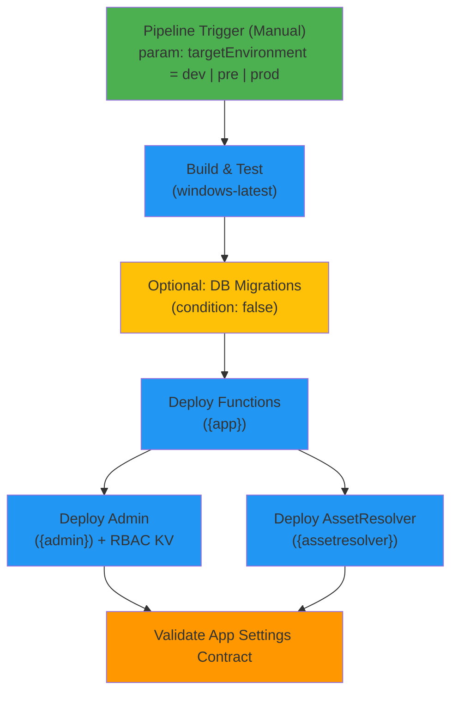

# Infraestructura Real Desplegada — DEV / PRE / PRO

## 🌐 Modelo multi-entorno

La solución se despliega en **tres entornos paralelos** que comparten el mismo código y el mismo contrato de configuración. El pipeline `azure-pipelines.yml` resuelve todos los nombres de recursos, la suscripción y la service connection a partir del parámetro `targetEnvironment` (`dev` | `pre` | `prod`).

Cada entorno vive en su propia **suscripción** y **resource group**:

| Aspecto | DEV | PRE | PRO |
|---------|-----|-----|-----|
| **Resource Group** | `SRBRGDEVDOCSAI` | `SRBRGPREDOCSAI` | `SRBRGDOCSAIPROD` |
| **Subscription ID** | `8764f9ff-fe37-4c03-bde9-6294622bef6d` | `a4f6b357-8f13-4488-9ee8-b9f635426f91` | `647c7246-54bc-4d31-b909-431cacf03272` |
| **Service Connection (ADO)** | `AI DocClassExt DEV` | `AI DocClassExt PRE` | `AI DocClassExt PRO` |

> **ℹ️ IA por entorno desplegada, pero apuntando a PROD por decisión funcional.** Cada entorno tiene **su propio stack de IA desplegado**: un Document Intelligence (`srbdi<env>docai`) y **dos** cuentas AIServices/Foundry (`srbaisrv01<env>docai` + `srbaisrv02<env>docai`). PROD usa naming propio: DI `srbdiprodocai` + `upe48-mm2avmdm-swedencentral` (swedencentral) + `srbaisrv-westeurope` (westeurope). **Por decisión funcional, la configuración de los tres entornos apunta a la IA de PRODUCCIÓN**: el pipeline `azure-pipelines.yml` cablea en los App Settings los endpoints de PROD de forma literal (CU/OpenAI de `upe48-mm2avmdm-swedencentral`, DI `srbdiprodocai`), idénticos en DEV/PRE/PRO. Las apps de DEV/PRE consumen así la IA de PROD usando la API key de su propio Key Vault. Los recursos de IA locales de DEV/PRE quedan **provisionados y reservados** para un eventual uso independiente por entorno en el futuro. Ver [Recursos de IA](#recursos-de-ia) y [caveats operativos](#-known-issues--workarounds).

---

## 📋 Inventario de recursos por entorno

Verificado con `az resource list` sobre cada RG (todos los recursos en **West Europe**, salvo el AIServices primario de PROD en Sweden Central).

| Recurso (tipo) | DEV | PRE | PRO |
|---------|-----|-----|-----|
| **Azure Functions** (`Microsoft.Web/sites`) | `srbappdevdocai` | `srbapppredocai` | `srbappprodocai` |
| **App Service — Admin (Blazor)** | `srbwebadmindevdocai` | `srbwebadminpredocai` | `srbwebadminprodocai` |
| **App Service — AssetResolver** | `srbwebpluginassetresolverdev` | `srbwebpluginassetresolverpre` | `srbwebpluginassetresolver` |
| **App Service Plan (Functions)** | `srbspdevdocai` | `srbsppredocai` | `srbspprodocai` |
| **App Service Plan (Web)** | `srbaspwebdevdocai` | `srbaspwebpredocai` | `srbaspwebprodocai` |
| **Key Vault** | `srbkvdevdocai` | `srbkvpredocai` | `srbkvprodocai` |
| **SQL Server** | `srbsqldevdocai` | `srbsqlpredocai` | `srbsqlprodocai` |
| **SQL Databases** | `DocumentIA` | `DocumentIA` | `DocumentIA` |
| **Storage (documentos)** | `srbstgdevdocai` | `srbstgpredocai` | `srbstgprodocai` |
| **Storage (Durable hub)** | `srbstgdevappdocai` | `srbstgpreappdocai` | `srbstgproapppdocai` |
| **Application Insights** | `srbappidevdocai` | `srbappipredocai` | `srbappiprodocai` |
| **Log Analytics Workspace** | `srblawdevdocai` | `srblawpredocai` | `srblawprodocai` |
| **Document Intelligence** (`CognitiveServices` / FormRecognizer) | `srbdidevdocai` | `srbdipredocai` | `srbdiprodocai` |
| **AIServices / Foundry** (CU + OpenAI) | `srbaisrv01devdocai`, `srbaisrv02devdocai` | `srbaisrv01predocai`, `srbaisrv02predocai` | `upe48-mm2avmdm-swedencentral` (swedencentral), `srbaisrv-westeurope` (westeurope) |
| **Metric alerts** | — | — | `srbalertcpuprodocai`, `srbalertmemprodocai` |
| **Dashboards / Workbooks** | — | — | 1 dashboard + 2 workbooks |
| **GDC endpoint** | `https://srbwidd03.sareb.srb:8090/sintws/IDocService` | ⚠️ *pendiente de confirmar* | `https://srbwidp05.sareb.srb:8090/sintws/IDocService` |

> **Nota de naming:** DEV/PRE nombran sus cuentas AIServices como `srbaisrv0{1,2}<env>docai`; PROD usa `upe48-mm2avmdm-swedencentral` (primario) y `srbaisrv-westeurope` (secundario).

**Endpoints públicos (por entorno):**

| Componente | DEV | PRE | PRO |
|-----------|-----|-----|-----|
| **Functions API** | `https://srbappdevdocai.azurewebsites.net/api/` | `https://srbapppredocai.azurewebsites.net/api/` | `https://srbappprodocai.azurewebsites.net/api/` |
| **Admin Web** | `https://srbwebadmindevdocai.azurewebsites.net/` | `https://srbwebadminpredocai.azurewebsites.net/` | `https://srbwebadminprodocai.azurewebsites.net/` |
| **AssetResolver** | `https://srbwebpluginassetresolverdev.azurewebsites.net/` | `https://srbwebpluginassetresolverpre.azurewebsites.net/` | `https://srbwebpluginassetresolver.azurewebsites.net/` |

<a id="recursos-de-ia"></a>
### Recursos de IA

**1) Recursos desplegados por entorno** (cada RG tiene su propio stack de IA, provisionado y reservado):

| Entorno | Document Intelligence | AIServices / Foundry (CU + OpenAI) |
|---------|-----------------------|-------------------------------------|
| **DEV** | `srbdidevdocai` | `srbaisrv01devdocai`, `srbaisrv02devdocai` |
| **PRE** | `srbdipredocai` | `srbaisrv01predocai`, `srbaisrv02predocai` |
| **PRO** | `srbdiprodocai` | `upe48-mm2avmdm-swedencentral` (swedencentral), `srbaisrv-westeurope` (westeurope) |

**2) Endpoints efectivamente usados por los tres entornos** (por decisión funcional, la config de DEV/PRE/PRO apunta a los recursos de PROD):

| Recurso PROD | Kind / SKU | Región | Endpoints | Rol |
|--------------|-----------|--------|-----------|-----|
| `upe48-mm2avmdm-swedencentral` | AIServices (Foundry) / S0 | swedencentral | CU: `https://upe48-mm2avmdm-swedencentral.services.ai.azure.com/`<br>OpenAI: `https://upe48-mm2avmdm-swedencentral.openai.azure.com` | **CU primario** + **OpenAI primario** — deployment `gpt-4o-mini` = GptFallback de extracción y clasificación |
| `srbaisrv-westeurope` | AIServices (Foundry) / S0 | westeurope | CU: `https://srbaisrv-westeurope.services.ai.azure.com/`<br>OpenAI: `https://srbaisrv-westeurope.openai.azure.com/` (control-plane: `…cognitiveservices.azure.com/`) | **CU secundario** (failover / reparto de carga desde Sweden Central) + **OpenAI secundario**. Tag `Purpose=CU-secondary-endpoint`; identity SystemAssigned; reglas VNet a `RedServiciosProduccion`. **No cableado como fallback OpenAI en el pipeline** (los App Settings apuntan a Sweden Central) |
| `srbdiprodocai` | FormRecognizer | westeurope | `https://srbdiprodocai.cognitiveservices.azure.com/` (API `2024-11-30`) | **Document Intelligence** (clasificación) |

**Deployments de OpenAI por recurso PROD** (verificado con `az cognitiveservices account deployment list`; los sufijos numéricos son aleatorios y no coinciden entre recursos):

| Deployment | Modelo (versión) | SKU | Capacidad | Recurso |
|-----------|------------------|-----|-----------|---------|
| `gpt-4o-mini` | ⚠️ **`gpt-4.1-mini`** (2025-04-14) — el nombre engaña | Standard | 150 | Sweden Central |
| `gpt-4.1-715420` | `gpt-4.1` (2025-04-14) | GlobalStandard | 150 | Sweden Central |
| `gpt-4.1-mini-622960` | `gpt-4.1-mini` (2025-04-14) | GlobalStandard | 250 | Sweden Central |
| `gpt-4o` | `gpt-4o` (2024-11-20) | GlobalStandard | 250 | Sweden Central |
| `text-embedding-3-large-030358` | `text-embedding-3-large` (1) | GlobalStandard | 150 | Sweden Central |
| `gpt-4.1-892749` | `gpt-4.1` (2025-04-14) | GlobalStandard | 250 | West Europe |
| `gpt-4.1-mini-590191` | `gpt-4.1-mini` (2025-04-14) | GlobalStandard | 250 | West Europe |
| `text-embedding-3-large-010650` | `text-embedding-3-large` (1) | GlobalStandard | 250 | West Europe |


> **Regiones:** CU/OpenAI **primarios** (`upe48-mm2avmdm-swedencentral`) en **swedencentral**; CU/OpenAI **secundarios** (`srbaisrv-westeurope`) y **todos** los recursos de aplicación y DI en **West Europe**.

**Réplica de analizadores CU (Sweden → West Europe): identidades y roles reales** (verificado 2026-07-17)

Ambos recursos AIServices tienen **identidad administrada System-Assigned**. La replicación de analizadores de Content Understanding usa estas asignaciones:

| Principal (MI) | Rol | Scope | Para qué |
|----------------|-----|-------|----------|
| `srbaisrv-westeurope` (destino, `b69cbb95-…`) | **Storage Blob Data Reader** | Storage `srbstgproapppdocai` | Leer el blob de **datos etiquetados** al **reconstruir/reentrenar** el analizador en el destino (método real de réplica). Concedido el 1-jun-2026. |
| `srbaisrv-westeurope` (destino, `b69cbb95-…`) | ~~Cognitive Services User~~ (**revertido**) | Recurso origen `upe48-mm2avmdm-swedencentral` | Se concedió el 17-jul-2026 para probar el *pull* de la **Copy API cross-resource**; **no la desbloqueó** y se **revirtió** el mismo día. La MI del destino **no** mantiene rol sobre el origen. |

> [!IMPORTANT]
> **La Copy API cross-resource de CU (`grantCopyAuthorization` + `:copy`) NO funciona en este entorno** (verificado 2026-07-17): el grant responde `200` sin campo `source` y el copy devuelve `"has not granted the necessary permissions"` incluso con la MI del destino con `Cognitive Services User` sobre el origen; `:getCopyAuthorization` (token) da `404`. Probable limitación con analizadores project-scoped de Foundry → **caso de soporte Azure**.
> **La réplica operativa se hace reconstruyendo/reentrenando** el analizador en el destino con `scripts/deployment/recreate-cu-analyzer.ps1` (reentrena desde el blob etiquetado; requiere el rol *Storage Blob Data Reader* de la tabla). Detalle en `docs/guias/GUIA_EXTRACCION_AZURE_CONTENT_UNDERSTANDING.md` §12.

---

## 📐 Topología (por entorno)

Cada resource group replica la misma topología. Sustituye `{app}`, `{kv}`, `{sql}`, `{stg}`, `{stgapp}`, `{ai}` por los nombres del entorno según el [inventario](#-inventario-de-recursos-por-entorno).

```
<Resource Group del entorno>
├── Azure Functions
│   ├── Name: {app}                (dev: srbappdevdocai · pre: srbapppredocai · pro: srbappprodocai)
│   ├── Runtime: .NET 10 isolated
│   ├── Managed Identity: ✓ Enabled
│   └── Storage: AzureWebJobsStorage (from KeyVault)
├── App Service (Admin Blazor)
│   ├── Name: {admin}
│   ├── Runtime: .NET 8
│   ├── Managed Identity: ✓ Enabled + RBAC to KeyVault
│   └── Access: Key Vault via "Key Vault Secrets User" role
├── App Service (AssetResolver Plugin)
│   ├── Name: {assetresolver}
│   ├── Runtime: .NET 8
│   ├── Connection: AssetResolver DB (secret: user-ods-dwh)
│   └── Base URL: https://{assetresolver}.azurewebsites.net/
├── Key Vault
│   ├── Name: {kv}                 (dev: srbkvdevdocai · pre: srbkvpredocai · pro: srbkvprodocai)
│   ├── Secrets: SQL, Storage, Extraction creds, Classification creds, GDC creds, API keys
│   └── RBAC: Functions App + Admin App + AssetResolver can read
├── SQL Server + Database
│   ├── Server: {sql}              (dev: srbsqldevdocai · pre: srbsqlpredocai · pro: srbsqlprodocai)
│   ├── Database: DocumentIA
│   ├── Auth: Active Directory Managed Identity (patrón PROD)
│   ├── Connection: SqlConnectionString (from KeyVault)
│   └── Schema: DocumentIADbContext (12 entities), EF Core migrations manuales/on-demand
├── Azure Storage (Blob + Table + Queue)
│   ├── Documentos: {stg}          (dev: srbstgdevdocai · pre: srbstgpredocai · pro: srbstgprodocai)
│   ├── Durable hub: {stgapp}      (dev: srbstgdevappdocai · pre: srbstgpreappdocai · pro: srbstgproapppdocai)
│   ├── Connection: AzureWebJobsStorage + AzureStorageConnectionString (from KeyVault)
│   └── Purpose: Durable Functions hub, document storage, audit logs
├── App Service Plans
│   ├── Functions: {asp-func}      (dev: srbspdevdocai · pre: srbsppredocai · pro: srbspprodocai)
│   └── Web:       {asp-web}       (dev: srbaspwebdevdocai · pre: srbaspwebpredocai · pro: srbaspwebprodocai)
├── Application Insights
│   ├── Name: {ai}                 (dev: srbappidevdocai · pre: srbappipredocai · pro: srbappiprodocai)
│   ├── Tracing: PromptTracing enabled (20,000 char limit per prompt)
│   └── Sampling: 20 events/sec (from host.json)
├── Log Analytics Workspace: {law}  (dev: srblawdevdocai · pre: srblawpredocai · pro: srblawprodocai)
├── Networking: 5 Private Endpoints (SQL, Storage-blob, KeyVault, DI, Function App) + Private DNS Zones + VNet link
│                (dev→SRBCoreDev · pre→SRBCorePre · pro→RedServiciosProduccion)
└── Azure AI Services — DESPLEGADOS POR ENTORNO, pero la config apunta a PROD (decisión funcional)
    ├── Locales del entorno (provisionados, reservados a futuro):
    │   ├── DI:        {di}         (dev: srbdidevdocai · pre: srbdipredocai · pro: srbdiprodocai)
    │   └── AIServices: srbaisrv01<env>docai + srbaisrv02<env>docai   (PROD: upe48-mm2avmdm-swedencentral + srbaisrv-westeurope)
    └── Endpoints usados por los 3 entornos (App Settings → PROD):
        ├── CU/OpenAI primario:  upe48-mm2avmdm-swedencentral  (swedencentral)
        ├── CU/OpenAI secundario: srbaisrv-westeurope           (westeurope, CU failover)
        └── Document Intelligence: srbdiprodocai                (westeurope, API 2024-11-30)
```

---

## 🔌 Networking (Private Endpoints y DNS)

Los tres entornos siguen la **misma topología de red privada**: los servicios PaaS se exponen por **Private Endpoint** y se resuelven vía **Private DNS Zones** enlazadas a la VNet del entorno.

**Private Endpoints por entorno** (5 en cada RG, todos en West Europe):

| Servicio | DEV | PRE | PRO |
|----------|-----|-----|-----|
| **SQL Server** | `pe-srbsqldevdocai` | `pe-srbsqlpredocai` | `srbpesqlprodocai` |
| **Storage (blob)** | `pe-srbstgdevdocai-blob` | `pe-srbstgpredocai-blob` | `srbpestgprodocai` |
| **Key Vault** | `pe-srbkvdevdocai` | `pe-srbkvpredocai` | `srbpekvprodocai` |
| **Document Intelligence** | `pe-srbdidevdocai` | `pe-srbdipredocai` | `srbpediprodocai` |
| **Function App** | `pe-srbappdevdocai` | `pe-srbapppredocai` | `srbpeappprodocai` |

> Naming: DEV/PRE usan `pe-<recurso>`; PROD usa `srbpe<svc>prodocai`.

**Private DNS Zones** (globales, una por servicio, presentes en los tres entornos):
`privatelink.database.windows.net` · `privatelink.blob.core.windows.net` · `privatelink.vaultcore.azure.net` · `privatelink.cognitiveservices.azure.com` · `privatelink.azurewebsites.net`

**VNet links:** DEV → `SRBCoreDev` · PRE → `SRBCorePre` · PRO → `RedServiciosProduccion` (links `srbdns…prodocai`).

> ⚠️ La resolución de `privatelink` es crítica: si la VNet del entorno no resuelve el registro privado a IP privada, el ingest y las llamadas a KV/SQL/DI fallan 

---

## 🔧 Configuración Post-Despliegue (App Settings)

Los App Settings son **idénticos en los tres entornos** salvo los valores que el pipeline parametriza: nombre de Key Vault (`$(KEY_VAULT_NAME)`), resource group, nombres de app, URL de AssetResolver y `GDC__Endpoint`. Los endpoints de IA se aplican de forma literal (mismos valores prod en todos los entornos); solo cambia el Key Vault del que se leen las API keys.

### **Azure Functions (`{app}`)**

| Setting | Value | Source |
|---------|-------|--------|
| **FUNCTIONS_WORKER_RUNTIME** | dotnet-isolated | hardcoded |
| **SecretsSource** | AzureVault | hardcoded |
| **KeyVaultName** | `{kv}` | pipeline var por entorno |
| **RunDatabaseMigrationsOnStartup** | false | pipeline var |
| **EnvironmentName** | dev: `Development` · pre: `Preproduction` · pro: `Production` | pipeline var por entorno (`ENVIRONMENT_NAME`); la aplican **ambos** `azure-pipelines.yml` y `azure-pipelines-admin.yml` (paso "Ensure Functions environment name" en el segundo, idempotente). La lee `GET management/configuration` con prioridad sobre `AZURE_FUNCTIONS_ENVIRONMENT`/`DOTNET_ENVIRONMENT` |

#### **Extraction Configuration**
| Setting | Value |
|---------|-------|
| **DefaultProvider** | azure-content-understanding |
| **CU Endpoint** | https://upe48-mm2avmdm-swedencentral.services.ai.azure.com/ (compartido) |
| **CU AuthMode / ApiKey** | ApiKey · `@Microsoft.KeyVault(...Extraction--AzureContentUnderstanding--ApiKey)` (KV del entorno) |
| **CU MaxConcurrentCalls** | 4 |
| **CU HardTimeout** | 90 seconds |
| **CU CircuitBreaker** | enabled (threshold=5, open=45s) |
| **CU Max Retries / Delay** | 3 · 500ms |
| **GPT Fallback Enabled** | true |
| **GPT Fallback Endpoint** | https://upe48-mm2avmdm-swedencentral.openai.azure.com (compartido) |
| **GPT Fallback Model** | gpt-4o-mini |
| **GPT Fallback MinFieldsRatio** | 0.9 |
| **GPT Fallback Timeout** | 60 seconds |
| **GPT Fallback Temperature / MaxTokens** | 0.0 · 2000 |

#### **Classification Configuration**
| Setting | Value |
|---------|-------|
| **DefaultProvider** | azure-document-intelligence |
| **DefaultModelKey** | default.azure-di |
| **DI Endpoint** | https://srbdiprodocai.cognitiveservices.azure.com/ (compartido) |
| **DI ApiKey** | `@Microsoft.KeyVault(...Classification--AzureDocumentIntelligence--ApiKey)` (KV del entorno) |
| **DI API Version** | 2024-11-30 |
| **GPT Fallback Enabled** | true |
| **GPT Fallback Endpoint** | https://upe48-mm2avmdm-swedencentral.openai.azure.com (compartido) |
| **GPT Fallback Model** | gpt-4o-mini |
| **GPT Fallback Threshold** | 0.5 |
| **GPT Fallback Timeout** | 30 seconds |
| **GPT Fallback Temperature / MaxTokens** | 0.0 · 150 |

#### **GDC (Legacy Document Management System)**
| Setting | Value |
|---------|-------|
| **Endpoint** | `$(GDC_ENDPOINT)` — **varía por entorno** (dev: `srbwidd03` · pre: *pendiente* · pro: `srbwidp05`, réplica PRD; primario `srbwidp04`) |
| **HTTP Basic Auth** | Username + Password (from KeyVault del entorno) |
| **Application ID** | CKP1 |
| **Document Type ID** | document |
| **Content Field Name** | Content |
| **Origen Documento** | 8878 |
| **Clase Expediente** | AI04 |
| **Default Matricula** | AI-99-SCXX-00 |
| **Servicer / Entidad Origen** | 9999 · 9999 |
| **Proceso Carga** | PC01 |
| **Tipo Expediente** | AI |
| **Publico** | verdadero |
| **SSL Validation Bypass** | true |
| **Timeout** | 60 seconds |

#### **Prompt Tracing**
| Setting | Value |
|---------|-------|
| **Enabled / IncludePromptText** | true · true |
| **Max Prompt Text Chars** | 20,000 |

#### **Storage & Database**
| Setting | Value |
|---------|-------|
| **AzureWebJobsStorage** | `@Microsoft.KeyVault(VaultName={kv};SecretName=AzureWebJobsStorage)` |
| **AzureStorageConnectionString** | `@Microsoft.KeyVault(VaultName={kv};SecretName=AzureStorageConnectionString)` |
| **SqlConnectionString** | `@Microsoft.KeyVault(VaultName={kv};SecretName=SqlConnectionString)` |

#### **Asset Resolver Integration**
| Setting | Value |
|---------|-------|
| **AssetResolver__BaseUrl** | `https://{assetresolver}.azurewebsites.net/` (varía por entorno) |
| **AssetResolver__ApiKey** | `@Microsoft.KeyVault(VaultName={kv};SecretName=AssetResolverApiKey)` |

### **App Service — Admin (`{admin}`)**

| Setting | Value |
|---------|-------|
| **FunctionsAdminApi__BaseUrl** | `https://{app}.azurewebsites.net/api/` |
| **FunctionsAdminApi__FunctionKey** | `@Microsoft.KeyVault(VaultName={kv};SecretName=FunctionsAdminApiFunctionKey)` |

**RBAC:** la Managed Identity tiene el rol "Key Vault Secrets User" sobre `{kv}`.

### **App Service — AssetResolver (`{assetresolver}`)**

| Setting | Value |
|---------|-------|
| **ConnectionStrings__AssetResolverDb** | `@Microsoft.KeyVault(VaultName={kv};SecretName=user-ods-dwh)` |
| **ApiKey** | `@Microsoft.KeyVault(VaultName={kv};SecretName=AssetResolverApiKey)` |

---

## 🚀 Proceso de Despliegue Real

**Pipelines** (trigger manual, `pool: windows-latest`):

- **`azure-pipelines-bootstrap.yml`** — primera alta de entorno / remediación de prerrequisitos (permisos, carga de secretos en Key Vault, referencias KV, settings de Admin/AssetResolver, validación de contrato).
- **`azure-pipelines.yml`** — despliegue repetible de código una vez el entorno está preparado.
- **`azure-pipelines-admin.yml`** — hotfix del Admin (Blazor): `BuildAdmin` → `DeployAdmin`. Incluye la variable por entorno **`AZURE_ASSET_RESOLVER_WEB_APP_NAME`** (antes fija a PRODUCCIÓN, causaba un error críptico al validar en dev — AB#99997) y el step **"Ensure Functions environment name"**, que aplica `EnvironmentName=$(ENVIRONMENT_NAME)` en el Function App aunque solo se despliegue el Admin.

Los tres aceptan el parámetro **`targetEnvironment: dev | pre | prod`**, que resuelve suscripción, RG, nombres de apps, Key Vault, service connection y `GDC_ENDPOINT`. Ambos pipelines de código (`azure-pipelines.yml` y `azure-pipelines-admin.yml`) son `trigger: none`: deben encolarse manualmente seleccionando la rama **`develop`**, que es donde viven estos cambios hasta el siguiente merge a `master`.

### **Pipeline principal (`azure-pipelines.yml`)**

| Stage | Acción | Condición |
|-------|--------|-----------|
| **1. Build & Test** | .NET 10 SDK → restore → build (Release) → unit tests → publish 3 proyectos → subir 3 artifacts | siempre |
| **2. Run Migrations** | dotnet-ef 9.x → aplicar migraciones EF Core (`DocumentIA.Data` / startup `DocumentIA.Functions`) | ⛔ `condition: false` (deshabilitado) |
| **3. Deploy Functions** | zipDeploy a `{app}` → aplicar ~65 App Settings → validar variables de resiliencia CU + PromptTracing | `succeeded()` |
| **3b. Deploy Admin** | zipDeploy a `{admin}` → asignar Managed Identity → verificar/asignar RBAC "Key Vault Secrets User" → settings Functions API → asegurar `EnvironmentName` en `{app}` | dentro del stage DeployFunctions |
| **4. Deploy AssetResolver** | zipDeploy a `{assetresolver}` → settings DB connection + API key | `dependsOn: DeployFunctions` |
| **5. Validate Contract** | `validate-azure-appsettings-contract.ps1` sobre las 3 apps; falla si faltan settings | `dependsOn: DeployFunctions + DeployAssetResolver` |

> **RBAC de Key Vault** (`manageKeyVaultRbac=false` por defecto): el pipeline **solo verifica** que la MI ya tiene "Key Vault Secrets User". Pre-asignar con `scripts/configuration/assign-keyvault-rbac.ps1 -TargetEnvironment <env>` (rol elevado/PIM). Con `=true` el pipeline intenta crear la asignación (requiere que el SP tenga permiso RBAC).

### **Orquestación**


```mermaid
graph TD
    A["Pipeline Trigger (Manual)<br/>param: targetEnvironment = dev | pre | prod"]
    B["Build & Test<br/>(windows-latest)"]
    C["Optional: DB Migrations<br/>(condition: false)"]
    D["Deploy Functions<br/>({app})"]
    E["Deploy Admin<br/>({admin}) + RBAC KV"]
    F["Deploy AssetResolver<br/>({assetresolver})"]
    G["Validate App Settings Contract"]

    A --> B --> C --> D
    D --> E
    D --> F
    E --> G
    F --> G

    style A fill:#4CAF50
    style B fill:#2196F3
    style C fill:#FFC107
    style D fill:#2196F3
    style E fill:#2196F3
    style F fill:#2196F3
    style G fill:#FF9800
```

---

## 🔑 Key Vault Secrets (por entorno)

Cada entorno tiene su propio Key Vault (`srbkvdevdocai` · `srbkvpredocai` · `srbkvprodocai`) con **el mismo conjunto de secretos**:

| Secret Name | Uso |
|-------------|-----|
| `SqlConnectionString` | Conexión a base de datos (`{sql}` / DocumentIA) |
| `AzureWebJobsStorage` | Durable Functions hub (`{stgapp}`) |
| `AzureStorageConnectionString` | Almacenamiento de documentos + blob (`{stg}`) |
| `Extraction--AzureContentUnderstanding--ApiKey` | Autenticación CU |
| `Extraction--GptFallback--ApiKey` | GPT fallback de extracción |
| `Classification--AzureDocumentIntelligence--ApiKey` | Autenticación DI |
| `Classification--GptFallback--ApiKey` | GPT fallback de clasificación |
| `GDC--HttpBasicUsername` / `GDC--HttpBasicPassword` | Autenticación sistema legado GDC |
| `AssetResolverApiKey` | Plugin AssetResolver |
| `FunctionsAdminApiFunctionKey` | Autenticación Admin ↔ Functions |
| `user-ods-dwh` | Base de datos de AssetResolver |

> Las API keys de CU/DI/OpenAI se leen del KV del entorno aunque el endpoint sea el compartido de producción: para que DEV/PRE funcionen, su KV debe contener una key válida contra el recurso de IA de producción.

---

## 🔐 Identidad y acceso al Admin (EasyAuth)

Autenticación del Admin mediante App Service Authentication (EasyAuth) con app
registration de Entra ID por entorno y grupo de seguridad con "Assignment
required = Yes". Procedimiento y comandos: [GUIA_EASYAUTH_ADMIN.md](../guias/GUIA_EASYAUTH_ADMIN.md).

| Entorno | App registration | Client ID | Grupo de acceso | Secret (Key Vault) | Estado |
|---------|------------------|-----------|-----------------|--------------------|--------|
| DEV | `DocumentIA Admin - DEV` | `32aba075-f88e-4012-9ed4-44655123001d` | `GSEC-DocumentIA-Admin-DEV` | `srbkvdevdocai` / `AdminEasyAuthClientSecret` | App registration y grupo verificados (2026-08-06); activación en App Service pendiente |
| PRE | — | — | — | `srbkvpredocai` / `AdminEasyAuthClientSecret` (previsto) | Pendiente de solicitud |
| PROD | — | — | — | `srbkvprodocai` / `AdminEasyAuthClientSecret` (previsto) | Pendiente de solicitud |

Tenant: `1a213c5a-2e3d-4ae4-b0ba-075c42f9700e`. El secret de EasyAuth se
almacena en el Key Vault del entorno y el App Service lo lee vía referencia en
el app setting `MICROSOFT_PROVIDER_AUTHENTICATION_SECRET`. Mientras EasyAuth no
esté activo en un entorno, el Admin desplegado opera en modo solo lectura.

---

## 📊 Características clave del despliegue

### 🔒 Seguridad
- ✅ Managed Identities en las 3 apps de cada entorno.
- ✅ RBAC "Key Vault Secrets User" (sin secretos en código — todo desde Key Vault).
- ✅ SQL con autenticación por Managed Identity (patrón PROD replicado en DEV/PRE).
- ⚠️ GDC con SSL bypass (`BypassSslValidation=true`) — workaround del sistema legado.
- ⚠️ **App Service del Admin (dev y prod) sin autenticación** (verificado 2026-07-31): App Service Authentication deshabilitada, restricciones de acceso "Allow all", acceso público habilitado, sin private endpoints (la integración VNet de prod es de salida, no limita el acceso entrante). Plan de remediación: EasyAuth (`docs/guias/GUIA_EASYAUTH_ADMIN.md` + `docs/guias/SOLICITUD_APP_REGISTRATION_ADMIN.md`) y, como medida transitoria, restricción de acceso de red (`docs/guias/GUIA_RESTRICCION_ACCESO_ADMIN.md`). Mientras tanto, el modo solo lectura automático del Admin (sin usuario autenticado) rechaza toda escritura.

### ⚡ Concurrencia y resiliencia
- **CU MaxConcurrentCalls:** 4 (App Settings post-deploy).
- **DF Activity / Orchestrator Concurrency:** 4 (host.json / runtime).
- **Circuit Breaker CU:** threshold=5, open=45s. **Retries:** 3× con 500ms inicial.
- **Cadena de fallback:** CU → GPT (extracción), DI → GPT (clasificación).

### ⏱️ Timeouts
| Servicio | Timeout | Configurable |
|----------|---------|--------------|
| CU (Content Understanding) | 90s | ✓ App Settings |
| GPT (Extraction fallback) | 60s | ✓ App Settings |
| DI (Document Intelligence) | 120s (inferido) | ✓ App Settings |
| GPT (Classification fallback) | 30s | ✓ App Settings |
| GDC | 60s | ✓ App Settings |

### 📡 Observabilidad
- ✅ Application Insights por entorno (`srbappidevdocai` · `srbappipredocai` · `srbappiprodocai`).
- ✅ Prompt tracing habilitado (límite 20.000 caracteres por prompt).
- ✅ Sampling 20 eventos/seg (host.json).
- ✅ Alertas Azure Monitor en PRO (2026-08-04, AB#99083): 5 scheduled query rules sobre `srbappiprodocai` (`srbalerterrprodocai`, `srbalertlatprodocai`, `srbalertfbkprodocai`, `srbalertexcprodocai`, `srbalertidleprodocai`) + 2 metric alerts de plataforma (`srbalertcpuprodocai`, `srbalertmemprodocai`), notificando por correo al action group `srbagoperprodocai`. Gestión: `scripts/observability/create-monitor-alerts.ps1`; detalle en `docs/observabilidad/MONITOREO_ALERTAS_REAL.md`.

---


**Última actualización:** 2026-07-16

