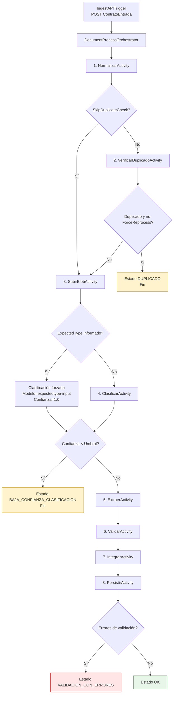
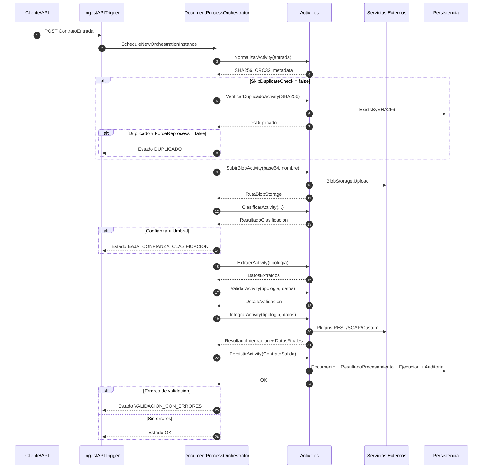

# Manual de Activities (Azure Functions Durable)

## 1) Objetivo

Este manual describe cómo funcionan las `Activities` del backend `DocumentIA.Functions`, qué responsabilidad tiene cada una y cómo se usan dentro del pipeline orquestado.

Ámbito cubierto:

- Trigger de entrada HTTP.
- Orquestador Durable (`DocumentProcessOrchestrator`).
- Activities de procesamiento (`Normalizar`, `VerificarDuplicado`, `SubirBlob`, `Clasificar`, `Extraer`, `Validar`, `Integrar`, `Persistir`).

---

## 2) Flujo completo de ejecución

Entrada:

1. `IngestAPITrigger` recibe `POST` con `ContratoEntrada`.
2. Lanza instancia de Durable Orchestration `DocumentProcessOrchestrator`.

Pipeline del orquestador:

1. `NormalizarActivity`
2. `VerificarDuplicadoActivity` (si no se indicó `SkipDuplicateCheck`)
3. `SubirBlobActivity` (si no se corta por duplicado o si `ForceReprocess=true`)
4. `ClasificarActivity` (se omite si `Instrucciones.ExpectedType` viene informado)
5. `ExtraerActivity`
6. `ValidarActivity`
7. `IntegrarActivity`
8. `PersistirActivity`

Salida:

- `ContratoSalida` con estado final (`OK`, `VALIDACION_CON_ERRORES`, `DUPLICADO`, `BAJA_CONFIANZA_CLASIFICACION`, `ERROR`).

### Diagrama del flujo (Mermaid)

### Diagrama swimlane (Mermaid)

### Leyenda rápida de estados

- `OK`: procesamiento completo sin errores de validación.
- `VALIDACION_CON_ERRORES`: procesamiento completo con errores de validación.
- `DUPLICADO`: documento ya existente y sin reproceso forzado.
- `BAJA_CONFIANZA_CLASIFICACION`: confianza de clasificación por debajo del umbral.
- `ERROR`: excepción no controlada en cualquier etapa.

### Leyenda de colores (diagrama de flujo)

- **Verde**: finalización correcta (`OK`).
- **Amarillo**: finalización anticipada por regla de negocio (`DUPLICADO`, `BAJA_CONFIANZA_CLASIFICACION`).
- **Rojo suave**: finalización con incidencias de validación (`VALIDACION_CON_ERRORES`).

---

## 3) Contrato de entrada y salida

## Entrada (`ContratoEntrada`)

Campos relevantes:

- `Instrucciones.ExpectedType`: fuerza tipología y omite la activity de clasificación.
- `Instrucciones.SkipDuplicateCheck`: omite validación de duplicado.
- `Instrucciones.ForceReprocess`: permite seguir aunque sea duplicado.
- `Instrucciones.Classification.Provider`: override opcional del proveedor (`auto`, `azure-document-intelligence`, `mock`).
- `Instrucciones.Classification.Model`: override opcional del modelo (`auto` para usar default global).
- `Instrucciones.Classification.Umbral`: umbral mínimo de confianza para continuar.
- `Documento.Name` y `Documento.Content.Base64`: contenido a procesar.
- `Trazabilidad.CorrelationId`, `SubmittedBy`: metadata operativa.

## Salida (`ContratoSalida`)

Bloques principales:

- `Identificacion` (documento, tipología, fecha, guid).
- `Integridad` (SHA256, CRC32).
- `DatosExtraidos` (y enriquecidos tras integración).
- `DetalleEjecucion`:
  - clasificación,
  - extracción,
  - postproceso/validación,
  - integración.
- `Resultado` (estado y confianza global).

---

## 4) Activities: detalle funcional

## 4.1 `NormalizarActivity`

Responsabilidad:

- Decodificar Base64 del documento.
- Calcular `SHA256` y `CRC32`.

Salida:

- Diccionario con: `SHA256`, `CRC32`, `TamañoBytes`, `NombreNormalizado`, `FechaNormalizacion`.

Comportamiento de error:

- Si falla la normalización/cálculo de integridad, propaga excepción y el orquestador termina en `ERROR`.

## 4.2 `SubirBlobActivity`

Responsabilidad:

- Subir a Blob Storage el contenido del documento cuando el flujo debe continuar.

Salida:

- `RutaBlobStorage` (string) o vacío si no se pudo almacenar.

Comportamiento de error:

- Si falla la subida a Blob, registra warning y continúa devolviendo string vacío.

## 4.3 `VerificarDuplicadoActivity`

Responsabilidad:

- Comprobar si existe documento por `SHA256` en repositorio.

Salida:

- `true/false` (duplicado o no).

Decisión en orquestador:

- Si es duplicado y `ForceReprocess=false` ⇒ estado final `DUPLICADO` y finaliza.

## 4.4 `ClasificarActivity`

Responsabilidad:

- Resolver tipología del documento.

Reglas actuales:

- Si `Instrucciones.ExpectedType` viene informado, la clasificación se resuelve en orquestación y esta activity no se ejecuta.
- Si no existe `ExpectedType`, la activity usa `IClasificarDataProvider` con precedencia:
  - `Instrucciones.Classification.Provider` / `Instrucciones.Classification.Model`
  - `Classification:DefaultProvider` / `Classification:DefaultModelKey`
- El proveedor por defecto es Azure DI (`azure-document-intelligence`) salvo override explícito.

Decisión en orquestador:

- Si `Confianza < Instrucciones.Classification.Umbral` ⇒ estado `BAJA_CONFIANZA_CLASIFICACION` y finaliza.

## 4.5 `ExtraerActivity`

Responsabilidad:

- Extraer datos por tipología usando proveedor inyectado `IExtraerDataProvider`.

Implementación actual:

- En `Program.cs` está registrado `MockExtraerDataProvider`.

Salida:

- `Dictionary<string, object>` con campos extraídos.

## 4.6 `ValidarActivity`

Responsabilidad:

- Validar campos extraídos con motor de reglas por tipología.

Cómo carga reglas:

- Usa `TipologiaConfigLoader` con path `config/tipologias`.
- Busca archivo `<tipologia>.validation.json`.

Salida:

- `DetalleValidacion` (total reglas, errores, warnings, detalle por campo, confianza de validación).

Comportamiento especial:

- Si no existe archivo de validación, devuelve warning funcional (no excepción fatal).

## 4.7 `IntegrarActivity`

Responsabilidad:

- Ejecutar plugins de integración/enriquecimiento configurados por tipología.

Flujo:

- Carga configuración `*.plugins.json`.
- Ordena plugins por prioridad.
- Ejecuta secuencialmente.
- Si un plugin devuelve datos, hace merge sobre `DatosFinales`.
- Si falla plugin crítico (`priority == 1`), corta la cadena con `Estado = ERROR`.

Salida:

- `ResultadoIntegracion` con detalle por plugin y datos finales enriquecidos.

## 4.8 `PersistirActivity`

Responsabilidad:

- Persistir trazabilidad completa del procesamiento.

Qué guarda:

- `DocumentoEntity` (alta o actualización por SHA256).
- `ResultadoProcesamientoEntity` (resumen técnico).
- `DocumentoEjecucionEntity` (histórico completo + contrato salida serializado).
- `PluginEjecucionEntity` por plugin ejecutado.
- `ValidacionResultadoEntity` parseando mensajes de validación.
- `AuditoriaEntity` con resultado final.

Comportamiento de error:

- Excepción en persistencia propaga error al orquestador.

---

## 5) Reglas de estado del orquestador

- `DUPLICADO`: hash ya existe y no se fuerza reproceso.
- `BAJA_CONFIANZA_CLASIFICACION`: clasificación por debajo de umbral.
- `VALIDACION_CON_ERRORES`: pipeline completo, con errores de validación.
- `OK`: pipeline completo sin errores de validación.
- `ERROR`: excepción no controlada en pipeline.

Confianza global:

- `Resultado.ConfianzaGlobal = min(confianzaClasificación, confianzaValidación)`.

---

## 6) Configuración y dependencias

Dependencias clave registradas en `Program.cs`:

- `IClasificarDataProvider` (default: `ConfigurableClasificarDataProvider` con Azure DI).
- `IExtraerDataProvider`.
- `IBlobStorageService`.
- Repositorios de persistencia y `DbContext`.
- Sistema de plugins (`PluginManager`, `PluginFactory`, `PluginConfigLoader`).

Archivos de configuración utilizados por activities:

- Validación: `src/backend/DocumentIA.Functions/config/tipologias/*.validation.json`
- Integración: `src/backend/DocumentIA.Functions/config/tipologias/*.plugins.json`

---

## 7) Operación y uso

## 7.1 Invocación

- Endpoint HTTP: Function `IngestDocument`.
- Método: `POST` con body compatible con `ContratoEntrada`.
- Respuesta: `202 Accepted` con `instanceId` y `statusQueryUri`.

## 7.2 Qué revisar en incidencias

- `DUPLICADO`: revisar `SkipDuplicateCheck` / `ForceReprocess`.
- `BAJA_CONFIANZA_CLASIFICACION`: ajustar umbral o tipología esperada.
- `VALIDACION_CON_ERRORES`: revisar reglas `<tipologia>.validation.json` y campos faltantes.
- `ERROR`: revisar logs de activity específica y persistencia.

## 7.3 Orden recomendado de diagnóstico

1. Confirmar `instanceId` y estado de orquestación.
2. Revisar logs por paso (`Paso 1...Paso 8`, incluyendo `Paso 2.5` para subida a blob).
3. Validar configuración de tipología (validation/plugins).
4. Revisar conectividad a servicios externos (Blob, plugins REST/SOAP).
5. Verificar persistencia en tablas de documento/ejecución/auditoría.

---

## 8) Limitaciones actuales y evolución sugerida

Limitaciones observadas:

- Dependencia de configuración correcta de `Classification:AzureDocumentIntelligence` y `config/classification/models.json` para clasificación real.
- Dependencia fuerte de configuración de tipología en filesystem.

Evolución natural:

- Sustituir extractor mock por implementación real.
- Externalizar secretos y parámetros por entorno (local/qa/prod).

---

## 9) Referencias de código

- Trigger: `src/backend/DocumentIA.Functions/Triggers/IngestAPITrigger.cs`
- Orquestador: `src/backend/DocumentIA.Functions/Orchestrators/DocumentProcessOrchestrator.cs`
- Activities: `src/backend/DocumentIA.Functions/Activities`
- Modelos entrada/salida: `src/backend/DocumentIA.Core/Models`
- Configuración de reglas: `src/backend/DocumentIA.Core/Configuration/TipologiaConfigLoader.cs`
- Manual de plugins relacionado: `docs/manuales/MANUAL_PLUGINS.md`
