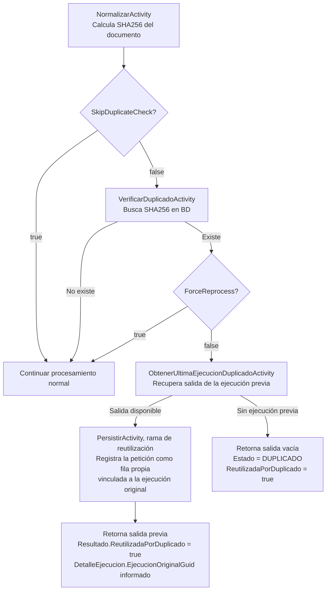

# Manual de Deduplicación Interna — DocumentIA

## 1. Propósito

El sistema incluye un mecanismo de deduplicación basado en hash SHA256 del contenido del documento. Su objetivo es **evitar reprocesar el mismo documento dos veces** y reutilizar el resultado de la ejecución anterior, ahorrando tiempo de procesamiento y costes de llamadas a servicios IA.

Este mecanismo es **independiente** de la deteccion de duplicados en el GDC (Gestor Documental), que se describe en [ESPECIFICACION_CAPA_SERVICIO_GDC_SINTWS.md](../especificaciones/ESPECIFICACION_CAPA_SERVICIO_GDC_SINTWS.md).

---

## 2. Cómo funciona

### 2.1 Flujo de decisión



### 2.2 Posición en el pipeline

La verificación ocurre después de normalizar (paso 1) y **antes** de subir el blob (paso 2.5), clasificar y extraer. Si se detecta duplicado, el pipeline se **corta early** sin llamar a ningún servicio IA.

Desde AB#100258 ese corte **no es silencioso**: antes de devolver la respuesta reutilizada, el orquestador llama a `PersistirActivity` por su rama de reutilización (ver 3.4) y la petición queda registrada como una fila propia en `DocumentoEjecuciones`, vinculada a la ejecución cuyo contrato se devuelve. Antes de ese cambio la petición no dejaba rastro: no existía para el Monitor ni para ningún recuento.

```
NormalizarActivity → [VerificarDuplicadoActivity] → SubirBlobActivity → ClasificarActivity → ...
```

---

## 3. Actividades implicadas

### 3.1 `NormalizarActivity`

Calcula los hashes del documento a partir del contenido Base64:

| Hash | Uso principal |
|---|---|
| SHA256 | Deduplicación interna (clave de búsqueda en BD). |
| MD5 | Deduplicación en GDC (campo `MD5` en SINTWS). |
| CRC32 | Integridad (campo adicional en `Integridad`). |

La normalización también extrae: `TamañoBytes`, `NombreNormalizado`, `FechaNormalizacion`.

### 3.2 `VerificarDuplicadoActivity`

**Firma:** `Run([ActivityTrigger] string sha256) → bool`

Consulta `IDocumentoRepository.ExistsBySHA256Async(sha256)` contra la base de datos interna. Devuelve:

- `true` → el documento ya existe en BD.
- `false` → no existe; continuar procesamiento normal.

### 3.3 `ObtenerUltimaEjecucionDuplicadoActivity`

**Firma:** `Run([ActivityTrigger] string sha256) → ContratoSalida?`

Cuando se detecta duplicado y `ForceReprocess = false`:

1. Busca el `DocumentoEntity` por SHA256 en `IDocumentoRepository`.
2. Obtiene todas las ejecuciones del documento desde `IDocumentoEjecucionRepository`.
3. Selecciona la **primera ejecución que tenga `ContratoSalidaCompletoJson` poblado** (la última en orden de inserción). Se prefiere la que coincide en `ClassificationOnly` y `NivelClasificacion` con la petición; si no hay coincidencia exacta, la última con contrato (AB#100177). Las filas de reutilización (3.4) nacen sin contrato, así que **nunca son candidatas**: una reutilización no se reutiliza y no se forman cadenas.
4. Deserializa el JSON y establece:
   - `Resultado.ReutilizadaPorDuplicado = true`
   - `Resultado.MensajeReutilizacion = "Documento ya procesado previamente. Se reutiliza la última ejecución."`
   - `DetalleEjecucion.EjecucionOriginalGuid = EjecucionGuid` de la fila seleccionada. Es el único puente hacia la ejecución original: ese GUID se genera al persistir y no viaja dentro del contrato (`Identificacion.Guid` es el GUID del documento, no de la ejecución).
5. Devuelve la `ContratoSalida` reutilizada.

Si no hay ejecuciones serializadas disponibles, devuelve `null`.

### 3.4 `PersistirActivity` — rama de reutilización (AB#100258)

El orquestador, antes de devolver la respuesta reutilizada, corrige la identidad del contrato (`DetalleEjecucion.InstanceId` y `OperationId` pasan a ser los de **esta** llamada; hasta entonces llegaban los de la orquestación histórica) y llama a `PersistirActivity` con un `ReutilizacionInput` (`EjecucionOriginalGuid` + `SHA256`). La actividad:

| Escribe | No toca |
|---|---|
| Una fila en `DocumentoEjecuciones` con `ReutilizadaPorDuplicado = 1`, `EjecucionOriginalId` = Id de la original, `ContratoSalidaCompletoJson = NULL`, sin coste (`CosteIAEur = NULL`). Lleva `InstanceId`, `OperationId`, `SubmittedBy`, `ClassificationOnly`, `NivelClasificacion` y `DuracionTotalMs` de la llamada actual, y copia `Tipologia`, `EstadoFinal` y confianzas de la original para que la fila sea legible sin join. | `Documentos` (existe por definición; su markdown y su caducidad de blob son del original). |
| Una fila de `Auditoria` con acción `REUTILIZACION_DUPLICADO`. | `ResultadosProcesamiento`, plugins y validaciones (no se ejecutaron). |

Reglas:

- **`EstadoFinal` es el de la original a propósito**: reutilizar un `ERROR` sigue contando como error.
- **Idempotente por `InstanceId`**: si ya existe una fila de reutilización con ese `InstanceId`, no inserta otra (un reintento de Durable tras un fallo posterior al commit no duplica la traza).
- **Nunca falla la respuesta**: el orquestador envuelve la llamada en su propio `try/catch`; si registrar la traza falla, se loguea y la respuesta reutilizada se devuelve igual.
- Si la ejecución original no se localiza por su GUID, la fila se graba sin vínculo (`EjecucionOriginalId = NULL`) con un aviso en el log. Las reutilizaciones grabadas antes de la corrección `36dbd24` (el orquestador pasaba el GUID del documento en vez del de la ejecución) están en esa situación y no suman en el coste evitado.

---

## 4. Comportamiento según combinación de flags

| `SkipDuplicateCheck` | `ForceReprocess` | Existe en BD | Comportamiento |
|---|---|---|---|
| `false` | `false` | No | Pipeline completo normal. |
| `false` | `false` | Sí, con salida previa | **Short-circuit**: devuelve salida previa. `Estado` = el de la ejecución previa. `ReutilizadaPorDuplicado = true`. Registra una fila de reutilización vinculada a la original (3.4). |
| `false` | `false` | Sí, sin salida previa | **Short-circuit**: devuelve respuesta vacía. `Estado = "DUPLICADO"`. `ReutilizadaPorDuplicado = true`. Persiste una ejecución normal con ese estado (AB#100178) y `ReutilizadaPorDuplicado = 0` en BD: no reutilizó nada. |
| `false` | `true` | Sí | Reprocesa completamente, ignorando el duplicado. |
| `true` | — | — | Omite verificación. Pipeline completo. |

---

## 5. Campos en la respuesta relativos a deduplicación

En `ContratoSalida.Resultado`:

| Campo | Tipo | Descripción |
|---|---|---|
| `resultado.estado` | string | `"DUPLICADO"` cuando se detecta duplicado sin ejecución reutilizable. En reutilización con ejecución previa, el estado es el de dicha ejecución (normalmente `"OK"`). |
| `resultado.reutilizadaPorDuplicado` | bool | `true` cuando se devuelve una ejecución anterior o cuando el estado es `DUPLICADO`. |
| `resultado.mensajeReutilizacion` | string? | Mensaje descriptivo del motivo de reutilización. |

En `ContratoSalida.DetalleEjecucion` (AB#100258):

| Campo | Tipo | Descripción |
|---|---|---|
| `detalleEjecucion.instanceId` | string | Siempre el de **esta** llamada, también en una respuesta reutilizada. Antes de AB#100258 llegaba el de la orquestación histórica, y no se podía ir de la respuesta a la llamada que la produjo. |
| `detalleEjecucion.operationId` | string | Ídem: el `operation_Id` de App Insights de esta llamada. |
| `detalleEjecucion.ejecucionOriginalGuid` | string? | Solo en respuestas reutilizadas: `EjecucionGuid` de la ejecución cuyo contrato se devuelve. En una ejecución normal es `null` y **se omite del JSON**. Es el campo con el que localizar la ejecución original en el Monitor. |
| `detalleEjecucion.costes.reutilizadaPorDuplicado` | bool | `true` en reutilización: el bloque de costes llega a cero. |
| `detalleEjecucion.costes.costeEjecucionOriginalEur` | decimal? | Coste de la original, informativo. Ver [MANUAL_COSTES_IA.md](MANUAL_COSTES_IA.md) §4.6. |

**Compatibilidad con clientes.** El cambio es aditivo: `ejecucionOriginalGuid` solo aparece en respuestas reutilizadas y un deserializador que ignore campos desconocidos no lo nota. Lo único que cambia de valor es `instanceId` / `operationId` en respuestas reutilizadas, que pasan de ser los de otra orquestación a los correctos. `statusQueryUri`, los estados y el resto del contrato no cambian.

---

## 6. Casos de uso típicos

### Reenvío accidental del mismo documento

El sistema detecta el SHA256 idéntico, recupera la ejecución anterior y devuelve ese resultado sin reprocesar. El cliente recibe `reutilizadaPorDuplicado = true`.

### Forzar reprocesamiento (corrección de datos)

Si se ha actualizado la configuración de tipología o se requiere reextracción, enviar con `forceReprocess = true`. El documento se procesa completamente aunque ya exista.

### Importación masiva con documentos potencialmente repetidos

Enviar `skipDuplicateCheck = false` (default) para que el sistema filtre automáticamente duplicados, ahorrando tiempo y coste en lote.

### Entornos de prueba sin BD

Enviar `skipDuplicateCheck = true` para omitir la verificación y siempre procesar, independientemente del estado de la BD.

---

## 7. Persistencia en base de datos

La deduplicación se apoya en dos repositorios:

| Repositorio | Entidad | Uso |
|---|---|---|
| `IDocumentoRepository` | `DocumentoEntity` | Índice de documentos únicos por SHA256. Consultado por `VerificarDuplicadoActivity` y `ObtenerUltimaEjecucionDuplicadoActivity`. |
| `IDocumentoEjecucionRepository` | `DocumentoEjecucionEntity` | Historial de ejecuciones con `ContratoSalidaCompletoJson`. Consultado por `ObtenerUltimaEjecucionDuplicadoActivity`. |

Los documentos se persisten al final del pipeline por `PersistirActivity`. El SHA256 se registra en ese momento. Si la función se interrumpe antes de `PersistirActivity`, el documento no queda registrado y no se detectará como duplicado en futuras ejecuciones.

Columnas de `DocumentoEjecuciones` propias de la reutilización (migración `20260911093509_ReutilizacionPorDuplicado`, AB#100258):

| Columna | Tipo | Significado |
|---|---|---|
| `ReutilizadaPorDuplicado` | `bit NOT NULL DEFAULT 0` | 1 = la fila registra una petición servida con el contrato de otra ejecución. No es una ejecución de IA. |
| `EjecucionOriginalId` | `int NULL`, FK a `DocumentoEjecuciones.Id` | Ejecución cuyo contrato se devolvió. Solo informada cuando el flag es 1. |

Cualquier lector directo de la tabla debe filtrar `ReutilizadaPorDuplicado = 0` si espera contratos: las filas de reutilización tienen `ContratoSalidaCompletoJson`, `DatosOriginalesJson` y `DatosFinalesJson` a NULL. El Monitor de Admin, los agregados de costes y el procedimiento `sp_ObtenerDocumentoEjecucionesPorIdActivo` ya lo hacen por defecto (ver 8 y 9).

---

## 8. Ver las reutilizaciones en el Monitor de Admin

Desde AB#100258 el Monitor (`/monitor`) las distingue:

- **Por defecto quedan fuera** del listado, de los KPIs, del histograma, de la matriz y de los costes: no son ejecuciones de IA y contarlas falsearía calidad y coste. Las cifras históricas del Monitor no cambian por su llegada.
- **Selector tri-estado** en los filtros: *Excluir* (por defecto), *Incluir* y *Solo reutilizadas*. El endpoint `GET /api/management/ejecuciones*` lo recibe como `reutilizadas=incluir|solo` (cualquier otro valor excluye).
- **Listado**: badge "Reutilizada" en la fila; el modal del contrato JSON se deshabilita en esas filas con el texto "el contrato es el de la ejecución #X", enlazada.
- **Detalle, en los dos sentidos**: en la reutilización, banner "Servida reutilizando la ejecución #X del \<fecha\>" más lo que sí es suyo (fecha, solicitante, `InstanceId`, `OperationId`, duración real). En la original, bloque "Reutilizada N veces" con la lista de peticiones que la aprovecharon.
- **KPIs**, calculados aparte sobre la misma ventana temporal: **peticiones servidas por reutilización** (recuento) y **coste evitado** (suma del `CosteIAEur` medido de las ejecuciones originales reutilizadas; si la original no tenía coste medido o el vínculo falta, no suma).

## 9. Consumidor externo: `sp_ObtenerDocumentoEjecucionesPorIdActivo`

El procedimiento gana el parámetro `@IncluirReutilizadas BIT = 0`. Sin informarlo devuelve **exactamente las mismas filas que antes** (las de reutilización, con contrato NULL, quedan fuera). Con `@IncluirReutilizadas = 1` entran, y las dos columnas nuevas al final del resultset (`ReutilizadaPorDuplicado`, `EjecucionOriginalId`) permiten distinguirlas sin deducirlo del contrato vacío. Se aplica con `scripts/database/sp-obtener-ejecuciones-por-idactivo-reutilizaciones.sql`; no viaja en ninguna migración de EF.

## 10. Evidencia en entorno real

`tests/e2e-postdeploy/run-validacion-dedup.ps1` demuestra las invariantes DUP-01..DUP-05 contra DEV (fila propia con contrato en una ejecución real; fila de reutilización sin contrato ni coste y vinculada a la original; `forceReprocess` reejecuta sin marcar reutilización; los agregados y el coste del periodo no se mueven y el contador de reutilizadas sube en uno; la traza lleva el `InstanceId` de la petición y se registra una sola vez). Ver `tests/e2e-postdeploy/README.md`.

---

---

## 11. Diferencia con deduplicación en GDC

| Aspecto | Deduplicación interna (BD) | Deduplicación en GDC (SINTWS) |
|---|---|---|
| Clave | SHA256 del contenido | `id_expediente` + `checksum` (MD5) |
| Momento | Paso 2 del pipeline (antes de clasificar) | Paso subida GDC (`SubirGDCActivity`) |
| Efecto en duplicado | Short-circuit completo del pipeline | Subida omitida; `GDC.YaExistia = true` |
| Control | `SkipDuplicateCheck` / `ForceReprocess` | No configurable desde el contrato de entrada |
| Documentado en | Este documento | [ESPECIFICACION_CAPA_SERVICIO_GDC_SINTWS.md](../especificaciones/ESPECIFICACION_CAPA_SERVICIO_GDC_SINTWS.md) |
