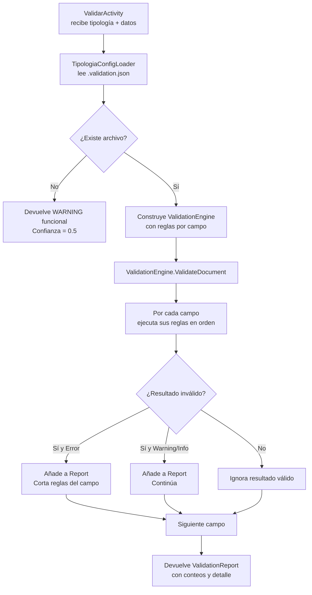

# Manual del sistema de validaciones (DocumentIA)

## 1) Objetivo y valor

El motor de validaciones de `DocumentIA.Core` aplica reglas de negocio sobre los campos extraídos de cada documento **antes** de su integración y persistencia.

### Qué aporta

- **Calidad de datos**: detecta campos ausentes, mal formados o fuera de rango antes de que lleguen a sistemas externos.
- **Configuración sin código**: las reglas se definen en JSON por tipología, no en código.
- **Severidades granulares**: distingue `Error` (bloquea confianza), `Warning` e `Info` sin detener el pipeline.
- **Reglas especializadas para España**: NIF/NIE/CIF, referencia catastral y dirección postal.
- **Extensible**: añadir una nueva regla supone implementar `IValidationRule` y registrar el `ruleType` en `TipologiaConfigLoader`.

---

## 2) Arquitectura del sistema

```
TipologiaConfigLoader
   └── Lee <tipologia>.validation.json
   └── Construye ValidationEngine (AddRule por campo)

ValidationEngine
   └── ValidateDocument(Dictionary<string, object?>)
   └── Devuelve ValidationReport

ValidationReport
   ├── Results: List<ValidationResult>
   ├── ErrorCount / WarningCount / InfoCount
   └── IsValid (true si ErrorCount == 0)
```

### Diagrama de flujo



---

## 3) Severidades

| Severidad | Impacto en pipeline | Uso recomendado |
|---|---|---|
| `Error` | Reduce `ConfianzaValidacion`. El orquestador marca `VALIDACION_CON_ERRORES` | Campos críticos, formatos obligatorios |
| `Warning` | Queda en reporte pero no bloquea | Campos recomendados, formatos flexibles |
| `Info` | Informativo, no impacta confianza | Sugerencias, avisos operativos |

> `IsValid = true` solo cuando `ErrorCount == 0`. Warnings e Infos no invalidan el reporte.

---

## 4) Reglas disponibles

### 4.1 `required` (RequiredFieldValidator)

Verifica que el campo exista y no sea cadena vacía.

- `ruleType`: no aplica directamente; se activa con `"required": true` en el campo.
- Severidad por defecto: `Error`.

### 4.2 `range` (RangeValidator)

Valida que el valor numérico esté dentro de un rango.

Parámetros:

- `min` (decimal, opcional)
- `max` (decimal, opcional)

```json
{ "ruleType": "range", "severity": "Error", "parameters": { "min": 0, "max": 200000000 } }
```

### 4.3 `nif` (NifValidator)

Valida formato y dígito de control de NIF, CIF y NIE españoles.

- NIF: `12345678A` — 8 dígitos + letra de control.
- CIF: `A12345678` — letra org + 7 dígitos + control.
- NIE: `X1234567A` — X/Y/Z + 7 dígitos + letra de control.

```json
{ "ruleType": "nif", "severity": "Warning", "parameters": {} }
```

### 4.4 `catastral` (CatastralReferenceValidator)

Valida que la referencia catastral tenga 20 caracteres y cumpla el patrón oficial español.

- Patrón: `7 dígitos + 2 letras + 4 dígitos + 1 letra + 4 dígitos + 2 letras`.
- Ejemplo válido: `1234567AB1234S0001ZX`.
- Si los dígitos de control son incorrectos, baja a `Warning` (no bloquea).

```json
{ "ruleType": "catastral", "severity": "Warning", "parameters": {} }
```

### 4.5 `date` (DateFormatValidator)

Valida formato y restricciones temporales de fechas.

Parámetros:

- `formats`: array de formatos aceptados (por defecto: `dd/MM/yyyy`, `yyyy-MM-dd`, `dd-MM-yyyy`, `yyyy/MM/dd`).
- `allowFuture` (bool): permite fechas futuras.
- `allowPast` (bool): permite fechas pasadas.

```json
{ "ruleType": "date", "severity": "Error",
  "parameters": { "formats": ["dd/MM/yyyy", "yyyy-MM-dd"], "allowFuture": false, "allowPast": true } }
```

### 4.6 `address` (AddressValidator)

Valida direcciones postales españolas.

Parámetros:

- `minLength` / `maxLength`: longitud mínima/máxima.
- `requireStreetNumber` (bool): exige número de portal.
- `requireMunicipality` (bool): comprueba municipio contra contexto.
- `requireProvince` (bool): comprueba provincia contra contexto.

Valida internamente:
- caracteres permitidos (tildes, ñ, números, separadores comunes),
- código postal de 5 dígitos,
- número de portal si se requiere.

```json
{ "ruleType": "address", "parameters":
  { "minLength": 6, "maxLength": 160, "requireStreetNumber": true } }
```

### 4.7 `enum` (EnumValidator)

Valida que el valor pertenezca a una lista de valores permitidos.

Parámetros:

- `values`: lista de strings permitidos.
- `caseSensitive` (bool, defecto `false`).

```json
{ "ruleType": "enum", "severity": "Error",
  "parameters": { "values": ["Urbana", "Rustica", "Especial"], "caseSensitive": false } }
```

### 4.8 `regex` (RegexValidator)

Valida que el valor cumpla una expresión regular.

Parámetros:

- `pattern`: expresión regular.

```json
{ "ruleType": "regex", "severity": "Error",
  "parameters": { "pattern": "^[0-9]{5}$" } }
```

### 4.9 `minLength` / `maxLength` (LengthValidator)

Valida la longitud de un string.

> El campo `ruleType` es insensible a mayúsculas (el motor aplica `.ToLower()` al leer la configuración). Por convenio, los archivos de configuración usan camelCase: `minLength` / `maxLength`.

```json
{ "ruleType": "minLength", "severity": "Warning", "parameters": { "value": 5 } }
{ "ruleType": "maxLength", "severity": "Error",   "parameters": { "value": 100 } }
```

### 4.10 `boolean` (BooleanValidator)

Valida que el campo sea interpretable como booleano.

Valores aceptados: `true/false`, `1/0`, `sí/no`, `si/no`, `yes/no`, `verdadero/falso`.

- Se activa poniendo `"type": "boolean"` en la definición del campo.

### 4.11 `array` (ArrayValidator)

Valida arrays y sus items anidados.

- Se activa poniendo `"type": "array"` + `"items"` con sus `properties`.
- Valida propiedades requeridas y aplica reglas por cada item.

---

## 5) Configuración por tipología

Ubicación: `src/backend/DocumentIA.Functions/config/tipologias/<tipologia>.validation.json`

### Esquema completo

```json
{
  "tipologiaId": "nota-simple",
  "tipologiaNombre": "Nota Simple",
  "version": "1.0",
  "fields": [
    {
      "name": "NombreCampo",
      "type": "string | decimal | date | boolean | array",
      "required": true,
      "rules": [
        {
          "ruleType": "<tipo-regla>",
          "severity": "Error | Warning | Info",
          "parameters": { }
        }
      ],
      "items": {
        "type": "object",
        "properties": [
          { "name": "SubCampo", "type": "string", "required": true, "rules": [] }
        ]
      }
    }
  ]
}
```

### Ejemplo real (`nota.simple.1_4.validation.json`, campos principales)

```json
{
  "tipologiaId": "nota-simple",
  "version": "1.4",
  "fields": [
    { "name": "FincaRegistral", "type": "string", "required": true,
      "rules": [
        { "ruleType": "minLength", "severity": "Error", "parameters": { "value": 1 } },
        { "ruleType": "maxLength", "severity": "Error", "parameters": { "value": 30 } }
      ] },
    { "name": "FechaDocumento", "type": "date", "required": true,
      "rules": [{ "ruleType": "date", "severity": "Error",
                  "parameters": { "formats": ["dd/MM/yyyy","yyyy-MM-dd"], "allowFuture": false, "allowPast": true } }] },
    { "name": "IDUFIR_CRU", "type": "string", "required": false,
      "rules": [{ "ruleType": "regex", "severity": "Warning", "parameters": { "pattern": "^[0-9]{14}$" } }] },
    { "name": "Direccion", "type": "string", "required": false,
      "rules": [{ "ruleType": "address",
                  "parameters": { "minLength": 6, "maxLength": 160, "requireStreetNumber": true, "requireMunicipality": true, "requireProvince": true } }] },
    { "name": "ReferenciaCatastral", "type": "string", "required": false,
      "rules": [{ "ruleType": "catastral", "severity": "Warning", "parameters": {} }] }
  ]
}
```

---

## 6) Añadir una nueva regla de validación

1. Crear clase en `src/backend/DocumentIA.Core/Validation/Rules/` que extienda `ValidationRuleBase`.
2. Implementar `RuleName` y `Validate(...)`.
3. Registrar el nuevo `ruleType` en `TipologiaConfigLoader.CreateRuleFromConfig(...)`.
4. Referenciar el nuevo `ruleType` en los `.validation.json` correspondientes.

```csharp
public class MiReglaValidator : ValidationRuleBase
{
    public override string RuleName => "MiReglaValidator";

    public override ValidationResult Validate(string fieldName, object? value,
        Dictionary<string, object?>? context = null)
    {
        if (value == null) return CreateSuccessResult(fieldName);

        // lógica de validación
        bool esValido = true; // reemplazar con la comprobación real

        return esValido
            ? CreateSuccessResult(fieldName)
            : CreateFailureResult(fieldName, "Mensaje de error", "Sugerencia de corrección");
    }
}
```

---

## 7) Comportamiento del orquestador según validación

- Errores de validación → el pipeline **no se detiene**, continúa hasta `PersistirActivity`.
- Estado final `VALIDACION_CON_ERRORES` si `DetalleValidacion.Errores > 0`.
- `ConfianzaGlobal = min(confianzaClasificacion, confianzaValidacion)`.
- `ConfianzaValidacion = 1 - (errores / totalReglas)`.

---

## 8) Checklist para nueva tipología

- Crear `<tipologia>.validation.json` en `config/tipologias`.
- Definir campos requeridos con `"required": true`.
- Asignar `severity` correcta por impacto en negocio.
- Para campos NIF/catastral, usar `Warning` sin bloquear flujo.
- Para campos críticos de integridad (superficie, fecha), usar `Error`.
- Probar con `ValidarActivity` directamente vía test de integración.

---

## 9) Referencias de código

- Interfaz de reglas: `src/backend/DocumentIA.Core/Validation/IValidationRule.cs`
- Motor: `src/backend/DocumentIA.Core/Validation/ValidationEngine.cs`
- Modelos de resultado: `src/backend/DocumentIA.Core/Validation/Models/ValidationResult.cs`
- Reglas: `src/backend/DocumentIA.Core/Validation/Rules/`
- Config de tipología: `src/backend/DocumentIA.Core/Configuration/TipologiaValidationConfig.cs`
- Cargador de config: `src/backend/DocumentIA.Core/Configuration/TipologiaConfigLoader.cs`
- Archivos JSON: `src/backend/DocumentIA.Functions/config/tipologias/*.validation.json`
- Activity de validación: `src/backend/DocumentIA.Functions/Activities/ValidarActivity.cs`
- Manual de activities relacionado: `docs/03_DISENO_TECNICO_DETALLADO.md` (anexo integrado)
