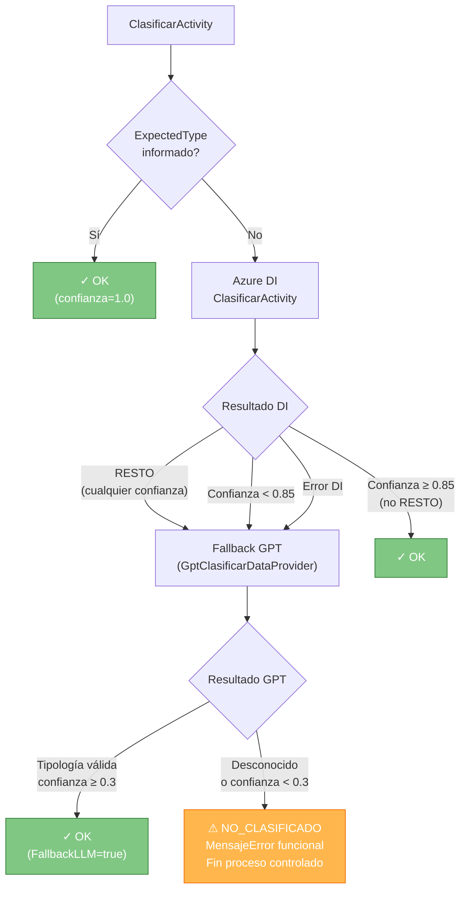

# Referencia de Tipologías

## 1. Resumen de tipologías activas

| Familia (`tipologiaId`) | Versión | Clave técnica | Default | GDC Tipo | GDC Subtipo | Skip GDC | Extracción (proveedor) | Prompt |
|---|---|---|---|---|---|---|---|---|
| `nota-simple` | 1.0 | `nota.simple.1_0` | No | NOTS | NOTS01 | No | — | — |
| `nota-simple` | 1.2 | `nota.simple.1_2` | No | NOTS | NOTS01 | No | — | — |
| `nota-simple` | 1.3 | `nota.simple.1_3` | No | NOTS | NOTS01 | No | — | — |
| `nota-simple` | **1.4** | `nota.simple.1_4` | **Sí** | NOTS | NOTS01 | No | CU (`nota.simple.1_4.azure-cu`) | Sí (gpt4o-mini) |
| `tasacion` | 1.0 | `tasacion` | Sí | — | — | **Sí** | — | No |
| `resumen-documental` | 1.0 | `resumen.documental` | Sí | — | — | **Sí** | Disabled (mock) | Sí (vision, gpt4o-mini) |
| `ibi` ★ | 1.0 | DB-backed | No | — | — | No | GPT directo (`azure-openai`) | — |

> **Cédula:** el archivo `cedula.plugins.json` ha sido eliminado. La tipología `cedula` no está operativa.
>
> ★ **`ibi`** es una tipología almacenada exclusivamente en base de datos (sin fichero `.validation.json` en disco). Usa `extraction.provider = "azure-openai"` → `GptDirectExtraerDataProvider`. El modelo de extracción se define en la tabla `ModelosConfig` (key `default.gpt4o-mini_ex`).

---

## 2. Resolución de tipología (`TipologiaVersionResolver`)

El resolver carga tipologías desde dos fuentes (con prioridad DB sobre fichero):
1. **Base de datos** — tabla `TipologiasConfig` vía `TipologiaVersionResolver` (tipologías DB-backed como `ibi`).
2. **Ficheros JSON** — archivos `*.validation.json` del directorio `config/tipologias/` (tipologías legacy como `nota-simple`, `tasacion`, `resumen-documental`).

Admite tres formas de referencia:

| Formato de entrada | Resultado |
|---|---|
| `nota-simple` | Versión marcada `isDefault: true` dentro de la familia (actualmente v1.4) |
| `nota-simple@1.3` | Versión exacta 1.3 |
| `nota.simple.1_3` | Clave técnica directa (código en BD / nombre de archivo de seed sin extensión) |

**Errores que puede lanzar:**

- `KeyNotFoundException` — familia o versión no registrada → en el orquestador termina en `ERROR` con `MensajeError`.
- `InvalidOperationException` — múltiples versiones `isDefault` en la misma familia, o familia con varias versiones y ninguna default.

---

## 3. Pipeline de clasificación

### 3.1 Flujo normal

```
ContratoEntrada.Instrucciones.ExpectedType
    └─ informado ── clasificación directa (confianza = 1.0, modelo = "expectedtype-input")
    └─ vacío ─────▶ ClasificarActivity
                        └─ Proveedor DI (AzureDocumentIntelligence)
                               ├─ resultado = RESTO  ─────────────────────▶ ⚠ Fallback GPT obligatorio (§3.2)
                               ├─ confianza < 0.85   ─────────────────────▶ ⚠ Fallback GPT (§3.2)
                               └─ confianza ≥ 0.85  ─────────────────────▶ ✓ Clasificación OK
```

### 3.2 Fallback GPT

`ConfigurableClasificarDataProvider` activa el fallback GPT (`GptClasificarDataProvider`) en dos casos:

| Motivo | `FallbackRazon` registrada | Descripción |
|---|---|---|
| DI devuelve `RESTO` | `resto_classification:{confianza}` | Azure DI no reconoce el documento y lo clasifica como resto; el fallback es **obligatorio** independientemente de la confianza. |
| Confianza DI < `clasifUmbralFallback` | `low_confidence:{confianza}` | Confianza insuficiente para aceptar el resultado DI. |
| Error en proveedor DI | _(varía)_ | Excepción en llamada a DI; si hay resultado DI parcial, se intenta GPT. |

### 3.3 Resultado GPT no clasificable → NO_CLASIFICADO

Si GPT devuelve `"Desconocido"` o confianza < 0.3, `GptClasificarDataProvider` lanza:

```
InvalidOperationException: "No se ha podido identificar la tipologia del documento..."
```

El orquestador captura esta excepción y **termina el proceso en estado `NO_CLASIFICADO`** (cierre controlado):

- No se ejecutan `ExtraerActivity`, `ValidarActivity`, `IntegrarActivity` ni `PersistirActivity`.
- La salida incluye en `Resultado`:
  - `Estado = "NO_CLASIFICADO"`
  - `MensajeError = "Documento no clasificable con confianza suficiente"`
  - `ConfianzaGlobal = 0`, `EstadoCalidad = "WARNING"`, `ConfianzaClasificacion = 0`
- La salida incluye en `DetalleEjecucion.Clasificacion`:
  - `TipologiaDetectada = "Desconocido"`, `FallbackLLM = true`, `FallbackRazon = "fallback_unclassified"`, `Confianza = 0`
- `DetalleEjecucion.Postproceso.Inconsistencias` recoge un aviso funcional (no error técnico).

### 3.4 Diagrama clasificación



---

## 4. Tipología: `nota-simple`

**Descripción:** Nota simple registral española. Documento oficial del Registro de la Propiedad que certifica la situación jurídica de una finca: titular dominical, cargas, hipotecas, servidumbres y gravámenes.

**Código GDC:** `NOTS / NOTS01` — Serie `AI01` — Matrícula MGDC: `AI-01-NOTS-01`

**Versión activa (default):** 1.4

### 4.1 Historial de versiones

| Versión | Clave técnica | Default | Principales diferencias |
|---|---|---|---|
| 1.0 | `nota.simple.1_0` | No | Campos mínimos (`superficie`, `FechaDocumento`, `NIF`). Sin extracción CU ni prompt. |
| 1.2 | `nota.simple.1_2` | No | Introduce `FincaRegistral`, `RegistroPropiedad` (required), `IDUFIR_CRU`. Sin CU. |
| 1.3 | `nota.simple.1_3` | No | `RegistroPropiedad` pasa a optional. Añade plugins (mock REST, SOAP catastro, custom Sareb). |
| **1.4** | `nota.simple.1_4` | **Sí** | Extracción real con Azure Content Understanding. Añade `Registrador`, `CodigoPostal`, `Provincia`, `Municipio`. Plugin de enriquecimiento en producción (`refCatExcel`). Genera resumen GPT. |

### 4.2 Campos de validación (versión 1.4)

| Campo | Tipo | Obligatorio | Regla | Severidad |
|---|---|---|---|---|
| `FincaRegistral` | string | Sí | minLength=1, maxLength=30 | Error |
| `RegistroPropiedad` | string | No | minLength=3, maxLength=120 | Error |
| `MunicipioRegistro` | string | No | maxLength=80 | Warning |
| `IDUFIR_CRU` | string | No | regex `^[0-9]{14}$` | Warning |
| `Registrador` | string | No | minLength=3, maxLength=120 | Error |
| `FechaDocumento` | date | Sí | formatos `dd/MM/yyyy`/`yyyy-MM-dd`, no futura | Error |
| `NumeroAsientoPresentacion` | string | No | maxLength=40 | Warning |
| `Direccion` | string | No | address (min=6, max=160, número+municipio+provincia) | Warning |
| `ReferenciaCatastral` | string | No | catastral | Warning |
| `CodigoPostal` | string | No | regex `^[0-9]{5}$` | Warning |
| `Provincia` | string | No | maxLength=50 | Warning |
| `Municipio` | string | No | — | Warning |

### 4.3 Configuración de confianza (v1.4)

| Parámetro | Valor |
|---|---|
| `clasifUmbralFallback` | 0.85 |
| `extracWeightCampos` | 0.5 |
| `extracWeightRequeridos` | 0.3 |
| `extracWeightWarnings` | 0.2 |
| `umbralOK` | 0.85 |
| `umbralRevision` | 0.70 |

### 4.4 Extracción (v1.4)

- **Proveedor:** `azure-content-understanding`
- **Model key:** `nota.simple.1_4.azure-cu`
- **autoMapUnmappedFields:** `true`
- **fieldMappings:** vacíos (mapeo automático sin alias explícitos)

### 4.5 Prompt (v1.4)

- **Modelo:** `default.gpt4o-mini` (`contentMode: markdown`)
- **maxTokens:** 1600 · **temperature:** 0.0
- Genera resumen ejecutivo en 4 apartados: objetivo, datos clave, riesgos/alertas, acciones recomendadas.

### 4.6 Plugins

#### Versión 1.3 (`nota.simple.1_3.plugins.json`)

| Prioridad | Clave | Tipo | Habilitado | Descripción |
|---|---|---|---|---|
| 1 | `mock-enrichment` | REST | Sí | `http://localhost:8080/` — enriquecimiento mock (development) |
| 2 | `mock-soap-catastro` | SOAP | Sí | `http://localhost:8081` — consulta referencia catastral mock, `returnsIdActivo=true` |
| 3 | `sareb-business-rules` | custom | Sí | DLL `SarebEnrichments.dll` → `Sareb.Enrichments.NotaSimpleEnricher`, `returnsIdActivo=true` |
| 4 | `httpbin-test` | REST | **No** | httpbin.org/post — solo pruebas |

#### Versión 1.4 (`nota.simple.1_4.plugins.json`)

| Prioridad | Clave | Tipo | Habilitado | Descripción |
|---|---|---|---|---|
| 1 | `refCatExcel` | REST | Sí | `http://localhost:8082/enriquecer` — enriquecimiento con referencia catastral, `returnsIdActivo=true` |

> El plugin `refCatExcel` tiene `priority=1`, por lo que un fallo crítico en este plugin terminará el proceso en `ERROR` (sin continuar a Persistir).

---

## 5. Tipología: `tasacion`

**Descripción:** Informe de tasación inmobiliaria. Documento técnico que certifica el valor de mercado de un inmueble.

**GDC:** no se sube (`skipGDCUpload: true`). Matrícula MGDC: `TASACION`.

**Versión activa:** 1.0 (única)

### 5.1 Campos de validación

| Campo | Tipo | Obligatorio | Regla | Severidad |
|---|---|---|---|---|
| `ValorTasado` | decimal | Sí | rango [1.000 – 2.000.000] | Error |
| `FechaDocumento` | date | Sí | formatos `dd/MM/yyyy`/`yyyy-MM-dd`, no futura | Error |
| `Direccion` | string | No | address (min=6, max=160) | _(sin severity explícita)_ |
| `NIF` | string | No | nif | Warning |
| `ReferenciaCatastral` | string | No | catastral | Warning |

### 5.2 Extracción y prompt

- Extracción: **no configurada** (sin bloque `extraction` en el JSON).
- Prompt: `enabled: false`.

### 5.3 Plugins (`tasacion.plugins.json`)

| Prioridad | Clave | Tipo | Habilitado | Descripción |
|---|---|---|---|---|
| 2 | `httpbin-test` | REST | Sí | `https://httpbin.org/post` — integración de prueba con retry |

> Sin plugin crítico (prioridad 1), por lo que un fallo en este plugin no corta el pipeline.

---

## 6. Tipología: `resumen-documental`

**Descripción:** Tipología genérica orientada a generar un resumen estandarizado del documento de entrada.

**GDC:** no se sube (`skipGDCUpload: true`). Sin código GDC ni matrícula.

**Versión activa:** 1.0 (única)

### 6.1 Campos y extracción

- **Campos:** ninguno (array vacío — no hay validación de campos extraídos).
- **Extracción:** `enabled: false` con provider `mock`.

### 6.2 Prompt

- **Modelo:** `default.gpt4o-mini` · **contentMode:** `vision` (envía imagen del documento)
- **maxTokens:** 600 · **temperature:** 0.0
- Misma estructura de resumen ejecutivo (objetivo, datos clave, riesgos, acciones).

### 6.3 Plugins

Sin archivo `resumen.documental.plugins.json` — no se ejecuta ningún plugin de integración.

---

## 7. Clasificador Azure DI

Modelo configurado en `config/classification/models.json`:

| Clave | Proveedor | Classifier ID | API Version |
|---|---|---|---|
| `default.azure-di` | `azure-document-intelligence` | `DocumentAICC_v0` | `2024-11-30` |

La etiqueta `RESTO` es el valor que Azure DI asigna cuando no puede clasificar el documento en ninguna de las clases entrenadas. Este valor dispara siempre el fallback GPT.

---

## 8. Gestión de errores de tipología en el orquestador

| Situación | Excepción | Resultado final |
|---|---|---|
| GPT devuelve Desconocido o confianza < 0.3 | `InvalidOperationException` | `Estado=NO_CLASIFICADO`, `MensajeError` funcional |
| Familia o versión no registrada en resolver | `KeyNotFoundException` (envuelta en `TaskFailedException`) | `Estado=NO_CLASIFICADO`, `MensajeError` funcional |
| Excepción genérica en cualquier activity | `Exception` | `Estado=ERROR`, `MensajeError = ex.Message` |

El campo `Resultado.MensajeError` está definido en `ContratoSalida.ResultadoFinal` y puede poblarse tanto en `ERROR` como en `NO_CLASIFICADO`.

---

## 9. Añadir una nueva tipología

1. Crear `config/tipologias/<familia>.<version>.validation.json` con los campos:
   - `tipologiaId`, `tipologiaNombre`, `version`, `isDefault`, `skipGDCUpload`
   - `confidenceConfig` (umbrales de confianza)
   - `fields[]` con reglas de validación
   - Opcionalmente: `extraction`, `promptConfig`
2. (Opcional) Crear `config/tipologias/<familia>.<version>.plugins.json` para plugins de integración.
3. Verificar con `TipologiaVersionResolver.Resolve("<familia>")` que el resolver la carga correctamente.
4. Si `isDefault: true`, asegurarse de que no haya otra versión de la misma familia marcada como default.
5. Entrenar o actualizar el clasificador Azure DI (`DocumentAICC_v0`) con muestras del nuevo tipo de documento, o configurar `ExpectedType` en las instrucciones de entrada para forzar la tipología sin clasificación automática.
