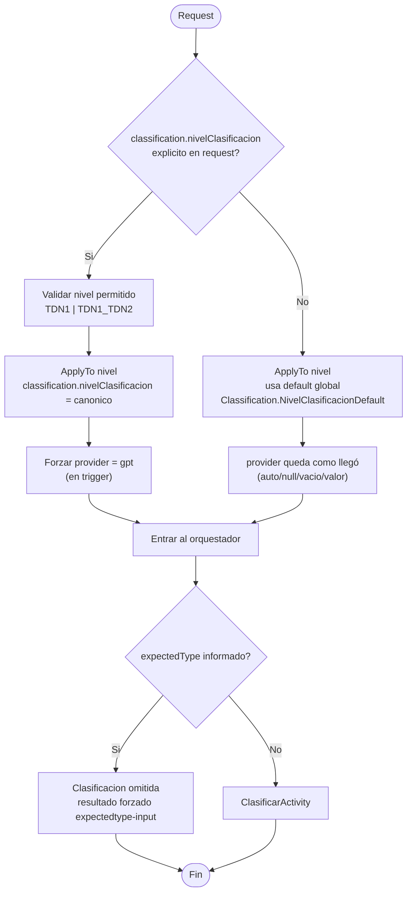
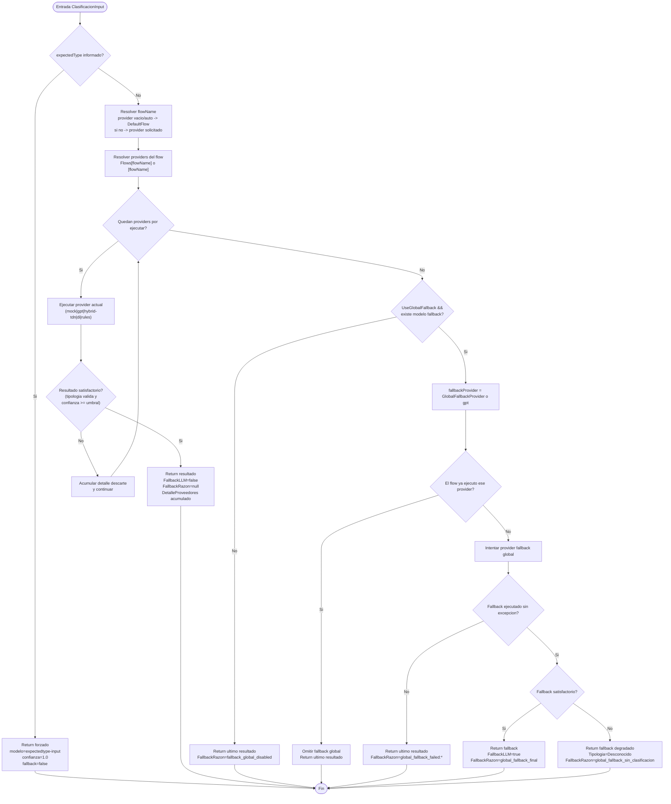

# Grafico temporal v2 - ClasificarActivity

Fecha: 2026-05-27
Ambito: comportamiento de `ClasificarActivity` y su proveedor configurable (`ConfigurableClasificarDataProvider`), considerando instrucciones de entrada y configuracion activa.

## 1) Precedencia efectiva (instrucciones vs configuracion)

1. `instrucciones.expectedType`:
- Si viene informado, `ClasificarActivity` no llama a ningun proveedor y devuelve clasificacion forzada (`confianza=1.0`).

2. `instrucciones.classification.nivelClasificacion`:
- En el trigger (`IngestAPITrigger`), si viene explicito se fuerza `classification.provider = gpt`.
- Si no viene, se aplica el default global (`Classification.NivelClasificacionDefault`).

3. `instrucciones.classification.provider`:
- Si es `null`, vacio o `auto`, se usa `Classification.DefaultFlow` (o `DefaultProvider` legacy).
- Si coincide con una key de `Classification.Flows`, se ejecuta la secuencia configurada.
- Si no coincide con un flow, se interpreta como provider directo unico.

4. `instrucciones.classification.umbral`:
- Se pasa como `UmbralFallbackEfectivo` a Clasificar.
- Es el umbral de satisfaccion del resultado (`confianza >= umbral`).
- Si no viene, se usa `0.6` (en satisfaccion) o fallback model threshold cuando aplica.

5. `Classification.UseGlobalFallback` + modelo fallback en registro:
- Si ningun provider del flow es satisfactorio, decide si se intenta fallback global final.

## 2) Factores de entrada previos que cambian Clasificar

Antes de llamar a `ClasificarActivity`, el orquestador puede modificar el input:

- Recorte para clasificacion (`ClassificationPreparation.Enabled` y max paginas).
- `classificationOnly` con `maxPagesForClassificationOnly` puede limitar mas paginas.
- `instrucciones.classification.markdown` inyecta markdown y evita extraccion previa layout.
- Si no hay markdown, no hay `expectedType` y provider no genera markdown propio, se extrae markdown layout previo.
- `GenerarResumenPorDefecto` se envia en `true` al clasificador.

Nota: `classificationOnly=true` y `expectedType` informado es invalido en trigger (HTTP 400).

## 3) Grafico A - Precedencia nivelClasificacion/proveedor

## 4) Grafico B - Ejecucion de provider/flow en Clasificar

## 5) Criterio de satisfaccion

Un resultado es satisfactorio si se cumplen todos:

- `tipologiaDetectada` no vacia.
- `tipologiaDetectada` distinta de `Desconocido` y `RESTO`.
- `confianza >= umbral`.

Umbral usado:

- `instrucciones.classification.umbral` si viene.
- Si no, base `0.6` para la validacion de satisfaccion del flujo.

## 6) Comportamientos por provider

| Provider | Comportamiento | Notas claves |
|---|---|---|
| `di` (`azure-di`) | Clasifica con Azure Document Intelligence | Usa `classification.model` (si `auto` toma default model de DI). Puede devolver `contentExtraido` y el orquestador lo propaga a markdown cuando aplica. |
| `gpt` | Clasificacion jerarquica GPT (fase TDN1 y opcional TDN2) | Usa modelo fallback marcado en registro (`UseAsFallback=true`). Si `nivelClasificacion=TDN1`, puede devolver `ClasificacionParcial=true`. |
| `hybrid-tdn` | Cadena interna `Reglas -> DI -> Rescate LLM` | Tiene sus propios umbrales (`HybridTdn`). Si todo falla, puede terminar en `Desconocido` o `Error` segun excepcion. |
| `rules` | Solo clasificacion por reglas | Si no cumple umbral, se considera no satisfactorio y el flow continua. |
| `mock` | Proveedor de pruebas | Depende del provider mock configurado. |

## 7) Casos especiales relevantes para salida

1. `ClasificacionParcial=true`:
- Si GPT devuelve tipologia virtual (`Desconocido` con `PropuestaTipologia`), el orquestador puede detener el pipeline temprano con salida de propuesta.
- Si devuelve TDN1 conocido, el pipeline continua.

2. Errores de provider:
- Provider no soportado en flow lanza excepcion.
- Error en fallback global deja el ultimo resultado conocido y marca razon de fallback fallido.

3. Evitar doble GPT:
- Si el flow ya incluyo el provider global fallback, no se reejecuta fallback global.

## 8) Mapa rapido de configuracion que mas impacta

- `Classification.DefaultFlow`
- `Classification.Flows.*.Providers`
- `Classification.UseGlobalFallback`
- `Classification.GlobalFallbackProvider`
- `Classification.NivelClasificacionDefault`
- `HybridTdn.*`
- Registro de modelos de clasificacion (modelo default por provider y modelo fallback)

## 9) Matriz de casos Given/When/Then (automatizable)

Objetivo: validar de forma automatica las reglas de precedencia entre `nivelClasificacion`, `provider`, `DefaultFlow`, `Flows` y bypass por `expectedType`.

### 9.1 Casos unitarios (trigger + proveedor configurable + activity)

| ID | Capa | Given | When | Then |
|---|---|---|---|---|
| UT-01 | Trigger | request sin `classification.nivelClasificacion`; `NivelClasificacionDefault=TDN1_TDN2`; `provider=auto` | Ejecutar validacion y normalizacion en trigger | `classification.nivelClasificacion=TDN1_TDN2`; provider no se fuerza a gpt |
| UT-02 | Trigger | request con `classification.nivelClasificacion=TDN1`; `provider=di` | Ejecutar validacion y normalizacion en trigger | provider final queda en `gpt` (forzado); nivel canonico `TDN1` |
| UT-03 | Trigger | request con `classification.nivelClasificacion=tdn1_tdn2` | Ejecutar trigger | nivel canonico `TDN1_TDN2` |
| UT-04 | Trigger | request con `classification.nivelClasificacion=TDN2`; default valido | Ejecutar trigger | respuesta 400 por nivel invalido |
| UT-05 | Trigger | `NivelClasificacionDefault=TDN3` (config invalida) | Ejecutar trigger | respuesta 500 por configuracion invalida |
| UT-06 | Provider config | `provider=null`; `DefaultFlow=hybrid-rules-gpt-di`; flow definido | Ejecutar `ConfigurableClasificarDataProvider` | orden de intento: rules -> gpt -> di |
| UT-07 | Provider config | `provider=auto`; `DefaultFlow=di`; flows contiene `di=[di]` | Ejecutar proveedor configurable | se ejecuta solo `di` |
| UT-08 | Provider config | `provider=hybrid-rules-di-gpt`; flow definido | Ejecutar proveedor configurable | se ejecuta secuencia exacta del flow |
| UT-09 | Provider config | `provider=di`; flow no definido con ese nombre | Ejecutar proveedor configurable | se interpreta provider unico y ejecuta `di` |
| UT-10 | Provider config | `provider=desconocido`; no flow con esa key | Ejecutar proveedor configurable | lanza `NotSupportedException` |
| UT-11 | Provider config | flow termina no satisfactorio; `UseGlobalFallback=false` | Ejecutar proveedor configurable | devuelve ultimo resultado con razon `fallback_global_disabled` |
| UT-12 | Provider config | flow no satisfactorio; `UseGlobalFallback=true`; `GlobalFallbackProvider=gpt`; flow no incluye gpt | Ejecutar proveedor configurable | ejecuta fallback global gpt |
| UT-13 | Provider config | flow no satisfactorio; `GlobalFallbackProvider=gpt`; flow ya incluyo gpt | Ejecutar proveedor configurable | NO reejecuta gpt en fallback global |
| UT-14 | Activity | input con `expectedType=nota-simple@1.4` | Ejecutar `ClasificarActivity` | retorna `expectedtype-input`, confianza 1.0 y no invoca proveedor |
| UT-15 | Activity | input sin `expectedType` | Ejecutar `ClasificarActivity` | invoca proveedor una vez y retorna su resultado |

### 9.2 Casos de integración (API + orquestador)

| ID | Tipo | Given | When | Then |
|---|---|---|---|---|
| IT-01 | API | payload sin `classification.nivelClasificacion`, `provider=auto`, `DefaultFlow=hybrid-rules-gpt-di` | POST a `IngestDocument` | request aceptada; en ejecucion se observa flujo por default (no forzado por nivel) |
| IT-02 | API | payload con `classification.nivelClasificacion=TDN1`, `provider=di` | POST a `IngestDocument` | request aceptada; provider efectivo en clasificacion es gpt |
| IT-03 | API | payload con `classification.nivelClasificacion=TDN2` | POST a `IngestDocument` | respuesta 400 |
| IT-04 | API | payload con `classificationOnly=true` y `expectedType` informado | POST a `IngestDocument` | respuesta 400 por combinacion invalida |
| IT-05 | Pipeline | payload con `expectedType` informado | Ejecutar proceso completo | clasificacion queda omitida por expectedType |
| IT-06 | Pipeline | payload sin markdown, sin expectedType, provider no DI/CU | Ejecutar proceso completo | orquestador ejecuta pre-layout para contexto antes de clasificar |
| IT-07 | Pipeline | payload con `classification.markdown` informado | Ejecutar proceso completo | se omite pre-layout y se usa markdown inyectado |

### 9.3 Plantilla Given/When/Then (reusable)

Usar esta plantilla para cada test automatizado:

1. Given:
- Config de `ClassificationRoutingSettings` (DefaultFlow, Flows, UseGlobalFallback, GlobalFallbackProvider, NivelClasificacionDefault).
- Request de entrada (ExpectedType, Classification.Provider, Classification.NivelClasificacion, ClassificationOnly, Markdown).
- Mocks/stubs de proveedores (`rules`, `di`, `gpt`, `hybrid`) y resultado esperado por cada uno.

2. When:
- Ejecutar unidad objetivo (trigger, provider configurable, activity, o endpoint de integración).

3. Then:
- Verificar provider efectivo o secuencia ejecutada.
- Verificar estado/HTTP esperado.
- Verificar campos de salida relevantes (`TipologiaDetectada`, `Confianza`, `FallbackLLM`, `FallbackRazon`, bypass por expectedType).

### 9.4 Prioridad de ejecución recomendada

1. Bloqueante (smoke de reglas): UT-01, UT-02, UT-06, UT-10, UT-14, IT-02.
2. Alta (fallback y edge cases): UT-11, UT-12, UT-13, IT-03, IT-04.
3. Media (comportamiento de contexto): IT-06, IT-07.
