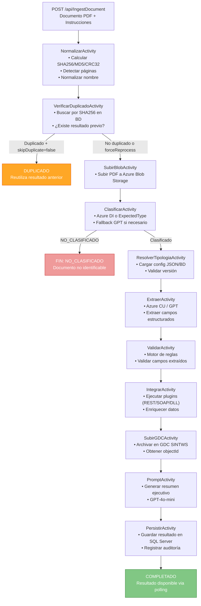
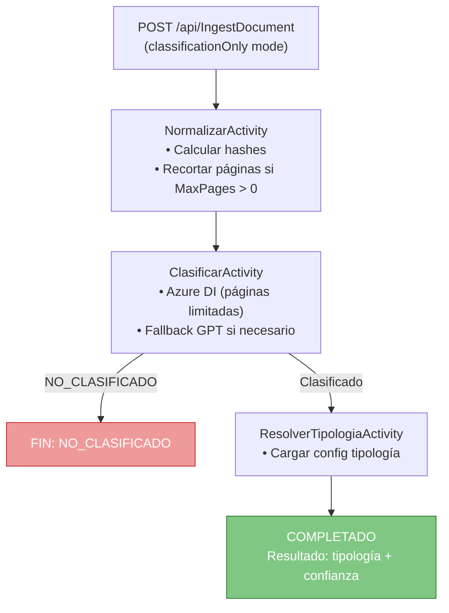
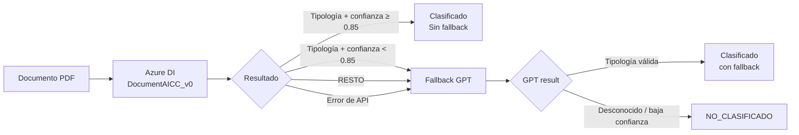
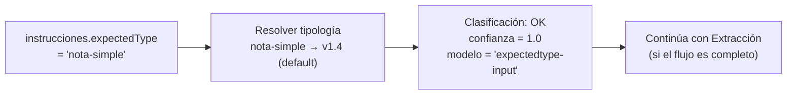
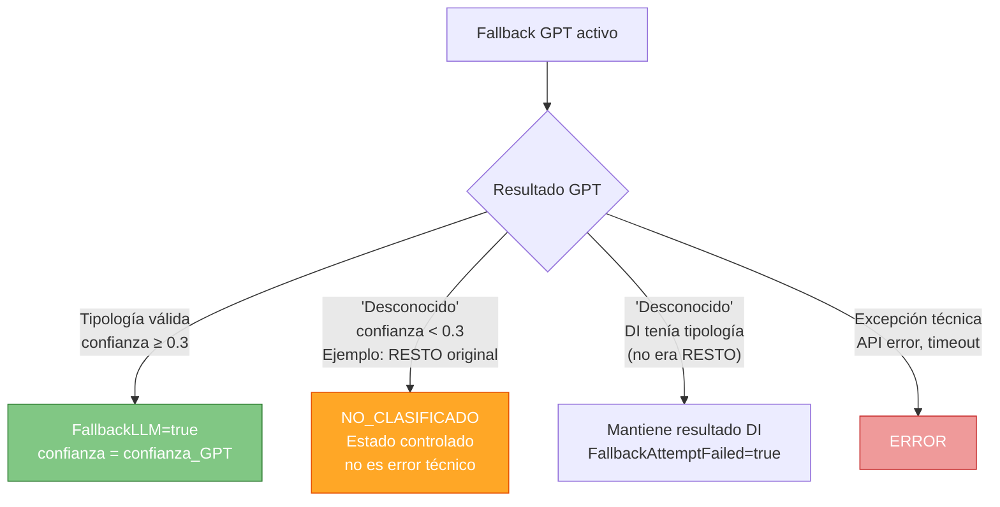
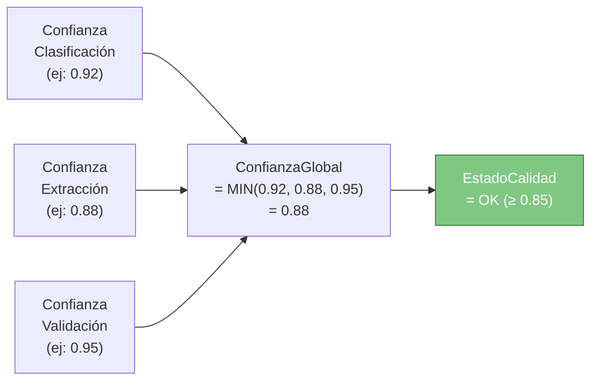
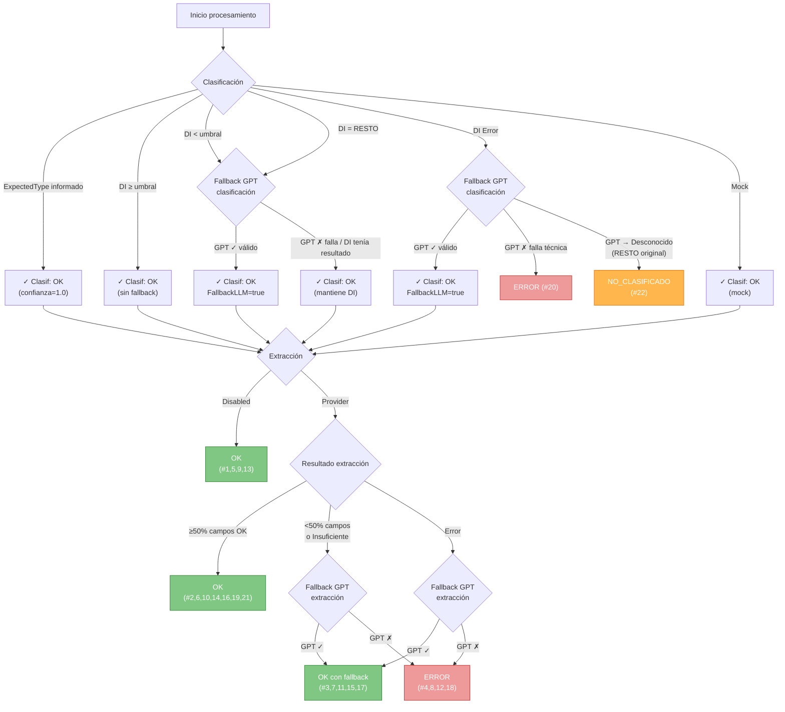
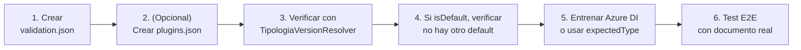
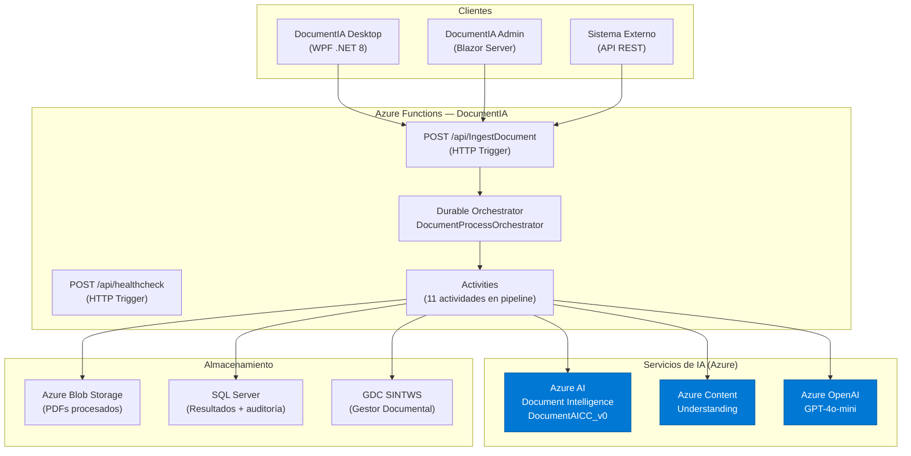

# Guía de Clasificación de Documentos — DocumentIA

> **Proyecto:** AI DocClassExt — SAREB  
> **Audiencia:** Usuarios técnicos, usuarios de negocio, integradores de sistemas

---

## Tabla de Contenidos

1. [Resumen Ejecutivo (Visión de Negocio)](#1-resumen-ejecutivo-visión-de-negocio)
2. [Conceptos Fundamentales](#2-conceptos-fundamentales)
3. [Flujos de Clasificación](#3-flujos-de-clasificación)
   - 3.1 [Flujo Completo (Ingest + Classify + Extract + Validate)](#31-flujo-completo)
   - 3.2 [Flujo Solo Clasificación (Classification Only)](#32-flujo-solo-clasificación)
4. [Modos de Clasificación](#4-modos-de-clasificación)
   - 4.1 [Clasificación Automática (Azure DI)](#41-clasificación-automática-azure-di)
   - 4.2 [Clasificación Forzada (ExpectedType)](#42-clasificación-forzada-expectedtype)
   - 4.3 [Fallback GPT](#43-fallback-gpt)
   - 4.4 [Clasificación Mock (Desarrollo/Test)](#44-clasificación-mock-desarrollotest)
5. [Tipologías Soportadas](#5-tipologías-soportadas)
6. [Sistema de Confianza](#6-sistema-de-confianza)
7. [Configuración de Clasificación](#7-configuración-de-clasificación)
8. [Referencia de la API](#8-referencia-de-la-api)
9. [Ejemplos Prácticos Completos](#9-ejemplos-prácticos-completos)
10. [Casuísticas y Comportamientos Posibles](#10-casuísticas-y-comportamientos-posibles)
11. [Errores Frecuentes y Soluciones](#11-errores-frecuentes-y-soluciones)
12. [Añadir una Nueva Tipología](#12-añadir-una-nueva-tipología)

---

## 1. Resumen Ejecutivo (Visión de Negocio)

### ¿Qué hace DocumentIA?

DocumentIA es un sistema inteligente que **lee, identifica y clasifica documentos inmobiliarios automáticamente**. Cuando le envías un documento (PDF, imagen), el sistema determina qué tipo de documento es —sin que tengas que decírselo— y extrae los datos más relevantes de su contenido.

### ¿Por qué es útil?

| Sin DocumentIA | Con DocumentIA |
|---|---|
| Un operario lee cada documento y anota manualmente el tipo | El sistema detecta el tipo en segundos |
| Entrada de datos manual propensa a errores | Extracción automática con validación de negocio |
| Tiempo de proceso: minutos por documento | Tiempo de proceso: 5–30 segundos por documento |
| Sin trazabilidad ni auditoría automática | Registro completo de cada decisión y su nivel de confianza |

### ¿Cómo funciona a grandes rasgos?

```
Tú envías un PDF  →  DocumentIA lo "lee"  →  Identifica el tipo de documento
     →  Extrae los datos  →  Valida los datos  →  Te devuelve el resultado estructurado
```

### ¿Qué tipos de documentos reconoce?

| Tipo de Documento | Nombre Técnico | Descripción |
|---|---|---|
| **Nota Simple** | `nota-simple` | Documento oficial del Registro de la Propiedad que certifica la situación jurídica de una finca |
| **Tasación** | `tasacion` | Informe técnico que certifica el valor de mercado de un inmueble |
| **Resumen Documental** | `resumen-documental` | Cualquier documento para el que se quiere un resumen automático |
| **IBI** | `IBI` | Recibo del Impuesto sobre Bienes Inmuebles |
| **TDN** | `tdn.clasificacion` | Clasificación jerárquica de documentos jurídicos e inmobiliarios (notariales, escrituras, sentencias) |

### ¿Qué resultado me devuelve?

Tras el procesamiento, recibirás:

- **Tipo de documento** identificado y con qué nivel de certeza
- **Datos extraídos** del documento (campos estructurados)
- **Estado de calidad**: `OK`, `REVISION` o `ERROR`
- **Puntuación de confianza** (0–1) descompuesta por etapa
- Un **resumen ejecutivo** del documento (cuando está configurado)

### Nivel de confianza para usuarios de negocio

| Indicador | Qué significa | Acción recomendada |
|---|---|---|
| **OK** (≥ 0.85) | El sistema tiene alta certeza sobre el documento y sus datos | Procesamiento automático sin revisión |
| **REVISION** (0.70–0.85) | El sistema tiene dudas; los datos pueden ser correctos pero conviene revisar | Revisión humana recomendada |
| **ERROR** (< 0.70) | Alta probabilidad de que algo no sea correcto | Revisión humana obligatoria |
| **NO_CLASIFICADO** | El sistema no pudo identificar el tipo de documento | Intervención manual necesaria |

---

## 2. Conceptos Fundamentales

### 2.1 Tipología

Una **tipología** representa un tipo de documento con su configuración asociada: campos a extraer, reglas de validación, proveedores de IA, y umbrales de confianza.

Una misma tipología puede tener múltiples **versiones** (ej: `nota-simple v1.0`, `v1.3`, `v1.4`). Siempre hay una versión marcada como `isDefault: true` que es la que se usa por defecto.

```
Familia: "nota-simple"
    ├── versión 1.0  (legacy)
    ├── versión 1.2  (legacy)
    ├── versión 1.3  (legacy)
    └── versión 1.4  ← DEFAULT (activa)
```

### 2.2 ExpectedType

Parámetro opcional de la petición. Si lo informas, el sistema **omite la clasificación automática** y usa ese tipo directamente (confianza = 1.0). Útil cuando el sistema origen ya sabe qué tipo de documento es.

```json
"instrucciones": {
  "expectedType": "nota-simple"   // Fuerza la tipología sin clasificación IA
}
```

### 2.3 Confianza

Puntuación numérica de 0 a 1 que indica cuánta certeza tiene el sistema en cada etapa:

- **Confianza de clasificación**: ¿qué seguro estoy de que este es el tipo de documento correcto?
- **Confianza de extracción**: ¿qué completos y fiables son los datos que he extraído?
- **Confianza de validación**: ¿cuántas reglas de negocio ha superado el documento?
- **Confianza global**: el mínimo de las tres anteriores (el eslabón más débil)

### 2.4 Estado vs. Estado de Calidad

Son dos campos independientes en el resultado:

| Campo | Descripción | Valores posibles |
|---|---|---|
| `Estado` | Resultado del proceso (éxito o tipo de fallo) | `OK`, `VALIDACION_CON_ERRORES`, `ERROR`, `DUPLICADO`, `NO_CLASIFICADO` |
| `EstadoCalidad` | Fiabilidad de los datos obtenidos | `OK`, `REVISION`, `ERROR` |

Un documento puede terminar en `Estado=OK` pero `EstadoCalidad=REVISION` (proceso completado, pero con confianza media que requiere revisión humana).

### 2.5 Flujo Asíncrono

El procesamiento es siempre asíncrono:

1. **POST** a `/api/IngestDocument` → respuesta inmediata `202 Accepted` con `instanceId`
2. **GET** a la URL de estado → verificar si está `Running` o `Completed`
3. **Leer resultado** del campo `output` cuando `runtimeStatus = "Completed"`

```
POST /api/IngestDocument
    └─→  202 { instanceId: "abc123" }

GET /runtime/.../instances/abc123
    └─→  { runtimeStatus: "Running", customStatus: { actividad: "Extraer" } }

GET /runtime/.../instances/abc123   (unos segundos después)
    └─→  { runtimeStatus: "Completed", output: { resultado: { estado: "OK" } } }
```

---

## 3. Flujos de Clasificación

### 3.1 Flujo Completo

El flujo completo incluye todas las etapas del pipeline: normalización, detección de duplicados, subida a blob, clasificación, extracción, validación, integración con plugins, subida al GDC y persistencia en base de datos.



#### Actividades del flujo completo y su propósito

| Actividad | Propósito | Tiempo estimado |
|---|---|---|
| `NormalizarActivity` | Calcula hashes (SHA256, MD5, CRC32), detecta páginas, normaliza el nombre del fichero | < 1 s |
| `VerificarDuplicadoActivity` | Detecta si el documento ya fue procesado (por SHA256) | < 1 s |
| `SubirBlobActivity` | Sube el PDF a Azure Blob Storage para trazabilidad y procesamiento posterior | 1–3 s |
| `ClasificarActivity` | Identifica el tipo de documento mediante Azure DI o GPT | 3–15 s |
| `ResolverTipologiaActivity` | Carga la configuración de la tipología detectada | < 1 s |
| `ExtraerActivity` | Extrae campos estructurados del documento (Azure CU o GPT) | 5–20 s |
| `ValidarActivity` | Valida los campos extraídos contra las reglas de negocio | < 1 s |
| `IntegrarActivity` | Ejecuta plugins de enriquecimiento (REST/SOAP/DLL) | 1–10 s |
| `SubirGDCActivity` | Archiva el documento en el GDC corporativo (SINTWS SOAP) | 2–8 s |
| `PromptActivity` | Genera un resumen ejecutivo del documento usando LLM | 3–8 s |
| `PersistirActivity` | Persiste el resultado completo en SQL Server | < 1 s |

**Tiempo total estimado:** 15–60 segundos (variable según tamaño del documento y latencia de servicios externos).

---

### 3.2 Flujo Solo Clasificación

El flujo de **solo clasificación** es un modo optimizado que detiene el pipeline tras identificar el tipo de documento, sin ejecutar extracción, validación, plugins ni persistencia completa.

> **Cuándo usar:** Cuando solo necesitas saber qué tipo de documento es, sin procesar su contenido ni integrar con sistemas externos.



#### Activar el modo solo clasificación

Se activa mediante el parámetro `instrucciones.classificationOnly` (o el script dedicado) con la instrucción de no ejecutar extracción:

```json
{
  "instrucciones": {
    "skipDuplicateCheck": true,
    "classification": {
      "provider": "auto",
      "model": "auto",
      "umbral": 0.50
    },
    "extraction": {
      "provider": "mock"
    }
  },
  "documento": {
    "name": "documento_desconocido.pdf",
    "content": { "base64": "<BASE64>" }
  }
}
```

#### Diferencias entre flujo completo y solo clasificación

| Característica | Flujo Completo | Solo Clasificación |
|---|---|---|
| Actividades ejecutadas | Todas (11 actividades) | 3–4 actividades |
| Extracción de datos | Sí | No |
| Validación de campos | Sí | No |
| Plugins de enriquecimiento | Sí | No |
| Subida a GDC | Sí (si configurado) | No |
| Persistencia en BD | Completa | Mínima (solo clasificación) |
| Tiempo estimado | 15–60 s | 4–18 s |
| Coste estimado (tokens IA) | Alto | Bajo |
| Ideal para | Procesamiento definitivo | Pre-clasificación, enrutamiento, validación masiva |

---

## 4. Modos de Clasificación

### 4.1 Clasificación Automática (Azure DI)

El modo por defecto. El sistema envía el documento a **Azure AI Document Intelligence** (modelo custom `DocumentAICC_v0`) que devuelve una tipología y una puntuación de confianza.



**Configuración del modelo de clasificación:**

```json
// config/classification/models.json
{
  "Models": [
    {
      "Key": "default.azure-di",
      "Provider": "azure-document-intelligence",
      "ClassifierId": "DocumentAICC_v0",
      "ApiVersion": "2024-11-30",
      "IsDefault": true,
      "UseAsFallback": false,
      "TimeoutSeconds": 120
    },
    {
      "Key": "classification.gpt4o-mini-fallback",
      "Provider": "azure-openai",
      "IsDefault": false,
      "UseAsFallback": true,
      "DeploymentName": "gpt-4o-mini",
      "TimeoutSeconds": 30,
      "MaxTokens": 150
    }
  ]
}
```

**Umbral de confianza configurable por petición:**

```json
"instrucciones": {
  "classification": {
    "provider": "auto",
    "model": "auto",
    "umbral": 0.85    // ← Se puede ajustar por petición (0.0 – 1.0)
  }
}
```

| Umbral | Comportamiento |
|---|---|
| `0.85` (default) | Fallback GPT si DI < 0.85 |
| `0.50` | Acepta clasificaciones DI con confianza ≥ 0.50, fallback solo si < 0.50 |
| `1.0` | Siempre fallback GPT (DI nunca supera 1.0) |
| `0.0` | Nunca fallback (acepta cualquier confianza DI, excepto RESTO) |

---

### 4.2 Clasificación Forzada (ExpectedType)

Cuando el sistema de origen ya conoce el tipo de documento, puede informar `expectedType` para **saltarse la clasificación automática**. El sistema usa directamente esa tipología con `confianza = 1.0` y el modelo registrado como `"expectedtype-input"`.

```json
// Ejemplo: forzar clasificación como Nota Simple v1.4
{
  "instrucciones": {
    "expectedType": "nota-simple",
    "skipDuplicateCheck": false
  }
}
```

**Formatos válidos para `expectedType`:**

| Formato | Ejemplo | Resultado |
|---|---|---|
| Nombre de familia | `"nota-simple"` | Usa la versión `isDefault: true` (actualmente v1.4) |
| Familia@versión | `"nota-simple@1.3"` | Usa exactamente la versión 1.3 |
| Clave técnica | `"nota.simple.1_3"` | Usa la clave técnica directa |

**Comportamiento con `expectedType` informado:**



> **Nota:** Si el `expectedType` no existe en el registro de tipologías, el proceso termina en `ERROR` con `KeyNotFoundException`.

---

### 4.3 Fallback GPT

Cuando Azure DI no puede clasificar con suficiente confianza, el sistema activa automáticamente el **fallback GPT** (modelo `gpt-4o-mini`).

#### Tipologías incluidas en el prompt GPT

El sistema construye dinámicamente la lista de tipologías que ofrece al LLM a partir de la tabla `Tipologias` en base de datos. Se incluyen **todas las tipologías con estado `Published` y activas que tengan un `tipologiaId` válido**, usando el campo `gptDescripcion` como descripción semántica (si está vacío, se usa `tipologiaNombre` como fallback).

> **Comportamiento de caché:** el prompt se regenera desde BD como máximo cada 5 minutos (IMemoryCache TTL). Si se publica o modifica una tipología, el cambio se refleja en el siguiente ciclo.

| Campo JSON | Uso en el prompt |
|---|---|
| `tipologiaId` | Identificador que el LLM debe devolver |
| `gptDescripcion` | Descripción semántica optimizada para el LLM |
| `tipologiaNombre` | Fallback si `gptDescripcion` está vacío |

Las tipologías con el mismo `tipologiaId` (distintas versiones de la misma familia) aparecen **una sola vez** en el prompt — se usa la primera encontrada para evitar duplicados.

#### Condiciones que activan el fallback

| Condición | `FallbackRazon` en el resultado | ¿Fallback obligatorio? |
|---|---|---|
| DI devuelve `RESTO` | `resto_classification:{confianza}` | **Sí siempre** |
| DI con `confianza < umbral` | `low_confidence:{confianza}` | Sí si < umbral |
| Error/timeout de la API de DI | `exception:{mensaje}` | Sí si hay resultado DI parcial |

#### Qué ocurre si el fallback también falla

| Situación del fallback GPT | Resultado final |
|---|---|
| GPT devuelve tipología con confianza ≥ 0.3 | Clasificado (con `FallbackLLM=true`) |
| GPT devuelve "Desconocido" o confianza < 0.3 (RESTO) | `NO_CLASIFICADO` (fin controlado) |
| GPT devuelve "Desconocido" pero DI tenía resultado < umbral | El proceso mantiene el resultado DI (no termina en error) |
| GPT lanza excepción técnica | `ERROR` |



---

### 4.4 Clasificación Mock (Desarrollo/Test)

En entornos de desarrollo, se puede usar el proveedor `mock` que devuelve siempre una tipología predefinida sin llamar a ningún servicio externo.

```json
"instrucciones": {
  "classification": {
    "provider": "mock",
    "model": "auto"
  }
}
```

> Útil para: tests unitarios, desarrollo local sin conectividad a Azure, validación de flujos de extracción sin depender de la clasificación.

---

## 5. Tipologías Soportadas

### 5.1 Inventario completo

> **Estado BD:** 15 tipologías Published+Activa (mayo 2026). 14 tienen `gptDescripcion` configurada y participan en el fallback GPT.

#### Tipologías de extracción y prompt (motor clásico)

| Familia | Clave técnica | GDC | Extracción | Prompt | Skip GDC | `gptDescripcion` |
|---|---|---|---|---|---|---|
| `nota-simple` (v1.4, default) | `nota.simple.1_4` | NOTS/NOTS01 | Azure CU | gpt4o-mini | No | Sí |
| `nota-simple` (v1.0, legacy) | `nota.simple` | NOTS/NOTS01 | Ninguna | No | No | Sí |
| `tasacion` | `tasacion` | — | Ninguna | No | **Sí** | Sí |
| `resumen-documental` | `resumen.documental` | — | Mock | vision | **Sí** | Sí |
| `IBI` (v1.1, DB-backed) | `IBI_1.1` | — | Azure OpenAI | No | **Sí** | Sí |
| `general-prompting` | `general-prompting` | — | — | Sí | **Sí** | No |

#### Tipologías TDN de clasificación jurídica (motor Hybrid)

> Estas tipologías son clasificadas por el motor `HybridTdnClasificarProvider` (reglas → DI → rescate LLM). No tienen extracción de campos ni subida a GDC.

| Código BD | tipologiaId | Familia TDN | Descripción resumida | `gptDescripcion` |
|---|---|---|---|---|
| `ESCR-01` | `escr.titularidad.otro` | Escrituras | Cancelación hipoteca, carta de pago | Sí |
| `ESCR-06` | `escr.titularidad.otro` | Escrituras | Dación en pago, adjudicación | Sí |
| `ESCR-10` | `escr.compraventa` | Escrituras | Compraventa inmobiliaria | Sí |
| `ESCR-26` | `escr.titularidad.otro` | Escrituras | Titularidad residual (dominio, propiedad) | Sí |
| `ESCR-29` | `escr.titularidad.otro` | Escrituras | Titularidad acreditada contractual/notarial | Sí |
| `DOCN-06` | `docn.complementario` | Documentos notariales | Acta/escritura complementaria o subsanación | Sí |
| `SERE-24` | `sere.ejecucion` | Sentencias/Resoluciones | Ejecución hipotecaria judicial | Sí |
| `SERE-25` | `sere.cancelacion` | Sentencias/Resoluciones | Mandamiento cancelación cargas | Sí |
| `SERE-26` | `sere.adjudicacion` | Sentencias/Resoluciones | Testimonio judicial de adjudicación | Sí |

### 5.2 Nota Simple (v1.4 — default)

**Descripción:** Nota simple registral española. Documento oficial del Registro de la Propiedad que certifica la situación jurídica de una finca: titular dominical, cargas, hipotecas, servidumbres y gravámenes.

**Campos extraídos:**

| Campo | Obligatorio | Tipo | Regla de validación | Severidad |
|---|---|---|---|---|
| `FincaRegistral` | Sí | string | minLength=1, maxLength=30 | Error |
| `RegistroPropiedad` | No | string | minLength=3, maxLength=120 | Error |
| `MunicipioRegistro` | No | string | maxLength=80 | Warning |
| `IDUFIR_CRU` | No | string | regex `^[0-9]{14}$` | Warning |
| `Registrador` | No | string | minLength=3, maxLength=120 | Error |
| `FechaDocumento` | Sí | date | formatos `dd/MM/yyyy`/`yyyy-MM-dd`, no futura | Error |
| `NumeroAsientoPresentacion` | No | string | maxLength=40 | Warning |
| `Direccion` | No | string | address (min=6, max=160, número+municipio+provincia) | Warning |
| `ReferenciaCatastral` | No | string | catastral | Warning |
| `CodigoPostal` | No | string | regex `^[0-9]{5}$` | Warning |
| `Provincia` | No | string | maxLength=50 | Warning |
| `Municipio` | No | string | — | Warning |

**Configuración de confianza:**

```json
"confidenceConfig": {
  "clasifUmbralFallback": 0.85,
  "extracUmbralFallback": 0.9,
  "extracWeightCampos": 0.5,
  "extracWeightRequeridos": 0.3,
  "extracWeightWarnings": 0.2,
  "umbralOK": 0.85,
  "umbralRevision": 0.70
}
```

**Plugins activos (v1.4):**

| Plugin | Tipo | URL | Propósito | Prioridad |
|---|---|---|---|---|
| `refCatExcel` | REST | `http://localhost:8082/enriquecer` | Enriquecimiento por referencia catastral | 1 (crítico) |

### 5.3 Tasación (v1.0)

**Descripción:** Informe de tasación inmobiliaria. Certifica el valor de mercado de un inmueble.

**Campos extraídos:**

| Campo | Obligatorio | Tipo | Regla | Severidad |
|---|---|---|---|---|
| `ValorTasado` | Sí | decimal | rango [1.000 – 2.000.000] | Error |
| `FechaDocumento` | Sí | date | formatos `dd/MM/yyyy`/`yyyy-MM-dd`, no futura | Error |
| `Direccion` | No | string | address (min=6, max=160) | — |
| `NIF` | No | string | nif | Warning |
| `ReferenciaCatastral` | No | string | catastral | Warning |

> La tasación **no sube al GDC** (`skipGDCUpload: true`) y **no tiene extracción configurada** en la versión actual (los datos se reciben directamente o se procesan en otro sistema).

### 5.4 Resumen Documental (v1.0)

**Descripción:** Tipología genérica para documentos de los que solo se quiere un resumen. No valida campos específicos.

- No tiene campos de validación (array vacío).
- Extracción: `disabled` (provider mock).
- Prompt activado con modo `vision` (envía imagen del documento al LLM).
- No sube al GDC.

### 5.5 IBI (v1.0 — DB-backed)

**Descripción:** Recibo del Impuesto sobre Bienes Inmuebles emitido por el ayuntamiento.

> **Esta tipología está almacenada en base de datos**, no en ficheros JSON en disco. Usa `extraction.provider = "azure-openai"` → extracción directa con GPT.

**Campos extraídos:**

| Campo | Obligatorio | Tipo | Regla |
|---|---|---|---|
| `FechaDocumento` | Sí | date | formatos `dd/MM/yyyy`/`yyyy-MM-dd`, no futura |
| `Direccion` | No | string | address (min=6, max=160) |
| `NIF` | No | string | nif |
| `ReferenciaCatastral` | No | string | catastral |

### 5.6 TDN Clasificación (v1.0)

**Descripción:** Clasificación jerárquica de documentos jurídicos e inmobiliarios. Organiza documentos en tres niveles: TDN1 → TDN2 → Matrícula.

**Familias TDN1 soportadas:**

| Código TDN1 | Nombre | Ejemplos de subtipo |
|---|---|---|
| `DOCN` | Documentos notariales | `cambio-titularidad-sareb` |
| `ESCR` | Escrituras | `compraventa`, `dacion`, `cancelacion-hipotecaria`, `prestamo-originario` |
| `SERE` | Sentencias y resoluciones judiciales | `subasta-adjudicacion-auto`, `subasta-cancelacion-cargas` |

- **Sin extracción** de campos (solo clasificación jerárquica).
- **Sin prompt**.
- **No sube al GDC** (`skipGDCUpload: true`).
- Policy de clasificación avanzada con control de páginas y umbrales por ambigüedad.

---

## 6. Sistema de Confianza

### 6.1 Cálculo de la confianza global

La confianza global es el **mínimo de las tres etapas**:

$$\text{ConfianzaGlobal} = \min(\text{ConfianzaClasif}, \text{ConfianzaExtrac}, \text{ConfianzaValidación})$$

> Si la extracción está deshabilitada para la tipología, se omite del cálculo.



### 6.2 Umbrales de calidad

| Estado | Rango de confianza | Descripción |
|---|---|---|
| **OK** | ≥ 0.85 | Procesamiento automático sin revisión humana |
| **REVISION** | 0.70 – 0.84 | Revisión humana recomendada |
| **ERROR** | < 0.70 | Alta probabilidad de dato incorrecto |

### 6.3 Fórmula de confianza de clasificación

```
Si se usó fallback GPT:
    confianza = CLAMP(confianza_GPT ?? confianza_DI ?? 0.5, 0, 1)

Si no se usó fallback:
    confianza = CLAMP(confianza_DI ?? 0.0, 0, 1)
```

### 6.4 Fórmula de confianza de extracción (Azure CU)

$$\text{ConfianzaExtrac} = w_{campos} \cdot \text{AvgConf} + w_{req} \cdot \text{RatioRequeridos} + w_{warn} \cdot (1 - \text{RatioWarnings})$$

| Variable | Descripción | Peso default (nota-simple 1.4) |
|---|---|---|
| `AvgConf` | Promedio de confianza individual de campos según CU | `w_campos = 0.50` |
| `RatioRequeridos` | Campos obligatorios presentes / total obligatorios | `w_req = 0.30` |
| `1 - RatioWarnings` | Penalización por warnings de validación | `w_warn = 0.20` |

**Ejemplo de cálculo:**

```
AvgConf = 0.90 (Azure CU informa 90% confianza media)
RatioRequeridos = 1.0 (todos los campos obligatorios presentes)
RatioWarnings = 0.10 (10% de campos con warning)

ConfianzaExtrac = 0.50×0.90 + 0.30×1.0 + 0.20×(1-0.10)
               = 0.45 + 0.30 + 0.18
               = 0.93
```

### 6.5 Fórmula de confianza de validación

$$\text{ConfianzaValidación} = 1 - \frac{\text{errores}}{\text{reglasRequeridas}}$$

```
Ejemplo: 2 errores sobre 10 reglas requeridas
ConfianzaValidación = 1 - (2/10) = 0.80  → EstadoCalidad: REVISION
```

---

## 7. Configuración de Clasificación

### 7.1 Jerarquía de configuración

La configuración se aplica en orden de prioridad descendente:

```
Petición HTTP (instrucciones)
    ↓ Si no informado
Configuración de tipología (validation.json)
    ↓ Si no informado
Configuración global del servidor (appsettings.json)
    ↓ Si no informado
Valores por defecto del sistema
```

### 7.2 Parámetros configurables por petición

```json
{
  "instrucciones": {
    "expectedType": "nota-simple",           // Forzar tipología (omite clasificación IA)
    "skipDuplicateCheck": false,             // Omitir verificación de duplicados
    "forceReprocess": false,                 // Forzar reproceso aunque sea duplicado
    "skipGDCUpload": null,                   // null=respetar config tipología, true/false=forzar
    "classification": {
      "provider": "auto",                    // auto|azure-document-intelligence|mock
      "model": "auto",                       // auto (usar modelo default configurado)
      "umbral": 0.85                         // Umbral fallback (0.0–1.0)
    },
    "extraction": {
      "provider": "auto",                    // auto|azure-content-understanding|azure-openai|mock
      "model": "auto",                       // Clave del modelo en ModeloConfigs
      "umbral": 0.80                         // Umbral mínimo de campos para aceptar extracción
    },
    "prompt": {
      "systemPrompt": "Eres un experto...",  // Override del system prompt de la tipología
      "userPromptTemplate": "Resumen: {{CONTENT}}",
      "modelKey": "default.gpt4o-mini",
      "temperature": 0.0,                    // 0.0–2.0
      "maxTokens": 1200,                     // 100–4000
      "contentMode": "markdown"             // markdown|vision
    }
  }
}
```

### 7.3 Estructura de un fichero de validación de tipología

```json
// config/tipologias/<familia>.<version>.validation.json
{
  "tipologiaId": "nota-simple",
  "tipologiaNombre": "Nota Simple",
  "version": "1.4",
  "isDefault": true,         // true = versión por defecto de la familia (para resolución de ExpectedType)
  "skipGDCUpload": false,
  "gptDescripcion": "Nota simple registral española...",  // descripción semántica para prompt fallback GPT

  // Configuración de extracción IA
  "extraction": {
    "enabled": true,
    "provider": "azure-content-understanding",
    "modelKey": "nota.simple.1_4.azure-cu",
    "autoMapUnmappedFields": true,
    "fieldMappings": []
  },

  // Configuración de prompt/resumen
  "promptConfig": {
    "enabled": true,
    "modelKey": "default.gpt4o-mini",
    "systemPrompt": "Eres un analista documental...",
    "userPromptTemplate": "Genera un resumen ejecutivo...\n\nContenido:\n{contenido}",
    "maxTokens": 1600,
    "temperature": 0,
    "contentMode": "markdown"
  },

  // Umbrales de confianza
  "confidenceConfig": {
    "clasifUmbralFallback": 0.85,
    "extracUmbralFallback": 0.9,
    "extracWeightCampos": 0.5,
    "extracWeightRequeridos": 0.3,
    "extracWeightWarnings": 0.2,
    "umbralOK": 0.85,
    "umbralRevision": 0.70
  },

  // Campos a validar tras la extracción
  "fields": [
    {
      "name": "FincaRegistral",
      "type": "string",
      "required": true,
      "rules": [
        { "ruleType": "minLength", "severity": "Error", "parameters": { "value": 1 } },
        { "ruleType": "maxLength", "severity": "Error", "parameters": { "value": 30 } }
      ]
    }
    // ... más campos
  ]
}
```

### 7.4 Estructura de un fichero de plugins

```json
// config/tipologias/<familia>.<version>.plugins.json
{
  "tipologiaId": "nota-simple",
  "plugins": [
    {
      "pluginKey": "refCatExcel",
      "pluginType": "rest",             // rest|soap|custom
      "enabled": true,
      "priority": 1,                    // 1 = crítico (fallo termina proceso)
      "returnsIdActivo": true,          // ¿El plugin devuelve idActivo?
      "configuration": {
        "baseUrl": "http://localhost:8082",
        "endpoint": "/enriquecer",
        "method": "POST",
        "authType": "None"
      }
    }
  ]
}
```

> **Prioridad de plugin:** Si el plugin con `priority=1` falla, el proceso termina en `ERROR` sin llegar a `PersistirActivity`. Plugins con prioridad > 1 son no críticos.

### 7.5 Tipos de reglas de validación disponibles

| Tipo de regla | Descripción | Ejemplo de parámetros |
|---|---|---|
| `minLength` | Longitud mínima del texto | `{ "value": 1 }` |
| `maxLength` | Longitud máxima del texto | `{ "value": 120 }` |
| `date` | Validación de fecha | `{ "formats": ["dd/MM/yyyy"], "allowFuture": false }` |
| `regex` | Expresión regular | `{ "pattern": "^[0-9]{14}$" }` |
| `range` | Rango numérico | `{ "min": 1000, "max": 2000000 }` |
| `nif` | Validación de NIF/NIE/CIF español | _(sin parámetros adicionales)_ |
| `catastral` | Validación de referencia catastral | _(sin parámetros adicionales)_ |
| `address` | Validación de dirección postal | `{ "minLength": 6, "maxLength": 160, "requireStreetNumber": true }` |

---

## 8. Referencia de la API

### 8.1 Endpoint principal

```
POST /api/IngestDocument
Content-Type: application/json
x-functions-key: <function-key>    (producción)
```

**URL base:**
- Local: `http://localhost:7071`
- Azure: `https://srbappprodocai.azurewebsites.net`

### 8.2 Estructura completa de la petición

```json
{
  "instrucciones": {
    "expectedType": "string | null",
    "skipDuplicateCheck": false,
    "forceReprocess": false,
    "skipGDCUpload": null,
    "classification": {
      "provider": "auto",
      "model": "auto",
      "umbral": 0.85
    },
    "extraction": {
      "provider": "auto",
      "model": "auto",
      "umbral": 0.80
    },
    "prompt": {
      "systemPrompt": "string | null",
      "userPromptTemplate": "string | null",
      "modelKey": "string | null",
      "temperature": 0.0,
      "maxTokens": 1200,
      "contentMode": "markdown | vision"
    },
    "assetResolver": {
      "enabled": null,
      "camposBusqueda": {
        "idufir": "string | null",
        "referenciaCatastral": "string | null"
      },
      "camposSolicitados": ["ID_ACTIVO_SAREB"]
    }
  },
  "documento": {
    "name": "mi_documento.pdf",
    "objectIdGDC": null,
    "content": {
      "base64": "<PDF_EN_BASE64>"
    }
  },
  "trazabilidad": {
    "correlationId": "uuid-o-string-personalizado",
    "submittedBy": "sistema-origen",
    "idActivo": "ID_ACTIVO_OPCIONAL"
  }
}
```

> **Regla importante:** `documento.objectIdGDC` y `documento.content.base64` son mutuamente excluyentes. Debes usar uno u otro.

### 8.3 Respuesta del endpoint (202 Accepted)

```json
{
  "instanceId": "abc123def456ghi789",
  "statusQueryUri": "https://host/runtime/webhooks/durabletask/instances/abc123def456ghi789",
  "correlationId": "mi-correlation-id"
}
```

### 8.4 Estructura del resultado final (Completed)

```json
{
  "runtimeStatus": "Completed",
  "output": {
    "identificacion": {
      "documento": "nota_simple_123.pdf",
      "guid": "xxxxxxxx-xxxx-xxxx-xxxx-xxxxxxxxxxxx",
      "tipologia": "nota.simple.1_4",
      "tipologiaFamilia": "nota-simple",
      "tipologiaVersion": "1.4",
      "fechaProceso": "2026-05-19T10:00:10Z",
      "paginas": 5
    },
    "integridad": {
      "crc32": "a1b2c3d4",
      "sha256": "abcdef0123456789...",
      "md5": "fedcba9876543210...",
      "rutaBlobStorage": "documents/nota_simple_123.pdf",
      "gestorDocumental": "GDC",
      "idActivo": "ACTIVO-001",
      "idActivoEntrada": null,
      "idActivoCambiado": false
    },
    "datosExtraidos": {
      "FincaRegistral": "12345",
      "RegistroPropiedad": "REGISTRO DE LA PROPIEDAD DE CHIVA 1",
      "FechaDocumento": "2026-01-15",
      "IDUFIR_CRU": "12345678901234",
      "Direccion": "Calle Mayor 1, 46370 Chiva, Valencia",
      "ReferenciaCatastral": "1234567AB0000A0001ZZ",
      "CodigoPostal": "46370",
      "Provincia": "Valencia",
      "Municipio": "Chiva",
      "PromptResult": "1) Objetivo: certifica situación jurídica de finca...\n2) Datos clave: ..."
    },
    "resultado": {
      "estado": "OK",
      "mensajeError": null,
      "confianzaGlobal": 0.92,
      "estadoCalidad": "OK",
      "confianzaClasificacion": 0.95,
      "confianzaExtraccion": 0.91,
      "confianzaValidacion": 0.92,
      "reutilizadaPorDuplicado": false
    },
    "detalleEjecucion": {
      "instanceId": "abc123def456...",
      "clasificacion": {
        "tipologiaDetectada": "nota.simple.1_4",
        "clasificador": "DocumentAICC_v0",
        "confianza": 0.95,
        "fallbackLLM": false,
        "fallbackRazon": null,
        "pagesProcessed": 3
      },
      "extraccion": {
        "proveedor": "azure-content-understanding",
        "camposExtraidos": 10,
        "camposTotales": 12,
        "metricas": {
          "promedioConfianza": 0.93,
          "ratioRequeridos": 1.0
        }
      },
      "validacion": {
        "errores": 0,
        "warnings": 2,
        "totalReglas": 12
      }
    }
  }
}
```

### 8.5 Estados posibles del campo `resultado.estado`

| Estado | Descripción |
|---|---|
| `OK` | Procesamiento completado correctamente |
| `VALIDACION_CON_ERRORES` | Completado pero con errores de validación de campos |
| `ERROR` | Error técnico en alguna actividad del pipeline |
| `DUPLICADO` | Documento ya procesado; se reutiliza el resultado anterior |
| `NO_CLASIFICADO` | No se pudo identificar el tipo de documento |

---

## 9. Ejemplos Prácticos Completos

### Ejemplo 1: Flujo mínimo — Clasificación automática

El caso más simple: enviar un documento sin configuración adicional para que el sistema lo clasifique y procese automáticamente.

```powershell
# PowerShell — Flujo mínimo
$pdf = [IO.File]::ReadAllBytes("C:\docs\nota_simple.pdf")
$b64 = [Convert]::ToBase64String($pdf)

$body = @{
    documento = @{
        name = "nota_simple.pdf"
        content = @{ base64 = $b64 }
    }
    trazabilidad = @{
        correlationId = [guid]::NewGuid().ToString()
        submittedBy = "mi-sistema"
    }
} | ConvertTo-Json -Depth 5

$r = Invoke-RestMethod -Method POST `
    -Uri "http://localhost:7071/api/IngestDocument" `
    -ContentType "application/json" `
    -Body $body

Write-Host "InstanceId: $($r.instanceId)"
```

```bash
# curl — Flujo mínimo
BASE64=$(base64 -w0 nota_simple.pdf)
curl -X POST http://localhost:7071/api/IngestDocument \
  -H "Content-Type: application/json" \
  -d "{
    \"documento\": {
      \"name\": \"nota_simple.pdf\",
      \"content\": { \"base64\": \"$BASE64\" }
    },
    \"trazabilidad\": {
      \"correlationId\": \"$(uuidgen)\",
      \"submittedBy\": \"mi-sistema\"
    }
  }"
```

---

### Ejemplo 2: Clasificación forzada por tipo conocido

Cuando el sistema origen ya sabe qué tipo de documento es:

```json
{
  "instrucciones": {
    "expectedType": "nota-simple",
    "skipDuplicateCheck": false
  },
  "documento": {
    "name": "NS_30000876.pdf",
    "content": { "base64": "<BASE64>" }
  },
  "trazabilidad": {
    "correlationId": "BATCH-2026-0519-001",
    "submittedBy": "sistema-batch",
    "idActivo": "354937"
  }
}
```

**Resultado esperado:**
```json
{
  "resultado": {
    "estado": "OK",
    "confianzaClasificacion": 1.0
  },
  "detalleEjecucion": {
    "clasificacion": {
      "clasificador": "expectedtype-input",
      "fallbackLLM": false,
      "confianza": 1.0
    }
  }
}
```

---

### Ejemplo 3: Clasificación automática con umbral bajo (modo permisivo)

Para documentos donde se acepta clasificar aunque la confianza de DI sea baja:

```json
{
  "instrucciones": {
    "skipDuplicateCheck": true,
    "forceReprocess": true,
    "classification": {
      "provider": "auto",
      "model": "auto",
      "umbral": 0.50
    }
  },
  "documento": {
    "name": "documento_dudoso.pdf",
    "content": { "base64": "<BASE64>" }
  },
  "trazabilidad": {
    "correlationId": "TEST-LOW-CONF-001",
    "submittedBy": "validacion.calidad"
  }
}
```

---

### Ejemplo 4: Clasificación con fallback GPT explícito

Cuando se quiere forzar siempre el fallback a GPT (útil para tipos difíciles o documentos escaneados):

```json
{
  "instrucciones": {
    "classification": {
      "provider": "auto",
      "model": "auto",
      "umbral": 1.0
    }
  },
  "documento": {
    "name": "documento_escaneado.pdf",
    "content": { "base64": "<BASE64>" }
  },
  "trazabilidad": {
    "correlationId": "FORCE-GPT-001",
    "submittedBy": "qa-team"
  }
}
```

> Al establecer `umbral=1.0`, ningún resultado de Azure DI superará el umbral (DI max = 1.0 en teoría, pero rara vez lo alcanza), forzando el fallback GPT.

---

### Ejemplo 5: Clasificación con versión específica de tipología

```json
{
  "instrucciones": {
    "expectedType": "nota-simple@1.3"
  },
  "documento": {
    "name": "nota_simple_legacy.pdf",
    "content": { "base64": "<BASE64>" }
  },
  "trazabilidad": {
    "correlationId": "LEGACY-1.3-001",
    "submittedBy": "sistema-legacy"
  }
}
```

---

### Ejemplo 6: Solo clasificación (sin extracción ni validación)

Para enrutamiento de documentos o pre-clasificación masiva:

```json
{
  "instrucciones": {
    "skipDuplicateCheck": true,
    "classification": {
      "provider": "auto",
      "umbral": 0.50
    },
    "extraction": {
      "provider": "mock"
    },
    "skipGDCUpload": true
  },
  "documento": {
    "name": "doc_sin_procesar.pdf",
    "content": { "base64": "<BASE64>" }
  },
  "trazabilidad": {
    "correlationId": "CLASSIFY-ONLY-2026-001",
    "submittedBy": "router.documentos"
  }
}
```

---

### Ejemplo 7: Con prompt ad-hoc personalizado

Ejecutar un prompt propio sin necesitar configurar la tipología:

```json
{
  "instrucciones": {
    "expectedType": "nota-simple",
    "prompt": {
      "systemPrompt": "Eres un experto en documentos inmobiliarios españoles. Responde en español, sin inventar datos.",
      "userPromptTemplate": "Del siguiente documento, extrae en formato JSON los campos: NIF del titular, nombre completo del titular, y fecha de expedición.\n\nDocumento:\n{{CONTENT}}",
      "modelKey": "default.gpt4o-mini",
      "temperature": 0.0,
      "maxTokens": 500,
      "contentMode": "markdown"
    }
  },
  "documento": {
    "name": "nota_simple_consulta.pdf",
    "content": { "base64": "<BASE64>" }
  },
  "trazabilidad": {
    "correlationId": "PROMPT-ADHOC-001",
    "submittedBy": "analista.juridico"
  }
}
```

**El resultado en `datosExtraidos["PromptResult"]`:**
```
{
  "NIF": "12345678A",
  "NombreTitular": "Juan García Martínez",
  "FechaExpedicion": "15/01/2026"
}
```

---

### Ejemplo 8: Documento ya archivado en GDC (por objectId)

Procesar un documento que ya existe en el Gestor Documental sin necesidad de enviarlo en base64:

```json
{
  "instrucciones": {
    "expectedType": "nota-simple"
  },
  "documento": {
    "name": "nota_simple_ya_archivada.pdf",
    "objectIdGDC": "GDC-OBJ-ID-12345678"
  },
  "trazabilidad": {
    "correlationId": "GDC-EXISTING-001",
    "submittedBy": "sistema-gestion-activos",
    "idActivo": "ACT-98765"
  }
}
```

> Cuando se usa `objectIdGDC`, el sistema automáticamente establece `skipGDCUpload = true` (no se vuelve a subir al GDC).

---

### Ejemplo 9: Reprocesar un duplicado

Si el documento ya fue procesado pero necesitas forzar un nuevo procesamiento:

```json
{
  "instrucciones": {
    "skipDuplicateCheck": false,
    "forceReprocess": true
  },
  "documento": {
    "name": "nota_simple_actualizada.pdf",
    "content": { "base64": "<MISMO_BASE64_QUE_ANTES>" }
  },
  "trazabilidad": {
    "correlationId": "REPROCESS-001",
    "submittedBy": "admin.sistema"
  }
}
```

---

### Ejemplo 10: Con AssetResolver para enriquecer datos de activo

Buscar el activo por IDUFIR o referencia catastral:

```json
{
  "instrucciones": {
    "expectedType": "nota-simple",
    "assetResolver": {
      "enabled": true,
      "camposBusqueda": {
        "idufir": "12345678901234"
      },
      "camposSolicitados": ["ID_ACTIVO_SAREB", "DESCRIPCION_ACTIVO"]
    }
  },
  "documento": {
    "name": "nota_simple_busqueda.pdf",
    "content": { "base64": "<BASE64>" }
  },
  "trazabilidad": {
    "correlationId": "ASSET-RESOLVER-001",
    "submittedBy": "sistema-activos"
  }
}
```

---

### Ejemplo 11: Procesamiento en lote (script PowerShell)

Clasificar todos los PDFs de una carpeta:

```powershell
# Clasificación masiva de documentos
param(
    [string]$InputFolder = "C:\docs\pendientes",
    [string]$Endpoint = "http://localhost:7071/api/IngestDocument"
)

$pdfs = Get-ChildItem -Path $InputFolder -Filter "*.pdf"
$resultados = @()

foreach ($pdf in $pdfs) {
    Write-Host "Procesando: $($pdf.Name)" -ForegroundColor Cyan

    $bytes = [IO.File]::ReadAllBytes($pdf.FullName)
    $b64 = [Convert]::ToBase64String($bytes)

    $body = @{
        instrucciones = @{
            skipDuplicateCheck = $false
            classification = @{ provider = "auto"; umbral = 0.85 }
        }
        documento = @{
            name = $pdf.Name
            content = @{ base64 = $b64 }
        }
        trazabilidad = @{
            correlationId = "BATCH-$($pdf.BaseName)-$(Get-Date -Format 'yyyyMMddHHmmss')"
            submittedBy = "proceso.lote"
        }
    } | ConvertTo-Json -Depth 10

    try {
        $resp = Invoke-RestMethod -Method POST -Uri $Endpoint `
            -ContentType "application/json" -Body $body
        
        # Esperar resultado (polling)
        $maxRetries = 60; $retry = 0
        do {
            Start-Sleep -Seconds 2
            $status = Invoke-RestMethod -Method GET -Uri $resp.statusQueryUri
            $retry++
        } while ($status.runtimeStatus -eq "Running" -and $retry -lt $maxRetries)

        $resultado = [PSCustomObject]@{
            Archivo   = $pdf.Name
            Tipologia = $status.output.identificacion.tipologiaFamilia
            Estado    = $status.output.resultado.estado
            Confianza = $status.output.resultado.confianzaGlobal
            Calidad   = $status.output.resultado.estadoCalidad
        }
        $resultados += $resultado
        Write-Host "  $($resultado.Tipologia) | $($resultado.Estado) | Conf=$($resultado.Confianza)" -ForegroundColor Green
    }
    catch {
        Write-Host "  Error: $_" -ForegroundColor Red
        $resultados += [PSCustomObject]@{ Archivo = $pdf.Name; Estado = "ERROR"; Error = $_ }
    }
}

# Mostrar resumen
$resultados | Format-Table -AutoSize
$resultados | Export-Csv -Path "resultado_lote_$(Get-Date -Format 'yyyyMMdd').csv" -Encoding UTF8 -NoTypeInformation
```

---

### Ejemplo 12: Polling con seguimiento de progreso

```powershell
function Wait-DocumentIA {
    param(
        [string]$StatusUri,
        [int]$MaxRetries = 90,
        [int]$PollDelaySeconds = 2
    )

    for ($i = 0; $i -lt $MaxRetries; $i++) {
        $status = Invoke-RestMethod -Method GET -Uri $StatusUri
        
        if ($status.runtimeStatus -eq "Running" -and $status.customStatus) {
            $cs = $status.customStatus
            Write-Host "  Actividad: $($cs.actividad) | Completadas: $($cs.completadas -join ' → ') | $($cs.duracionMs)ms"
        }
        elseif ($status.runtimeStatus -eq "Completed") {
            $out = $status.output
            $r = $out.resultado
            Write-Host ""
            Write-Host "COMPLETADO en $($out.detalleEjecucion.duracionMs)ms" -ForegroundColor Green
            Write-Host "   Tipología  : $($out.identificacion.tipologiaFamilia) v$($out.identificacion.tipologiaVersion)"
            Write-Host "   Estado     : $($r.estado)"
            Write-Host "   Calidad    : $($r.estadoCalidad) (confianza: $($r.confianzaGlobal))"
            Write-Host "   FallbackLLM: $($out.detalleEjecucion.clasificacion.fallbackLLM)"
            return $status
        }
        elseif ($status.runtimeStatus -in @("Failed", "Terminated")) {
            Write-Host "FALLIDO: $($status.output)" -ForegroundColor Red
            return $status
        }

        Start-Sleep -Seconds $PollDelaySeconds
    }

    Write-Host "Timeout esperando resultado" -ForegroundColor Yellow
    return $null
}
```

---

### Ejemplo 13: Verificar salud del sistema antes de procesar

```powershell
$health = Invoke-RestMethod -Method POST -Uri "http://localhost:7071/api/healthcheck"
if ($health.status -ne "healthy") {
    Write-Warning "Sistema no disponible: $($health.status)"
    # Detalle por componente
    $health.components.PSObject.Properties | ForEach-Object {
        Write-Host "$($_.Name): $($_.Value.status) — $($_.Value.message)"
    }
} else {
    Write-Host "Sistema listo "
}
```

---

## 10. Casuísticas y Comportamientos Posibles

### 10.1 Matriz completa de resultados (Nota Simple 1.4)

| # | Clasificación | Fallback Clasif | Extracción | Resultado Extrac | Resultado Final |
|---|---|---|---|---|---|
| 1 | ExpectedType | N/A | Disabled | — | `OK` |
| 2 | ExpectedType | N/A | Provider | ≥50% campos | `OK` |
| 3 | ExpectedType | N/A | Provider | <50% campos | `OK` (fallback GPT extracción) |
| 4 | ExpectedType | N/A | Provider | Error | `ERROR` |
| 5 | DI ≥0.85 | NO | Disabled | — | `OK` |
| 6 | DI ≥0.85 | NO | Provider | ≥50% campos | `OK` |
| 7 | DI ≥0.85 | NO | Provider | <50% campos | `OK` (fallback GPT extracción) |
| 8 | DI ≥0.85 | NO | Provider | Error | `ERROR` |
| 9 | DI <0.85 | GPT Sí | Disabled | — | `OK` |
| 10 | DI <0.85 | GPT Sí | Provider | ≥50% campos | `OK` |
| 11 | DI <0.85 | GPT Sí | Provider | <50% campos | `OK` (fallback GPT extracción) |
| 12 | DI <0.85 | GPT Sí | Provider | Error | `ERROR` |
| 13 | DI <0.85 | GPT No | Disabled | — | `OK` (mantiene resultado DI) |
| 14 | DI <0.85 | GPT No | Provider | ≥50% campos | `OK` |
| 15 | DI <0.85 | GPT No | Provider | <50% campos | `OK` (fallback GPT extracción) |
| 16 | DI error | GPT Sí | Provider | ≥50% campos | `OK` |
| 17 | DI error | GPT Sí | Provider | <50% campos | `OK` (fallback GPT) |
| 18 | DI error | GPT Sí | Provider | Error | `ERROR` |
| 19 | Mock | N/A | Provider | ≥50% campos | `OK` |
| 20 | DI error | GPT No | — | — | `ERROR` |
| 21 | DI = RESTO | GPT Sí | Provider | ≥50% campos | `OK` |
| 22 | DI = RESTO | GPT No (Desconocido) | — | — | `NO_CLASIFICADO` |

**Resumen:** 16 causísticas terminan en OK, 5 en ERROR, 1 en NO_CLASIFICADO.

### 10.2 Diagrama de flujo de casuísticas



### 10.3 Comportamiento especial: documento RESTO

Cuando Azure DI clasifica un documento como `RESTO`, indica que no lo reconoce en ninguna de las clases entrenadas. El fallback GPT es **obligatorio** e independiente del umbral configurado.

```
DI → "RESTO" (confianza: 0.40)
    → Fallback GPT obligatorio
        → GPT → "nota-simple" (confianza: 0.85) → OK con FallbackLLM=true
        → GPT → "Desconocido" (confianza: 0.15) → NO_CLASIFICADO (controlado)
```

### 10.4 Comportamiento especial: documento duplicado

```
SHA256 del documento coincide con ejecución anterior
    → skipDuplicateCheck=false, forceReprocess=false
        → Estado=DUPLICADO, reutilizadaPorDuplicado=true
        → Se devuelve el resultado de la ejecución anterior
    → skipDuplicateCheck=true
        → Ignora duplicado, procesa normalmente
    → forceReprocess=true
        → Procesa de nuevo aunque sea duplicado (sin reutilizar)
```

---

## 11. Errores Frecuentes y Soluciones

### 11.1 Tabla de errores y soluciones

| Error / Situación | Causa | Solución |
|---|---|---|
| `Estado = NO_CLASIFICADO` | GPT no pudo identificar el tipo | Revisar el documento; si es un tipo conocido, usar `expectedType` |
| `Estado = ERROR` + `mensajeError = "KeyNotFoundException"` | `expectedType` no existe en el registro | Verificar la familia/versión en `TipologiaVersionResolver` |
| `Estado = ERROR` + error en plugin `refCatExcel` | El plugin de prioridad 1 falló | Verificar disponibilidad del servicio en `localhost:8082`; desactivar plugin si no está disponible |
| `EstadoCalidad = REVISION` | Confianza global entre 0.70 y 0.85 | Revisar manualmente los datos extraídos |
| `EstadoCalidad = ERROR` | Confianza global < 0.70 | Revisión humana obligatoria; considerar extracción manual |
| `400 Bad Request` | Body inválido o campos fuera de rango | Verificar que `base64` y `objectIdGDC` no coexisten; revisar longitudes de prompts (≤ 5000 chars) |
| `confianzaClasificacion = 0` | NO_CLASIFICADO | Ver causística #22 |
| `FallbackLLM = true` con `confianza < 0.85` | GPT clasificó pero con baja confianza | `EstadoCalidad` será REVISION; revisar tipología detectada |
| Proceso en `Running` > 120 s | Timeout en Azure DI o GPT | El proceso fallará en timeout; verificar conectividad y cuotas de los servicios AI |
| `runtimeStatus = "Failed"` (sin output) | Error no controlado en el orquestador | Revisar logs de Application Insights con el `instanceId` |

### 11.2 Interpretar el campo `detalleEjecucion.clasificacion`

```json
// Clasificación exitosa sin fallback
{
  "clasificacion": {
    "tipologiaDetectada": "nota.simple.1_4",
    "clasificador": "DocumentAICC_v0",
    "confianza": 0.95,
    "fallbackLLM": false,
    "fallbackRazon": null
  }
}

// Clasificación con fallback GPT (confianza baja de DI)
{
  "clasificacion": {
    "tipologiaDetectada": "nota.simple.1_4",
    "clasificador": "gpt-4o-mini",
    "confianza": 0.82,
    "fallbackLLM": true,
    "fallbackRazon": "low_confidence:0.65"
  }
}

// Clasificación con fallback GPT (DI = RESTO)
{
  "clasificacion": {
    "tipologiaDetectada": "tasacion",
    "clasificador": "gpt-4o-mini",
    "confianza": 0.78,
    "fallbackLLM": true,
    "fallbackRazon": "resto_classification:0.45"
  }
}

// No clasificado
{
  "clasificacion": {
    "tipologiaDetectada": "Desconocido",
    "clasificador": "gpt-4o-mini",
    "confianza": 0,
    "fallbackLLM": true,
    "fallbackRazon": "fallback_unclassified"
  }
}
```

---

## 12. Añadir una Nueva Tipología

### 12.1 Pasos



### 12.2 Plantilla mínima de validation.json

```json
{
  "tipologiaId": "mi-nueva-tipologia",
  "tipologiaNombre": "Mi Nueva Tipología",
  "version": "1.0",
  "isDefault": true,
  "skipGDCUpload": false,
  "gptDescripcion": "Descripción del tipo de documento para el LLM de clasificación/fallback.",

  "extraction": {
    "enabled": false,
    "provider": "mock",
    "modelKey": "unused",
    "autoMapUnmappedFields": true,
    "fieldMappings": []
  },

  "promptConfig": {
    "enabled": false,
    "modelKey": "default.gpt4o-mini",
    "systemPrompt": "",
    "userPromptTemplate": "",
    "maxTokens": 1200,
    "temperature": 0.0,
    "contentMode": "markdown"
  },

  "confidenceConfig": {
    "clasifUmbralFallback": 0.85,
    "umbralOK": 0.85,
    "umbralRevision": 0.70
  },

  "fields": [
    {
      "name": "CampoObligatorio",
      "type": "string",
      "required": true,
      "rules": [
        { "ruleType": "minLength", "severity": "Error", "parameters": { "value": 1 } },
        { "ruleType": "maxLength", "severity": "Error", "parameters": { "value": 100 } }
      ]
    }
  ]
}
```

### 12.3 Verificación tras crear la tipología

```powershell
# Probar con clasificación forzada antes de entrenar el modelo DI
$body = @{
    instrucciones = @{
        expectedType = "mi-nueva-tipologia"
        skipGDCUpload = $true
        skipDuplicateCheck = $true
    }
    documento = @{
        name = "prueba.pdf"
        content = @{ base64 = "<BASE64_DOCUMENTO_PRUEBA>" }
    }
    trazabilidad = @{
        correlationId = "TEST-NUEVA-TIPOLOGIA-001"
        submittedBy = "developer"
    }
} | ConvertTo-Json -Depth 5

$r = Invoke-RestMethod -Method POST `
    -Uri "http://localhost:7071/api/IngestDocument" `
    -ContentType "application/json" -Body $body

Write-Host "InstanceId: $($r.instanceId)"
# Luego hacer polling para verificar resultado
```

---

## Anexo A: Diagrama de Arquitectura del Sistema



---

## Anexo B: Glosario

| Término | Definición |
|---|---|
| **Tipología** | Tipo de documento con su configuración de extracción, validación y comportamiento |
| **ExpectedType** | Parámetro que fuerza la tipología sin clasificación IA |
| **Azure DI** | Azure AI Document Intelligence: servicio de IA de clasificación con modelo custom entrenado |
| **Azure CU** | Azure Content Understanding: servicio de extracción estructurada de campos de documentos |
| **Fallback GPT** | Mecanismo de reserva que usa GPT-4o-mini cuando Azure DI no puede clasificar con suficiente confianza |
| **RESTO** | Etiqueta que Azure DI asigna cuando no reconoce el documento. Siempre activa fallback GPT |
| **Confianza** | Puntuación numérica 0–1 que indica la certeza del sistema en cada etapa |
| **EstadoCalidad** | Semáforo de fiabilidad de los datos: OK, REVISION o ERROR |
| **GDC** | Gestor Documental Corporativo (SINTWS SOAP) donde se archivan los documentos |
| **Durable Functions** | Patrón de orquestación asíncrona de Azure que gestiona el pipeline de actividades |
| **instanceId** | Identificador único de una ejecución del orquestador para hacer polling del resultado |
| **Plugin** | Componente de integración (REST/SOAP/DLL) que enriquece los datos extraídos |
