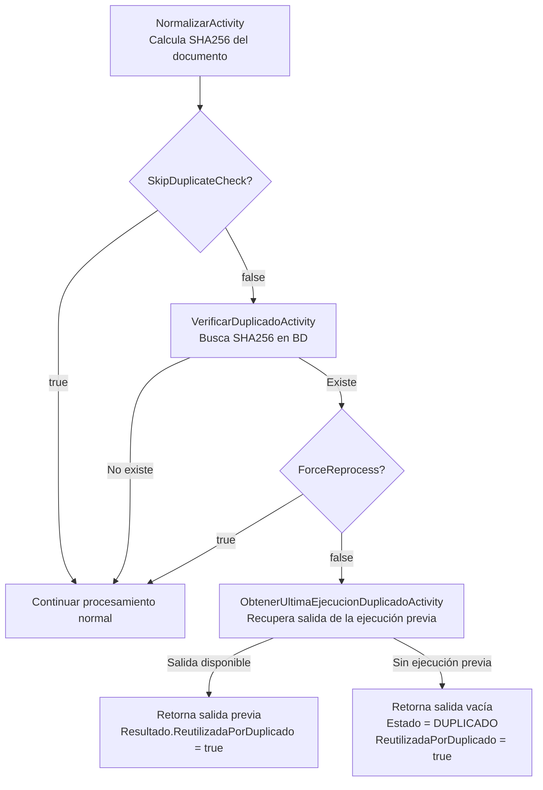

# Manual de Deduplicación Interna — DocumentIA

## 1. Propósito

El sistema incluye un mecanismo de deduplicación basado en hash SHA256 del contenido del documento. Su objetivo es **evitar reprocesar el mismo documento dos veces** y reutilizar el resultado de la ejecución anterior, ahorrando tiempo de procesamiento y costes de llamadas a servicios IA.

Este mecanismo es **independiente** de la deteccion de duplicados en el GDC (Gestor Documental), que se describe en [ESPECIFICACION_CAPA_SERVICIO_GDC_SINTWS.md](../2_arquitectura_y_diseno/ESPECIFICACION_CAPA_SERVICIO_GDC_SINTWS.md).

---

## 2. Cómo funciona

### 2.1 Flujo de decisión



### 2.2 Posición en el pipeline

La verificación ocurre después de normalizar (paso 1) y **antes** de subir el blob (paso 2.5), clasificar y extraer. Si se detecta duplicado, el pipeline se **corta early** sin llamar a ningún servicio IA.

```
NormalizarActivity → [VerificarDuplicadoActivity] → SubirBlobActivity → ClasificarActivity → ...
```

---

## 3. Actividades implicadas

### 3.1 `NormalizarActivity`

Calcula los hashes del documento a partir del contenido Base64:

| Hash | Uso principal |
|---|---|
| SHA256 | Deduplicación interna (clave de búsqueda en BD). |
| MD5 | Deduplicación en GDC (campo `MD5` en SINTWS). |
| CRC32 | Integridad (campo adicional en `Integridad`). |

La normalización también extrae: `TamañoBytes`, `NombreNormalizado`, `FechaNormalizacion`.

### 3.2 `VerificarDuplicadoActivity`

**Firma:** `Run([ActivityTrigger] string sha256) → bool`

Consulta `IDocumentoRepository.ExistsBySHA256Async(sha256)` contra la base de datos interna. Devuelve:

- `true` → el documento ya existe en BD.
- `false` → no existe; continuar procesamiento normal.

### 3.3 `ObtenerUltimaEjecucionDuplicadoActivity`

**Firma:** `Run([ActivityTrigger] string sha256) → ContratoSalida?`

Cuando se detecta duplicado y `ForceReprocess = false`:

1. Busca el `DocumentoEntity` por SHA256 en `IDocumentoRepository`.
2. Obtiene todas las ejecuciones del documento desde `IDocumentoEjecucionRepository`.
3. Selecciona la **primera ejecución que tenga `ContratoSalidaCompletoJson` poblado** (la última en orden de inserción).
4. Deserializa el JSON y establece:
   - `Resultado.ReutilizadaPorDuplicado = true`
   - `Resultado.MensajeReutilizacion = "Documento ya procesado previamente. Se reutiliza la última ejecución."`
5. Devuelve la `ContratoSalida` reutilizada.

Si no hay ejecuciones serializadas disponibles, devuelve `null`.

---

## 4. Comportamiento según combinación de flags

| `SkipDuplicateCheck` | `ForceReprocess` | Existe en BD | Comportamiento |
|---|---|---|---|
| `false` | `false` | No | Pipeline completo normal. |
| `false` | `false` | Sí, con salida previa | **Short-circuit**: devuelve salida previa. `Estado` = el de la ejecución previa. `ReutilizadaPorDuplicado = true`. |
| `false` | `false` | Sí, sin salida previa | **Short-circuit**: devuelve respuesta vacía. `Estado = "DUPLICADO"`. `ReutilizadaPorDuplicado = true`. |
| `false` | `true` | Sí | Reprocesa completamente, ignorando el duplicado. |
| `true` | — | — | Omite verificación. Pipeline completo. |

---

## 5. Campos en la respuesta relativos a deduplicación

En `ContratoSalida.Resultado`:

| Campo | Tipo | Descripción |
|---|---|---|
| `resultado.estado` | string | `"DUPLICADO"` cuando se detecta duplicado sin ejecución reutilizable. En reutilización con ejecución previa, el estado es el de dicha ejecución (normalmente `"OK"`). |
| `resultado.reutilizadaPorDuplicado` | bool | `true` cuando se devuelve una ejecución anterior o cuando el estado es `DUPLICADO`. |
| `resultado.mensajeReutilizacion` | string? | Mensaje descriptivo del motivo de reutilización. |

---

## 6. Casos de uso típicos

### Reenvío accidental del mismo documento

El sistema detecta el SHA256 idéntico, recupera la ejecución anterior y devuelve ese resultado sin reprocesar. El cliente recibe `reutilizadaPorDuplicado = true`.

### Forzar reprocesamiento (corrección de datos)

Si se ha actualizado la configuración de tipología o se requiere reextracción, enviar con `forceReprocess = true`. El documento se procesa completamente aunque ya exista.

### Importación masiva con documentos potencialmente repetidos

Enviar `skipDuplicateCheck = false` (default) para que el sistema filtre automáticamente duplicados, ahorrando tiempo y coste en lote.

### Entornos de prueba sin BD

Enviar `skipDuplicateCheck = true` para omitir la verificación y siempre procesar, independientemente del estado de la BD.

---

## 7. Persistencia en base de datos

La deduplicación se apoya en dos repositorios:

| Repositorio | Entidad | Uso |
|---|---|---|
| `IDocumentoRepository` | `DocumentoEntity` | Índice de documentos únicos por SHA256. Consultado por `VerificarDuplicadoActivity` y `ObtenerUltimaEjecucionDuplicadoActivity`. |
| `IDocumentoEjecucionRepository` | `DocumentoEjecucionEntity` | Historial de ejecuciones con `ContratoSalidaCompletoJson`. Consultado por `ObtenerUltimaEjecucionDuplicadoActivity`. |

Los documentos se persisten al final del pipeline por `PersistirActivity`. El SHA256 se registra en ese momento. Si la función se interrumpe antes de `PersistirActivity`, el documento no queda registrado y no se detectará como duplicado en futuras ejecuciones.

---

## 8. Diferencia con deduplicación en GDC

| Aspecto | Deduplicación interna (BD) | Deduplicación en GDC (SINTWS) |
|---|---|---|
| Clave | SHA256 del contenido | `id_expediente` + `checksum` (MD5) |
| Momento | Paso 2 del pipeline (antes de clasificar) | Paso subida GDC (`SubirGDCActivity`) |
| Efecto en duplicado | Short-circuit completo del pipeline | Subida omitida; `GDC.YaExistia = true` |
| Control | `SkipDuplicateCheck` / `ForceReprocess` | No configurable desde el contrato de entrada |
| Documentado en | Este documento | [ESPECIFICACION_CAPA_SERVICIO_GDC_SINTWS.md](../2_arquitectura_y_diseno/ESPECIFICACION_CAPA_SERVICIO_GDC_SINTWS.md) |
